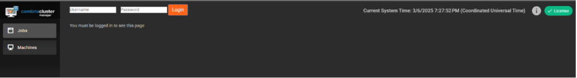

## Document History

| Version | Date       | Description                                |
|---------|------------|--------------------------------------------|
| 5.4.0   | 10/03/2024 | Updated for release 5.4.0.21627 (Linux)    |
| 5.5.0   | 04/11/2025 | Updated for release 5.5.0.23529 (Linux)    |

> **Download the online version of this document for the latest information and latest files. Always download the latest files.**

Do not move forward with the installation process if you do not agree with the End User License Agreement (EULA) for our products.  
You can download and read the EULA for Cambria FTC, Cambria Cluster, and Cambria License Manager from the links below:

- [Cambria License Manager EULA](https://www.dropbox.com/s/1wg7ee7a59kzi8h/EULA_Cambria_License_Manager.pdf?dl=0)  
- [Cambria Cluster EULA](https://www.dropbox.com/s/oemlax63aatjjiw/EULA_Cluster.pdf?dl=0)  
- [Cambria FTC EULA](https://www.dropbox.com/s/ualv9usxsowh6m2/EULA_FTC.pdf?dl=0)

### Limitations and Security Information

Cambria FTC, Cluster, and License Manager are installed on Linux Docker containers. Limitations and security checks done for this version are included in our general Linux Documents below:

- [Linux Cambria Cluster and FTC 5.5.0 Guide](https://www.dropbox.com/scl/fi/0rvskhpqtla6dffhbfli5/Linux_Cambria_Cluster_and_FTC_5_5_0_Guide.pdf?rlkey=ngryjzox121ow5fgbc4y8n2yd)

> **Note:** These documents are for informational use only. The setup for Kubernetes starts in section 3. Create Kubernetes Cluster.  
> This document references Kubernetes version 1.32.1 only.

---

## ⚠️ Important: Before You Begin

PDF documents have a copy/paste issue. For best results, download this document and any referenced PDF documents in this guide and open them in a PDF viewer such as Adobe Acrobat.

For commands that are in more than one line, copy each line one by one and check that the copied command matches the one in the document.

---

## ⚠️ Critical Information: Read Before Proceeding with Installation

Before starting the installation, carefully review the following considerations. Skipping this section may result in errors, failed deployments, or misconfigurations.

1. **A New Kubernetes Cluster Will Be Deployed**  
   ● The installation process creates a brand-new Kubernetes cluster to keep the Cambria ecosystem isolated from other applications.

2. **Default Installation is Non-Secure**  
   ● The guide covers installation with default settings in an open environment (not secure).  
   ● If you require a secure or customized setup, you will need AWS expertise, which is not covered in this guide.  
   ● Firewall information is provided in section 1.5. Firewall Information

3. **Understand Your Transcoding Requirements**  
   ● Know your expected transcoding volume, input/output specs, and whether a GPU is needed.  
   ● Refer to section 1.3. AWS EC2 Instance Information and Benchmark for guidelines on machine requirements.

4. **Administrative Rights Required**  
   ● Many of the steps in this guide require administrative rights to AWS for adding permissions and performing other administrative functions of that sort.

5. **Check AWS Account Quota**  
   ● Ensure the AWS account has sufficient quota to deploy Kubernetes resources.  
   ● See section 1.2. Resource Usage for estimated resource requirements.

6. **A Separate Linux Machine is Required**  
   ● A dedicated Linux machine (preferably Ubuntu) is needed to deploy Kubernetes.  
   ● Keeping Kubernetes tools and configuration files on a dedicated system is strongly recommended.

7. **Verify Region-Specific Resource Availability**  
   ● Not all AWS regions support the same resources (e.g., GPU availability varies by region).  
   ● Consult AWS documentation to confirm available resources in your desired region.


## Document Overview

The purpose of this document is to provide a walkthrough of the installation and initial testing process of the **Cambria Cluster** and **Cambria FTC** applications in a Kubernetes environment.

### Document Structure

1. Overview of the Cambria Cluster / FTC Environment in a Kubernetes Environment  
2. Preparation for the installation (Prerequisites)  
3. Create and configure the Kubernetes Cluster  
4. Install Cambria Cluster and Cambria FTC on the Kubernetes Cluster  
5. Verify the installation is working properly  
6. Test the Cambria Cluster / FTC applications  
7. Update the Cambria Cluster / FTC applications on Kubernetes Cluster  
8. Delete a Kubernetes Cluster  
9. Quick Reference of Kubernetes Installation  
10. Quick Reference of Important Kubernetes Components (URLs, template projects, test player, etc.)  
11. Glossary of important terms  

---

## 1. Overview

### 1.1 Cambria Cluster / FTC Kubernetes Deployment

There are two major applications involved in this Kubernetes installation:

- **Cambria Cluster**
- **Cambria FTC**

---

### Cambria Cluster

This deployment is recommended to run on **at least 3 nodes** (`replica = 3`) with a **LoadBalancer service** that exposes the application externally.

- Each Cambria Cluster pod is installed on its own node.
- One pod acts as the **leader**, and the other two serve as **replicas**, allowing automatic failover.

Each **Cambria Cluster pod** includes:

1. `Cambria Cluster` (application container)  
2. `Leader Elector` tool – designates the pod leader  
3. `Cambria FTC Autoscaler` tool – auto-deploys FTC workers based on job load:

> **Scaling Formula:**  
> Number of Nodes to Deploy = `(Number of Queued Jobs + 2) / 3`

Additionally:

- A **PostgreSQL database** pod is deployed per active Cambria Cluster pod.
- Databases are **replicated** for fault tolerance and data integrity.

---

### Cambria FTC

Capella’s **Cambria FTC** deployment consists of **one or more nodes**, often using different instance types than the Cluster nodes.

- FTC pods are responsible for executing encoding jobs.
- Each pod is assigned its **own node**.

Each **Cambria FTC pod** includes:

1. `Cambria FTC` (application container)  
2. `Auto-Connect FTC` (dotnet tool) – performs:
   - Pod discovery
   - Cluster identification
   - FTC-Cluster auto-connect logic  
   - If no Cluster is found within ~20 minutes, the node is recycled
3. `Pgcluster` – PostgreSQL container for job and state persistence (pod lifetime only)

---

### Deployment Note

Each node in the Kubernetes Cluster will either be running the **Cambria Cluster deployment** or the **Cambria FTC deployment**, but not both.


### 1.2 Resource Usage

The resources used and their quantities will vary depending on requirements and environments.  
Below is general information about major resource usage. Other resources may also be required.  
Please consult AWS and `eksctl` documentation for more details.

#### Reference Documentation:

- [EKS Deployment Options](https://docs.aws.amazon.com/eks/latest/userguide/eks-deployment-options.html)  
- [eksctl: Creating and Managing Clusters](https://eksctl.io/usage/creating-and-managing-clusters/)  
- [eksctl: VPC Networking](https://eksctl.io/usage/vpc-networking/)  
- [EKS Subnet Best Practices](https://docs.aws.amazon.com/eks/latest/best-practices/subnets.html)  
- [AWS EC2: Available IPs per ENI](https://docs.aws.amazon.com/AWSEC2/latest/UserGuide/AvailableIpPerENI.html)  
- [EKS Network Security Best Practices](https://docs.aws.amazon.com/eks/latest/best-practices/network-security.html)

---

#### Resource Overview

| Component      | Description                                                                 |
|----------------|-----------------------------------------------------------------------------|
| **Load Balancers** | - 0–3 Classic Load Balancers (Manager WebUI, Manager Web Server, Grafana)  
                      - 0–1 Network Load Balancer (Ingress)                                    |
| **Nodes**          | - `X` Cambria Manager Instances (Default: 3)  
                      - `Y` Cambria FTC Instances (Default max: 20)                            |
| **Networking**     | - 1 VPC (default)  
                      - 3 public subnets and 3 private subnets (2 subnets reserved)  
                      - Default `/16` CIDR  
                      - Each subnet: `/19` CIDR                                                 |

> **Note:** For CIDR planning, refer to  
> [EKS Best Practices: Networking](https://docs.aws.amazon.com/eks/latest/best-practices/networking.html)

#### Security Groups

- Default: 1 security group for the **control plane**
- Default: `X` security groups — one per **node group**

---

<!-- Add image below once graph is provided -->
<!--  -->

### 1.3 AWS Machine Information and Benchmark

The following benchmark compares two AWS EC2 instance types.  
This information is current as of **September 2023**.

> ⚠️ Benchmark results reflect workloads that involve read/write access to **AWS S3**, which affects transcoding speed.

---

#### Benchmark Job Configuration

| Type     | Codec | Frame Rate | Resolution                   |
|----------|--------|-------------|-------------------------------|
| **Source** | TS     | H.264       | 30 fps, 1920×1080 @ 8 Mbps     |
| **Output** | HLS/TS | H.264       | 29.97 fps  
                                   - 1920×1080 @ 4 Mbps  
                                   - 1280×720 @ 2.4 Mbps  
                                   - 640×480 @ 0.8 Mbps  
                                   - 320×240 @ 0.3 Mbps |

---

#### a. `c6a.4xlarge` [AMD EPYC 7R13]

##### Machine Info

| Name         | RAM     | CPUs | Storage | Network Performance | Cost/Hour |
|--------------|---------|------|---------|----------------------|-----------|
| c6a.4xlarge  | 32 GB   | 16   | Any     | 12.5 Gbps            | $0.612    |

##### Benchmark Results

| Concurrent Jobs | Real-Time Speed                        | CPU Usage |
|-----------------|----------------------------------------|-----------|
| 2               | - 0.73x RT per job (slower than real-time)  
                 - Total throughput: 1.46x RT  
                 (≈ 42 sec to transcode 1 min)          | 100%      |

---

#### b. `c6a.16xlarge` [AMD EPYC 7R13]

##### Machine Info

| Name           | RAM     | CPUs | Storage | Network Performance | Cost/Hour |
|----------------|---------|------|---------|----------------------|-----------|
| c6a.16xlarge   | 128 GB  | 64   | Any     | 25 Gbps              | $2.448    |

##### Benchmark Results

| Concurrent Jobs | Real-Time Speed                         | CPU Usage |
|-----------------|------------------------------------------|-----------|
| 2               | - 2.17x RT per job (faster than real-time)  
                 - Total throughput: 4.34x RT  
                 (≈ 21 sec to transcode 1 min)           | ~84%       |

---

#### Benchmark Summary

- The **c6a.16xlarge** instance provides significantly higher throughput due to increased compute resources.
- However, the **c6a.4xlarge** instance is **more cost-effective per hour**.
- The choice between the two should consider both budget and throughput requirements.

### 1.4 Cambria Application Access

The Cambria applications can be accessed using the following methods:

---

#### 1.4.1 External Access via TCP Load Balancer

By default, Cambria installs with one TCP Load Balancer for:

- **Manager WebUI + License Manager**
- **Web / REST API Server**

These load balancers are publicly reachable by IP or domain name with their configured ports.

**Examples**:

- **Cambria Manager WebUI:** `https://44.33.212.155:8161`
- **Cambria REST API:** `https://121.121.121.121:8650/CambriaFC/v1/SystemInfo`

> 🔄 You can enable or disable external access via TCP Load Balancer by editing the Helm configuration (see section 4.2).  
> If disabled, you'll need to configure another access method below.

---

#### 1.4.2 HTTP Ingress via Reverse Proxy

If you’d rather use a purchased domain (e.g., from GoDaddy) or disable public IP access, you can expose services through an HTTP Ingress.

- Only **one IP/domain name** is needed.
- Traffic is routed by subdomain:

  - `webui.mydomain.com` → Cambria WebUI  
  - `api.mydomain.com` → Cambria Web Server / REST API  
  - `monitoring.mydomain.com` → Grafana Dashboard

> ⚠️ Capella provides a default ingress hostname for testing. In production, you must configure your own hostname, SSL certificate, and domain settings (detailed later in this guide).

---

### 1.5 Firewall Information

Default Kubernetes cluster setup includes basic virtual network firewalling. If using custom or more restrictive firewall rules, ensure the following ports are open:

| Port  | Protocol | Traffic Direction | Description                                 |
|-------|----------|------------------|---------------------------------------------|
| 8650  | TCP      | Inbound          | Cambria Cluster REST API                    |
| 8161  | TCP      | Inbound          | Cambria Cluster WebUI                       |
| 8678  | TCP      | Inbound          | Cambria License Manager Web Server          |
| 8481  | TCP      | Inbound          | Cambria License Manager WebUI               |
| 9100  | TCP      | Inbound          | Prometheus Exporter for Cambria Cluster     |
| 8648  | TCP      | Inbound          | Cambria FTC REST API                        |
| 3100  | TCP      | Inbound          | Loki Logging Service                        |
| 3000  | TCP      | Inbound          | Grafana Dashboard                           |
| 443   | TCP      | Inbound          | Capella Ingress                             |
| —     | TCP/UDP  | Outbound         | All outbound traffic                        |

Additionally, ensure outbound/inbound access for Cambria licensing domains:

| Domain                                      | Port | Protocol | Description                     |
|--------------------------------------------|------|----------|---------------------------------|
| `api.cryptlex.com`                         | 443  | TCP      | License Server                  |
| `cryptlexapi.capellasystems.net`           | 8485 | TCP      | License Cache Server            |
| `cpfs.capellasystems.net`                  | 8483 | TCP      | License Backup Server           |

### 2. Prerequisites

The following steps must be completed before starting the deployment process.

---

#### 2.1 Tools: Kubectl, Helm, Eksctl, and AWS CLI

This guide uses `curl` and `unzip` to run commands and download required applications.

Install dependencies on Ubuntu:

```bash
sudo apt update; sudo apt upgrade; sudo apt install curl unzip
```

Then download and prepare the deployment package:

```bash
curl -o CambriaClusterKubernetesAWS_5_5_0.zip -L "https://www.dropbox.com/scl/fi/4dg2024wbbq0lx1qbnk8e/CambriaClusterKubernetesAWS_5_5_0.zip?rlkey=j0q7xgxv2v60x4bcwfoesd8nv&st=zfnff3f2&dl=1"
unzip CambriaClusterKubernetesAWS_5_5_0.zip
chmod +x *.sh
```

> **Note:** Scripts are tested on **Ubuntu**. Other Linux distributions may work but are untested.

---

##### 2.1.1 Installation

There are two options to install Kubernetes tools:

**Option 1: Use Provided Scripts**

```bash
./installKubeTools.sh
./installKubeToolsAws.sh
```

**Option 2: Manual Installation**

- [Kubectl](https://kubernetes.io/docs/tasks/tools/)
- [Helm](https://helm.sh/docs/intro/install/)
- [Eksctl](https://eksctl.io/installation/)
- [AWS CLI](https://docs.aws.amazon.com/cli/latest/userguide/getting-started-install.html)

---

##### 2.1.2 Verification

Run the following to verify installations:

```bash
kubectl version --client
helm version
eksctl version
aws --version
```

---

#### 2.2 Create and Configure AWS Permissions

To create Kubernetes resources, IAM permissions must be configured.

Run this to set your AWS account ID:

```bash
export AWS_ACCOUNT_ID=$(aws sts get-caller-identity --query "Account" --output text)
```

---

##### 2.2.1 Create Custom Policies

Eksctl requires specific IAM policies. To create them:

```bash
./createEksctlCustomAwsPolicies.sh
```

If creation fails, verify the script and existing policies. Delete old ones if necessary.

For more details: [Minimum eksctl IAM Policies](https://eksctl.io/usage/minimum-iam-policies/)

---

##### 2.2.2 Create and Assign Eksctl AWS Role

1. Create a role `eksctl-user` with the following policies:

- AmazonEC2FullAccess
- AWSCloudFormationFullAccess
- EksAllAccess
- IamLimitedAccess

2. Create the role via:

```bash
./createEksctlClusterUserRole.sh eksctl-user
```

> Must have permissions to create roles and instance profiles.

3. On EC2, attach the new IAM role:
Go to **Actions > Security > Modify IAM role** and choose `eksctl-user-instance-profile`.

---

### 3. Create Kubernetes Cluster

This section describes how to create an EKS cluster and Cambria Cluster node group.

---

#### 3.1 Create AWS EKS Cluster and Node Group

Recommendations:

- **Cambria Cluster** handles encoding job scheduling.
- Use at least **c7i.xlarge** for each node.
- Set node count to **3** for redundancy.
- One node is active; the other two serve as failover.

---

**Step 1: Set environment variables**

```bash
export CLUSTER_NAME=cambria-cluster
export REGION=us-west-2
export KUBEVERSION=1.32
```

---

**Step 2: Create the cluster**

```bash
eksctl create cluster \
--name=$CLUSTER_NAME \
--region=$REGION \
--version=$KUBEVERSION \
--kubeconfig=./$CLUSTER_NAME-kubeconfig.yaml \
--node-private-networking \
--nodegroup-name=manager-nodes \
--with-oidc \
--node-ami-family=Ubuntu2204 \
--nodes=3 \
--instance-types=c7i.xlarge \
--vpc-cidr=10.0.0.0/16
```

> Capella has also tested AmazonLinux2, but it does not support GPU workloads.
> The lowest CIDR tested by Capella is `/19`.


Run the following command to create the Kubernetes cluster using `eksctl`:

```bash
eksctl create cluster \
  --name=$CLUSTER_NAME \
  --region=$REGION \
  --version=$KUBEVERSION \
  --kubeconfig=./$CLUSTER_NAME-kubeconfig.yaml \
  --node-private-networking \
  --nodegroup-name=manager-nodes \
  --with-oidc \
  --node-ami-family=Ubuntu2204 \
  --nodes=3 \
  --instance-types=c7i.xlarge \
  --vpc-cidr=10.0.0.0/16
3. Set kubeconfig as an Environment Variable

export KUBECONFIG=$CLUSTER_NAME-kubeconfig.yaml

4. Verify Cluster Access

kubectl get nodes
Expected output should resemble:

pgsql

NAME                                         STATUS   ROLES    AGE     VERSION
ip-10-0-12-44.us-west-2.compute.internal     Ready    <none>   118m    v1.32.0
ip-10-0-16-207.us-west-2.compute.internal    Ready    <none>   118m    v1.32.0
ip-10-0-22-84.us-west-2.compute.internal     Ready    <none>   118m    v1.32.0
⚠️ If the output is different or an error occurs, verify deployment information, credentials, and permissions.

3.2 Create EBS CSI Driver
Step 1: Create IAM Role for CSI Plugin
This IAM role is required to allow the CSI plugin to manage EBS volumes.

eksctl create iamserviceaccount \
  --name=ebs-csi-controller-sa \
  --namespace=kube-system \
  --cluster=$CLUSTER_NAME \
  --region=$REGION \
  --role-only \
  --attach-policy-arn=arn:aws:iam::aws:policy/service-role/AmazonEBSCSIDriverPolicy \
  --approve \
  --role-name=eksctl-ebs-csi-driver-role
🔧 The role name (--role-name) must:

Start with eksctl-

Be unique to the cluster

Be ≤ 64 characters

Step 2: Install AWS EBS CSI Driver Addon

eksctl create addon \
  --name aws-ebs-csi-driver \
  --cluster=$CLUSTER_NAME \
  --region=$REGION \
  --force \
  --service-account-role-arn=arn:aws:iam::$AWS_ACCOUNT_ID:role/eksctl-ebs-csi-driver-role
⚠️ This step installs the AWS EBS CSI plugin.
It must be in Active status before continuing.
If this fails, consider re-creating the cluster as the safest option.

eksctl-ebs-csi-driver-role: the role name from the command in step 1
eksctl create addon \
--name aws-ebs-csi-driver \
--cluster=$CLUSTER_NAME \
--region=$REGION \
--force \
--service-account-role-arn=arn:aws:iam::$AWS_ACCOUNT_ID:role/eksctl-ebs-csi-driver-role
```
un the following command to verify the AWS EBS CSI Driver plugin state:

```bash
eksctl get addon   --name=aws-ebs-csi-driver   --cluster=$CLUSTER_NAME   --region=$REGION
```

> ⚠️ **DO NOT proceed to the next step until the plugin status shows `ACTIVE`.**

---

### 3.3 AWS IAM Permissions for FTC

Certain permissions must be granted for Cambria FTC to access S3 and use the FTC autoscaler.  
This requires **IAM administrative privileges**.

> ℹ️ These steps can be done via the AWS Console, but this guide uses the AWS CLI on a Linux deployment machine.

---

### 3.3.1 Create FTC IAM Role

The Cambria FTC application requires a role with read/write permissions for S3 buckets.

```bash
./createRoleForFtcInstances.sh eksctl-ftc-role ftcS3PermissionSample.json
```

- `eksctl-ftc-role`: IAM role name (must start with `eksctl-`, be unique to the cluster, ≤ 64 characters)
- `ftcS3PermissionSample.json`: Capella-provided sample policy allowing S3 read/write/list access

> 📄 Refer to AWS documentation to customize or generate your own S3 access policy:  
> [AWS IAM Policy Generator](https://awspolicygen.s3.amazonaws.com/policygen.html)

---

### 3.3.2 Create FTC Autoscaler Roles

> Only required if using Cambria FTC's autoscaler feature.

Run the following script:

```bash
./createRolesForFtcAutoscaler.sh eksctl-autoscaler-role eksctl-autoscaler-cfg-role
```

- `eksctl-autoscaler-role`: IAM role for the autoscaler container  
- `eksctl-autoscaler-cfg-role`: IAM role for autoscaler configuration  

> 💡 Both role names must:  
> - Start with `eksctl-`  
> - Be unique to the EKS cluster  
> - Be ≤ 64 characters in length

```bash
./createRolesForFtcAutoscaler.sh eksctl-autoscaler-role eksctl-autoscaler-cfg-role
```

### 3.4 (Optional) Restricting Cambria FTC Encoder Designated Nodes via Exclusion Label

Follow these steps only if more precise control is required over which nodes Cambria FTC is installed on.

#### Overview

By default, the Cambria management and encoding applications are installed on separate nodes according to a specified node instance type.  
For example, if the management node instance type is set to `c7i.xlarge`, Cambria Cluster can only be installed on nodes of that instance type, while Cambria FTC can be installed on nodes of other instance types.

In some scenarios, the default setup may not be sufficient. For example, certain nodes may need to handle both management and encoding, or specific nodes in the cluster may be designated for other tasks and should not run encoding tasks.  
To accommodate these workflows, an exclusion label must be added to the nodes where Cambria FTC should be restricted.

#### Steps

1. Find out which node(s) will be Cambria FTC restricted and note down the name:

    ```bash
    kubectl get nodes
    ```

2. Apply the following label to each of those nodes:

    ```bash
    kubectl label node <node-name> no-capella-worker=true
    ```

3. To apply the same restriction to all nodes in a node group:

    ```bash
    eksctl set labels \
      --cluster=$CLUSTER_NAME \
      --region=$REGION \
      --labels="no-capella-worker=true" \
      --nodegroup=<node-group>
    ```

4. In section 4.2 (Helm Configuration), set:

    ```yaml
    workersCanUseManagerNodes: true
    ```

---

### 3.5 Create Cambria FTC Node Group(s)

> **Skip this step if planning to use Cambria FTC's autoscaler.**

Run the following command to create a Node Group for the FTC worker application instances (replace highlighted values):

**Recommendation:**  
Use `c6a.4xlarge` instances based on [Section 1.3 Benchmarking]. Start with 1 node for testing.

```bash
eksctl create nodegroup \
  --name=worker-nodes \
  --cluster=$CLUSTER_NAME \
  --region=$REGION \
  --node-private-networking \
  --nodes=1 \
  --instance-types=c6a.4xlarge \
  --node-ami-family=Ubuntu2204
```

---

### 3.6 GPU Operator for NVENC

> Required only if using GPU instances.  
> **Not compatible with Cambria FTC's autoscaler.**

```bash
helm repo add nvidia https://helm.ngc.nvidia.com/nvidia; \
helm repo update; \
helm install nvidia-operator nvidia/gpu-operator \
  --create-namespace \
  --namespace gpu-operator
```

Wait at least 5 minutes for installation to complete. Then run:

```bash
kubectl get pods -n gpu-operator
```

If pods are still initializing after 10 minutes:

a. Confirm at least one AWS GPU instance is present  
b. Run:

```bash
kubectl describe pod <your-pod-name> -n gpu-operator
```

Check the **Events** section and contact Capella Support if needed.

---

### 3.7 Performance Metrics and Logging

This section is required for logging and performance metrics.

Follow the guide below to install **Prometheus**, **Grafana**, **Loki**, and **Promtail**:

[Prometheus & Grafana Setup for Cambria 5.5.0 on AWS (PDF)](https://www.dropbox.com/scl/fi/b9x59y4n3ff2i3g8if36s/Prometheus_Grafana_Setup_for_Cambria_Cluster_5_5_0_on_AWS_Kubernetes.pdf?rlkey=s1jz68o18s2ajyrak2334mdeh&st=wltynfq9&dl=1)


## 4. Install Cambria Cluster, FTC, and Dependencies

### 4.1 Prerequisite: Deploy External Kubernetes Tools

These tools must be deployed before Cambria FTC / Cluster can function properly.

#### 4.1.1 Required Tools

1. Run the following:
   ```bash
   ./deployCambriaKubeDependencies.sh
   ```

2. Verify resource statuses:
   - Pods should be `Running`
   - All containers in `READY` should be active
   - Services should have `CLUSTER-IP` assigned
   - Check with:
     ```bash
     kubectl get all -n cnpg-system
     kubectl get all -n argo-events
     kubectl get all -n cert-manager
     ```

If resources aren't ready after 1 minute, contact Capella support.

#### 4.1.2 (Optional) Ingress-Nginx

> Run these steps if ingress is needed, or for testing. See section 1.4 for access options.

> ⚠️ **Important:** Load balancer created **will not auto-delete** with the cluster and must be removed manually.

1. Deploy Ingress-Nginx:
   ```bash
   kubectl apply -f https://raw.githubusercontent.com/kubernetes/ingress-nginx/controller-v1.12.1/deploy/static/provider/aws/deploy.yaml
   ```

2. Verify status:
   ```bash
   kubectl get all -n ingress-nginx
   ```

   - Pods should be `Running`
   - `ingress-nginx-controller` service should have an `EXTERNAL-IP`

If resources remain unready, contact Capella support.

##### For Production or Public Domain/TLS Access

1. Go to AWS Load Balancer and find the VPC ID of your cluster.
2. In Security Groups, locate and open the matching VPC ID.
3. Add inbound rule:
   - Type: `Custom ICMP - IPv4`
   - Protocol: `Echo Request`
   - Source: `0.0.0.0/0`
4. Add DNS entries for:
   ```
   api.mydomain.com
   webui.mydomain.com
   monitoring.mydomain.com
   ```

---

### 4.2 Creating and Editing Helm Configuration File

#### Steps:

1. Create default config:
   ```bash
   helm show values capella-cluster.tgz > cambriaClusterConfig.yaml
   ```

2. Edit `cambriaClusterConfig.yaml` with a text editor.

#### Key Settings:

- `workersCanUseManagerNodes: false`  
  > Set to `true` if using exclusion labels (see section 3.4).

- `workersUseGPU: false`  
  > Set to `true` for NVENC GPU workflows.

- `nbGPUs: 1`  
  > Set to the number of GPUs per worker node.

- `managerInstanceType: "c7i.xlarge"`  
  > Set to your selected manager node instance type.

- `ftcEnableAutoScaler: true`  
  > Set to `false` to manually add FTC nodes instead of autoscaling.

# 4.2. Helm Configuration YAML Reference

```yaml
# ftcAutoScalerExtraConfig: extra config for autoscaler.
ftcAutoScalerExtraConfig:
  cpClusterName: cambria-cluster
  cpCloudVendor: AWS
  cpRegion: us-west-2
  cpNodeRole: arn:aws:iam::12341234:role/eksctl-autoscaler-config-role
  cpCapacityType: dedicated

# ftcInstanceType: instance type for the FTC nodes
ftcInstanceType: "c6a.4xlarge"

# maxFTCInstances: maximum number of FTC instances
maxFTCInstances: 20

# pgInstances: number of postgresql database instances
pgInstances: 3

# cambriaClusterReplicas: number of Cambria Cluster instances
cambriaClusterReplicas: 3

externalAccess:
  exposeStreamServiceExternally: true
  enableIngress: true
  hostName: myhost.com
  acmeRegistrationEmail: test@example.com
  acmeServer: https://acme-staging-v02.api.letsencrypt.org/directory

secrets:
  pgClusterPassword: "xrtVeQ4nN82SSiYHoswqdURZ…"
  ftcLicenseKey: "2XXXXX-XXXXXX-XXXXXX-XXXXXX-XXXXXX-XXXXXX"
  cambriaClusterAPIToken: "12345678-1234-43f8-b4fc-53afd3893d5f"
  cambriaClusterWebUIUser: "admin,defaultWebUIUser,RZvSSd3ffsElsCEEe9"
  argoEventWebhookSourceBearerToken: "L9Em5WIW8yth6H4uPtzT"

aws:
  role:
    ftc: arn:aws:iam::12341234:role/eksctl-ftc-role
    autoscaler: arn:aws:iam::12341234:role/eksctl-autoscaler-role

optionalInstall:
  enableEventing: true
  
  ## 4.3. Installing Cambria FTC / Cluster

Wait at least 5 minutes after installing prerequisites before moving on to this step. In a command line / terminal window, run:

```bash
helm upgrade --install capella-cluster capella-cluster.tgz --values cambriaClusterConfig.yaml
```

Expected output:

```
Release "capella-cluster" does not exist. Installing it now.
NAME: capella-cluster
LAST DEPLOYED: Thu May 3 10:09:47 2023
NAMESPACE: default
STATUS: deployed
REVISION: 1
TEST SUITE: None
```

Several components are now being deployed. Wait a few minutes.

The default VPC and security groups will be created. Refer to [AWS Network Security Best Practices](https://docs.aws.amazon.com/eks/latest/best-practices/network-security.html) and section 1.5 for required Capella ports.

---

## 5. Verify Cambria FTC / Cluster Installation

### 5.1. Verify Cambria Cluster Deployment

Run:

```bash
kubectl get all -n default
```

Check for the following:

| Resource     | Expected Content |
|--------------|------------------|
| Deployments  | 1 `cambriaclusterapp` and 1 `cambriaclusterwebui` deployment with all items active |
| Pods         | `X` pods named `cambriaclusterapp`, `X` pods with `pgcluster`, and 1 `cambriaclusterwebui` pod—all Running |
| Services     | 3 `pgcluster` services with `CLUSTER-IP`, 1 `cambriaclusterservice`, and 1 `cambriaclusterwebuiservice` with `EXTERNAL-IP` if `exposeStreamServiceExternally` is true |

If resources aren't ready after a few minutes, contact Capella support.

---

### 5.2. Verify Cambria FTC Deployment

Run:

```bash
kubectl get all -n capella-worker
```

Check for the following:

| Resource    | Expected Content |
|-------------|------------------|
| Pods        | `X` pods with `cambriaftcapp`. If autoscaler is enabled, they will be pending. If not, `Y` pods should be active |
| Deployments | 1 `cambriaftcapp` deployment |

Wait a few minutes if needed. If issues persist, contact Capella support.

---

### 5.3. Verify Applications are Accessible

#### 5.3.1. Cambria Cluster WebUI

Skip if WebUI is disabled in the Helm config or if ingress is used.

**Option 1: External URL**

```bash
kubectl get svc/cambriaclusterwebuiservice -n default -o=jsonpath="{'https://'}{.status.loadBalancer.ingress[0].hostname}{':8161'}{'
'}"
```

Example output:

```
https://192.122.45.33:8161
```

**Option 2: Non-External Access (Port Forwarding)**

```bash
kubectl port-forward -n default svc/cambriaclusterwebuiservice 8161:8161 --address=0.0.0.0
```

Access URL depends on your machine:

```
https://<server>:8161
```

Use `localhost` if browser and terminal are the same machine.

Open the URL in a browser. You may encounter an "Unsafe" warning page:
```


3. Click on Advanced and Proceed to [ EXTERNAL IP ] (unsafe). This will show the login page.



4. Log in using the credentials created in the helm values yaml file (See cambriaClusterWebUIUser)

## 5.3.1. Cambria Cluster WebUI

1. Get the WebUI address. A web browser is required to access the WebUI:

**Option 1: External Url if External Access is Enabled**
```bash
kubectl get svc/cambriaclusterwebuiservice -n default -o=jsonpath="{'https://'}{.status.loadBalancer.ingress[0].hostname}{':8161'}{'
'}"
```

Example output:
```
https://192.122.45.33:8161
```

**Option 2: Non-External Url Access**
```bash
kubectl port-forward -n default svc/cambriaclusterwebuiservice 8161:8161 --address=0.0.0.0
```

Access using a web browser:  
`https://<server>:8161` (replace `<server>` with localhost or the server's IP)

3. Click on **Advanced** and **Proceed to [ EXTERNAL IP ] (unsafe)**.  
4. Log in using the credentials from `cambriaClusterWebUIUser` in the Helm config.

---

## 5.3.2. Cambria Cluster REST API

**Option 1: External Url if External Access is Enabled**
```bash
kubectl get svc/cambriaclusterservice -n default -o=jsonpath="{'https://'}{.status.loadBalancer.ingress[0].hostname}{':8650'}{'
'}"
```

**Option 2: Non-External Url Access**
```bash
kubectl port-forward -n default svc/cambriaclusterservice 8650:8650 --address=0.0.0.0
```

**Check API:**
```bash
curl -k -X GET https://<server>:8650/CambriaFC/v1/SystemInfo
```

---

## 5.3.3. Cambria Ingress

### 5.3.3.1. Get the Ingress Endpoints

**Option 1: Default Testing Ingress**
```bash
kubectl get ingress -A
```

**Resolve ELB hostname**
```bash
ping a1c1d1a23a121.us-west-2.elb.amazonaws.com
```

**Edit `/etc/hosts`:**
```
55.99.103.99 api.myhost.com
55.99.103.99 webui.myhost.com
55.99.103.99 monitoring.myhost.com
```

**Option 2: Publicly Registered Domain (Production)**

Example URLs:
- REST API: `https://api.myhost.com`
- WebUI: `https://webui.myhost.com`
- Grafana: `https://monitoring.myhost.com`

---

### 5.3.3.2. Test Ingress Endpoints

Example:
- WebUI: `https://webui.myhost.com`
- REST API: `https://api.myhost.com/CambriaFC/v1/SystemInfo`
- Grafana: `https://monitoring.myhost.com`

---

## 5.3.4. Cambria License

**Option 1: External Url if External Access is Enabled**
```bash
kubectl get svc/cambriaclusterwebuiservice -n default -o=jsonpath="{'https://'}{.status.loadBalancer.ingress[0].hostname}{':8481'}{'
'}"
```

**Option 2: Non-External Url Access**
```bash
kubectl port-forward -n default svc/cambriaclusterwebuiservice 8481:8481 --address=0.0.0.0
```

Access using a browser:  
`https://<server>:8481`

2. In a web browser, enter the above url. This should trigger an "Unsafe" page similar to the one below:


3. Click on Advanced and Proceed to [ EXTERNAL IP ] (unsafe). This will show the login page.


4. Log in using the credentials created in the Helm values yaml file (See cambriaClusterWebUIUser)
5. Verify that the License Status is valid for at least either the Primary or Backup. Preferably, both Primary and Backup should be valid. If there are issues with the license, wait a few minutes as sometimes it takes a few minutes to properly update. If still facing issues, contact the Capella support team.

## 6. Testing Cambria FTC / Cluster

The following guide provides information on how to get started testing the Cambria FTC / Cluster software:  
https://www.dropbox.com/scl/fi/5vra6xff23vvng7aa4qyx/Cambria_Cluster_and_FTC_5_5_0_Kubernetes_User_Guide.pdf?rlkey=j3l9wjjo5ncbub9bh9bizrukr&st=ablrc3pz&dl=1

## 7. Updating / Upgrading Cambria Cluster / FTC

There are currently two ways to update / upgrade Cambria FTC / Cluster in the Kubernetes environment.

### 7.1. Option 1: Normal Upgrade via Helm Upgrade

This upgrade method is best for when changing version numbers, secrets such as the license key, WebUI users, etc, and Cambria FTC / Cambria Cluster-specific settings such as max number of pods, replicas, etc.

> **Warning:**  
> - `pgClusterPassword` cannot currently be updated via this method  
> - Changing PostgreSQL version also cannot be updated via this method  

1. Edit the Helm configuration YAML for your Kubernetes environment or create a new configuration file.  
2. Run the following command:
   ```bash
   helm upgrade capella-cluster capella-cluster.tgz --values cambriaClusterConfig.yaml
   ```
3. Restart the deployments:
   ```bash
   kubectl rollout restart deployment cambriaclusterapp cambriaclusterwebui -n default
   kubectl rollout restart deployment cambriaftcapp -n capella-worker
   ```
4. Wait a few minutes for the Kubernetes pods to install properly.

### 7.2. Option 2: Upgrade via Cambria Cluster Reinstallation

This is the most reliable option and involves uninstalling all Cambria components and reinstalling with a new Helm chart and values YAML file. **Note**: This will delete the database and all jobs in the Cambria Cluster UI.

1. Follow section 4.2 to create/edit the new `cambriaClusterConfig.yaml`.  
2. Run:
   ```bash
   helm uninstall capella-cluster --wait
   ```
3. Then reinstall:
   ```bash
   helm upgrade --install capella-cluster capella-cluster.tgz --values cambriaClusterConfig.yaml
   ```

### 7.3. Upgrade Verification

Use the steps in **Section 5: Verify Cambria FTC / Cluster Installation**.

## 8. Deleting Kubernetes Cluster

1. Remove the Helm deployments:
   ```bash
   helm uninstall capella-cluster -n default --wait
   ```
2. Delete any persistent volumes:
   ```bash
   kubectl get pv -o name | awk -F'/' '{print $2}' | xargs -I{} kubectl patch pv {} -p='{"spec": {"persistentVolumeReclaimPolicy": "Delete"}}'
   ```
3. If ingress-nginx was deployed:
   ```bash
   kubectl delete namespace ingress-nginx
   ```
4. Follow delete steps in Section 3.7 if applicable.

5. Set cluster name and region:
   ```bash
   export CLUSTER_NAME=cambria-cluster
   export REGION=us-west-2
   ```

6. Delete FTC role policy:
   ```bash
   aws iam delete-role-policy --role-name=eksctl-ftc-role --policy-name=S3AccessPolicy
   ```

7. If using autoscaler:
   ```bash
   aws iam delete-role-policy --role-name=eksctl-autoscaler-role --policy-name=FTCAutoscalerPolicy
   ./deleteConfigRoleForFtcAutoscaler.sh eksctl-autoscaler-cfg-role
   ```

8. Delete the cluster:
   ```bash
   eksctl delete cluster --name=$CLUSTER_NAME --region=$REGION --wait
   ```

9. Confirm via AWS Console: check that the cluster is no longer listed under Elastic Kubernetes Service in the chosen region.

a. Search for Elastic Kubernetes Service in the region that the Kubernetes Cluster is located. Make sure the
deleted cluster does not show up on the list


b. Search for CloudFormation in the region that the Kubernetes Cluster is located. Make sure there are no stacks
specific to the Kubernetes Cluster on the list


c. Important: Check in EC2 Volumes and Load Balancers to make sure no volumes or load balancers were
leftover from the kubernetes cluster. Most will have the name of the EKS cluster in the resource name

## 9. Quick Reference: Installation, Testing, and Teardown

### 9.1. Installation (Deploy from Linux to AWS Kubernetes)

Use a Linux deployment machine (preferably an EC2 instance). Certain steps require an IAM Administrator to run the commands as they create specific roles for the deployment process.

#### 9.1.1. Prerequisites

```bash
sudo apt update; sudo apt upgrade; sudo apt install curl unzip; \
curl -o CambriaClusterKubernetesAWS_5_5_0.zip -L "https://www.dropbox.com/scl/fi/4dg2024wbbq0lx1qbnk8e/CambriaClusterKubernetesAWS_5_5_0.zip?rlkey=j0q7xgxv2v60x4bcwfoesd8nv&st=31ajhgif&dl=1"; \
unzip CambriaClusterKubernetesAWS_5_5_0.zip; \
chmod +x *.sh; \
./installKubeTools.sh; \
./installKubeToolsAws.sh
```

#### 9.1.2. IAM Administrator Required Steps

```bash
export AWS_ACCOUNT_ID=$(aws sts get-caller-identity --query "Account" --output text); \
./createEksctlCustomAwsPolicies.sh
./createEksctlClusterUserRole.sh eksctl-user
```

#### 9.1.3. Installation

Make sure that the Linux deployment machine assumes the role created in section 9.1.2.

1. Set the following environment variables:

```bash
export CLUSTER_NAME=cambria-cluster
export REGION=us-west-2
export KUBEVERSION=1.32
export CAMBRIA_CLUSTER_NODE_COUNT=3
export CAMBRIA_CLUSTER_INSTANCE_TYPE=c7i.xlarge
export EBS_CSI_CONTROLLER_ROLE_NAME=eksctl-ebs-csi-driver-role
export FTC_ROLE_NAME=eksctl-ftc-role
export FTC_ROLE_POLICY_JSON=ftcS3PermissionSample.json
export AUTOSCALER_ROLE_NAME=eksctl-autoscaler-role
export AUTOSCALER_CONFIG_ROLE_NAME=eksctl-autoscaler-cfg-role
```

2. Configure the Helm values file:

```bash
helm show values capella-cluster.tgz > cambriaClusterConfig.yaml
```

3. Run the install script:

```bash
./quickInstallCambriaClusterAws.sh; export KUBECONFIG=$CLUSTER_NAME-kubeconfig.yaml
```

4. Install the monitoring/logging tools (see section 3.7).

5. Perform installation verification (see section 5).

---

### 9.2. Upgrades and Teardown

#### 9.2.1. Cambria FTC/Cluster and/or Kubernetes Cluster Upgrades

Edit the `capellaClusterConfig.yaml` file and run:

```bash
./quickUpgradeCambriaCluster.sh
```

#### 9.2.2. Cambria FTC | Cluster Uninstall

```bash
helm uninstall capella-cluster --wait
```

#### 9.2.3. Kubernetes Cluster Teardown

See section 8 for full teardown instructions.

---

## 10. Quick Reference: Helpful Commands/Info for After Installation

### AWS Kubernetes Kubeconfig File

```bash
aws eks update-kubeconfig --name=CapellaEKS --region=us-west-2
```

### Cambria Cluster WebUI

```bash
kubectl get service/cambriaclusterwebuiservice -n default -o=jsonpath="{'https://'}{.status.loadBalancer.ingress[0].hostname}{':8161'}"
```

Login credentials are defined in the Helm values YAML file (see section 3.3).

### Cambria Cluster REST API

```bash
kubectl get service/cambriaclusterservice -n default -o=jsonpath="{'https://'}{.status.loadBalancer.ingress[0].hostname}{':8650'}"
```

Example REST URL:

```
https://<hostname>:8650/CambriaFC/v1/Jobs?usertoken=<token>
```

### Leader Cambria Cluster Pod

```bash
kubectl get lease -o=jsonpath="{.items[0].spec.holderIdentity}"
```

### Cambria FTC Instance External IP

1. In the WebUI, go to the **Machines** tab and get the pod name.
2. Run:

```bash
kubectl get node/$(kubectl get pod/<pod-name> -n capella-worker -o=jsonpath={.spec.nodeName}) -o=jsonpath="{.status.addresses[1].address}{'\n'}"
```
## Remote Access to Kubernetes Pod

The general command for remote accessing a pod is:

```bash
kubectl exec -it <pod-name> -n <namespace> -- /bin/bash
```

**Example with Cambria FTC:**

```bash
kubectl exec -it cambriaftcapp-5c79586784-wbfvf -n capella-worker -- /bin/bash
```

## Extracting Cambria Logs

In a machine that has kubectl and the kubeconfig file for your Kubernetes cluster, open a terminal window and
make sure to set the KUBECONFIG environment variable to the path of your kubeconfig file. Then run one or
more of the following commands depending on what types of logs you need (or that Capella needs). You will get
a folder full of logs. Compress these logs into one zip file and send it to Capella:


```bash
# Cambria FTC
kubectl cp <pod-name>:/opt/capella/Cambria/Logs ./CambriaFTCLogs -n capella-worker

# Cambria Cluster
kubectl cp <pod-name>:/opt/capella/CambriaCluster/Logs ./CambriaClusterLogs -n default

# Cambria License Manager (FTC)
kubectl cp <pod-name>:/opt/capella/CambriaLicenseManager/Logs ./CambriaFTCLicLogs -n capella-worker

# Cambria License Manager (Cluster)
kubectl cp <pod-name>:/opt/capella/CambriaLicenseManager/Logs ./CambriaClusterLicLogs -n default
```

## Copy Files to Cambria Pods
In some cases, you might need to copy files to a Cambria FTC / Cluster pod. For example, you have an MP4 file
you want to use as a source directly from the encoding machine’s file system. In this case, to copy the file over
to the Cambria FTC / Cluster pod, do the following:


```bash
# Copy a file to Cambria FTC pod
kubectl cp /mnt/n/MySource.mp4 cambriaftcapp-7c55887db9-t42v7:/var/media/MySource.mp4 -n capella-worker

# Copy a file to Cambria Cluster pod
kubectl cp C:\MyKeys\MyKeyFile.key cambriaclusterapp-695dcc848f-vjpc7:/var/keys/MyKeyFile.key -n default

# Copy a directory to Cambria FTC pod
kubectl cp /mnt/n/MyMediaFiles cambriaftcapp-7c55887db9-t42v7:/var/temp/mediafiles -n capella-worker
```

## Restarting Pods
Kubectl does not currently have a way to restart pods. Instead, a pod will need to be “restarted” by deleting the pod
which causes a new pod to be created / existing pod to take over the containers.


```bash
# Delete Cambria FTC pod
kubectl delete pod cambriaftcapp-7c55887db9-t42v7 -n capella-worker

# Delete Cambria Cluster pod
kubectl delete pod cambriaclusterapp-695dcc848f-vjpc7 -n default
```

## Find the ARN of a Role

```bash
aws iam get-role --role-name=eksctl-autoscaler-role-$CLUSTER_NAME --query "Role.Arn" --output text
```

## 11. Glossary

### 11.1 Kubernetes

[Kubernetes Glossary](https://kubernetes.io/docs/reference/glossary/?fundamental=true)

### 11.2 Third-Party Tools

- **Argo:** Orchestrates parallel jobs in Kubernetes.
- **Argo-Events:** Triggers K8s functions based on external events.
- **Cert-Manager:** Manages TLS certificate automation.
- **Helm:** Tool for managing K8s apps.
- **Ingress-Nginx:** Reverse proxy/load balancer for ingress.

### 11.3 Capella Applications

- **cambriaclusterapp:** Core Cambria Cluster container.
- **cambriaftautoscale:** Spawns new FTC nodes.
- **cambriaftcapp:** Main FTC container.
- **cambriaftcconnect:** Auto-connects FTC instances to Cluster.
- **cambrialeaderelector:** Elects primary Cluster instance.
- **pgcluster-capella:** PostgreSQL backend for Cambria Cluster.

## Troubleshooting FTC Autoscaler

### No Instances Are Being Deployed

1. In the Linux deployment machine, run this command to get the logs of the FTC autoscaler:

```bash
kubectl logs -c cambriaftcautoscale -n default $(kubectl get lease -o=jsonpath="{.items[0].spec.holderIdentity}")
```
2. Check for any errors. Here are a few that have been found in the past:

```
[AWS] NodePoolCreate exception: One or more errors occurred. (No cluster found for name: xyz.)
```

Edit the Helm values (`cambriaClusterConfig.yaml`) and verify that `cpClusterName` in  
`ftcAutoScalerExtraConfig` is set to the correct kubernetes cluster name. If not, change the name in the  
Helm values file and run the steps in **7. Updating / Upgrading Cambria Cluster / FTC**.

```
[AWS] NodePoolCreate exception: One or more errors occurred. (Cross-account pass role is not allowed.)
```

This error can happen for many reasons but usually it means the IAM roles were not set up correctly or  
they were not configured correctly in the Helm values file. First, check the Helm values file and make  
sure all IAM roles specified are correct (See **4.2. Creating and Editing Helm Configuration File**).  
Otherwise, destroy the kubernetes cluster and re-create it.

```
[AWS] NodePoolCreate exception: One or more errors occurred. (User:  
arn:aws:sts::12341234:assumed-role/eksctl-XYZ/i-12341234  
is not authorized to perform: ABC on resource: arn:aws::xyzabc1234)
```

Similar to the previous error. Verify that the correct roles were set in the Helm values file. Otherwise,  
destroy the kubernetes cluster and re-create it.
