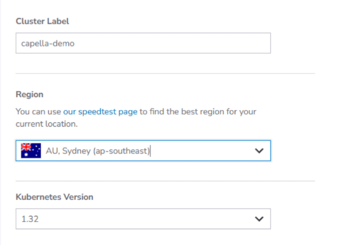
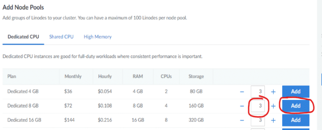
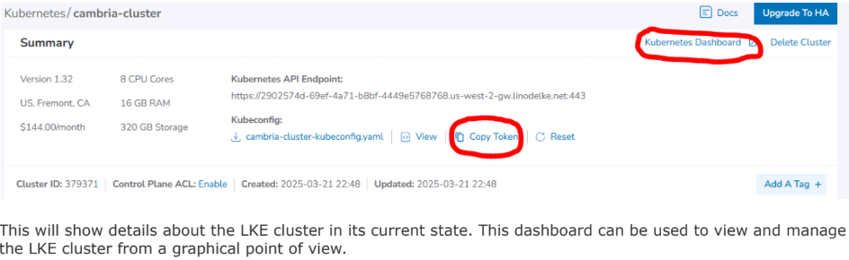
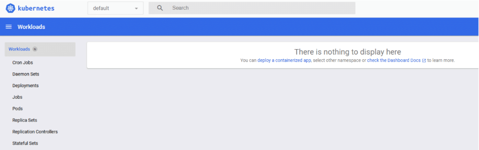
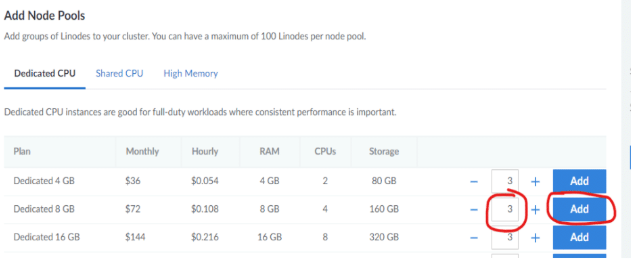
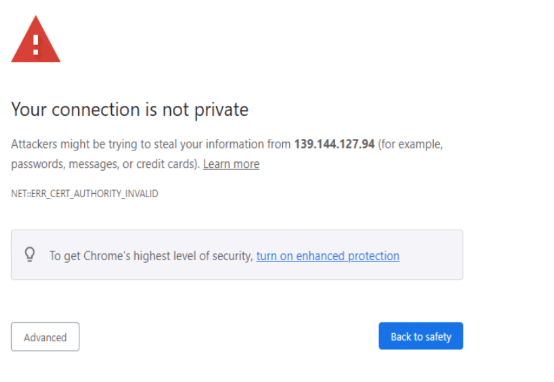
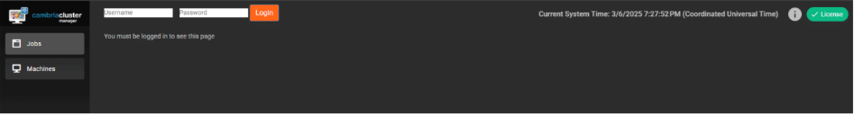

## Document History

| Version | Date       | Description                                |
|---------|------------|--------------------------------------------|
| 5.4.0   | 10/03/2024 | Updated for release 5.4.0.21627 (Linux)    |
| 5.5.0   | 04/11/2025 | Updated for release 5.5.0.23529 (Linux)    |

> **Download the online version of this document for the latest information and latest files. Always download the latest files.**

Do not move forward with the installation process if you do not agree with the End User License Agreement (EULA) for our products.  
You can download and read the EULA for Cambria FTC, Cambria Cluster, and Cambria License Manager from the links below:

- [Cambria License Manager EULA](https://www.dropbox.com/s/1wg7ee7a59kzi8h/EULA_Cambria_License_Manager.pdf?dl=0)  
- [Cambria Cluster EULA](https://www.dropbox.com/s/oemlax63aatjjiw/EULA_Cluster.pdf?dl=0)  
- [Cambria FTC EULA](https://www.dropbox.com/s/ualv9usxsowh6m2/EULA_FTC.pdf?dl=0)

### Limitations and Security Information

Cambria FTC, Cluster, and License Manager are installed on Linux Docker containers. Limitations and security checks done for this version are included in our general Linux Documents below:

- [Linux Cambria Cluster and FTC 5.5.0 Guide](https://www.dropbox.com/scl/fi/0rvskhpqtla6dffhbfli5/Linux_Cambria_Cluster_and_FTC_5_5_0_Guide.pdf?rlkey=ngryjzox121ow5fgbc4y8n2yd)

> **Note:** These documents are for informational use only. The setup for Kubernetes starts in section 3. Create Kubernetes Cluster.  
> This document references Kubernetes version 1.32.1 only.

---

## ⚠️ Important: Before You Begin

PDF documents have a copy/paste issue. For best results, download this document and any referenced PDF documents in this guide and open them in a PDF viewer such as Adobe Acrobat.

For commands that are in more than one line, copy each line one by one and check that the copied command matches the one in the document.

---

## ⚠️ Critical Information: Read Before Proceeding with Installation

Before starting the installation, carefully review the following considerations. Skipping this section may result in errors, failed deployments, or misconfigurations.

1. **A New Kubernetes Cluster Will Be Deployed**  
   ● The installation process creates a brand-new Kubernetes cluster to keep the Cambria ecosystem isolated from other applications.

2. **Default Installation is Non-Secure**  
   ● The guide covers installation with default settings in an open environment (not secure).  
   ● If you require a secure or customized setup, you will need Akamai Cloud expertise, which is not covered in this guide.  
   ● Firewall information is provided in section 1.5. Firewall Information

3. **Understand Your Transcoding Requirements**  
   ● Know your expected transcoding volume, input/output specs, and whether a GPU is needed.  
   ● Refer to section 1.3. Akamai Cloud Machine Information and Benchmark for guidelines on machine requirements.

4. **Administrative Rights Required**  
   ● Many of the steps in this guide require administrative rights to Akamai Cloud for adding permissions and performing other administrative functions of that sort.

5. **Check Akamai Cloud Account Quota**  
   ● Ensure the Akamai Cloud account has sufficient quota to deploy Kubernetes resources.  
   ● See section 1.2. Resource Usage for estimated resource requirements.

6. **A Separate Linux Machine is Required**  
   ● A dedicated Linux machine (preferably Ubuntu) is needed to deploy Kubernetes.  
   ● Keeping Kubernetes tools and configuration files on a dedicated system is strongly recommended.

7. **Verify Region-Specific Resource Availability**  
   ● Not all Akamai Cloud regions support the same resources (e.g., GPU availability varies by region).  
   ● Consult Akamai Cloud documentation to confirm available resources in your desired region.

# Document Overview

The purpose of this document is to provide a walkthrough of the installation and initial testing process of the Cambria Cluster and Cambria FTC applications in the Kubernetes environment. The basic view of the document is the following:

1. Overview of the Cambria Cluster / FTC Environment in a Kubernetes Environment  
2. Preparation for the installation (Prerequisites)  
3. Create and configure the Kubernetes Cluster  
4. Install Cambria Cluster and Cambria FTC on the Kubernetes Cluster  
5. Verify the installation is working properly  
6. Test the Cambria Cluster / FTC applications  
7. Update the Cambria Cluster / FTC applications on Kubernetes Cluster  
8. Delete a Kubernetes Cluster  
9. Quick Reference of Kubernetes Installation  
10. Quick Reference of Important Kubernetes Components (urls, template projects, test player, etc)  
11. Glossary of important terms  

---

## 1. Overview

### 1.1. Cambria Cluster / FTC Kubernetes Deployment

There are two major applications involved in this Kubernetes installation: Cambria Cluster and Cambria FTC.

#### Cambria Cluster:

This deployment is recommended to run on at least 3 nodes (replica = 3) with a service (Load Balancer) that exposes the application externally. For each of these nodes, Cambria Cluster will be installed on its own pod and designated to its own node. One node acts as the leader and the other two are replicas for the purpose of replacing the leader in the case it becomes inactive, corrupted, etc. Each Cambria Cluster pod has three containers:

1. Cambria Cluster (application)  
2. Leader Elector tool that chooses which of the Cambria Cluster node/pod will be the leader  
3. Cambria FTC Autoscaler tool that, when enabled, automatically deploys worker nodes for encoding purposes based on the number of encoding jobs queued to the system:  
   ```
   Number of Nodes to Deploy = (Number of Queued Jobs + 2) / 3
   ```

Each Cluster deployment has a corresponding PostgreSQL database installed on a separate pod. The data is replicated across the database pods to preserve state.

#### Cambria FTC:

Capella’s Cambria FTC deployment consists of one or more nodes that are (by default) of different instance types than the Cambria Cluster nodes. These focus specifically on running encoding tasks. Each Cambria FTC pod has three containers:

1. Cambria FTC (application)  
2. Auto-Connect FTC dotnet tool:  
   - Lists pods  
   - Attempts to find Cambria Cluster  
   - Connects the Cambria FTC application to the Cambria Cluster  
   - Deletes its own node pool if no Cambria Cluster is found (~20 min timeout)  
3. Pgcluster database: Stores encoding job content and runtime data

Each node in the Kubernetes Cluster is assigned either a Cluster or FTC role.

---

### 1.2. Resource Usage

Resources used and their quantities vary by requirement and environment. Below is a general overview (refer to Akamai Cloud documentation for full details):

- **NodeBalancers**: 0-3 (Manager WebUI, Manager Web Server, Grafana); 0-1 (Ingress)  
- **Nodes**:  
  - X Cambria Manager Instances (default: 3)  
  - Y Cambria FTC Instances (default: 20; based on config)  
- **Networking**: No VPCs are created  
- **Security**: By default, no firewalls are created. However, Firewalls can be applied to the LKE cluster nodes for stricter security

# 1.3. Akamai Cloud Machine Information and Benchmark

The following is a benchmark of two Akamai Cloud machines. The information below is as of September 2024.  
Note that the benchmark involves read from / write to Akamai ObjectStorage which influences the real-time speed of transcoding jobs.

## Benchmark Job Information

| Type | Codec | Frame Rate | Resolution | Bitrate |
|------|-------|------------|------------|---------|
| Source | TS H.264 | 30 | 1920 x 1080 | 8 Mbps |
| Output | HLS/TS H.264 | 29.97 | 1920 x 1080, 1280 x 720, 640 x 480, 320 x 240 | 4 Mbps, 2.4 Mbps, 0.8 Mbps, 0.3 Mbps |

---

## a. g6-dedicated-16 [ AMD EPYC 7713 ]

### Machine Info

| Name        | RAM   | CPUs | Storage | Transfer | Network In/Out     | Cost per Hour        |
|-------------|--------|------|---------|----------|---------------------|-----------------------|
| Dedicated 32 GB | 32 GB | 16   | 640 GB  | 7 TB     | 40 Gbps / 7 Gbps    | $0.432 (As of 05/28/2024) |

### Benchmark Results

- **# of Concurrent Jobs**: 2  
- **Real Time Speed per Job**: 0.43x RT (slower than real-time)  
- **Total Throughput**: 0.86x RT (1 minute of source takes ~1m10s to transcode)  
- **CPU Usage**: 100%

---

## b. g6-dedicated-64 [ AMD EPYC 7713 ]

### Machine Info

| Name         | RAM   | CPUs | Storage | Transfer | Network In/Out     | Cost per Hour        |
|--------------|--------|------|---------|----------|---------------------|-----------------------|
| Dedicated 512 GB | 512 GB | 64   | 7200 GB | 12 TB    | 40 Gbps / 12 Gbps   | $6.912 (As of 05/28/2024) |

### Benchmark Results

- **# of Concurrent Jobs**: 2  
- **Real Time Speed per Job**: 1.45x RT (faster than real-time)  
- **Total Throughput**: 2.90x RT (1 minute of source takes ~14 seconds to transcode)  
- **CPU Usage**: ~80%

---

### Benchmark Findings

The results show the g6-dedicated-64 has higher overall throughput. This is expected as the instance has more processing power than the g6-dedicated-16.  
However, if you take into account the cost per hour for each machine, the more cost-efficient option is to go with the **g6-dedicated-16**.

## 1.4. Cambria Application Access

The Cambria applications are accessible via the following methods:

### 1.4.1. External Access via TCP Load Balancer

The default Cambria installation configures the Cambria applications to be exposed through load balancers.  
There is one for the Cambria Manager WebUI + License Manager, and one for the web / REST API server.  
The load balancers are publicly available and can be accessed either through its public IP address or domain name, and the application's TCP port.

**Example:**

- **Cambria Manager WebUI:**  
  `https://44.33.212.155:8161`

- **Cambria REST API:**  
  `https://121.121.121.121:8650/CambriaFC/v1/SystemInfo`

External access in this way can be turned on/off via a configuration variable. See section **4.2. Creating and Editing Helm Configuration File**.  
If this feature is disabled, another method of access will need to be configured.

### 1.4.2. HTTP Ingress via Reverse Proxy

In cases where the external access via TCP load balancer is not acceptable or for using a purchased domain name  
from services such as GoDaddy, the Cambria installation provides the option to expose an ingress.

Similar to the external access load balancers, the Cambria Manager WebUI and web / REST API server are exposed.  
However, only one IP address / domain name is needed in this case.

How it works:
- The Cambria WebUI is exposed through the subdomain **webui**
- The Cambria web server through the subdomain **api**
- The Grafana dashboard through the subdomain **monitoring**

**Example with the domain `mydomain.com`:**

- **Cambria Manager WebUI:**  
  `https://webui.mydomain.com`

- **Cambria REST API:**  
  `https://api.mydomain.com`

- **Grafana Dashboard:**  
  `https://monitoring.mydomain.com`

Capella provides a default ingress hostname for testing purposes only.  
In production, the default hostname, SSL certificate, and other such information need to be configured.  
More information about ingress configuration is explained later in this guide.

### 1.5. Firewall Information

By default, this guide creates a Kubernetes cluster with default settings which do not include a firewall. For custom or non-default configurations, or to use a more restrictive network based on the default virtual network created, the following is a list of known ports that the Cambria applications use:

#### Ports Used by Cambria Applications

| Port(s) | Protocol | Traffic Direction | Description |
|---------|----------|-------------------|-------------|
| 8650    | TCP      | Inbound           | Cambria Cluster REST API |
| 8161    | TCP      | Inbound           | Cambria Cluster WebUI |
| 8678    | TCP      | Inbound           | Cambria License Manager Web Server |
| 8481    | TCP      | Inbound           | Cambria License Manager WebUI |
| 9100    | TCP      | Inbound           | Prometheus System Exporter for Cambria Cluster |
| 8648    | TCP      | Inbound           | Cambria FTC REST API |
| 3100    | TCP      | Inbound           | Loki Logging Service |
| 3000    | TCP      | Inbound           | Grafana Dashboard |
| 443     | TCP      | Inbound           | Capella Ingress |
| ALL     | TCP/UDP  | Outbound          | Expose all outbound traffic |

#### Required Firewall Domains for Cambria Licensing

For Cambria licensing, any Cambria Cluster and Cambria FTC machine requires the following domains be exposed in your firewall (both inbound and outbound traffic):

| Domain                         | Port(s) | Protocol | Traffic Direction | Description              |
|--------------------------------|---------|----------|-------------------|--------------------------|
| api.cryptlex.com               | 443     | TCP      | In/Out            | License Server           |
| cryptlexapi.capellasystems.net| 8485    | TCP      | In/Out            | License Cache Server     |
| cpfs.capellasystems.net       | 8483    | TCP      | In/Out            | License Backup Server    |

## 2. Prerequisites

The following steps need to be completed before the deployment process.

### 2.1. Tools: Kubectl and Helm

This guide uses cURL and unzip to run certain commands and download the required tools and applications.  
Therefore, the Linux server used for deployment will need to have these tools installed. Here is an example with Ubuntu:

```bash
sudo apt update; sudo apt upgrade; sudo apt install curl unzip
```

The components of this installation are packaged in a zip archive. Download it using the following command:

```bash
curl -o CambriaClusterKubernetesAkamai_5_5_0.zip -L "https://www.dropbox.com/scl/fi/djskqq0ve21vlgjk6bmiq/CambriaClusterKubernetesAkamai_5_5_0.zip?rlkey=dlw857nygf22e901tcakpbxm2&st=fibyo4zd&dl=1"
unzip CambriaClusterKubernetesAkamai_5_5_0.zip
chmod +x *.sh
```

> **Important:** The scripts included have been tested with Ubuntu. They may work with other Linux distributions but have not been tested.

#### 2.1.1. Installation

There are 2 options available for installing the Kubernetes required tools for deployment to Akamai Cloud:

**Option 1: Use Installation Script (Verified on Ubuntu)**  
```bash
./installKubeTools.sh
```

**Option 2: Other Installation Options**
1. [Kubectl](https://kubernetes.io/docs/tasks/tools/)
2. [Helm](https://helm.sh/docs/intro/install/)

#### 2.1.2. Verification

If any of the commands below fail, review the installation instructions for the failing tool and try again:

```bash
kubectl version --client; helm version
```

---

## 3. Create Kubernetes Cluster

The following section provides the basic steps needed to create a Kubernetes Cluster on Akamai Cloud.

### 3.1. Create LKE Cluster and Cambria Cluster Node Group

1. In the Akamai Cloud dashboard, create a Cluster on the Dashboard in the Kubernetes section.
   a. Choose a label for your Kubernetes Cluster, the region where it should be created, and version 1.32 for the Kubernetes Version.  
   b. If this Kubernetes setup is for production, it is recommended to enable the HA Control Plane to activate high availability for the Kubernetes Cluster.  
   > Note: This does incur an additional cost on top of the Kubernetes Cluster specific costs. Otherwise, select the **No** option.



   c. In the Add Node Pools section, there is one node pool that needs to be added at this time (for Cambria
Cluster). Set the number of nodes for Cambria Cluster to the amount desired and click the Add button
(See example below).

:::info Information / Recommendation
Cambria Cluster manages scheduling and handling Cambria FTC encoding / packaging programs.  
Think about how many programs will be intended to run and choose an instance type accordingly.  

The lowest recommended machine type for the manager machines is **Dedicated 8GB**.  
It is also recommended to set the node count to **3**. This is because one of the nodes will act as the Cambria Cluster node while the other two nodes act as backups (web server and database are replicated / duplicated).  

In the case that the Cambria Cluster node goes down or stops responding, one of the other two nodes will take over as the Cambria Cluster node.  

Depending on your workflow(s), think about how many backup nodes may be needed.
:::



placeholder



This will show details about the LKE cluster in its current state. This dashboard can be used to view and manage
the LKE cluster from a graphical point of view.



### 3.2. (Optional) Restricting Cambria FTC Encoder Designated Nodes via Exclusion Label

Follow these steps only if more precise control is required over which nodes Cambria FTC is installed on.  
If unsure, refer to the following overview for more details before moving forward.

#### Overview

By default, the Cambria management and encoding applications are installed on separate nodes according to a specified node instance type.  
For example, if the management node instance type is set to `g6-dedicated-4`, Cambria Cluster can only be installed on nodes of that instance type, while Cambria FTC can be installed on nodes of other instance types.

In some scenarios, the default setup may not be sufficient.  
For example, certain nodes may need to handle both management and encoding, or specific nodes in the cluster may be designated for other tasks and should not run encoding tasks.  
To accommodate these workflows, an exclusion label must be added to the nodes where Cambria FTC should be restricted.

#### Steps

1. Find out which node(s) will be Cambria FTC restricted and note down the name:
    ```bash
    kubectl get nodes
    ```

2. Apply the following label to each of those nodes:
    ```bash
    kubectl label node <node-name> no-capella-worker=true
    ```

3. Follow this step only for each node pool that should apply the Cambria FTC exclusion tag to all of its existing and new nodes.

   To apply the same restriction to all nodes in a node pool, add the same label to the node pool.  
   In Akamai, when labeling a node pool, the label will apply to existing and new nodes. One way to do this is via the Akamai Cloud Dashboard:

    a. In the Akamai Cloud Dashboard, go into the Kubernetes cluster and look for the node pool(s) to label  
    b. Select **Labels and Taints** and **Add Label**. In the Label field, enter:
       ```
       no-capella-worker: true
       ```
       and then save the changes.

4. When in section **4.2. Creating and Editing Helm Configuration File**, make sure to set this option in the Helm values file:
    ```yaml
    workersCanUseManagerNodes: true
	```
	
	### 3.3. Create Cambria FTC Node Group(s)

*Skip this step if planning to use Cambria FTC's autoscaler.*

Run the following steps to create the Node Group(s) for the worker application instances (replace the highlighted values to those of your specific environment):

**Information / Recommendation**

For this particular case, Cambria FTC nodes need to be added manually. Therefore, you will need to think about what machine / instance types are needed for running the Cambria FTC workflows.

Based on benchmarks (See section 1.3. _Akamai Cloud Machine Information and Benchmark_), the recommended machine / instance type to get started is `g6-dedicated-16`.

To get started, it is recommended to start with **one instance**. This way, when the installation is complete, there will already be one Cambria FTC instance to test with. The number of instances can always be scaled up and down, up to the **maximum FTC instance count** that will be configured in section 4.2. _Creating and Editing Helm Configuration File_.

---

**Steps:**

1. In the Akamai Dashboard, go to the LKE cluster.
2. Select **Add a Node Pool** and choose the node instance types and number of nodes to add to the node group.
    - The instance types **MUST** be different from the Cambria Cluster nodes except if the steps in section 3.2 _Optional: Restricting Cambria FTC Encoder Designated Nodes via Exclusion Label_ were followed.




### 3.4. GPU Operator for NVENC

This section is only required for a Kubernetes cluster that will use GPUs.  
**Skip this step if GPUs will not be used in this Kubernetes cluster.**

**Limitation**: This currently does not work with the FTC autoscaler.

In a command prompt / terminal, run the following commands to deploy the GPU Operator to the Kubernetes cluster:

```bash
helm repo add nvidia https://helm.ngc.nvidia.com/nvidia
helm repo update
helm install nvidia-operator nvidia/gpu-operator \
  --create-namespace \
  --namespace gpu-operator
```

Wait at least 5 minutes for the GPU operator to install completely.  
Run this command with `kubectl` and make sure that all of the pods are in a `Running` or `Completed` state:

```bash
kubectl get pods -n gpu-operator
```

If any pod is still in an `Init` state or `PodCreating` state, wait another 5 minutes to see if the pods will complete their install process.

For any pods that are in an errored state or that are still in an `Init` state after 10 minutes, do the following:
- Check that at least one node is one of the supported Akamai Cloud GPU instances.
- Use the following command to check the state of a failing pod (check the Events section):

```bash
kubectl describe pod <your-pod-name> -n gpu-operator
```

Either look up the error for a potential solution or send the entire Events section to the Capella support team for investigation.

---

### 3.5. Performance Metrics and Logging

This section is required for logging and other performance information about the Cambria applications.  
Follow the steps in the document below to install Prometheus, Grafana, Loki, and Promtail:

[Prometheus_Grafana_Setup_for_Cambria_Cluster_5_5_0_on_Akamai_Kubernetes.pdf](https://www.dropbox.com/scl/fi/rxshb6038wd9yg81kxagd/Prometheus_Grafana_Setup_for_Cambria_Cluster_5_5_0_on_Akamai_Kubernetes.pdf?rlkey=5l561e8x251y46gywx57k5svm&st=m58td12z&dl=1)

---

## 4. Install Cambria Cluster, FTC, and Dependencies

### 4.1. Prerequisite: Deploy External Kubernetes Tools

There are a few tools that need to be deployed in order to make Cambria FTC / Cluster work properly.

#### 4.1.1. Required Tools

1. Run the following commands to deploy the pre-requisite tools for the kubernetes cluster:

```bash
./deployCambriaKubeDependencies.sh
```

2. Verify that resources are created and in an active / online state:
   - Pods should be in a `Running` STATUS and all containers in `READY` should be active.
   - Services should have a `CLUSTER-IP` assigned.
   - All other resources (e.g., replicasets, deployments, statefulsets, etc) should have all desired resources active.

```bash
kubectl get all -n cnpg-system
kubectl get all -n argo-events
kubectl get all -n cert-manager
```

If any resources are still not ready, wait about a minute for them to complete.  
If still not working, contact the Capella support team.

---

#### 4.1.2. (Optional) Ingress-Nginx

Run the steps in this section if either an ingress is required or for testing purposes.  
If unsure, read section **1.4. Cambria Application Access** which provides a brief overview of the different ways to access the Cambria applications.

By default, certain parts of the Cambria applications are exposed via an ingress. In order to access these, the `ingress-nginx` service needs to be created and attached to the ingress via a reverse-proxy.

> **Important:** This will create a load balancer that is **not automatically deleted** when the Kubernetes cluster is destroyed. This load balancer has to be deleted manually.

### 4.1.2. (Optional) Ingress-Nginx (continued)

1. Run the following command:

```bash
kubectl apply -f https://raw.githubusercontent.com/kubernetes/ingress-nginx/controller-v1.12.1/deploy/static/provider/cloud/deploy.yaml
```

2. Verify that the resources are created and in an active / online state:
- Pods should be in a `Running` STATUS and all containers in `READY` should be active.
- Services should have a `CLUSTER-IP` assigned. The `ingress-nginx-controller` should have an `EXTERNAL-IP`.
- All other resources (e.g. replicasets, deployments, statefulsets) should have all desired resources active:

```bash
kubectl get all -n ingress-nginx
```

If any resources are still not ready, wait about a minute for them to complete. If still not complete, contact the Capella support team.

#### For Production / Using Publicly Registered Domain Name and TLS Certificate:

Follow this document:

[Cambria Kubernetes Domain DNS Guide (Dropbox)](https://www.dropbox.com/scl/fi/3vlap75xs8r5zo1d47gr0/Cambria_Kubernetes_Domain_DNS_Guide.pdf?rlkey=ei34633z8elzu7jvmv8w6ezou)

> Important: Connect the domain to the ingress and make sure to have entries in the domain registry for the following subdomains (assuming `mydomain.com` is your registered domain):
>
> - `api.mydomain.com`
> - `webui.mydomain.com`
> - `monitoring.mydomain.com`

If not working or unsure of how to do this, contact Capella support.

---

### 4.2. Creating and Editing Helm Configuration File

With Helm and Kubectl installed on the Linux deployment server, create the Helm configuration file (`yaml`) that will be used to deploy Cambria Cluster / FTC to the Kubernetes environment.

1. In a terminal, run the following command to create the configuration file:

```bash
helm show values capella-cluster.tgz > cambriaClusterConfig.yaml
```

2. Open the configuration file in your preferred editor and edit the following values:

**Blue** = provided by Capella  
**Red** = specific to your environment


### cambriaClusterConfig.yaml Explanation

```yaml
# allow worker pods to run on the same nodes as manager pods
workersCanUseManagerNodes: false

# workersUseGPU: allow workers to use nvidia GPU
workersUseGPU: false

# nbGPUs: how many GPUs are on the nodes...
nbGPUs: 1

# managerInstanceType: database and Cambria Cluster will be...
managerInstanceType: "g6-dedicated-4"

# ftcEnableAutoScaler: if true, auto-scaler pod for FTC will be deployed
ftcEnableAutoScaler: true

# ftcInstanceType: instance type for the FTC nodes which will be...
ftcInstanceType: "g6-dedicated-16"

# maxFTCInstances: maximum number of FTC instances (ie replicas)...
maxFTCInstances: 20

# pgInstances: number of postgresql database instances (ie replicas)
pgInstances: 3

# cambriaClusterReplicas: number of Cambria Cluster instances...
cambriaClusterReplicas: 3

externalAccess:
  # exposeClusterServiceExternally: main Cambria Cluster service
  exposeStreamServiceExternally: true

  # enableIngress: enable nginx ingress
  enableIngress: true

  # hostName: use for the nginx ingress. Replace this with your domain name.
  hostName: myhost.com

  # acmeRegistrationEmail: email for Automated Certificate Management
  acmeRegistrationEmail: test@example.com

  # acmeServer: server to get TLS certificate from
  acmeServer: https://acme-staging-v02.api.letsencrypt.org/directory

secrets:
  # pgClusterPassword: password for the postgresql database
  pgClusterPassword: "xrtVeQ4nN82SSiYHoswqdURZ…"

  # ftcLicenseKey: FTC license key
  ftcLicenseKey: "2XXXXX-XXXXXX-XXXXXX-XXXXXX-XXXXXX-XXXXXX"

  # cambriaClusterAPIToken: API token for Cambria Cluster...
  cambriaClusterAPIToken: "12345678-1234-43f8-b4fc-53afd3893d5f"

  # cambriaClusterWebUIUser: user/password to access Cambria Cluster UI...
  cambriaClusterWebUIUser: "admin,defaultWebUIUser,RZvSSd3ffsElsCEEe9"

  # akamaiCloudAPIToken: API token, used for horizontal scaling...
  akamaiCloudAPIToken: "d02732530a2bcfd4d028425eb55f366f74631…"

  # argoEventWebhookSourceBearerToken: bearer token used by webhook-ftc
  argoEventWebhookSourceBearerToken: "L9Em5WIW8yth6H4uPtzT"

optionalInstall:
  enableEventing: true
```

## 4.3. Installing Cambria FTC / Cluster

Wait at least 5 minutes after installing prerequisites before moving on to this step. In a command line / terminal window, run the following command:

```bash
helm upgrade --install capella-cluster capella-cluster.tgz --values cambriaClusterConfig.yaml
```

The result of running the command should look something like this:

```
Release "capella-cluster" does not exist. Installing it now.
NAME: capella-cluster
LAST DEPLOYED: Thu May 3 10:09:47 2023
NAMESPACE: default
STATUS: deployed
REVISION: 1
TEST SUITE: None
```

At this point, several components are being deployed to the Kubernetes environment. Wait a few minutes for everything to be deployed.

---

## 5. Verify Cambria FTC / Cluster Installation

### 5.1. Verify Cambria Cluster Deployment

> **Important:** The components below are only a subset of the whole installation. These are the components considered as key to a proper deployment.

1. Run the following command:

```bash
kubectl get all -n default
```

2. Verify the following information:

| Resources  | Content |
|------------|---------|
| Deployments | - 1 `cambriaclusterapp` deployment with all items active<br />- 1 `cambriaclusterwebui` deployment with all items active |
| Pods        | - X pods with `cambriaclusterapp` in the name (X = # of replicas specified in config file) with all items active / Running<br />- X pods with `pgcluster` in the name (X = # of replicas specified in config file) with all items active / Running<br />- 1 pod with `cambriaclusterwebui` in the name |
| Services    | - 3 services with `pgcluster` in the name with a `CLUSTER-IP` assigned<br />- 1 service named `cambriaclusterservice`. If `exposeStreamServiceExternally` is true, this should have an `EXTERNAL-IP`<br />- 1 service named `cambriaclusterwebuiservice`. If `exposeStreamServiceExternally` is true, this should have an `EXTERNAL-IP` |

3. If any of the above are not in an expected state, wait a few more minutes in case some resources take longer than expected to complete. If after a few minutes there are still resources in an unexpected state, contact the Capella support team.

---

### 5.2. Verify Cambria FTC Deployment

> **Important:** The components below are only a subset of the whole installation. These are the components considered as key to a proper deployment.

1. Run the following command:

```bash
kubectl get all -n capella-worker
```

2. Verify the following information:

| Resources  | Content |
|------------|---------|
| Pods        | - X pods with `cambriaftcapp` in the name (X = Max # of FTCs specified in the config file)<br />**Notes:**<br />1. If using Cambria FTC autoscaler, all of these pods should be in a pending state. Every time the autoscaler deploys a Cambria FTC node, one pod will be assigned to it.<br />2. If not using Cambria FTC autoscaler, Y of the pods should be in an active / running state and all containers running (Y = # of Cambria FTC nodes active) |
| Deployments | - 1 `cambriaftcapp` deployment. |

3. If any of the above are not in an expected state, wait a few more minutes in case some resources take longer than expected to complete. If after a few minutes there are still resources in an unexpected state, contact the Capella support team.

### 5.3. Verify Applications are Accessible

#### 5.3.1. Cambria Cluster WebUI

Skip this step if the WebUI was set to disabled in the Helm values configuration yaml file or the ingress will be used instead. For any issues, contact the Capella support team.

1. **Get the WebUI address. A web browser is required to access the WebUI:**

**Option 1: External Url if External Access is Enabled**  
Run the following command:

```bash
kubectl get svc/cambriaclusterwebuiservice -n default -o=jsonpath="{'https://'}{.status.loadBalancer.ingress[0].hostname}{':8161'}{'
'}"
```

The response should look something like this:

```
https://192.122.45.33:8161
```

**Option 2: Non-External Url Access**  
Run the following command to temporarily expose the WebUI via port-forwarding:

```bash
kubectl port-forward -n default svc/cambriaclusterwebuiservice 8161:8161 --address=0.0.0.0
```

The URL depends on the location of the web browser. If the web browser and the port-forward are on the same machine, use `localhost`. Otherwise, use the IP address of the machine with the port-forward:

```
https://<server>:8161
```

2. **In a web browser, enter the above URL.** This should trigger an "Unsafe" page similar to the one below.



3. Click on Advanced and Proceed to [ EXTERNAL IP ] (unsafe). This will show the login page.



4. Log in using the credentials created in the Helm values yaml file (See cambriaClusterWebUIUser)

### 5.3.2. Cambria Cluster REST API

**Skip this step if the ingress will be used instead of external access or any other type of access.**  
For any issues, contact the Capella support team.

**1. Get the REST API address:**

**Option 1: External URL if External Access is Enabled**

```bash
kubectl get svc/cambriaclusterservice -n default -o=jsonpath="{'https://'}{.status.loadBalancer.ingress[0].hostname}{':8650'}{'
'}"
```

Example Output:
```
https://192.122.45.33:8650
```

**Option 2: Non-External URL Access**

Run the following command to temporarily expose the REST API via port-forwarding:

```bash
kubectl port-forward -n default svc/cambriaclusterservice 8650:8650 --address=0.0.0.0
```

The URL depends on the location of the port-forward.  
If the web browser and the port-forward are on the same machine, use `localhost`.  
Otherwise, use the IP address of the machine with the port-forward:

```
https://<server>:8650
```

**2. Run the following API query to check if the REST API is active:**

```bash
curl -k -X GET https://<server>:8650/CambriaFC/v1/SystemInfo
```

---

### 5.3.3. Cambria Ingress

**Skip this step if not planning to test with Cambria's ingress.**  
For any issues, contact the Capella support team.

#### 5.3.3.1. Get the Ingress Endpoints

There are two ways to use the ingress:

**Option 1: Using Default Testing Ingress**

Only use this option for testing purposes. Skip to Option 2 for production.  
To use the ingress in the testing state, the hostname needs to be DNS resolvable on the machines that need access.

**1. Get the ingress HOSTS and ADDRESS:**

```bash
kubectl get ingress -A
```

Example Output:

```
NAMESPACE   NAME                   CLASS   HOSTS                                         ADDRESS       PORTS   AGE
default     cambriaclusteringress nginx   api.akamai.capellatest.com,webui.akamaicapellatest.com   55.99.103.99   80, 443   23m
monitoring  cambriamonitoringingress nginx   monitoring.myhost.com                         55.99.103.99   80, 443   58m
```

**2. Edit the `/etc/hosts` file (or equivalent) on all servers needing access:**

```bash
55.99.103.99 api.myhost.com
55.99.103.99 webui.myhost.com
55.99.103.99 monitoring.myhost.com
```

**Option 2: Using Publicly Registered Domain (Production)**

Contact Capella if unable to set up a purchased domain with the ingress.  
If the domain is set up, the endpoints are as follows (example with `mydomain.com`):

- REST API: `https://api.myhost.com`
- WebUI: `https://webui.myhost.com`
- Grafana Dashboard: `https://monitoring.myhost.com`

### 5.3.3.2. Test Ingress Endpoints

If using the test ingress, these steps can only be verified in the machine(s) where the hosts file was modified. This is because the test ingress is not publicly DNS resolvable and so only those whose hosts file (or DNS) have been configured to resolve the test ingress will be able to access the Capella applications in this way.

1. **Test Cambria Cluster WebUI** with the ingress that starts with `webui`. Run steps 2-3 of **5.3.1. Cambria Cluster WebUI**. Example:  
   `https://webui.myhost.com`

2. **Test Cambria REST API** with the ingress that starts with `api`. Run step 2 of **5.3.2. Cambrai Cluster REST API**. Example:  
   `https://api.myhost.com/CambriaFC/v1/SystemInfo`

3. **Test Grafana Dashboard** with the ingress that starts with `monitoring`. Run the verification steps for the Grafana Dashboard in **section 1.4. Verify Grafana Deployment (steps 2-4)** in the document in **3.7. Performance Metrics and Logging**. Example:  
   `https://monitoring.myhost.com`

### 5.3.4. Cambria License

The Cambria license needs to be active in all entities where the Cambria application is deployed. Run the following steps to check the Cambria license. Access to a web browser is required:

1. **Get the url for the License Manager WebUI**:

   **Option 1: External Url if External Access is Enabled**  
   Run the following command:  
   ```bash
   kubectl get svc/cambriaclusterwebuiservice -n default -o=jsonpath="{'https://'}{.status.loadBalancer.ingress[0].hostname}{':8481'}{'
'}"
   ```  
   The response should look something like this:  
   `https://192.122.45.33:8481`

   **Option 2: Non-External Url Access**  
   Run the following command to temporarily expose the License WebUI via port-forwarding:  
   ```bash
   kubectl port-forward -n default svc/cambriaclusterwebuiservice 8481:8481 --address=0.0.0.0
   ```  
   The URL depends on the location of the port-forward. If the web browser and the port-forward are on the same machine, use `localhost`. Otherwise, use the IP address of the machine with the port-forward:  
   `https://<server>:8481`
   
   2. In a web browser, enter the above url. This should trigger an "Unsafe" page similar to the one below:


   3. Click on Advanced and Proceed to [ EXTERNAL IP ] (unsafe). This will show the login page.


4. Log in using the credentials created in the Helm values yaml file (See cambriaClusterWebUIUser)

5. Verify that the License Status is valid for at least either the Primary or Backup. Preferably, both Primary and
Backup should be valid. If there are issues with the license, wait a few minutes as sometimes it takes a few
minutes to properly update. If still facing issues, contact the Capella support team.

## 6. Testing Cambria FTC / Cluster

The following guide provides information on how to get started testing the Cambria FTC / Cluster software:
[Cambria Cluster and FTC 5.5.0 Kubernetes User Guide](https://www.dropbox.com/scl/fi/5vra6xff23vvng7aa4qyx/Cambria_Cluster_and_FTC_5_5_0_Kubernetes_User_Guide.pdf?rlkey=j3l9wjjo5ncbub9bh9bizrukr&st=tmmzm91q&dl=1)

## 7. Updating / Upgrading Cambria Cluster / FTC

There are currently two ways to update / upgrade Cambria FTC / Cluster in the kubernetes environment.

### 7.1. Option 1: Normal Upgrade via Helm Upgrade

This upgrade method is best for when changing version numbers, secrets such as the license key, WebUI users, etc, and Cambria FTC | Cambria Cluster specific settings such as max number of pods, replicas, etc.

**Warning! Known Issues**
- `pgClusterPassword` cannot currently be updated via this method
- Changing postgres version also cannot be updated via this method

1. Edit the Helm configuration file (yaml) for your Kubernetes environment or create a new configuration file and edit the new file. See section 4.2.
2. Run the following command to apply the upgrade:

```bash
helm upgrade capella-cluster capella-cluster.tgz --values cambriaClusterConfig.yaml
```

3. Restart the deployments:

```bash
kubectl rollout restart deployment cambriaclusterapp cambriaclusterwebui -n default
kubectl rollout restart deployment cambriaftcapp -n capella-worker
```

4. Wait a few minutes for the kubernetes pods to install properly.

### 7.2. Option 2: Upgrade via Cambria Cluster Reinstallation

For any upgrade cases for the Cambria Cluster | Cambria FTC environment, this is the most reliable option. This upgrade option basically uninstalls all of the Cambria FTC and Cluster components and then reinstalls with the new Helm chart and values (.yaml) file. As a result, this will delete the database and delete all of your jobs in the Cambria Cluster UI.

1. Follow section 4.2 to edit your new `cambriaClusterConfig.yaml` file.
2. Run:

```bash
helm uninstall capella-cluster --wait
```

3. Redeploy:

```bash
helm upgrade --install capella-cluster capella-cluster.tgz --values cambriaClusterConfig.yaml
```

### 7.3. Upgrade Verification

Use the steps in section 5.0 to verify the upgrade. For any issues, contact the Capella support team.

## 8. Deleting Kubernetes Cluster

Carefully follow each step. If using FTC's autoscaler, make sure no leftover Cambria FTC nodes are running.

1. Remove Helm deployments:

```bash
helm uninstall capella-cluster -n default --wait
```

2. Delete any remaining volumes:

```bash
kubectl get pv -o name | awk -F'/' '{print $2}' | xargs -I{} kubectl patch pv {} -p='{"spec":{"persistentVolumeReclaimPolicy": "Delete"}}'
```

3. If `ingress-nginx` was deployed:

```bash
kubectl delete namespace ingress-nginx
```

4. Follow delete steps from section 3.5.
5. In Akamai Cloud, go to Kubernetes section and delete the Cluster.
6. Delete any leftover NodeBalancers.
7. Delete any leftover Volumes.

## 9. Quick Reference: Installation, Testing, and Teardown

### 9.1. Installation (Deploy from Linux to Akamai Cloud Kubernetes)
For quick installation, use the Terraform installation instructions:  
[Cambria Cluster and FTC 5.5.0 Terraform on Akamai Kubernetes](https://www.dropbox.com/scl/fi/y4noltg67q489f39ewx4k/Cambria_Cluster_and_FTC_5_5_0_Terraform_on_Akamai_Kubernetes.pdf?rlkey=m2it3z2q7p4sebfulilgd8vn4&st=vbn29kcl&dl=1)

### 9.2. Upgrades and Teardown

#### 9.2.1. Cambria FTC | Cambria Cluster and/or the Kubernetes Cluster Upgrades
Edit the `capellaClusterConfig.yaml` file and then run the following command  
(See section 7. Updating / Upgrading Kubernetes Cluster for more details and warnings):

```bash
./quickUpgradeCambriaCluster.sh
```

#### 9.2.2. Cambria FTC | Cambria Cluster Uninstall
If just wanting to uninstall Cambria Cluster and Cambria FTC, run the following command:

```bash
helm uninstall capella-cluster --wait
```

#### 9.2.3. Kubernetes Cluster Teardown
As this involves several components, it is best to do the cluster teardown using the steps in section 8.

## 10. Quick Reference: Helpful Commands/Info for After Installation

This section provides helpful commands and other information that may be useful after the installation process such as how to get the WebUI address, what ports are available to use for incoming sources, etc.

### Akamai Kubernetes Kubeconfig File [For use with `kubectl` and Akamai Kubernetes Dashboard]
1. Log in to the Akamai Cloud dashboard and go to **Clusters**. Select your cluster from the list and click on the configuration file towards the top of the page.

### Akamai Kubernetes Dashboard
1. Log in to the Akamai Cloud dashboard and go to your Kubernetes Cluster. Click on the **Kubernetes Dashboard** link.
2. Use the Akamai Kubernetes Cluster Configuration File to log in to the dashboard.

### Cambria Cluster WebUI (via `kubectl`)
1. Run the following command to get the WebUI address:
   ```bash
   kubectl get service/cambriaclusterwebuiservice -n default      -o=jsonpath="{'https://'}{.status.loadBalancer.ingress[0].hostname}{':8161'}"
   ```
2. To log in to the WebUI, the credentials are located in the Helm values `.yaml` file that you configure (See section 3.3. Creating and Editing Helm Configuration File).

### Cambria Cluster WebUI (via Kubernetes Dashboard)
1. In the Akamai Kubernetes Dashboard for your cluster, go to **Services** and look for the `cambriaclusterwebuiservice` service. Copy the IP address of one of the External Endpoints.
2. The WebUI address should be `https://[EXTERNAL IP]:8161`. To log in to the WebUI, the credentials are located in the Helm values `.yaml` file that you configure (See section 3.3).

### Cambria Cluster REST API (via `kubectl`)
1. Run the following command to get the base REST API Web Address:
   ```bash
   kubectl get service/cambriaclusterservice -n default      -o=jsonpath="{'https://'}{.status.loadBalancer.ingress[0].hostname}{':8650'}"
   ```
2. The REST API URL should look similar to:
   ```
   https://23-45-226-151.ip.linodeusercontent.com:8650/CambriaFC/v1/Jobs?usertoken=12345678-1234-43f8-b4fc-53afd3893d5f
   ```

### Cambria Cluster REST API (via Kubernetes Dashboard)
1. In the Akamai Kubernetes Dashboard for your cluster, go to **Services** and look for the `cambriaclusterservice` service. Copy the IP address of one of the External Endpoints.
2. The REST API should look similar to:
   ```
   https://23-45-226-151.ip.linodeusercontent.com:8650/CambriaFC/v1/Jobs?usertoken=12345678-1234-43f8-b4fc-53afd3893d5f
   
   
## 10. Quick Reference: Helpful Commands/Info for After Installation

### Cambria FTC Instance External IP

1. In the Cambria Cluster WebUI, go to the **Machines** tab and copy the name of the machine (pod)
2. Run the following commands with the name of the machine (aka. `<pod-name>`):

```bash
# Replace <pod-name> with your pod name
kubectl get pod/<pod-name> -n capella-worker -o=jsonpath={.spec.nodeName}

# Replace <node-name> with the result from the above command
kubectl get node/<node-name> -n capella-worker -o=jsonpath={.status.addresses[1].address}
```

### Leader Cambria Cluster Pod

```bash
kubectl get lease -o=jsonpath="{.items[0].spec.holderIdentity}"
```

### Remote Access to Kubernetes Pod

```bash
kubectl exec -it <pod-name> -n <namespace> -- /bin/bash

# Example with Cambria FTC
kubectl exec -it cambriaftcapp-5c79586784-wbfvf -n capella-worker -- /bin/bash
```

### Extracting Cambria Cluster | Cambria FTC | Cambria License Logs

In a machine that has `kubectl` and the `kubeconfig` file for your Kubernetes cluster:

1. Open a terminal window
2. Make sure to set the `KUBECONFIG` environment variable to the path of your `kubeconfig` file
3. Run one or more of the following commands depending on the logs needed

```bash
# Cambria FTC
kubectl cp <pod-name>:/opt/capella/Cambria/Logs ./CambriaFTCLogs -n capella-worker

# Cambria Cluster
kubectl cp <pod-name>:/opt/capella/CambriaCluster/Logs ./CambriaClusterLogs -n default

# Cambria License Manager (Cambria FTC)
kubectl cp <pod-name>:/opt/capella/CambriaLicenseManager/Logs ./CambriaFTCLicLogs -n capella-worker

# Cambria License Manager (Cambria Cluster)
kubectl cp <pod-name>:/opt/capella/CambriaLicenseManager/Logs ./CambriaClusterLicLogs -n default
```

### Copy File(s) to Cambria FTC / Cluster Pod

```bash
# Copy file to Cambria FTC pod
kubectl cp /mnt/n/MySource.mp4 cambriaftcapp-7c55887db9-t42v7:/var/media/MySource.mp4 -n capella-worker

# Copy file to Cambria Cluster pod
kubectl cp C:\MyKeys\MyKeyFile.key cambriaclusterapp-695dcc848f-vjpc7:/var/keys/MyKeyFile.key -n default

# Copy directory to Cambria FTC container
kubectl cp /mnt/n/MyMediaFiles cambriaftcapp-7c55887db9-t42v7:/var/temp/mediafiles -n capella-worker
```

### Restarting / Re-creating Pods

```bash
# Delete Cambria FTC Container
kubectl delete pod cambriaftcapp-7c55887db9-t42v7 -n capella-worker

# Delete Cambria Cluster Container
kubectl delete pod cambriaclusterapp-695dcc848f-vjpc7 -n default


## 11. Glossary

This glossary provides a brief definition / description of some of the more common terms found in this guide.

### 11.1. Kubernetes

For Kubernetes terms, please refer to the Kubernetes Glossary:  
https://kubernetes.io/docs/reference/glossary/?fundamental=true

### 11.2. Third-Party Tools

- **Argo**: the Argo third-party system is a collection of tools for orchestrating parallel jobs in a Kubernetes environment.  
- **Argo-Events**: an Argo tool that triggers specific Kubernetes functions based on events from other dependencies such as webhook, s3, etc.  
- **Cert-Manager**: the cert-manager addon automates the process of retrieving and managing TLS certificates. These certificates are periodically renewed to keep the certificates up to date and valid.  
- **Helm**: the Helm third-party tool is used for deploying / managing (install, update, delete) deployments for Kubernetes Cluster applications.  
- **Ingress-Nginx**: the ingress-nginx addon is an ingress server using Nginx as a reverse proxy and load balancer. In this case, ingress-nginx is used for applying domain name use to the Kubernetes services (REST API, WebUI, etc).  

### 11.3. Capella Applications

- **cambriaclusterapp**: the Cambria Cluster application container. This container exists in all `cambriaclusterapp-xyz` pods.  
- **cambriaftautoscale**: this container is used like a load balancer. It spawns new nodes with Cambria FTC specific content whenever Cambria Cluster has jobs in the queue.  
- **cambriaftcapp**: the Cambria FTC application container. This container exists in all `cambriaftcapp-xyz` pods.  
- **cambriaftcconnect**: this container is used for automatically connecting Cambria FTC instances to Cambria Cluster. This container exists in all `cambriaftcapp-xyz` pods.  
- **cambrialeaderelector**: this container is used for Cambria Cluster replication in that it decides which of the Cambria Cluster instances is the primary instance. This container exists in all `cambriaclusterapp-xyz` pods.  
- **pgcluster-capella**: this type of pod holds the PostgreSQL database that Cambria Cluster uses / interacts with.  
