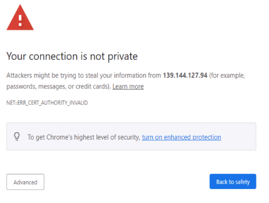
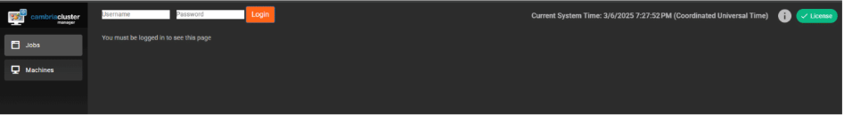

## Document History

| Version | Date       | Description                                |
|---------|------------|--------------------------------------------|
| 5.4.0   | 10/03/2024 | Updated for release 5.4.0.21627 (Linux)    |
| 5.5.0   | 04/11/2025 | Updated for release 5.5.0.23529 (Linux)    |

> **Download the online version of this document for the latest information and latest files. Always download the latest files.**

Do not move forward with the installation process if you do not agree with the End User License Agreement (EULA) for our products.  
You can download and read the EULA for Cambria FTC, Cambria Cluster, and Cambria License Manager from the links below:

- [Cambria License Manager EULA](https://www.dropbox.com/s/1wg7ee7a59kzi8h/EULA_Cambria_License_Manager.pdf?dl=0)  
- [Cambria Cluster EULA](https://www.dropbox.com/s/oemlax63aatjjiw/EULA_Cluster.pdf?dl=0)  
- [Cambria FTC EULA](https://www.dropbox.com/s/ualv9usxsowh6m2/EULA_FTC.pdf?dl=0)

### Limitations and Security Information

Cambria FTC, Cluster, and License Manager are installed on Linux Docker containers. Limitations and security checks done for this version are included in our general Linux Documents below:

- [Linux Cambria Cluster and FTC 5.5.0 Guide](https://www.dropbox.com/scl/fi/0rvskhpqtla6dffhbfli5/Linux_Cambria_Cluster_and_FTC_5_5_0_Guide.pdf?rlkey=ngryjzox121ow5fgbc4y8n2yd)

> **Note:** These documents are for informational use only. The setup for Kubernetes starts in section 3. Create Kubernetes Cluster.  
> This document references Kubernetes version 1.32.1 only.

---

## ⚠️ Important: Before You Begin

PDF documents have a copy/paste issue. For best results, download this document and any referenced PDF documents in this guide and open them in a PDF viewer such as Adobe Acrobat.

For commands that are in more than one line, copy each line one by one and check that the copied command matches the one in the document.

---

## ⚠️ Critical Information: Read Before Proceeding with Installation

Before starting the installation, carefully review the following considerations. Skipping this section may result in errors, failed deployments, or misconfigurations.

1. **A New Kubernetes Cluster Will Be Deployed**  
   ● The installation process creates a brand-new Kubernetes cluster to keep the Cambria ecosystem isolated from other applications.

2. **Default Installation is Non-Secure**  
   ● The guide covers installation with default settings in an open environment (not secure).  
   ● If you require a secure or customized setup, you will need Oracle Cloud expertise, which is not covered in this guide.  
   ● Firewall information is provided in section 1.5. Firewall Information

3. **Understand Your Transcoding Requirements**  
   ● Know your expected transcoding volume, input/output specs, and whether a GPU is needed.  
   ● Refer to section 1.3. Oracle Cloud Machine Information and Benchmark for guidelines on machine requirements.

4. **Administrative Rights Required**  
   ● Many of the steps in this guide require administrative rights to Oracle Cloud for adding permissions and performing other administrative functions of that sort.

5. **Check Oracle Cloud Account Quota**  
   ● Ensure the Oracle Cloud account has sufficient quota to deploy Kubernetes resources.  
   ● See section 1.2. Resource Usage for estimated resource requirements.

6. **A Separate Linux Machine is Required**  
   ● A dedicated Linux machine (preferably Ubuntu) is needed to deploy Kubernetes.  
   ● Keeping Kubernetes tools and configuration files on a dedicated system is strongly recommended.

7. **Verify Region-Specific Resource Availability**  
   ● Not all Oracle Cloud regions support the same resources (e.g., GPU availability varies by region).  
   ● Consult Oracle Cloud documentation to confirm available resources in your desired region.

# Document Overview

The purpose of this document is to provide a walkthrough of the installation and initial testing process of the Cambria Cluster and Cambria FTC applications in the Kubernetes environment. The basic view of the document is the following:

1. Overview of the Cambria Cluster / FTC Environment in a Kubernetes Environment  
2. Preparation for installation (Prerequisites)  
3. Create and configure the Kubernetes Cluster, Logging, and Metrics  
4. Install Cambria Cluster and Cambria FTC on the Kubernetes Cluster  
5. Verify the installation is working properly  
6. Test the Cambria Cluster / FTC applications  
7. Update the Cambria Cluster / FTC applications on Kubernetes Cluster  
8. Delete a Kubernetes Cluster  
9. Quick Reference of Kubernetes Installation  
10. Quick Reference of Important Kubernetes Components (urls, template projects, test player, etc)  
11. Glossary of important terms  

## 1. Overview

### 1.1. Cambria Cluster / FTC Kubernetes Deployment

There are two major applications involved in this Kubernetes installation: **Cambria Cluster** and **Cambria FTC**.

**Cambria Cluster:**  
This deployment is recommended to run on at least 3 nodes (`replica = 3`) with a service (Load Balancer) that exposes the application externally. For each of these nodes, Cambria Cluster will be installed on its own pod and designated to its own node. One node acts as the leader and the other two are replicas for the purpose of replacing the leader in the case it becomes inactive, corrupted, etc.

Each Cambria Cluster pod has three containers:
1. Cambria Cluster (application)  
2. Leader Elector tool that chooses which of the Cambria Cluster node / pod will be the leader  
3. Cambria FTC Autoscaler tool that, when the FTC autoscaler is enabled, will automatically deploy worker nodes for encoding purposes based on the number of encoding jobs queued to the system.

This is based on the calculation (rounded down):  
**Number of Nodes to Deploy = (Number of Queued Jobs + 2) / 3**

Also for the Cluster deployment, there is a corresponding PostgreSQL database installed on a separate pod for each active Cambria Cluster pod. The data is replicated between the different database pods in order to preserve data in case of issues with the database and/or Cluster.

**Cambria FTC:**  
Capella’s Cambria FTC deployment consists of one or more nodes that (by default) are of different instance types than the Cambria Cluster nodes. These nodes focus specifically on running encoding tasks. Similar to Cambria Cluster, the Cambria FTC application is installed on its own pod and designated to its own node.

Each Cambria FTC pod has three containers:
1. Cambria FTC (application)  
2. Auto-Connect FTC dotnet tool that does the following:  
   - lists pods  
   - attempts to find Cambria Cluster  
   - connects the Cambria FTC application running in the pod to the Cambria Cluster that it found.  
   This container also deletes its own node pool or recycles its node if no Cambria Cluster is found within a specific time (~20 minutes).  
3. Pgcluster database for storing its encoder's own job contents and other such information for as long as the pod is running.

Each node in the Kubernetes Cluster will either be running the Cluster deployment or the FTC deployment.

### 1.2. Resource Usage

The resources used and their quantities will vary depending on requirements and different environments.  
Below is general information about some of the major resource usage (other resources may be used).  
Consult Oracle Cloud documentation for other resources created, usage limits, etc.

**Oracle Documentation**  
https://docs.public.oneportal.content.oci.oraclecloud.com/en-us/iaas/Content/ContEng/Concepts/contengprerequisites.htm

| Resource Type   | Details                                                                 |
|-----------------|-------------------------------------------------------------------------|
| Load Balancers  | 0–4 (Manager WebUI, Manager Web Server, Ingress, Grafana)               |
| Nodes           | X Cambria Manager Instances (Default is 3)                              |
|                 | Y Cambria FTC Instances (Default is 20, based on max FTC configuration) |
| Networking      | Default is 1 VCN-native, IG, NAT, SGW                                   |
|                 | Default is 3 subnets (1 for kube plane, 1 for load balancers, 1 for nodes) |
|                 | Default is /16 CIDR (tested with /19 in default setup)                  |
| Security        | Default is to use security lists (No NSGs are used)                     |

### 1.3. Oracle Cloud Machine Information and Benchmark

The following is a benchmark of two Oracle Cloud machines. The information below is as of **October 2024**.  
Note that the benchmark involves read from / write to an ObjectStorage location which influences the real-time speed of transcoding jobs.

#### Benchmark Job Information

| Type     | Codec  | Frame Rate | Resolution               | Bitrate     |
|----------|--------|------------|---------------------------|-------------|
| Source   | TS H.264 | 30       | 1920 x 1080              | 8 Mbps      |
| Output   | HLS/TS H.264 | 29.97 | 1920 x 1080, 1280 x 720, 640 x 480, 320 x 240 | 4 Mbps, 2.4 Mbps, 0.8 Mbps, 0.3 Mbps |

---

**Machine Used:** `VM.Standard.E4.Flex` – 8 OCPUs + 32 GB RAM (AMD EPYC 7J13)

#### Machine Info

| Name                | RAM   | OCPUs | Storage | Network         | Cost per Hour |
|---------------------|--------|--------|---------|------------------|----------------|
| VM.Standard.E4.Flex | 32 GB  | 16     | Any     | 2.5 – 3.5 GHz    | $0.448         |

#### Benchmark Results

| # of Concurrent Jobs | Real Time Speed              | CPU Usage |
|----------------------|------------------------------|-----------|
| 2                    | 1.18x RT per job (faster than real-time) <br> Total Throughput: 2.36x RT <br> (~26 seconds to transcode 1 minute) | 100%      |

### 1.4. Cambria Application Access

The Cambria applications are accessible via the following methods:

#### 1.4.1. External Access via TCP Load Balancer

The default Cambria installation configures the Cambria applications to be exposed through load balancers.  
There is one for the **Cambria Manager WebUI + License Manager**, and one for the **web / REST API server**.  
The load balancers are publicly available and can be accessed either through their public IP address or domain name and the application's TCP port.

**Example:**

- **Cambria Manager WebUI**  
  `https://44.33.212.155:8161`

- **Cambria REST API**  
  `https://121.121.121.121:8650/CambriaFC/v1/SystemInfo`

> External access in this way can be turned on/off via a configuration variable.  
> See section **4.2. Creating and Editing Helm Configuration File**.  
> If this feature is disabled, another method of access will need to be configured.

---

#### 1.4.2. HTTP Ingress via Reverse Proxy

In cases where external access via TCP load balancer is not acceptable, or for using a purchased domain name from providers like GoDaddy,  
the Cambria installation provides the option to expose an ingress.

Similar to the external access load balancers, the **Cambria Manager WebUI** and **web / REST API server** are exposed.  
However, only **one IP address or domain name** is needed in this case.

How it works:
- The **Cambria WebUI** is exposed through the subdomain `webui`
- The **Cambria web server** is exposed through the subdomain `api`
- The **Grafana dashboard** is exposed through the subdomain `monitoring`

**Example with the domain `mydomain.com`:**

- **Cambria Manager WebUI**  
  `https://webui.mydomain.com`

- **Cambria REST API**  
  `https://api.mydomain.com`

- **Grafana Dashboard**  
  `https://monitoring.mydomain.com`

> Capella provides a default ingress hostname for **testing purposes only**.  
> In production, the default hostname, SSL certificate, and other such information needs to be configured.  
> More information about ingress configuration is explained later in this guide.

### 1.5. Firewall Information

By default, this guide creates a Kubernetes cluster with default settings, including the default network firewall configurations.  
A virtual network is created alongside the Kubernetes cluster.

For custom or non-default configurations, or to restrict the network beyond the default setup,  
refer to the following list of known ports that the Cambria applications use:

| Port(s) | Protocol | Direction | Description |
|---------|----------|-----------|-------------|
| 8650    | TCP      | Inbound   | Cambria Cluster REST API |
| 8161    | TCP      | Inbound   | Cambria Cluster WebUI |
| 8678    | TCP      | Inbound   | Cambria License Manager Web Server |
| 8481    | TCP      | Inbound   | Cambria License Manager WebUI |
| 9100    | TCP      | Inbound   | Prometheus System Exporter for Cambria Cluster |
| 8648    | TCP      | Inbound   | Cambria FTC REST API |
| 3100    | TCP      | Inbound   | Loki Logging Service |
| 3000    | TCP      | Inbound   | Grafana Dashboard |
| 443     | TCP      | Inbound   | Capella Ingress |
| ALL     | TCP/UDP  | Outbound  | Expose all outbound traffic |

---

For **Cambria licensing**, ensure that both **inbound and outbound** access is available for the following domains:

| Domain                         | Port(s) | Protocol | Direction | Description              |
|--------------------------------|---------|----------|-----------|--------------------------|
| api.cryptlex.com               | 443     | TCP      | In/Out    | License Server           |
| cryptlexapi.capellasystems.net| 8485    | TCP      | In/Out    | License Cache Server     |
| cpfs.capellasystems.net       | 8483    | TCP      | In/Out    | License Backup Server    |

## 2. Prerequisites

The following steps need to be completed before the deployment process.

### 2.1. Tools: Kubectl, Helm, and OCI CLI

This guide uses `cURL` and `unzip` to run certain commands and download the required tools and applications.  
Therefore, the Linux server used for deployment will need to have these tools installed.

#### Example (Ubuntu)

```bash
sudo apt update
sudo apt upgrade
sudo apt install curl unzip python3 jq
```

The components of this installation are packaged in a zip archive.  
Download and extract the archive using the following commands:

```bash
curl -o CambriaClusterKubernetesOracle_5_5_0.zip -L "https://www.dropbox.com/scl/fi/xx1zx2548wc77j59x9vo4/CambriaClusterKubernetesOracle_5_5_0.zip?rlkey=2x7fwe5zc1q7qw0ghmdh4pcx6&st=y0opl2fv&dl=1"
unzip CambriaClusterKubernetesOracle_5_5_0.zip
chmod +x *.sh
```

> **Important:** The scripts included have been tested with **Ubuntu**.  
> They may work with other Linux distributions but have not been tested.

---

### 2.1.1. Installation

There are **two options** available for installing the Kubernetes-required tools for deployment to Oracle Cloud:

**Option 1: Use Installation Script (Verified on Ubuntu)**

```bash
./installKubeTools.sh
./installKubeToolsOracle.sh
```

**Option 2: Other Installation Options**

- [Kubectl Installation](https://kubernetes.io/docs/tasks/tools/install-kubectl-linux/)
- [Helm Installation](https://helm.sh/docs/intro/install/)
- [OCI CLI Installation](https://docs.oracle.com/en-us/iaas/Content/API/SDKDocs/cliinstall.htm)

---

### 2.1.2. Verification

Run the following commands to verify that each tool is installed correctly:

```bash
kubectl version --client
helm version
oci --version
```

## 2.2. Create an Oracle Cloud API Key

You can skip this step if you already have an Oracle Cloud config file in `$HOME/.oci` in the Linux machine that will run the commands in this guide. In order to work with Oracle Cloud, an API key needs to be created.

### Steps:

1. Install `openssl` tool for creating keys:
   ```bash
   sudo apt update; sudo apt install openssl
   ```

2. Run the following script to create a public / private key pair:
   ```bash
   ./createPublicPrivateKeyPair.sh
   ```

3. Copy the public key that was printed out.

4. In the Oracle Cloud Dashboard, do the following:
   - Go to your profile (Profile is located in the top right corner and the option **My profile**).
   - In **Resources**, select **API keys** and click **Add API key**.
   - Select the **Paste a public key** option and paste the public key that you copied from step 3.
   - Click **Add** to continue. You should get a read-only version of your Oracle config file.

5. Copy the contents of the Oracle config file generated in the previous step. Go back to the Linux terminal and create a new file `$HOME/.oci/config`:
   ```bash
   nano $HOME/.oci/config
   ```
   - Paste the contents of the Oracle config file into this editor window.
   - Use your arrow keys to move down to the line that says:
     ```
     key_file: <path_to_your_private_key>
     ```
   - Replace `<path_to_your_private_key>` with:
     ```
     ~/.oci/privatekeypcks8.pem
     ```
   - Then save the contents by doing the following on your keyboard:
     - Press the `CTRL + X` keys
     - Press the `y` key
     - Press the `[Enter]` key
	 
	 ## 2.3. OKE Entity Permissions

Follow the steps in this section if you are planning to use Cambria Cluster's autoscaler feature. For this feature to work properly, the entities within the OKE cluster must have specific permissions in order to create and manage Oracle cloud instances.

1. In the Oracle Cloud Dashboard, go to **Identity > Domains** and choose the domain where the OKE cluster will be created. Then, go to **Dynamic Groups**.
2. Create a new Dynamic Group with the following rule (replace `[CT_ID]` with the compartment id of the compartment where the OKE cluster will be created):

```
All {instance.compartment.id = '[CT_ID]'}
```

3. Save the Dynamic Group and then go to **Identity > Policies**.
4. Create a new policy in the same compartment as the above with the following permissions (replace the highlighted values):

- **[DG]**: the name of the dynamic group created in the previous step  
- **[CT]**: the name of the compartment your OKE cluster will be created in

```
Allow dynamic-group [DG] to read clusters in compartment [CT]
Allow dynamic-group [DG] to manage cluster-family in compartment [CT]
Allow dynamic-group [DG] to use subnets in compartment [CT]
Allow dynamic-group [DG] to use vnics in compartment [CT]
Allow dynamic-group [DG] to inspect compartments in compartment [CT]
Allow dynamic-group [DG] to manage cluster-node-pools in compartment [CT]
Allow dynamic-group [DG] to manage instance-family in compartment [CT]
Allow dynamic-group [DG] to manage virtual-network-family in compartment [CT]
Allow dynamic-group [DG] to inspect compartments in compartment [CT]
Allow dynamic-group [DG] to use network-security-groups in compartment [CT]
Allow dynamic-group [DG] to use private-ips in compartment [CT]
Allow dynamic-group [DG] to use public-ips in compartment [CT]
```

## 3. Create Kubernetes Cluster

The following section provides the basic steps needed to create a Kubernetes Cluster on Oracle Cloud.

### 3.1. Create Cluster and Cambria Manager Nodes

1. In the Oracle Cloud account where the cluster will be created, search for the service **Kubernetes Clusters (OKE)**.
2. In the **List Scope** section, choose the **Compartment** where the Kubernetes cluster should be added. This should match the compartment that was used in section _2.2. OKE Entity Permissions_.
3. Create cluster and select **Quick create**. Click on **Submit** to apply the changes.
4. Set Kubernetes cluster details up to the **Shape and image** section (see the example below):

| Field | Value |
|-------|-------|
| Name | cambria-cluster |
| Kubernetes Version | v1.32.1 |
| Kubernetes API endpoint | Public endpoint |
| Node type | Managed |
| Kubernetes worker nodes | Private workers |

5. In the **Shape and image** section, you will choose the type of machine you want for your management (Cambria Cluster) nodes. This will depend on many factors including the amount of power you need for management, number of jobs you expect to have in general, number of machines to manage, etc.

**Information / Recommendation**:

- Cambria Cluster manages scheduling and handling Cambria FTC encoding / packaging programs.
- You will want to think about how many programs you will intend to run and choose an instance type accordingly.
- Node shape can be anything. In Capella testing, we mainly use the `VM.Standard.E3.Flex` option.
- For standard workflows, our minimum requirement currently is **4 OCPUs and 8GB of RAM**.
- It is also recommended to set the node count to **3**. This is because 1 of the nodes will act as the Cambria Cluster node while the other 2 nodes act as backup (web server and database are replicated / duplicated). In the case that the Cambria Cluster node goes down or stops responding, one of the other two nodes will take over as the Cambria Cluster node.
- Depending on the desired workflow(s), think about how many backup nodes may be needed.

**For this guide, here are the values we have set**:

| Field | Value |
|-------|-------|
| Node shape | VM.Standard.E3.Flex |
| OCPUs | 4 |
| Memory (GB) | 8 |
| Image | Oracle Linux 8 |

## 1.2. Resource Usage

The resources used and their quantities will vary depending on requirements and different environments. Below is general information about some of the major resource usage (other resources may be used). Consult Oracle cloud documentation for other resources created, usage limits, etc:

**Oracle Documentation:**  
https://docs.public.oneportal.content.oci.oraclecloud.com/en-us/iaas/Content/ContEng/Concepts/contengprerequisites.htm

- **Load Balancers**: 0-4 (Manager WebUI, Manager Web Server, Ingress, Grafana)  
- **Nodes**: X Cambria Manager Instances (Default is 3)  
- **Y Cambria FTC Instances**: Depends on max FTC instance configuration; Default is 20  
- **Networking**: Default is 1 VCN-native, IG, NAT, SGW  
  - Default is 3 subnets (1 for kube plane, 1 for load balancers, 1 for nodes)  
  - Default is /16 CIDR (Has been tested with /19 with default setup)  
- **Security**: Default is to use security lists (No NSGs are used)  

---

## 1.3. Oracle Cloud Machine Information and Benchmark

The following is a benchmark of two Oracle Cloud machines. The information below is as of October 2024. Note that the benchmark involves reading from / writing to an ObjectStorage location, which influences the real-time speed of transcoding jobs.

### Benchmark Job Information

| Type   | Codec | Frame Rate | Resolution                |
|--------|--------|-------------|----------------------------|
| Source | TS H.264 | 30        | 1920 x 1080 @ 8 Mbps       |
| Output | HLS/TS H.264 | 29.97 | 1920 x 1080 @ 4 Mbps<br>1280 x 720 @ 2.4 Mbps<br>640 x 480 @ 0.8 Mbps<br>320 x 240 @ 0.3 Mbps |

### VM: VM.Standard.E4.Flex - 8 OCPUs + 32 GB RAM [AMD EPYC 7J13]

#### Machine Info

| Name                  | RAM   | OCPUs | Storage | Network         | Cost per Hour |
|-----------------------|--------|--------|---------|------------------|----------------|
| VM.Standard.E4.Flex   | 32 GB | 16     | Any     | 2.5 - 3.5 Ghz    | $0.448         |

#### Benchmark Results

| # of Concurrent Jobs | Real Time Speed                              | CPU Usage |
|----------------------|-----------------------------------------------|-----------|
| 2                    | For Each job: 1.18x RT (faster than real-time)<br>Throughput: 2.36x RT (it takes around 26 seconds to transcode 1 minute of source) | 100% |

# 1.4. Cambria Application Access

The Cambria applications are accessible via the following methods:

## 1.4.1. External Access via TCP Load Balancer

The default Cambria installation configures the Cambria applications to be exposed through load balancers.
There is one for the Cambria Manager WebUI + License Manager, and one for the web / REST API server.
The load balancers are publicly available and can be accessed either through its public IP address or domain name, and the application's TCP port.

**Example:**  
**Cambria Manager WebUI:**  
`https://44.33.212.155:8161`  
**Cambria REST API:**  
`https://121.121.121.121:8650/CambriaFC/v1/SystemInfo`

External access in this way can be turned on / off via a configuration variable. See section 4.2 for details.

## 1.4.2. HTTP Ingress via Reverse Proxy

In cases where external access via TCP load balancer is not acceptable or for using a purchased domain name (e.g., GoDaddy), the Cambria installation can expose an ingress.

Cambria WebUI, web server, and Grafana are exposed via subdomains:

**Example with domain `mydomain.com`:**
- Cambria Manager WebUI: `https://webui.mydomain.com`
- Cambria REST API: `https://api.mydomain.com`
- Grafana Dashboard: `https://monitoring.mydomain.com`

Capella provides a default ingress hostname for testing only. In production, proper SSL and hostname settings should be configured.

# 1.5. Firewall Information

By default, this guide creates a Kubernetes cluster with default network firewall settings.
A virtual network is created along with the cluster. The following are known ports used by Cambria applications:

| Port(s) | Protocol | Traffic       | Description                             |
|---------|----------|----------------|-----------------------------------------|
| 8650    | TCP      | Inbound        | Cambria Cluster REST API                |
| 8161    | TCP      | Inbound        | Cambria Cluster WebUI                   |
| 8678    | TCP      | Inbound        | Cambria License Manager Web Server      |
| 8481    | TCP      | Inbound        | Cambria License Manager WebUI           |
| 9100    | TCP      | Inbound        | Prometheus System Exporter              |
| 8648    | TCP      | Inbound        | Cambria FTC REST API                    |
| 3100    | TCP      | Inbound        | Loki Logging Service                    |
| 3000    | TCP      | Inbound        | Grafana Dashboard                       |
| 443     | TCP      | Inbound        | Capella Ingress                         |
| ALL     | TCP/UDP  | Outbound       | Expose all Outbound Traffic             |

For licensing, open access to the following domains (inbound & outbound):

| Domain                           | Port(s) | Protocol | Traffic Description             |
|----------------------------------|---------|----------|----------------------------------|
| api.cryptlex.com                 | 443     | TCP      | License Server                   |
| cryptlexapi.capellasystems.net  | 8485    | TCP      | License Cache Server             |
| cpfs.capellasystems.net         | 8483    | TCP      | License Backup Server            |

# 2. Prerequisites

The following steps need to be completed before the deployment process.

## 2.1. Tools: Kubectl, Helm, and OCI CLI

This guide uses `cURL` and `unzip` to run certain commands and download the required tools and applications.  
Therefore, the Linux server used for deployment will need to have these tools installed. Here is an example with Ubuntu:

```bash
sudo apt update; sudo apt upgrade; sudo apt install curl unzip python3 jq
```

The components of this installation are packaged in a zip archive. Download it using the following command:

```bash
curl -o CambriaClusterKubernetesOracle_5_5_0.zip -L "https://www.dropbox.com/scl/fi/xx1zx2548wc77j59x9vo4/CambriaClusterKubernetesOracle_5_5_0.zip?rlkey=2x7fwe5zc1q7qw0ghmdh4pcx6&st=y0opl2fv&dl=1"; \
unzip CambriaClusterKubernetesOracle_5_5_0.zip; \
chmod +x *.sh
```

> **Important:** The scripts included have been tested with Ubuntu. They may work with other Linux distributions but have not been tested.

### 2.1.1. Installation

There are two options available for installing the Kubernetes required tools for deployment to Oracle Cloud:

**Option 1: Use Installation Script (Verified on Ubuntu)**

```bash
./installKubeTools.sh; ./installKubeToolsOracle.sh
```

**Option 2: Other Installation Options**

- Kubectl: https://kubernetes.io/docs/tasks/tools/install-kubectl-linux/  
- Helm: https://helm.sh/docs/intro/install/  
- OCI CLI: https://docs.oracle.com/en-us/iaas/Content/API/SDKDocs/cliinstall.htm  

### 2.1.2. Verification

If any of the commands below fail, review the installation instructions for the failing tool and try again:

```bash
kubectl version --client; helm version; oci --version
```

## 2.2. Create an Oracle Cloud API Key

You can skip this step if you already have an Oracle Cloud config file in `$HOME/.oci` in the Linux machine that will run the commands in this guide.  
In order to work with Oracle Cloud, an API key needs to be created.

1. Install OpenSSL tool for creating keys:

```bash
sudo apt update; sudo apt install openssl
```

2. Run the following script to create a public/private key pair:

```bash
./createPublicPrivateKeyPair.sh
```

3. Copy the public key that was printed out.  
4. In the Oracle Cloud Dashboard:
   - Go to your profile (**My Profile** from the top right corner).
   - In **Resources**, select **API Keys** and click **Add API Key**.
   - Select **Paste a public key** and paste the public key copied in step 3.
   - Click **Add**. A read-only version of your Oracle config file should be displayed.

5. Back in your Linux terminal, create the Oracle config file:

```bash
nano $HOME/.oci/config
```

Paste the config file content here. Then update:

```
key_file: <path_to_your_private_key>
```

to

```
key_file: ~/.oci/privatekeypcks8.pem
```

Save and exit the file:

- Press `CTRL + X`
- Press `y`
- Press `Enter`

## 2.3. OKE Entity Permissions

Follow the steps in this section if you plan to use Cambria Cluster's autoscaler feature.  
OKE cluster entities need specific permissions to create and manage Oracle Cloud instances.

1. In Oracle Cloud Dashboard:
   - Go to **Identity > Domains**, select the domain for the OKE cluster.
   - Go to **Dynamic Groups**.

2. Create a new Dynamic Group with the rule (replace `[CT_ID]` with your compartment ID):

```
All {instance.compartment.id = '[CT_ID]'}
```

3. Save the Dynamic Group.  
4. Navigate to **Identity > Policies** and create a new policy in the same compartment:

(Replace `[DG]` and `[CT]` with the dynamic group name and compartment name.)

```
Allow dynamic-group [DG] to read clusters in compartment [CT]
Allow dynamic-group [DG] to manage cluster-family in compartment [CT]
Allow dynamic-group [DG] to use subnets in compartment [CT]
Allow dynamic-group [DG] to use vnics in compartment [CT]
Allow dynamic-group [DG] to inspect compartments in compartment [CT]
Allow dynamic-group [DG] to manage cluster-node-pools in compartment [CT]
Allow dynamic-group [DG] to manage instance-family in compartment [CT]
Allow dynamic-group [DG] to manage virtual-network-family in compartment [CT]
Allow dynamic-group [DG] to use network-security-groups in compartment [CT]
Allow dynamic-group [DG] to use private-ips in compartment [CT]
Allow dynamic-group [DG] to use public-ips in compartment [CT]
```

## 3. Create Kubernetes Cluster

The following section provides the basic steps needed to create a Kubernetes Cluster on Oracle Cloud.

### 3.1. Create Cluster and Cambria Manager Nodes

1. In the Oracle Cloud account where the cluster will be created, search for the service Kubernetes Clusters (OKE)  
2. In the List Scope section, choose the Compartment where the kubernetes cluster should be added. This should match the compartment that was used in section 2.2. OKE Entity Permissions  
3. Create cluster and select Quick create. Click on Submit to apply the changes  
4. Set kubernetes cluster details up to the Shape and image section (see the example below):  
   - **Name**: cambria-cluster  
   - **Kubernetes Version**: v1.32.1  
   - **Kubernetes API endpoint**: Public endpoint  
   - **Node type**: Managed  
   - **Kubernetes worker nodes**: Private workers  
5. In the Shape and image section, choose the type of machine for your management (Cambria Cluster) nodes.  
   - Cambria Cluster manages scheduling and handling Cambria FTC encoding / packaging programs.  
   - You will want to think about how many programs you will intend to run and choose an instance type accordingly.  
   - Node shape can be anything. In Capella testing, we mainly use the VM.Standard.E3.Flex option.  
   - For standard workflows, our minimum requirement currently is 4 OCPUs and 8GB of RAM  
   - It is recommended to set the node count to 3 for redundancy.  
   - Example values:  
     - **Node shape**: VM.Standard.E3.Flex  
     - **OCPUs**: 4  
     - **Memory (GB)**: 8  
     - **Image**: Oracle Linux 8  
6. Verify the details of your OKE cluster and Create cluster. Wait for all of the tasks to say complete and continue. Wait until the Cluster status says Running. This could take 10+ minutes.  
7. Once the OKE cluster is running:  
   a. Access cluster and open the Local Access instructions  
   b. Step 1 can be skipped unless kubeconfig directory is needed  
   c. Set cluster name:  
      ```bash
      export CLUSTER_NAME=cambria-cluster
      ```  
   d. For step 2, choose the VCN-Native public endpoint and save as:  
      ```bash
      $CLUSTER_NAME-kubeconfig.yaml
      ```  
   e. For step 3, use the kubeconfig file from the previous step:  
      ```bash
      cambria-cluster-kubeconfig.yaml
      ```  
8. Verify node access:  
   ```bash
   kubectl get nodes
   ```

### 3.2. (Optional) Restricting Cambria FTC Encoder Designated Nodes via Exclusion Label

Use this if precise control over Cambria FTC deployment is needed.

**Overview:**  
By default, Cambria management and encoding apps are on separate nodes, based on instance type. If you want finer control (e.g., prevent some nodes from running FTC), use an exclusion label.

**Steps:**

1. Identify FTC-restricted nodes:  
   ```bash
   kubectl get nodes
   ```  
2. Label them:  
   ```bash
   kubectl label node <node-name> no-capella-worker=true
   ```  
3. To label node pools (applies to future nodes):  
   ```bash
   oci ce node-pool update --node-pool-id=<node-pool-id> --initial-node-labels='[{"key": "no-capella-worker", "value": "true"}]'
   ```  
4. Set the Helm values option:  
   ```yaml
   workersCanUseManagerNodes: true
   ```
### 3.3. Create Cambria FTC Nodes

Skip this step if planning to use Cambria FTC's Autoscaler feature.

For initial testing purposes, it is recommended (but not required) that only one Cambria FTC node is created. If more FTC nodes are needed, they can be deployed at any time using the same steps below. Keep in mind that there is a limit to how many FTC nodes can be created. This limit can be modified in a configuration file that is created later in this guide.

**Information / Recommendation**

This section will require an understanding of the required encoding workflows, the complexity of the transcoding jobs, volume, etc. This is needed in order to determine the strength and type of instance(s) that will be needed to run the transcodes.

- Node shape can be anything. In Capella testing, we mainly use the `VM.Standard.E4.Flex` option for the FTC nodes.
- For standard workflows, our minimum requirement currently is **8 OCPUs and 16GB of RAM**.

**Steps:**

1. In your Kubernetes cluster dashboard on the Oracle Cloud page, look for the **Resources** section and select **Node pools**.
2. Click **Add node pool** and fill out the following details:

    For this guide, we have set the following values:
    - **Name:** e.g., `cambria-worker-nodes`
    - **Compartment:** The compartment where your OKE cluster is in
    - **Node type:** Managed
    - **Version:** v1.31.1
    - **Node Placement Configuration:** Choose all of the default options
    - **Node shape:** VM.Standard.E4.Flex
    - **Select the number of OCPUs:** 8
    - **Amount of memory (GB):** 16
    - **Image:** Oracle Linux
    - **Node count:** 1
    - **Pod communication:** Choose one of the subnets that allows public IP addresses

3. Add the node pool and wait for it to be fully created (and with a **Node pool status** of *Active*).

---

### 3.4. Performance Metrics and Logging

This section is required for logging and other performance information about the Cambria applications.

Follow the steps in the document below to install Prometheus, Grafana, Loki, and Promtail:  
[Prometheus & Grafana Setup for Cambria Cluster 5.5.0](https://www.dropbox.com/scl/fi/x72bu2iypi86alyhf9wlr/Prometheus_Grafana_Setup_for_Cambria_Cluster_5_5_0_on_Oracle_Kubernetes.pdf?rlkey=0j7x2gxvp2rssv6swriw8xyd9&st=flpje7vk&dl=1)

---

## 4. Install Cambria Cluster, FTC, and Dependencies

### 4.1. Prerequisite: Deploy External Kubernetes Tools

There are a few tools that need to be deployed in order to make Cambria FTC / Cluster work properly.

#### 4.1.1. Required Tools

1. Run the following commands to deploy the pre-requisite tools for the Kubernetes cluster:

```bash
./deployCambriaKubeDependencies.sh
```

2. Verify that resources are created and in an active / online state:
   - Pods should be in a **Running** STATUS and all containers in **READY** should be active
   - Services should have a **CLUSTER-IP** assigned
   - All other resources (e.g., replicasets, deployments, statefulsets, etc.) should have all desired resources active

```bash
kubectl get all -n cnpg-system
kubectl get all -n argo-events
kubectl get all -n cert-manager
```

If any resources are still not ready, wait about a minute for them to complete. If still not working, contact the Capella support team.

## 5.3. Verify Applications are Accessible

### 5.3.1. Cambria Cluster WebUI

*Skip this step if the WebUI was set to disabled in the Helm values configuration yaml file or the ingress will be used instead. For any issues, contact the Capella support team.*

1. **Get the WebUI address. A web browser is required to access the WebUI:**

#### Option 1: External URL if External Access is Enabled

Run the following command:

```bash
kubectl get svc/cambriaclusterwebuiservice -n default -o=jsonpath="{'https://'}{.status.loadBalancer.ingress[0].ip}{':8161'}{'
'}"
```

The response should look something like this:

```
https://192.122.45.33:8161
```

#### Option 2: Non-External URL Access

Run the following command to temporarily expose the WebUI via port-forwarding:

```bash
kubectl port-forward -n default svc/cambriaclusterwebuiservice 8161:8161 --address=0.0.0.0
```

The URL depends on the location of the web browser. If the web browser and the port-forward are on the same machine, use `localhost`. Otherwise, use the IP address of the machine with the port-forward:

```
https://<server>:8161
```

2. In a web browser, enter the above URL. This should trigger an "Unsafe" page similar to the one below:



3. Click on Advanced and Proceed to [ EXTERNAL IP ] (unsafe). This will show the login page.



4. Log in using the credentials created in the Helm values yaml file (See cambriaClusterWebUIUser)

5. Verify that the License Status is valid for at least either the Primary or Backup. Preferably, both Primary and
Backup should be valid. If there are issues with the license, wait a few minutes as sometimes it takes a few minutes
to properly update. If still facing issues, contact the Capella support team

## 7. Updating / Upgrading Cambria Cluster / FTC

There are currently two ways to update / upgrade Cambria FTC / Cluster in the Kubernetes environment.

### 7.1. Option 1: Normal Upgrade via Helm Upgrade

This upgrade method is best for when changing version numbers, secrets such as the license key, WebUI users, etc., and Cambria FTC / Cluster-specific settings such as the max number of pods, replicas, etc.

> **Warning! Known Issues**  
> - `pgClusterPassword` cannot currently be updated via this method.  
> - Changing the PostgreSQL version also cannot be updated via this method.

**Steps:**

1. Edit the Helm configuration file (YAML) for your Kubernetes environment or create a new configuration file and edit the new file. See section 4.2.
2. Run:
   ```bash
   helm upgrade capella-cluster capella-cluster.tgz --values cambriaClusterConfig.yaml
   ```
3. Restart the deployments:
   ```bash
   kubectl rollout restart deployment cambriaclusterapp cambriaclusterwebui -n default
   kubectl rollout restart deployment cambriaftcapp -n capella-worker
   ```
4. Wait a few minutes for the Kubernetes pods to install properly.

### 7.2. Option 2: Upgrade via Cambria Cluster Reinstallation

This upgrade option is the most reliable. It uninstalls all the Cambria FTC and Cluster components, then reinstalls with the new Helm chart and values file. **This deletes the database and all jobs in the Cambria Cluster UI.**

**Steps:**

1. Follow section 4.2 to prepare a new `cambriaClusterConfig.yaml`.
2. Uninstall the current deployment:
   ```bash
   helm uninstall capella-cluster --wait
   ```
3. Reinstall the Helm configuration file:
   ```bash
   helm upgrade --install capella-cluster capella-cluster.tgz --values cambriaClusterConfig.yaml
   ```

### 7.3. Upgrade Verification

Use the steps in section 5.0 to verify the upgrade.

---

## 8. Deleting Kubernetes Cluster

To safely delete your Kubernetes environment:

1. Remove the Helm deployments:
   ```bash
   helm uninstall capella-cluster -n default --wait
   ```
2. If any volumes remain, delete them:
   ```bash
   kubectl get pv -o name | awk -F'/' '{print $2}' | xargs -I{} kubectl patch pv {} -p='{"spec": {"persistentVolumeReclaimPolicy": "Delete"}}'
   ```
3. If `ingress-nginx` was deployed, delete the namespace:
   ```bash
   kubectl delete namespace ingress-nginx
   ```
4. Follow the delete steps from the document in section 3.4.
5. In Oracle Cloud dashboard, go to OKE, find your cluster, and delete it.
6. Wait for all cluster resources to be deleted.
7. Go to Virtual Cloud Networks and delete any VCNs created by OKE (they will include the cluster name).

## 9. Quick Reference: Installation, Testing, and Teardown

### 9.1. Installation (Deploy from Linux to Oracle Kubernetes)

This installation will be basic and not include optional content. For any optional content, review the steps in the previous sections.

#### 9.1.1. Prerequisites and Administration

Review and execute the steps in section 2. Prerequisites

#### 9.1.2. Installation

The instructions below install the default Kubernetes components, including the default OKE VPC. Optional components like Labeling will not be configured. For any deviations or help, consult sections 1–4.

1. Create a Helm values file and edit it using the table from 4.2. Creating and Editing Helm Configuration File  
   ```bash
   helm show values capella-cluster.tgz > cambriaClusterConfig.yaml
   ```
2. In the Oracle Cloud dashboard, create a new Kubernetes Cluster (OKE) with at least 1 node for Cambria Cluster. Access the cluster and follow the Local Access instructions to download the kubeconfig file for the Kubernetes Cluster.
3. Run the following with your kubeconfig file:  
   ```bash
   export KUBECONFIG=<kubeconfig-file>
   ```
4. If not using Cambria FTC autoscaler, in your Kubernetes cluster dashboard on the Oracle Cloud page, look for the **Resources** section and select **Node pools**. Add a node pool and fill out the node pool details (See 3.3. Create Cambria FTC Nodes for more information).
5. Install monitoring and Prometheus tools from section 3.4. Performance Metrics and Logging.
6. Install Kubernetes prerequisites:  
   ```bash
   ./deployCambriaKubeDependencies.sh
   ```
7. (Optional) Install Ingress:  
   ```bash
   kubectl apply -f https://raw.githubusercontent.com/kubernetes/ingress-nginx/controller-v1.12.1/deploy/static/provider/oracle/deploy.yaml
   ```
8. Wait at least 5 minutes for prerequisites to fully install before moving on to the deploy step. Then, deploy Cambria Cluster / FTC:  
   ```bash
   helm upgrade --install capella-cluster capella-cluster.tgz --values cambriaClusterConfig.yaml
   ```
   Wait a few minutes for installation to complete. Review the verification steps in 5. Verify Cambria FTC / Cluster Installation.

### 9.2. Upgrades and Teardown

#### 9.2.1. Cambria FTC | Cambria Cluster and/or the Kubernetes Cluster Upgrades

Edit the `capellaClusterConfig.yaml` file and then run the following commands (See section 7. Updating / Upgrading Kubernetes Cluster for more details and warnings):  
```bash
./quickUpgradeCambriaCluster.sh
```

#### 9.2.2. Cambria FTC | Cambria Cluster Uninstall

If just wanting to uninstall Cambria Cluster and Cambria FTC, run the following command:  
```bash
helm uninstall capella-cluster --wait
```

#### 9.2.3. Kubernetes Cluster Teardown

As this involves several components, it is best to do the cluster teardown using the steps in section 8. Deleting Kubernetes Cluster.

---

## 10. Quick Reference: Helpful Commands/Info for After Installation

This section provides helpful commands and other information that may be useful after the installation process such as how to get the WebUI address, what ports are available to use for incoming sources, etc.

### Oracle Cloud Kubernetes Kubeconfig File [ For use with kubectl ]

1. Log in to the Oracle Cloud dashboard and search for **OKE**. Select your cluster from the list and click into it for more details.
2. Access Cluster and follow the **Local Access** instruction.  
   > **Note:** You will need to use a Linux machine that already has an OCI config file. If you do not have a config file, follow the steps in section 2.1.1. Create an Oracle Cloud API Key.

### Cambria Cluster WebUI

1. Run the following command to get the WebUI address:  
   ```bash
   kubectl get service/cambriaclusterwebuiservice -n default -o=jsonpath="{'https://'}{.status.loadBalancer.ingress[0].ip}{':8161'}"
   ```
2. To log in to the WebUI, the credentials are located in the Helm values `.yaml` file that you configure (See section 3.2. Creating and Editing Helm Configuration File).

### Cambria Cluster REST API

1. Run the following command to get the base REST API Web Address:  
   ```bash
   kubectl get service/cambriaclusterservice -n default -o=jsonpath="{'https://'}{.status.loadBalancer.ingress[0].ip}{':8650'}"
   ```
   The REST API URL should look similar to this:  
   ```
   https://23.45.226.151:8650/CambriaFC/v1/Jobs?usertoken=12345678-1234-43f8-b4fc-53afd3893d5f
   
   ## Cambria FTC Instance External IP

1. In the Cambria Cluster WebUI, go to the **Machines** tab and copy the name of the machine (pod)
2. Run the following commands with the name of the machine (aka. `<pod-name>`):

```bash
# Replace <pod-name> with your pod name
kubectl get pod/<pod-name> -n capella-worker -o=jsonpath="{.spec.nodeName}"

# Replace <node-name> with the result from the above command
kubectl get node/<node-name> -n capella-worker -o=jsonpath="{.status.addresses[1].address}"
```

## Leader Cambria Cluster Pod

Run the following command to get the name of the Cambria Cluster leader pod:

```bash
kubectl get lease -o=jsonpath="{.items[0].spec.holderIdentity}"
```

## Remote Access to Kubernetes Pod

The general command for remote accessing a pod is:

```bash
kubectl exec -it <pod-name> -n <namespace> -- /bin/bash
```

**Example with Cambria FTC:**

```bash
kubectl exec -it cambriaftcapp-5c79586784-wbfvf -n capella-worker -- /bin/bash
```

## Extracting Cambria Cluster | Cambria FTC | Cambria License Logs

In a machine that has `kubectl` and the `kubeconfig` file for your Kubernetes cluster, open a terminal window and make sure to set the `KUBECONFIG` environment variable to the path of your kubeconfig file. Then run one or more of the following commands depending on what types of logs you need (or that Capella needs). You will get a folder full of logs. Compress these logs into one zip file and send it to Capella:

`<pod-name>`: the name of the pod to grab logs from (e.g. `cambriaftcapp-5c79586784-wbfvf`)

```bash
# Cambria FTC
kubectl cp <pod-name>:/opt/capella/Cambria/Logs ./CambriaFTCLogs -n capella-worker

# Cambria Cluster
kubectl cp <pod-name>:/opt/capella/CambriaCluster/Logs ./CambriaClusterLogs -n default

# Cambria License Manager (Cambria FTC)
kubectl cp <pod-name>:/opt/capella/CambriaLicenseManager/Logs ./CambriaFTCLicLogs -n capella-worker

# Cambria License Manager (Cambria Cluster)
kubectl cp <pod-name>:/opt/capella/CambriaLicenseManager/Logs ./CambriaClusterLicLogs -n default
```

## Copy File(s) to Cambria FTC / Cluster Pod

In some cases, you might need to copy files to a Cambria FTC / Cluster pod. For example, you have an MP4 file you want to use as a source directly from the encoding machine’s file system. In this case, to copy the file over to the Cambria FTC / Cluster pod, do the following:

```bash
kubectl cp <host-file-path> <pod-name>:<path-inside-container> -n <namespace>
```

**Example:**

```bash
# Copy file to Cambria FTC pod
kubectl cp /mnt/n/MySource.mp4 cambriaftcapp-7c55887db9-t42v7:/var/media/MySource.mp4 -n capella-worker

# Copy file to Cambria Cluster pod
kubectl cp C:\MyKeys\MyKeyFile.key cambriaclusterapp-695dcc848f-vjpc7:/var/keys/MyKeyFile.key -n default

# Copy directory to Cambria FTC container
kubectl cp /mnt/n/MyMediaFiles cambriaftcapp-7c55887db9-t42v7:/var/temp/mediafiles -n capella-worker
```

## Restarting / Re-creating Pods

`kubectl` does not currently have a way to restart pods. Instead, a pod will need to be “restarted” by deleting the pod, which causes a new pod to be created or an existing pod to take over the containers.

```bash
kubectl delete pod <pod-name> -n <namespace>
```

**Example:**

```bash
# Delete Cambria FTC Container
kubectl delete pod cambriaftcapp-7c55887db9-t42v7 -n capella-worker

# Delete Cambria Cluster Container
kubectl delete pod cambriaclusterapp-695dcc848f-vjpc7 -n default
```

## 11. Glossary

This glossary provides a brief definition / description of some of the more common terms found in this guide.

### 11.1. Kubernetes

For Kubernetes terms, please refer to the Kubernetes Glossary:  
https://kubernetes.io/docs/reference/glossary/?fundamental=true

### 11.2. Third-Party Tools

- **Argo**: A collection of tools for orchestrating parallel jobs in a Kubernetes environment.  
- **Argo-Events**: An Argo tool that triggers specific Kubernetes functions based on events from other dependencies such as webhook, s3, etc.  
- **Cert-Manager**: Automates the process of retrieving and managing TLS certificates, renewing them as needed.  
- **Helm**: A tool for deploying and managing (install, update, delete) Kubernetes Cluster applications.  
- **Ingress-Nginx**: Uses Nginx as a reverse proxy and load balancer to apply domain name use to Kubernetes services (e.g., REST API, WebUI).

### 11.3. Capella Applications

- **cambriaclusterapp**: The Cambria Cluster application container, found in all `cambriaclusterapp-xyz` pods.  
- **cambriaftautoscale**: A load-balancer-like container that spawns Cambria FTC-specific nodes when jobs appear in the queue.  
- **cambriaftcapp**: The Cambria FTC application container, found in all `cambriaftcapp-xyz` pods.  
- **cambriaftcconnect**: Automatically connects Cambria FTC instances to Cambria Cluster, present in all `cambriaftcapp-xyz` pods.  
- **cambrialeaderelector**: Handles Cambria Cluster replication by electing the primary instance, found in all `cambriaclusterapp-xyz` pods.  
- **pgcluster-capella**: A pod holding the PostgreSQL database used by Cambria Cluster.
