# Cambria FTC: ARIB STD B37 Captions Extraction in MXF and Conversion to WebVTT and Burning the Captions in Video

Version 1 - 11/28/2023

## Table of Contents

- [Step 1: Detecting ARIB STD B37 Captions](#step-1-detecting-arib-std-b37-captions)
- [Step 2: Extract Captions to WebVTT](#step-2-extract-captions-to-webvtt)
- [Step 3: Burn in WebVTT Captions on Video](#step-3-burn-in-webvtt-captions-on-video)

## Note:

This workflow supports ARIB STD B37 caption extraction from MXF files only as of 11/28/2023. Captions in TS streams may be supported in the future.

## Step 1: Detecting ARIB STD B37 Captions

Submit a job through API:

```
POST: https://localhost:8648/CambriaFC/v1/Jobs
```

## Sample JobXML for the Body of the API call:
 
-Please replace SourceFilename with the path to your source

-Please replace OutputFilename with the output location and name you desire


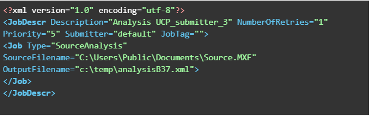


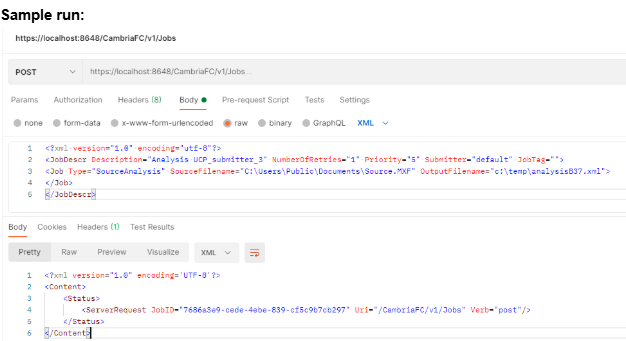

The job will be queued to the FTC Manager and complete. 

## Sample output:

Please search for Metadata HasSTDB37 in the output. If it’s set to 1 then the source has captions otherwise no captions have been detected on the source.


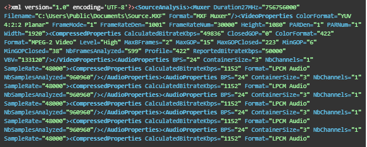

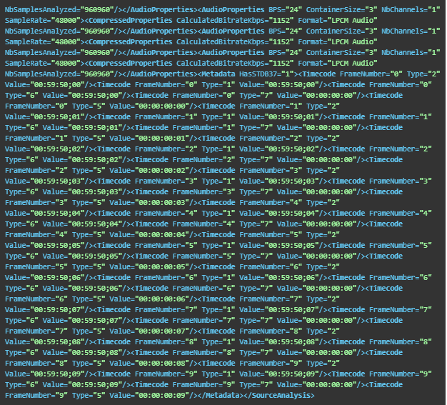


## Step 2: Extract Captions to WebVTT

FTC will extract captions from a source file and generate a WebVTT output.

1. Import your source into FTC.


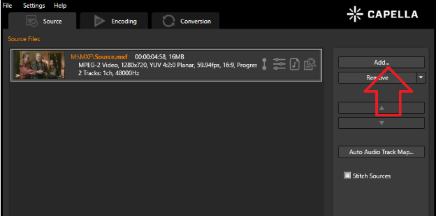


2. Add a closed caption exporter preset.


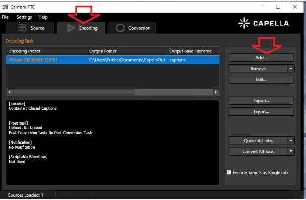


3. In the preset editor:
   - Set **Container** to **Closed Captions**.
   - **Source Caption Mode** should be **ARIB-STD-B37**.
   - Specify an **output directory and filename**.
   - Enable **Include Font Size info (cue)** to preserve font size.


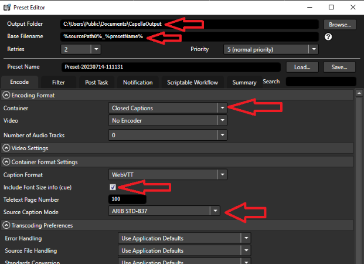


4. Queue the job.


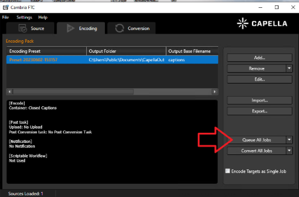


5. The job will process in Cambria Manager, where you can monitor status.


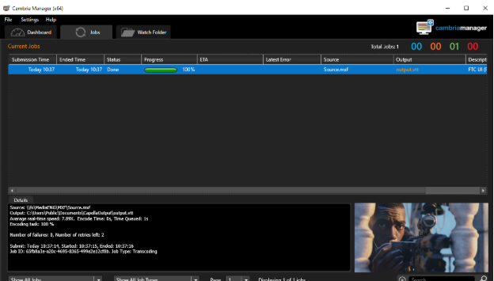


Sample WebVTT Output:

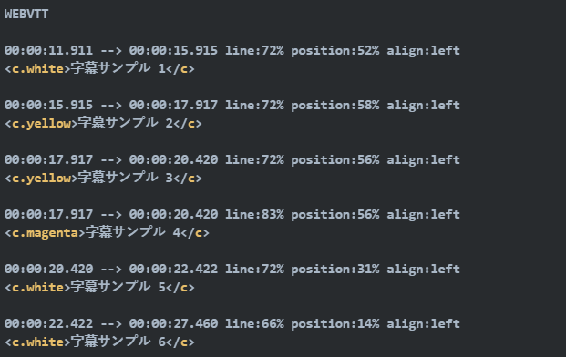


## Step 3: Burn in WebVTT Captions on Video

1. Import the source as in previous steps and add a **source-side filter**.


2. Apply **Timecode Overwrite Filter** to reset timecode to match the WebVTT file.

3. Add **Subtitle Burn-In** as a filter.


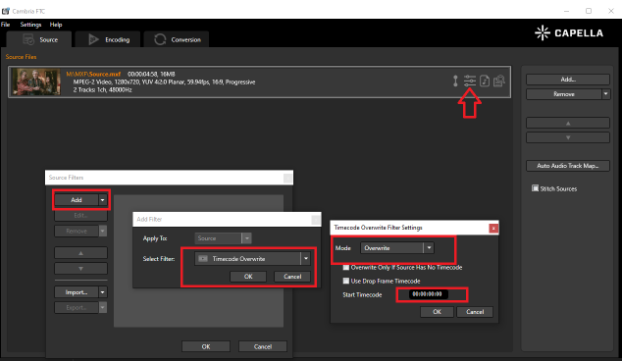

Next Please choose Subtitile burn in as the filter

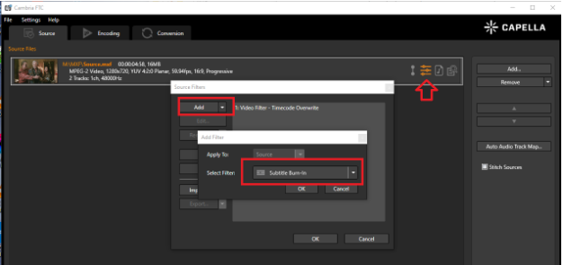

4. Configure the filter:
   - Set **Subtitle Source Type** to **Web Video Text Tracks Format**.
   - Browse and select the **WebVTT file** generated in Step 2.
   - Enable:
     - **Use Embedded Formatting**
     - **Captions are Formatted with ARIB STD-B37**
     - **Use Background**
   - Use a monospaced font (e.g., **Noto Sans JP** from [Google Fonts](https://fonts.google.com/specimen/Noto+Sans+JP)).
   

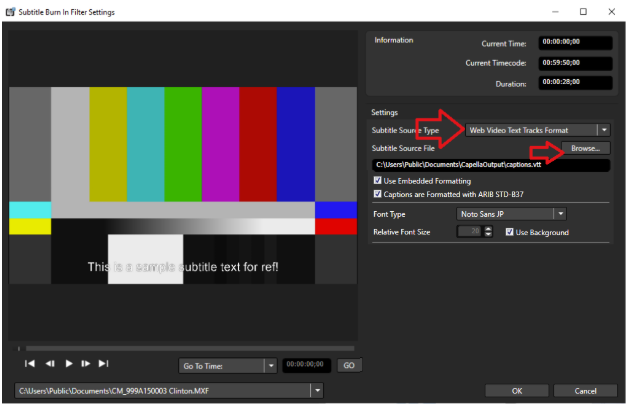


5. Ensure two **source-side filters** are set in this order:


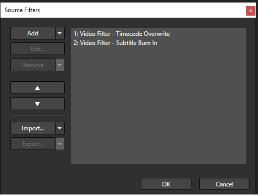


6. Switch to the **Encoding Tab**, add an encoding preset.


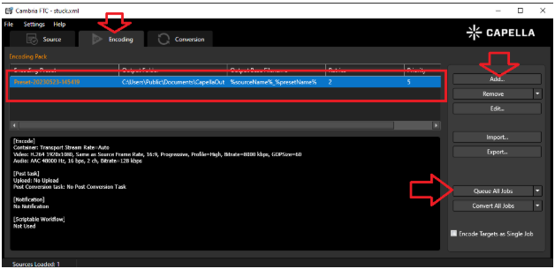


7. Queue the job in **Manager** and wait for the output video with burnt-in subtitles.


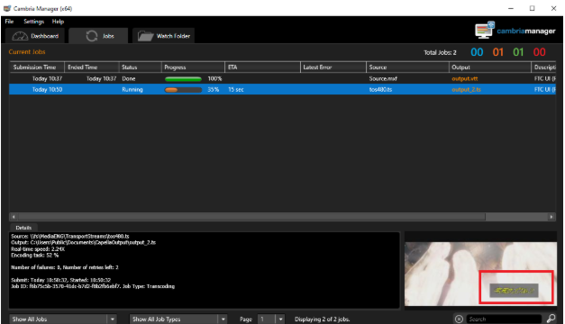


