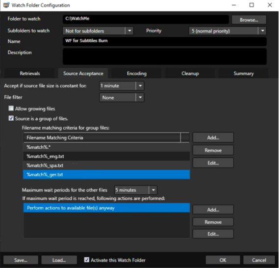

**NOTE: User will need to know \# of subtitles to use as they set up Watch-Folder.**

1. Launch Cambria Manger

2. Go to Watch Folder Tab, Add a Watch Folder

3. In the Watch Folder configuration window set the following:

   1. Folder to Watch (folder where you drop your source files to be encoded)
   2. Subfolders to watch (Depends on if your watch folder has subfolders)
   3. Priority
   4. Name and Description

4. Go to the Source Acceptance Tab set the following:

   1. Accept if source file is constant for: (Set Time by using dropdown or enter in time)
   2. Make sure Source is a group of files is enabled
      1. The files in my test example are called source1234.mov, source1234\_eng.txt, source1234\_spa.txt and source1234\_ger.txt.
      2. Please add the following as shown below:

      %match%.\*, %match%\_eng.txt %match%\_spa.txt and %match%\_ger.txt

5. Next, go to the Encoding Tab here you will add your encoding actions:
   1. Click the Add Simple Action … button on the right

      1. For the Trigger select: %match%.\* as shown below:
	  
	  

      2. Action set to: Encode to Target Preset
         1. Here you can select Edit… button on the right to edit your Encoding Settings, Source Filter Settings, and Conditional Audio Mapping settings

      3. For this scenario please click Edit… next to the Source Filters, here you will add the Subtitle Burn-in Filters based on the \# of subtitles you have:
         1. Click Add button to add a filter
         2. In the Select Filter dropdown select: Subtitle Burn-In and Click OK
         3. This will launch the Subtitle Burn-in filter settings where you can specify your subtitle settings and load a subtitle
         4. For our example case we are going to set the Subtitle Settings:
            1. Set Subtitle Source Type to: Visititle Single Timecode format
            2. Browse for your first subtitle source file, in our example case it is: source1234\_eng.txt
			
			

      4. Repeat steps 1-4 above for each subtitle file so in total you should have 3 Subtitle Burn-In Filters
      5. Click OK to add your subtitle burn-in filter to your watch folder configuration.
	  
	  

**NOTE: Make sure the subtitle burn-in filters are configured for the right Subtitle Source Type (in our example, we are using Visititle Single Timecode format).**

6. Modify your Encoding Settings, click Edit… Button (Add Script UseMultiSubBurnInSourcesFromGroupOfFiles.pl)
   1. This will launch the preset editor where you can configure your encoding settings
   2. Go to the Scriptable Workflow Tab:
      1. Enable Scriptable Workflow
      2. Leave default settings and load the following script by clicking Add Script button:

[https://www.dropbox.com/s/ouzwwgj0a1l764g/UseMultiSubBurnInSourcesFromGroupOfFiles.pl?dl=0](https://www.dropbox.com/s/ouzwwgj0a1l764g/UseMultiSubBurnInSourcesFromGroupOfFiles.pl?dl=0)

3. Click OK to save your encoding settings with script added.
7. Click OK to go back to Watch Folder configuration window and Enable Activate this Watch-Folder.
8. Drop your source file along with your subtitle files into the Watch Folder you specified in step 3, the Encoding Job should start.
9. Your output file should have 3 subtitles burned in, you can change their positions to see all three in the Subtitle Burn-In fitler settings.
