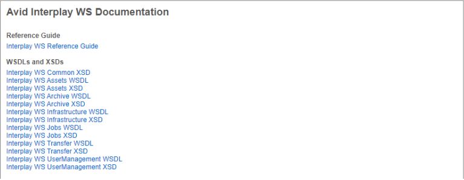
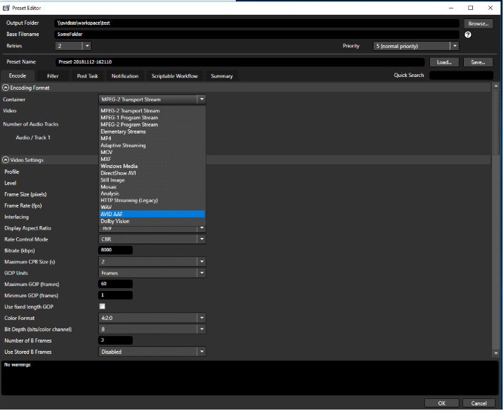

# Capella Cambria Cluster Redundancy Feature

**Version:** V2 #8426  

## Document History

| Version  | Description                          | Date          |
|----------|--------------------------------------|--------------|
| Draft 0.1 | First draft of the documentation   | Jan 21, 2015 |
| Draft 0.2 | Second draft of the documentation  | Feb 18, 2015 |

---

## Introduction

Cambria Cluster Manager is a **powerful tool** that manages multiple **Cambria FC machines** for job distribution with redundancy. If a machine becomes unavailable due to crashes, network issues, or reboots, **Cambria Cluster** detects the failure and reassigns jobs **automatically**.

However, previously, **Cambria Cluster Manager** itself did not have redundancy. The **Cambria Cluster Redundancy Feature** resolves this by allowing **two machines** to be configured as **Cambria Cluster Managers**:

- **Primary Cluster Manager** (Active)
- **Backup Cluster Manager** (Standby)

If the **Primary** machine fails, the **Backup** machine takes over **automatically**.

Redundancy is implemented through **PostgreSQL database replication**, ensuring real-time mirroring of **all critical data**.

---

## Naming Conventions

| Term | Description |
|------|-------------|
| **Redundancy Role** | Can be **Primary**, **Backup**, or **No Backup** |
| **Redundancy Primary** | Machine running **Cambria Cluster** as the active **Primary Manager** |
| **Redundancy Backup** | Machine running **Cambria Cluster** as the **Backup Manager** |
| **Cluster Machine** | Any **non-redundant** machine in the cluster |
| **Client Machine** | Machine running **Cambria FTC** |
| **Redundancy Triggering** | Process where the **Backup** takes over as **Primary** when failure occurs |

---

## Redundancy Trigger Criteria

For redundancy to activate, the following **conditions must be met**:

1. The **Primary Cluster Manager** is offline (Backup does not receive its broadcast).
2. The **Backup Cluster Manager** is online (receives broadcast from any Client Machine).
3. The **Backup** has been online for **30+ seconds** while the **Primary** is offline.

If both machines go offline, redundancy **will not trigger** unless the **Backup** remains online **30 seconds longer** than the **Primary**.

---

## What is Backed Up?

The **PostgreSQL database** is mirrored, which includes:

- **Job List**
- **Watch Folder Settings**
- **Client Machine List**
- **Options & Preferences**

---

## Expected Behavior & Important Notes

- **Redundancy triggers only when failure conditions are met.**
- **Backup Cluster** machine's **database will be wiped** and will mirror the **Primary Cluster**.
- **Redundancy Feature is dongle-protected** – dongles must not expire.
- **If a dongle expires, redundancy and cluster operations will fail.**

---

## Limitations

1. **Primary Cluster Manager must be configured first** before Backup.
2. **Database passwords are stored locally** – users should secure machines.
3. **Database replication is not encrypted.**
4. **Backup Cluster Manager is read-only** – no encoding jobs can be run on it.
5. **Fast internet connection and disk I/O are required**.
6. **Backup machine must match the Primary machine’s specs.**
7. **Static IPs are required** – PostgreSQL replication **cannot handle IP changes**.
8. **Only a 1:1 redundancy setup is supported** (one Primary, one Backup).
9. **Primary and Backup must be in the same subnet.**

---

## How to Configure Redundancy

1. **Prepare two machines** for Cambria Cluster – Machine **A** (Primary) and Machine **B** (Backup).  
   Also prepare a **Client Machine C**.

2. **Ensure both A & B have dongles** with the Redundancy Feature enabled.

3. On **Machines A & B**, open **Cambria Cluster** and set **Redundancy Role** to **No Backup**.

   
   
   
   
   

4. On **Machine A**, set **Machine C** to **Online**.

5. On **Machine A**, go to **Redundancy Tab** → Click **Configure** → Set Role to **Primary**.

6. Enter **Machine B's IP** in **Backup IP** field. Click **Apply**.

7. **Wait 30 seconds** for settings to apply.

8. On **Machine B**, go to **Redundancy Tab** → Click **Configure** → Set Role to **Backup**.

9. Enter **Machine A’s IP** in **Primary IP** field. Click **Apply**.

10. Wait **30 seconds to a few minutes** for synchronization.

11. Verify setup:
   - **Primary Machine A** should show:  
     - *"Primary Cluster Active, Database in Redundancy Mode."*
   - **Backup Machine B** should show:  
     - *"Backup Machine Connected, Mirroring Database."*

   
   
   
   
   

---

## How to Test Redundancy Manually

1. On **Machine A**, go to **Redundancy Tab** → Set Role to **Stopped**.
2. On **Machine B**, wait **30 seconds** → It will automatically switch to **Primary**.
3. **Machine B becomes the new Primary Cluster Manager.**
4. Machine B’s status will show **"Primary (Redundancy Triggered)."**

---

## Handling a Redundancy Trigger Event

1. If **Machine A (Primary)** fails and **Machine B (Backup)** takes over:
   - **Machine B** will be labeled **"Primary (Redundancy Triggered)"**.

2. **To restore Machine A:**  
   - Verify **Machine B’s database** is intact before proceeding.
   - Restart **Machine A**.
   - Set **Machine A’s Role** to **Backup**, entering **Machine B’s IP**.
   - Click **Apply**.

3. Machine A will now become the **Backup**, mirroring Machine B.

4. **To restore Machine A as Primary:**  
   - Manually trigger redundancy as described earlier.

---

## Handling Database Corruption or Redundancy Errors

- **Ensure the Redundancy Feature is licensed.**  
  Without a valid dongle, redundancy will not work.
- **If the database is corrupted**, reset the role to **No Backup** and reconfigure redundancy.
- **If PostgreSQL fails**, use the **Database Fixer Tool**:  
  ```
  C:\Program Files (x86)\Capella\CambriaCluster\CpPostgresDbFixer.exe
  ```

---

This concludes the **Cambria Cluster Redundancy Feature Documentation**.
