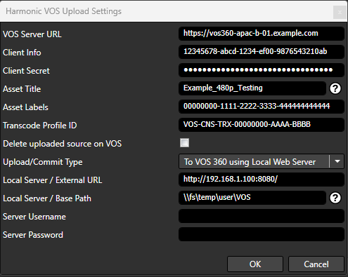
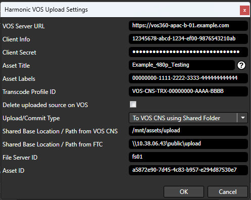

# FTC Harmonic VOS Upload Guide

> **NOTE:** Some configurations may require a local web server that needs to be open to the public.

## Steps to Upload to Harmonic VOS

### 1. Launch FTC

### 2. Add any source to the **Source Tab**.  

### 3. Once the source is added, go to the **Encoding Tab**.

### 4. In the Encoding Tab, **add a new preset**.

### 5. In the **Preset Editor**, set the **Output Folder** based on the type of VOS upload:

- **For VOS 360:** Configure the output to point to a location that is accessible via HTTP/HTTPS. This is typically a web server directory (e.g., Apache, Nginx, IIS) or another HTTP accessible path that VOS360 can reach.
  
  Example (local Apache with XAMPP):  
  ```
  C:\xampp\htdocs\Output
  ```
>  **Note:** Any properly configured web server can be used, not just Apache. Make sure VOS360 can reach the output via the correct hostname, port, and firewall/router settings.
  
- **For VOS CNS (on-prem):** Configure the output to a shared folder that FTC can write to and that the VOS CNS server can also access.
  
  Example (Windows):  
  ```
  \\server\location
  ```
  Example (Linux):
  ```
  /mnt/shared/location
  ```

> **NOTE:** ⚠️ Ensure the correct server location and access permissions are used. Content may need to be exposed through the proper port-forwarding, firewall rules, or CDN setup, depending on your environment.

### 6. Select the **MPEG-2 TS** container in encoding settings.

### 7. In **Video Settings**, make sure to:
- Specify the **Frame Size** for the Layer.
- Set the **Bitrate**.
- **Enable** the **"Use fixed length GOP"** checkbox.


### 8. Configure **Post Task**:
- In the **Preset Editor**, go to the **Post Task** tab.
- **Enable** the **"Use Upload"** checkbox.
- Click the **"Add Harmonic VOS"** button.
- Make sure that **EVERY** field is filled. The only field that does not need to be filled is **Server Username** and **Server Password** for VOS 360. As well as **Asset ID** For VOS CNS as it can also be automatically generated if not set manually.

	**Example (VOS 360):**
	
   

	**Example (VOS CNS):**
	
   

   

### 9. Specify your **Harmonic VOS credentials**.

 You must **HAVE** a **Cambria FTC License with Harmonic VOS Upload Enabled**.

 
 **String Replacement:** You can specify values like **%sourceName%**, **%sourcePath#%** as shown in the tooltip.

### 10. After adding the **Harmonic VOS Upload Task**, click **OK** to exit the Preset Editor.

### 11. **Duplicate the first preset** to create multiple layers as necessary.
- Adjust the **Frame Size and Bitrate** for each layer.
- **Remove the upload task** from duplicated presets.

 **IMPORTANT:**  
 The upload task should only be applied to the **first target**.  
 If you **don't remove the upload task** for additional layers, **multiple individual files** will be uploaded instead of an ABR encode.

### 12. **Enable "Encode Targets as a Single Job"**  
This ensures that files are uploaded as a **pair**.  
Once all target layers are created, click **Convert/Queue**.

   
   

### 13. **Verify the VOS Upload**  
Please log into your VOS system to check if everything is working.

---

This concludes the **FTC Harmonic VOS Upload Guide**.
