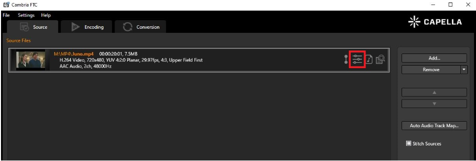
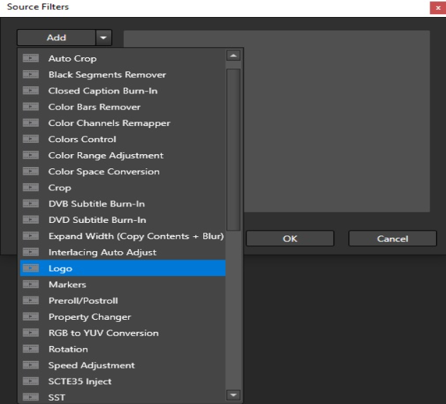
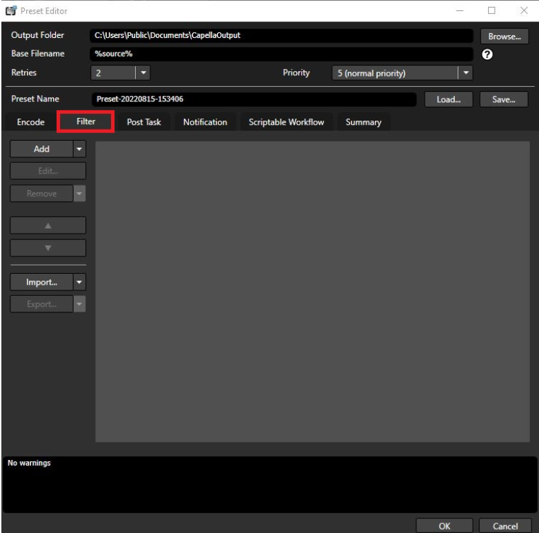

Currently, there are two ways to get to the Logo Filter UI

First Way

Upload a video file to FTC and click on the Filter icon.

Click on the arrow next to ADD and click on logo

Second Way

Upload a video file to FTC and click on the Encoding tab.

Add a preset and click on the filter tab.

Click on the arrow next to ADD and click on logo

Below is a breakdown of the functions in the logo filters UI

These series of buttons control the scrolling of the source. You may scrub through the source or use the buttons.

From left to right they are: Go to Beginning, Go to Previous Frame, Pause / Play, Go to Next Frame, and Go to End.

If you have multiple sources, you can use this box to select which source to apply the filter upon.

Instead of using the buttons to scroll the source, you may skip directly to the time or timecode.

This box shows the current time in the video, the current timecode, and the total duration of the video.

Click browse to add the source of your logo. The current support files for the source of the logo are: .bmp, .jpg, .jpeg, .png, .tif, .tiff, .tga

You may also add a .mov file as a logo.

Just select .mov in the drop down menu when you select browse.

This is where you can adjust the size / transparency / and offset of the logo. You may also choose to apply this filter to a certain segment of the source.

Click on OK to apply the filter and save.

