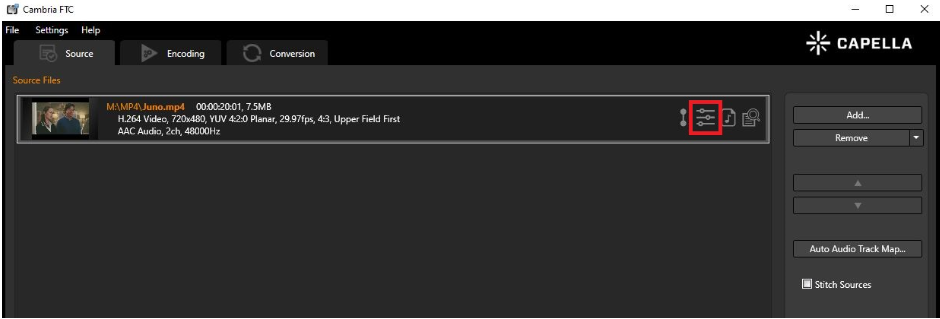
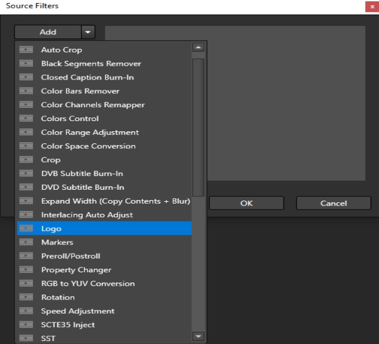
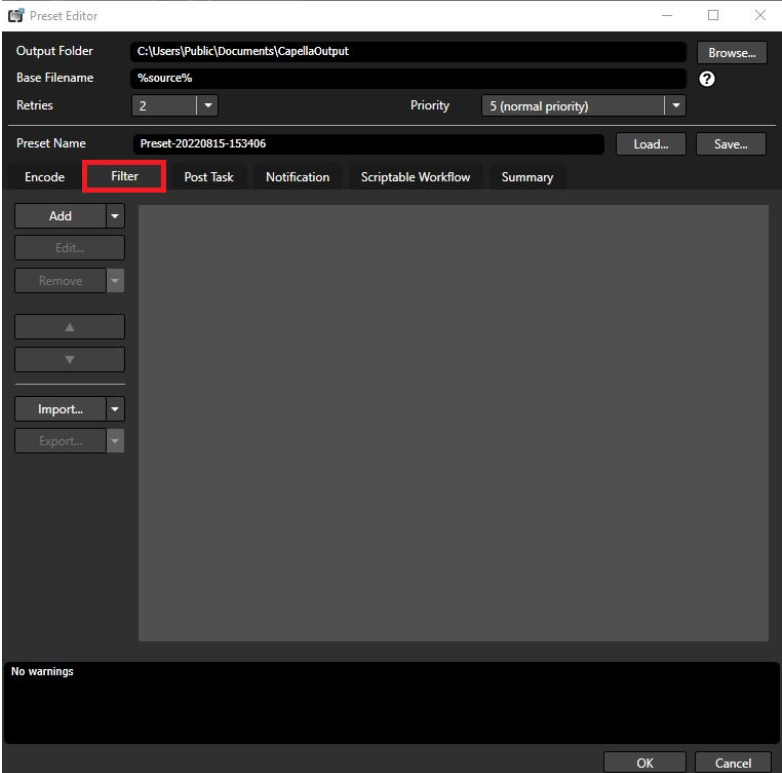
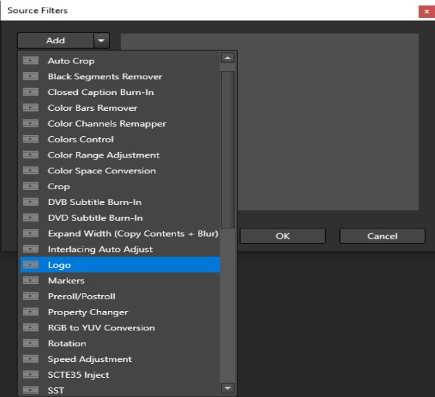
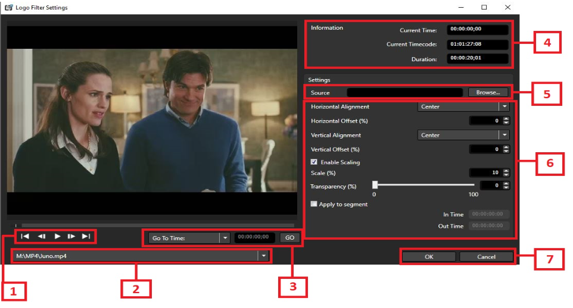

# Logo Filter in Cambria FTC

## Feature Overview

The **Logo Filter** in Cambria FTC allows you to overlay a static image or animated logo (including `.mov`) on your video. You can control the position, size, transparency, and duration of the logo display.

---

## How to Access the Logo Filter

### First Method

1. Upload a video file to FTC  
2. Click on the **Filter** icon

3. Click on the arrow next to **ADD** and select **logo**

---

### Second Method

1. Upload a video file to FTC  
2. Click on the **Encoding** tab  
3. Add a preset and click on the **Filter** tab

4. Click on the arrow next to **ADD** and select **logo**

---

## Logo Filter UI Breakdown

### Playback Controls

These buttons allow you to preview and navigate the video:

- **Go to Beginning**
- **Go to Previous Frame**
- **Pause / Play**
- **Go to Next Frame**
- **Go to End**

---

### Source Selector

If multiple sources are present, select which source the logo filter should apply to.

---

### Jump to Time

You can jump directly to a specific time or timecode instead of using the playback buttons.

---

### Time Display

This panel shows:

- **Current time**
- **Current timecode**
- **Total duration** of the video

---

### Logo Source File

Click **Browse** to select your logo source file.

Supported file types:

- `.bmp`, `.jpg`, `.jpeg`, `.png`, `.tif`, `.tiff`, `.tga`
- You may also use `.mov` (choose `.mov` in the file type dropdown)

---

### Logo Settings

In this section, you can:

- Adjust **size**
- Adjust **transparency**
- Adjust **offset**
- Set the time range to apply the filter

---

### Save Filter

Once the logo is positioned and configured:

- Click **OK** to apply and save the filter

