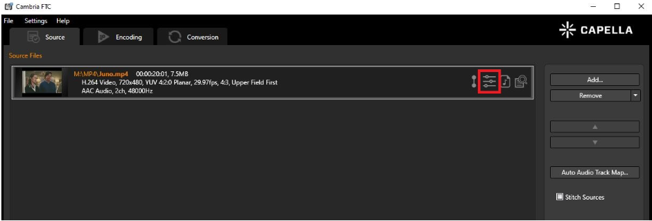

# Logo Filter in Cambria FTC

## Feature Overview

Cambria FTC provides a **Logo Filter** that allows users to overlay images or video files as logos on their source video. This guide explains the two ways to access the Logo Filter UI and describes each function within the UI in detail.

---

## Accessing the Logo Filter UI

### First Way

1. Upload a video file to FTC.
2. Click on the **Filter** icon.

3. Click on the arrow next to **ADD** and select **Logo**.

---

### Second Way

1. Upload a video file to FTC.
2. Click on the **Encoding** tab.
3. Add a preset and click on the **Filter** tab.

4. Click on the arrow next to **ADD** and select **Logo**.

---

## Logo Filter UI Breakdown

Below is a description of the available controls and functions in the Logo Filter user interface:

1. These buttons control the scrolling of the source. You may scrub through the source or use the buttons.  
From left to right, they are:

- **Go to Beginning**  
- **Go to Previous Frame**  
- **Pause / Play**  
- **Go to Next Frame**  
- **Go to End**

---

### Source Selection

If you have multiple sources, you can use this dropdown to select which source to apply the filter to.

---

### Jump to Time/Timecode

Instead of using playback buttons, you can skip directly to a specific time or timecode.

---

### Timecode Display

This box shows:

- Current time in the video  
- Current timecode  
- Total duration of the video

---

### Load Logo File

Click **Browse** to add the source of your logo. Supported image formats include:

- `.bmp`, `.jpg`, `.jpeg`, `.png`, `.tif`, `.tiff`, `.tga`

You may also add a **.mov file** as a logo.  
To do this, select `.mov` in the dropdown menu when browsing.

---

### Logo Properties

This panel allows you to adjust:

- **Size**  
- **Transparency**  
- **Offset**  

You may also choose to apply the logo filter to a specific segment of the source.

---

### Apply the Filter

Click **OK** to apply the filter and save your settings.

---

