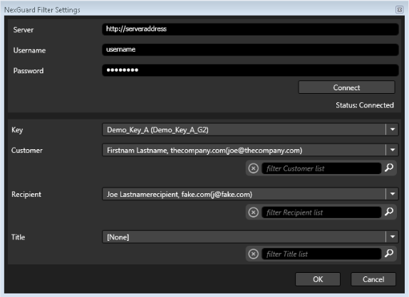

# NexGuard Filter for Capella Cambria FTC

> **Please contact NexGuard regarding license and NexGuard Manager (Server) before proceeding.**

## License Setup

Place your NexGuard license in the appropriate directory:

- **Old Licenses:**  
  ```
  C:\Program Files (x86)\Capella\Cambria\cpx64\NexGuard
  ```
- **New Licenses:**  
  ```
  C:\Program Files (x86)\Capella\Cambria\cpx64\NexGuardV2
  ```

## Opening FTC

1. Open **FTC**.
2. Import desired source(s) into FTC.
   - Sources can be added by clicking **‘Add Sources’** or by using **drag and drop**.
   
   

## Adding the NexGuard Filter

1. Go to the **Encoding** tab and click **‘Add’** or double-click to add an encoding preset.
2. Adjust **encoding settings** as needed.
3. Go to the **Filter** tab and add the NexGuard Video Watermarking filter:
   - **Old Licenses:** Select **‘NexGuard Video Watermarking’** filter.
   - **New Licenses:** Select **‘NexGuard Video Watermarking V2’** filter.
4. **The filter must be added as a Target filter.**

   
 

## Configuring the NexGuard Filter

1. Enter **NexGuard Server Manager** with **Username and Password**.
2. Click **‘Connect’** to ensure the connection with the server is successful.
3. Select options for:
   - **Key**
   - **Customer**
   - **Recipient**
   - **Title**


      
   

4. Click **‘Ok’** in Filter Settings.
5. The added filter should now appear as:  
   **`1:[Target] Video Filter – NexGuard Watermarking`**
6. Click **‘Ok’** in the Preset Editor.

## Queueing Jobs

1. Under the **Encoding** tab, select **‘Queue All Jobs’**.
2. Running jobs can be viewed in:
   - **Cambria Manager**
   - **NexGuard Manager**
3. Newly queued jobs will be marked as **‘New’** in NexGuard Manager.

   


## Verifying Watermarking

Watermarking can be verified using **NexGuard File QC Reader** or a similar tool.

## Known Limitations

- **Source files must be at least 2 minutes 30 seconds in length.**
- **Watermarked outputs cannot be watermarked again.**
- **Concurrent watermarking jobs are limited** depending on the license type.
  - FTC **cannot detect this limitation**; users must manage job concurrency.
- **NexGuard licenses can only be obtained from NexGuard.**  
  Capella **cannot** obtain a license on behalf of users.
- **V1 and V2 licenses are not compatible.**
- **V2 NexGuard licenses have two types:**
  - **On-Premises**
  - **Cloud**
  - If you use **FTC in a VM or Cloud environment (AWS, etc.), you must obtain a Cloud license** from NexGuard.

