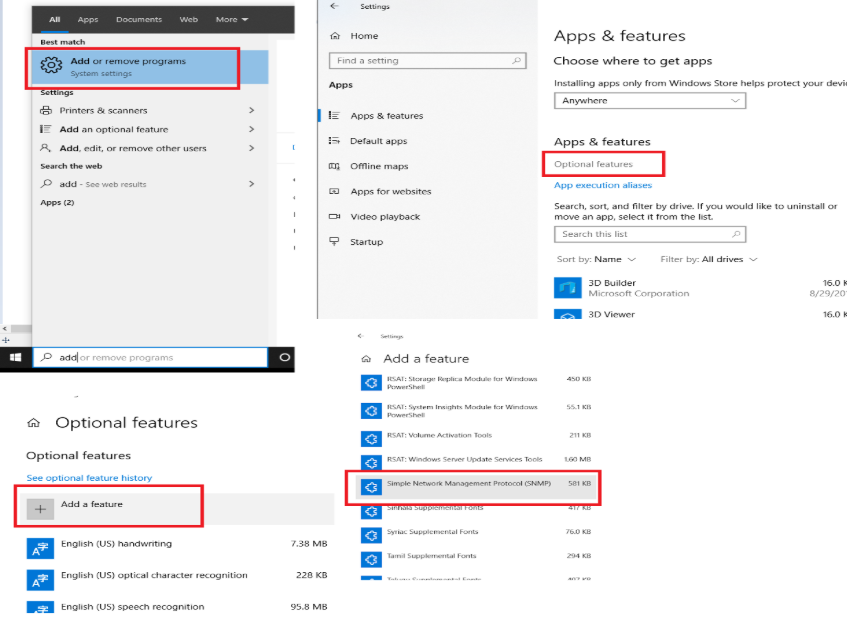
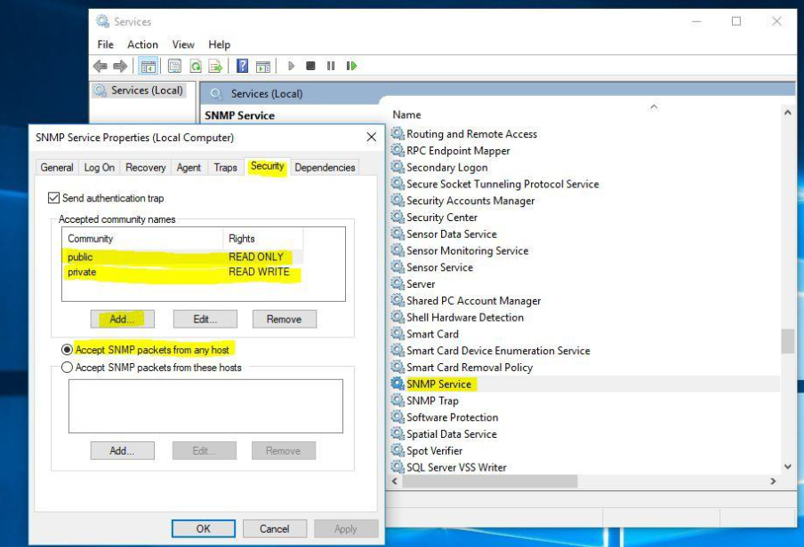
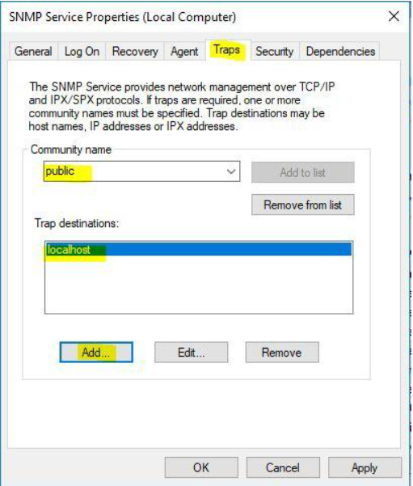
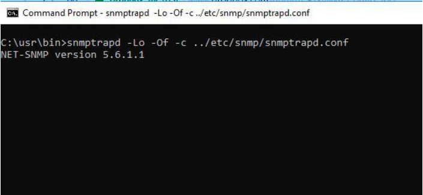

# SNMP Setup and Testing with FTC/Cluster

Section 1: How to setup and use WinSNMP with FTC and Cluster?

Search for Add or Remove programs in the Windows search bar

Under Apps & features select Optional features

Click Add a feature, search for SNMP

Select SNMP option from list and Click Install

Go to service manager (services.msc)

Double click SNMP Service and go security tab (if no tab exists, close service manager and reopen)

Hit Add for community and add "public" as READ ONLY, "private" as ReadWrite

Select Accept SNMP packets from any host (or, specify machine name for SNMP Manager)

go Traps tab.

Set community name as "public"

Trap destination as IP address of your machine

Click Apply to save settings

Make sure that snmp.exe is running in the system from task manager

Section 2: Testing WinSNMP with FTC and Cluster using snmpwalk tool and snmptrapd.

NOTE: In order to test these command line functions you will need to have net-snmp third-party tool installed:

Go through the step by step installation setup for net-snmp and use all default settings. For SNMP FTC/Cluster, we support the following OID List to display Job Information:

1.3.6.1.4.1.47181.0.0.1: Total Jobs

1.3.6.1.4.1.47181.0.0.2: Running Job

1.3.6.1.4.1.47181.0.0.3: Failed Jobs

1.3.6.1.4.1.47181.0.0.4: Queued Jobs

1.3.6.1.4.1.47181.0.0.5: Completed Jobs

1.3.6.1.4.1.47181.0.0.6: Cancelled Jobs

1.3.6.1.4.1.47181.0.0.7: Paused Jobs

NOTE: The following examples are using the third-party tool we use for testing purposes, one can use any SNMP tool using the list above with FTC in order to get these details.

SNMPwalk is an SNMP application that uses the SNMP GETNEXT requests to query. The SNMP walk will allow you to see all of the OID parameters available, set for FTC.

Below is how to test snmpwalk using the third-party tool net-snmp.

Test snmpwalk:

Launch cmd.exe

Enter this in as your command to see all the following details for FTC/Cluster

C:\usr\bin\snmpwalk.exe -v 2c -c public localhost .1.3.6.1.4.1.47181

This will result in an output that would give you the following details: 1.3.6.1.4.1.47181.0.0.1: Total Jobs

1.3.6.1.4.1.47181.0.0.2: Running Job

1.3.6.1.4.1.47181.0.0.3: Failed Jobs

1.3.6.1.4.1.47181.0.0.4: Queued Jobs

1.3.6.1.4.1.47181.0.0.5: Completed Jobs

1.3.6.1.4.1.47181.0.0.6: Cancelled Jobs

1.3.6.1.4.1.47181.0.0.7: Paused Jobs

You can individually enter the OIDs above to get specific results, for example:

C:\usr\bin\snmpwalk.exe -v 2c -c public localhost .1.3.6.1.4.1.47181.0.0.1

This will only result in: Total Jobs

More information regarding these commands can be found in your FTC installation directory under the MIBs folder:

C:\Program Files (x86)\Capella\Cambria\MIBs\CAPELLA-FTC-CLUSTER-MIB.my

SNMP Traps are alert messages sent from a remote SNMP-enabled device to a central collector, the "SNMP manager.

In our case, FTC/Cluster the agent sends a trap message to a snmptrap daemon which acts as a “SNMP manager”. Currently we only support traps messages for a increase in failed jobs.

The snmptrapd service is an SNMP application that receives and logs SNMP TRAP messages. Test snmptrap:

If Win SNMP Trap Daemon is working, please stop (SNMP TRAP service in service manager) You can also go Resource Monitor to check if snmptrapd.exe is

occupying 162 port. (If it is occupied, Win SNMP trap daemon is running)

Please download the following folder from this dropbox link:

Once this folder is downloaded place the snmptrap_test.bat file in the following directory:

C:\usr

Also from the downloaded folder place the snmpd.conf and snmptrapd.conf in the following directory:

C:\usr\etc\snmp

NOTE: These files are needed to test snmptrap functionality.

First change the cmd directory to C:\usr\bin , then enter the following command in cmd to see snmptrp console:

snmptrapd -Lo -Of -c ../etc/snmp/snmptrapd.conf

Run following bat executable to send test snmptrap message:

C:\usr\snmptrap_test.bat

If trap is correctly sent out, snmptrap daemon will show something like this:

Do something in FTC by queing a job that fails to Manager/Cluster to fire trap notification. (such as changing total number of failed job)

NOTE: 1.3.6.1.4.1.47181.0.0.3: Failed Jobs
