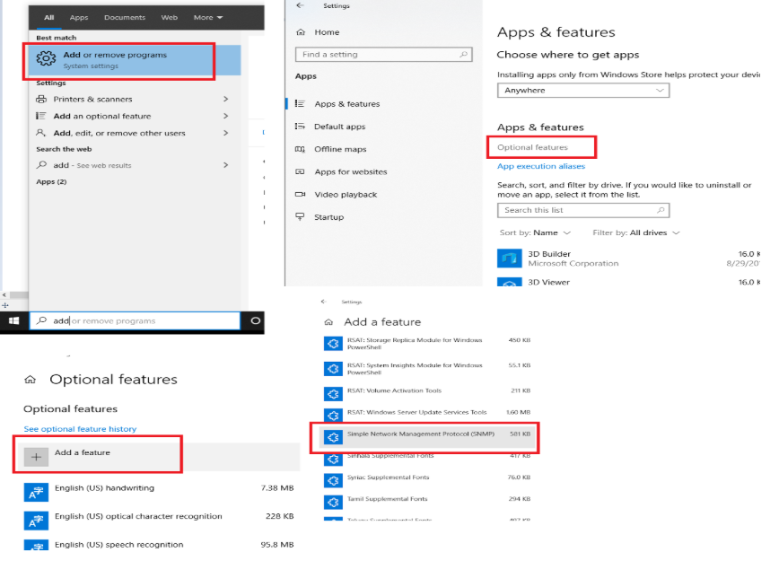
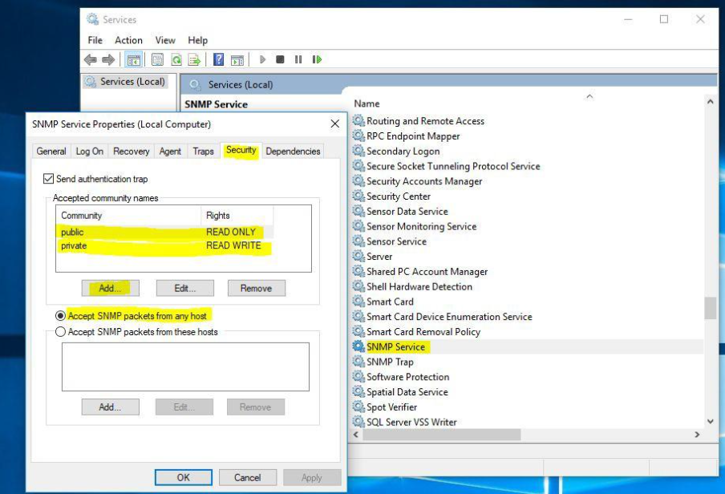
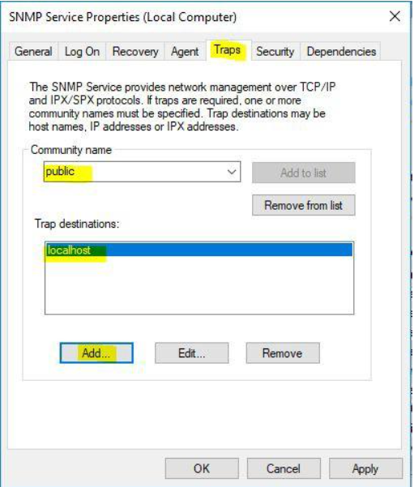
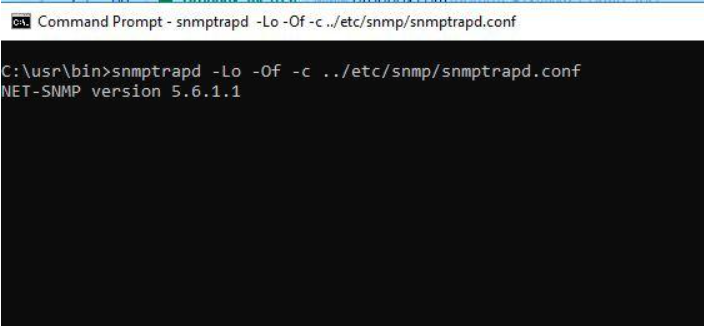

# SNMP Setup and Testing with Cambria FTC and Cluster

This guide explains how to set up and test SNMP (Simple Network Management Protocol) with **Cambria FTC and Cluster** using **WinSNMP** and the **Net-SNMP** toolset.

---

## Section 1: Setup WinSNMP on Windows

1. Search for **Add or Remove programs** in the Windows search bar  
2. Under **Apps & Features**, select **Optional features**  
3. Click **Add a feature**, search for `SNMP`  
4. Select **SNMP** from the list and click **Install**



---

### Configure SNMP Service

1. Open **Services** (`services.msc`)  
2. Find and double-click **SNMP Service**  
3. Go to the **Security** tab  
   > If the tab doesn’t show up, close Service Manager and reopen

4. Hit Add for community and add:
   - `"public"` as **READ ONLY**
   - `"private"` as **ReadWrite**

5. Under **Accept SNMP packets from**:
   - Choose **Any host** (or specify the hostname/IP of the SNMP Manager)



---

### Configure SNMP Traps

1. Go to the **Traps** tab  
2. Set **Community name** to: `public`  
3. Set **Trap destination** to the IP address of your machine  
4. Click **Apply** to save settings



> ✅ Make sure `snmp.exe` is running (check via Task Manager)

---

## Section 2: Test SNMP with Net-SNMP Tools

> **Note:** In order to test these command line functions you will need to have net-snmp third-party tool installed: [Net-SNMP](https://sourceforge.net/projects/net-snmp/files/latest/download)

Go through the step by step installation setup for net-snmp and use all default settings. **For SNMP FTC/Cluster, we support the following OID List to display Job Information:

- `1.3.6.1.4.1.47181.0.0.1`: Total Jobs  
- `1.3.6.1.4.1.47181.0.0.2`: Running Job  
- `1.3.6.1.4.1.47181.0.0.3`: Failed Jobs  
- `1.3.6.1.4.1.47181.0.0.4`: Queued Jobs  
- `1.3.6.1.4.1.47181.0.0.5`: Completed Jobs  
- `1.3.6.1.4.1.47181.0.0.6`: Cancelled Jobs  
- `1.3.6.1.4.1.47181.0.0.7`: Paused Jobs

> **Note:** The following examples are using the third-party tool we use for testing purposes, one can use any SNMP tool using the list above with FTC in order to get these details.

SNMPwalk is an SNMP application that uses the SNMP GETNEXT requests to query. The SNMP walk will allow you to see all of the OID parameters available, set for FTC.

Below is how to test snmpwalk using the third-party tool net-snmp.

---

### Test with `snmpwalk`

1. Open **Command Prompt**
2. Run:

```
C:\usr\bin\snmpwalk.exe -v 2c -c public localhost .1.3.6.1.4.1.47181
```
This will result in an output that would give you the following details: 1.3.6.1.4.1.47181.0.0.1: Total Jobs
- `1.3.6.1.4.1.47181.0.0.2: Running Job
- `1.3.6.1.4.1.47181.0.0.3: Failed Jobs
- `1.3.6.1.4.1.47181.0.0.4: Queued Jobs
- `1.3.6.1.4.1.47181.0.0.5: Completed Jobs
- `1.3.6.1.4.1.47181.0.0.6: Cancelled Jobs
- `1.3.6.1.4.1.47181.0.0.7: Paused Jobs


To test a single OID (e.g., Total Jobs):
```
C:\usr\bin\snmpwalk.exe -v 2c -c public localhost .1.3.6.1.4.1.47181.0.0.1
```

> For more info, check:
```
C:\Program Files (x86)\Capella\Cambria\MIBs\CAPELLA-FTC-CLUSTER-MIB.my
```

---

## Section 3: Testing SNMP Traps

SNMP Traps are alert messages sent from a remote SNMP-enabled device to a central collector, the "SNMP manager.

In our case, FTC/Cluster the agent sends a trap message to a snmptrap daemon which acts as a “SNMP manager”. Currently we only support traps messages for a increase in failed jobs.

The snmptrapd service is an SNMP application that receives and logs SNMP TRAP messages. Test snmptrap:

1. If Win SNMP Trap Daemon is working, please stop (SNMP TRAP service in service manager) You can also go Resource Monitor to check if snmptrapd.exe is
occupying 162 port. (If it is occupied, Win SNMP trap daemon is running)

2. Please download the following folder from this dropbox link:
https://www.dropbox.com/sh/7rithul2rq2n73f/AAA8wuaYGd0m7f6QP0vF0CkMa?dl=0

3. Once this folder is downloaded place the snmptrap_test.bat file in the following directory:
C:\usr

4. Also from the downloaded folder place the snmpd.conf and snmptrapd.conf in the following directory:
C:\usr\etc\snmp

**NOTE:** These files are needed to test snmptrap functionality.

5. First change the cmd directory to C:\usr\bin , then enter the following command in cmd to see snmptrp console:
**snmptrapd -Lo -Of -c ../etc/snmp/snmptrapd.conf



6. Run following bat executable to send test snmptrap message:
C:\usr\snmptrap_test.bat
If trap is correctly sent out, snmptrap daemon will show something like this:

Run following bat executable to send test snmptrap message:


