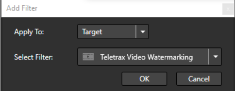
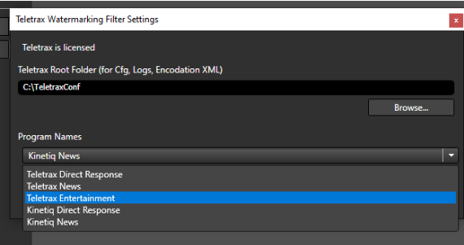

# Using the Teletrax Watermarking Filter on Cambria

## Getting Started

### What do you need?
- Cambria FTC/Cluster Version 4.4 or Later
- Teletrax license file on all client machines
- Teletrax config file: A text file that points to the location of the shared database and contains program information.

> **Note:** Contact [support@teletrax.com](mailto:support@teletrax.com) for the license file and config file.

## How to use Teletrax Filter with Cambria FTC/Cluster

### Step 1: Teletrax License and Root Directory Setup

Copy your Teletrax license file to:

```
C:\Program Files (x86)\Capella\Cambria\cpx64
```

Create a Root Directory anywhere on your system or over the network, depending on if you are using Cambria FTC or Cambria Cluster, for your Teletrax Config, Logs, and Encodation XML.

For example:
```
C:\Teletrax
```
or
```
\\storage\\temp\\Teletrax
```

> **NOTE:** The Root Directory, when using Cambria Cluster, must be over the network and can only be used as a UNC path, not a mapped drive.

> **IMPORTANT:** This Root directory should **not** have the same name as your shared database directory, as it will cause conflicts when a shared database is created.

Create a new subfolder inside the root directory called **Cfg**, where you will copy your Teletrax config file.

For example:
```
C:\Teletrax\Cfg\YourConfigFile.cfg
```
or
```
\\storage\\temp\\Teletrax\Cfg\YourConfigFile.cfg
```

> **Note:** The location of the shared database can be modified by requesting a new `.cfg` file from Teletrax. For Cambria Cluster, it should be over the network.

### Step 2: Teletrax Filter Setup in Cambria FTC/Cluster

1. Launch **Cambria FTC** (Version used: 4.4.0.48034).
2. Add any source you wish to encode/watermark.
3. Go to the **Encoding** tab and add a new **Encoding Preset**.
4. Set your encoding settings and navigate to the **Filter** tab to add the **Teletrax Watermarking Filter**.

   
   
   
   
   

5. Click **Add Filter**, in the window:
   - Select **Apply To:** `Target`
   - Select **Filter:** `Teletrax Video Watermarking`
   - Click **OK**

This will launch the **Teletrax Watermarking Filter Settings Window**, where you can verify if your Teletrax is licensed. Specify the location of your **Root Directory** and select the appropriate **Program Name** based on your Teletrax Config File. Click **OK**.

The filter is now configured and added to your preset. Click **OK** to finish setting up your encoding preset.

6. Click **Queue All Jobs** to queue jobs in Cambria Manager, or click **Convert All Jobs** to convert now in Cambria FTC.

   
   
   
   

The Filter is now configured and added to your preset, Click OK to finish setting up your encoding preset.

Click Queue All Jobs to queue jobs in Cambria Manager, or Click Convert All Jobs to convert now in Cambria FTC.


   

## Limitations

### From Teletrax Documentation: *TeletraxBasebandSDK.pdf*

- "The embedder is capable of embedding the watermark faster than real-time. However, the watermark contains elements of real-time. This contradiction allows the user to embed two pieces of material with the same watermark.
- Consider a **1-hour file embedded at twice real-time**, followed quickly by a **15-minute file**; each would contain the same **date and time payload**.
- To handle this, the SDK will allocate a **time slot in the near future** and will embed the corresponding watermark at full processing speed.
- Allocated time slots will be locked in the **persistent database** and will not be re-used.
- This database can be **shared between multiple embedder instances** on a single PC or multiple encoding stations.
- **Faster than real-time processing requires the duration of the video to be known beforehand.**"

> **WARNING:** The customer must understand the following to avoid watermark duplication, which would render the content **non-unique and unidentifiable** by Teletrax:

- The **PC date/time is the clock reference of the system**.
- It is the **customer’s responsibility** to keep the **PC date/time accurate and synced** to a standard time reference.
- If **multiple embedder instances share at least one EID** (i.e., they use **identical configuration files**), they **must also share the same persistent timestamp database**.
