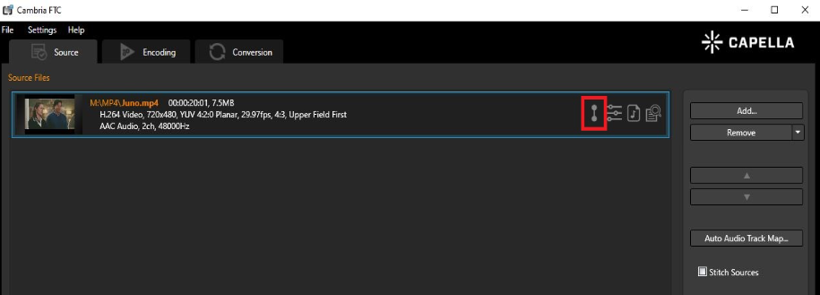
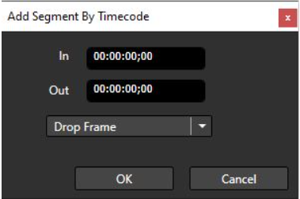

# Video Segments in Cambria FTC

## Feature Overview

The **Video Segments** feature in Cambria FTC allows users to mark and extract specific portions of a video by defining **in/out points**. This is useful for workflows that require trimming, re-ordering, or selectively encoding segments of the source.

---

## How to Use Video Segments

### Step 1: Open the Video Segments Tool

1. Upload a video file to FTC.  
2. Click on the **Video Segments** icon.

---

## Video Segments UI Breakdown

### Playback Controls

These buttons control the playback or navigation of the source video.  
You may scrub through the source or use the buttons.

From left to right:

- **Go to Beginning**  
- **Go to Previous Frame**  
- **Pause / Play**  
- **Go to Next Frame**  
- **Go to End**

---

### Set In/Out Points

This section allows you to set **in** and **out** points for your segment.

- Click **In** to mark the starting point of the segment  
- Click **Out** to mark the ending point

> An **out point cannot be before an in point**. If this occurs, an error will be shown.

---

### Add Segment

After setting the in and out points:

- Click **Add Segment**
- The segment will appear in the **Segment Properties** box

 You may also add segments by timecode or remove segments.
 
 ---
 
 ### Time Display

This panel shows:

- **Current time**
- **Current timecode**
- **Total duration** of the source

---

### Segment Properties

All added segments will appear here. You can:

- Add segments manually by timecode  
- Select and **remove** segments  
- Select and **modify** in/out points

 

---

### Fade In / Out

If you need to fade in or out within the segment:

1. Select in and out points  
2. Specify fade in and fade out durations  
3. Click **Add Segment**

---

### Jump to Time

Instead of scrolling, you can jump to a specific time or timecode manually.

---

### Save Segments

Once you’ve finished adding and adjusting segments:

- Click **OK** to save the segments

---

## Example Workflow

1. Scrub or use playback buttons to reach the **in point**, then click **In**
2. Scrub or use playback buttons to reach the **out point**, then click **Out**
3. Add **fade in/out** if needed
4. Click **Add Segment**  
   → The segment appears in Segment Properties
5. Click on a segment to change its in or out point
6. Click **Modify Segment** to apply changes
7. Click **OK** to save all segments

