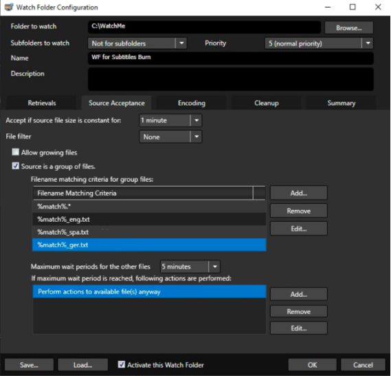
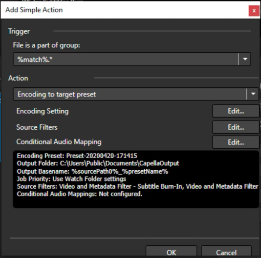
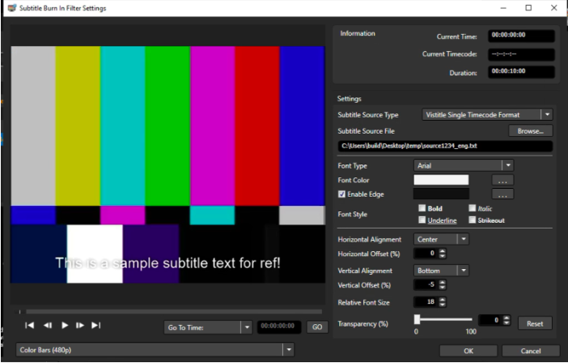
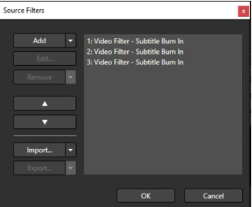
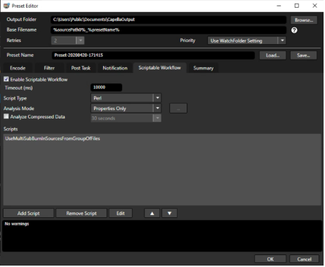

# Subtitle Burn-In Workflow with Cambria Watch Folder

## Supported Version

FTC **4.x.x** and above

---

## Introduction

This document explains how to set up a **Cambria Watch Folder** for subtitle burn-in using the **Subtitle Burn-In Filter**. The configuration supports multiple subtitle tracks in formats such as `.txt` (Visititle format) and is powered by a scriptable workflow for dynamic mapping.

> **NOTE:** User will need to know the number of subtitles to use as they set up the Watch Folder.

---

## Step-by-Step Instructions

### Launch Cambria Manager

* Launch **Cambria Manager**
* Go to the **Watch Folder** tab
* Click **Add a Watch Folder**


### Watch Folder Configuration

In the **Watch Folder configuration window**, set the following:

- **Folder to Watch**: folder where you drop your source files to be encoded  
- **Subfolders to watch**: depends on whether your folder has subfolders  
- **Priority**  
- **Name and Description**


### Source Acceptance Setup

Go to the **Source Acceptance Tab** and configure:

- **Accept if source file is constant for**: (set time by using dropdown or manual entry)  
- Ensure **Source is a group of files** is enabled

Example file group:

```
source1234.mov  
source1234_eng.txt  
source1234_spa.txt  
source1234_ger.txt
```
02_screenshot.png

Set file pattern to:

```
%match%.*, %match%_eng.txt %match%_spa.txt and %match%_ger.txt
```


---

### Encoding Configuration

Go to the **Encoding Tab** to add your encoding actions:

1. Click **Add Simple Action…**
2. For the Trigger select: %match%.* as shown below:




3. Set **Action** to: `Encode to Target Preset`
4. Click **Edit…** to configure:
   - **Encoding Settings**
   - **Source Filter Settings**
   - **Conditional Audio Mapping Settings**


### Subtitle Burn-In Filter Setup

In **Source Filters**, click **Edit…**, then:

1. Click **Add**
2. In the **Select Filter** dropdown, choose **Subtitle Burn-In** and click **OK**
3. Configure the following:
   - **Subtitle Source Type**: `Visititle Single Timecode format`
   - Browse and load the first subtitle file (e.g., `source1234_eng.txt`)



Repeat this process for each subtitle file.  
In the given example, you should add **3 Subtitle Burn-In Filters**.
Click OK to add your subtitle burn-in filter to your watch folder configuration.



> **NOTE:** Ensure that each subtitle filter is configured for the correct **Subtitle Source Type**.

### Scriptable Workflow Integration

Click **Edit…** on your encoding settings again to access the **Scriptable Workflow Tab**:

1. Enable **Scriptable Workflow**
2. Leave default settings
3. Click **Add Script** and load the following script:

```
https://www.dropbox.com/s/ouzwwgj0a1l764g/UseMultiSubBurnInSourcesFromGroupOfFiles.pl?dl=0
```



Click **OK** to save the preset with the script.

### Activate and Run Watch Folder

1. Click OK to go back to Watch Folder configuration window and Enable Activate this Watch-Folder.
2. Drop your source file along with your subtitle files into the Watch Folder you specified in step 3, the Encoding Job should start. 
3. Your output file should have 3 subtitles burned in, you can change their positions to see all three in the Subtitle Burn-In fitler settings.

