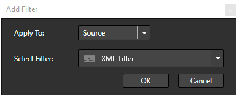
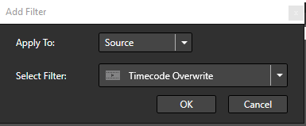

# XML Titler with Carbon Subtitle Workflow

## Supported Version

FTC **4.4.0** or above

---

## Introduction

FTC supports various subtitling workflows via **filters and plugins**, including:

- **Subtitle Burn-In Filter:** Adobe Encore, Vistitle, Cavena (.890), OP47 Teletext.
- **EZTitle Plugin:** Supports multiple formats, including **EBU, TimedText, etc.**
- **XML Titler:** Supports **Capella-defined XML format** and **Carbon Subtitle XML format**.

This guide focuses on **XML Titler** with **Carbon Subtitle XML**.

---

## Carbon Subtitle XML Descriptions

**Carbon Subtitle XML** is a proprietary format, widely used in the **Asia market**. While FTC does not support **all** its attributes, it supports most features for **minimal modifications** in workflows.

### XML Structure

Each subtitle line is encapsulated in **"TitlerData"**, with **each line** represented as a **"data" XML child**.

Each subtitle line must include:

- **StartTimecode**: When the subtitle appears on the screen.
- **EndTimecode**: When the subtitle disappears.
- **Title**: The subtitle text.

Example:

```xml
<TitlerData>
    <data StartTimecode="00:00:51;28" EndTimecode="00:00:55;26" Title="This is a sample" />
</TitlerData>
```

This means **"This is a sample"** will appear from **00:00:51;28** until **00:00:55;26**.

> **Alternative:** Instead of `StartTimecode` and `EndTimecode`, you can use `StartTime` and `EndTime` with **floating-point values** in seconds.

### Global Settings

The **first “data” XML child** contains **global settings** that apply to all subtitles:

- **Font**: Any system font is supported, including **non-English fonts** and **EUDC**.
- **CharSize**: `0.0` to `1.0` (relative to source resolution).
- **ColorR, ColorG, ColorB**: Text color (RGB, range **0-255**).
- **Transparency**: `0.0` (opaque) to `1.0` (fully transparent).
- **HardShadow**: `0` (off) or `1` (on, adds a hard border).
- **ShadowSize**: `0.0` to `1.0` (border thickness).
- **PosX, PosY**: `0.0` to `1.0` (relative X/Y position).
- **HAlign**: `0` = Center, `1` = Left, `2` = Right (**default: Left**).
- **VAlign**: `1` = Center, `2` = Top, `3` = Bottom (**default: Top**).

For **alignment**, the first subtitle line is **centered** at the `PosX` and `PosY` location after applying `HAlign` and `VAlign`.

> **Unsupported XML settings will be ignored.**

---

## How to Use FTC to Burn Subtitles

### Step 1: Import Your Video Source

   
   
   
   
   

### Step 2: Configure Encoding Preset

1. **Go to the Encoding Tab** → Add a **New Encoding Preset**.
2. **Go to the Filter Tab** → Add **Source Filters**.

   
   
   
   
   

### Step 3: Add XML Titler

1. Add **XML Titler** and **Apply to Source**.

   
   
   
   
   

2. Select the **Subtitle XML File** → Click **OK**.
3. You should now see the **subtitle preview**.

   
   
   
   
   

### Step 4: Timecode Correction (If Needed)

If your source does **not** have a valid timecode, you must **overwrite** it using the **Timecode Filter**.

   
   
   
   
   

1. **Ensure the Timecode Filter is positioned at the top** of the filter list.
2. XML Titler **requires valid timecode** to work.

### Step 5: Multiple Subtitles (Optional)

- You can **add multiple XML Titlers** to include **subtitles in different languages**.
- Each XML Titler applies a **different language track** to the same video.

> **Example:** English and Chinese subtitles on the same video.

   
   
   
   
   

### Step 6: Configure Encoding Settings & Transcode

1. Adjust encoding settings.
2. Start transcoding.

---

## Remarks & Best Practices

### 1. OS & Language Differences Affect Subtitle Appearance
- Even with the same font, different OS versions **may render subtitles differently**.

### 2. **Apply to Source vs. Apply to Target**
- **Apply to Source**: Use when **source and target frame rates are different**.
- **Apply to Target**: Use when **source and target resolutions differ** for **sharper text after scaling**.

### 3. **EZTitles Plugin Not Found?**
- If **EZTitles Subtitle Plugin** is missing, ensure it is **purchased and installed**.

### 4. **Using Watch Folder for Subtitle Workflow**
- **Watch Folder** supports **dynamic subtitle XML binding**.
- Contact **Capella Support** for **advanced subtitle automation**.

---

This concludes the **Carbon Subtitle XML Workflow Guide**.
