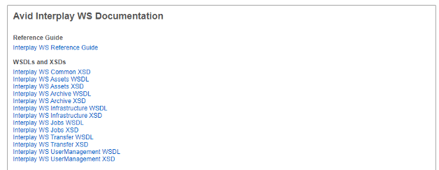
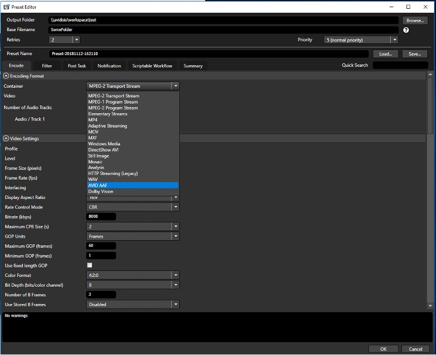
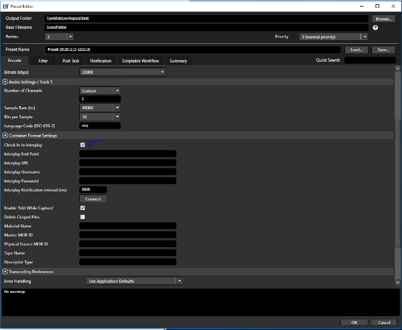
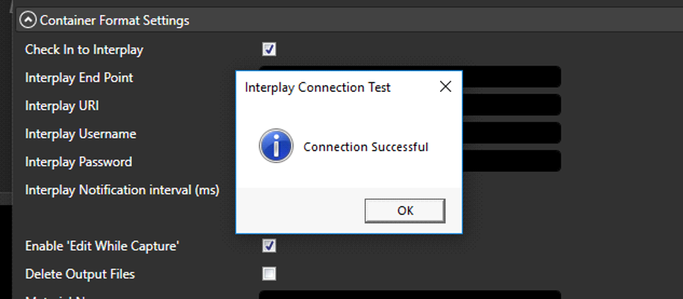
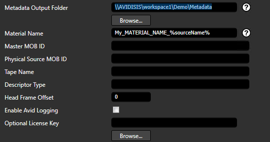
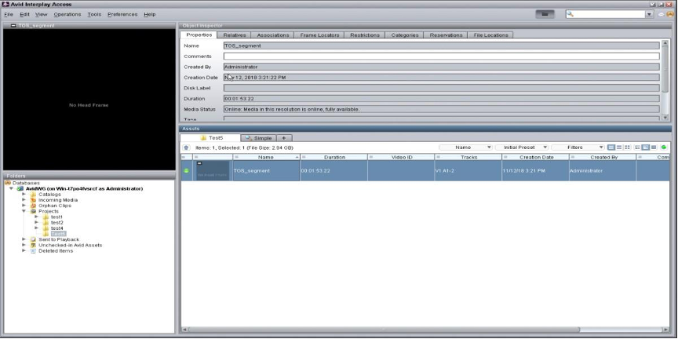
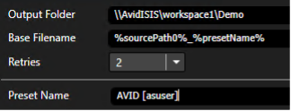

# AVID INTERPLAY

## Objective

This documentation Shows how to use Cambria FTC AVID exporter with AVID Interplay.

## Prerequisites

* AVID Interplay Web Services and AVID Nexis Client Manager should be installed on the Cambria FTC Machine
* AVID Nexis Storage with pre-configured workspace that the Cambria FTC machine can access directly (Eg. \\avidisis\workspace1)

## Setting up AVID Interplay Web Services 
	
AVID Interplay Web Services will need to be configured with the AVID Nexis Storage locations:

* In a web browser, go to ‘http://localhost’. You should see a page similar to the following:

* In Configuration and System Information, click on Edit Configuration. Add a new workgroup mapping to the workspace in your AVID Nexis Storage

* AVID Client Manager will need to mount the workspace to an open drive in the system:
    * Open Avid Nexis Client Manager. In the Systems section, you should see the name of the Avid Nexis Storage (Eg. AvidISIS) and in the Workspaces section, you should see one or more workspaces listed. Right-click on the workspace you plan to use and mount it.

	
## Cambria FTC AVID AAF Export With Interplay Check-In

The following steps will guide you through using Cambria FTC’s AVID AAF exporter and how to use it with the AVID Interplay check-in function:

* Launch FTC. In the Source tab, add one or more sources
* In the Encoding tab add a new preset
* Set the Output Folder to your Avid Nexis Storage workspace location (Eg. \\avidisis\workspace1\myAvidOutput)
* In the Encoding Settings, select the Avid AAF container and configure the encoding settings to your desired workflow

* In the Container Format Settings, enable the Check In to Interplay checkbox

	

* Fill out the Interplay details for your specific environment. 
    * **Interplay Endpoint:** http://localhost/services/Assets
    * **Interplay URI:** interplay://[ Workspace Name ]/Projects/[ Folder Path ]  The Interplay URI should point to your workspace path and the folder should be created before encoding as this may cause errors. Please create an empty folder in the path specified to output to the interplay access application.
    * **Interplay Username:** Username used to access workspace
    * **Interplay Password:** Password used to access workspace

* Test the connection by clicking on the Connect button.

* (Optional) You can change the Material name and other AVID metadata. The Material name will change the name that is shown in AVID Interplay’s interface. Other metadata will be included in the .aaf metadata file that AVID’s SDK creates

* Click OK to save the preset once you are done with the preset configuration

* Convert the job and wait for it to finish

* When the job completes successfully, the output files should be present in the Avid Nexis Storage location. The asset should also show up on the Avid Interplay interface under the Interplay URI specified:

* If you want to queue a job to manager the following needs to be added to the preset:
    * In the preset name field add [asuser] after the name of the preset. This identifies the logged in user for the AVID Interplay service.

  * Save the changes to the preset and queue the job. The job(s) should be listed in Cambria Manager and encode successfully. The newly created content should be present in the Avid Nexis Storage location and the asset information should also show up in the Avid Interplay interface.
    
---

For any questions or technical support, contact Capella Systems at:

📧 **support@capellasystems.net**

