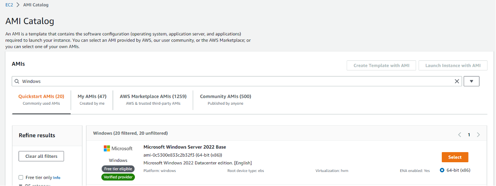
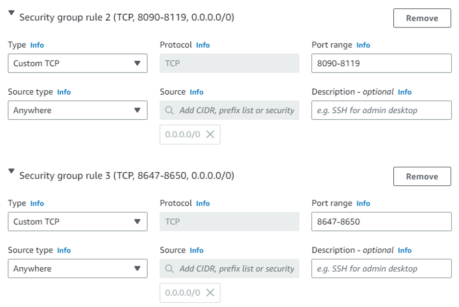
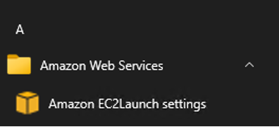
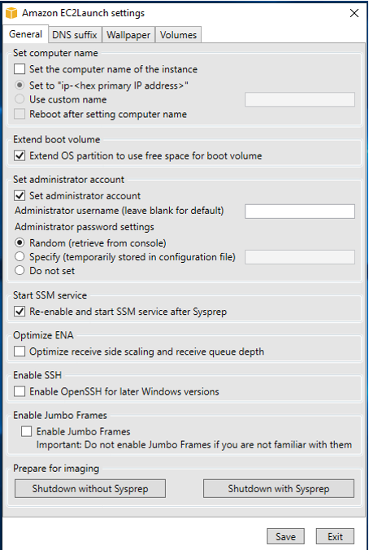
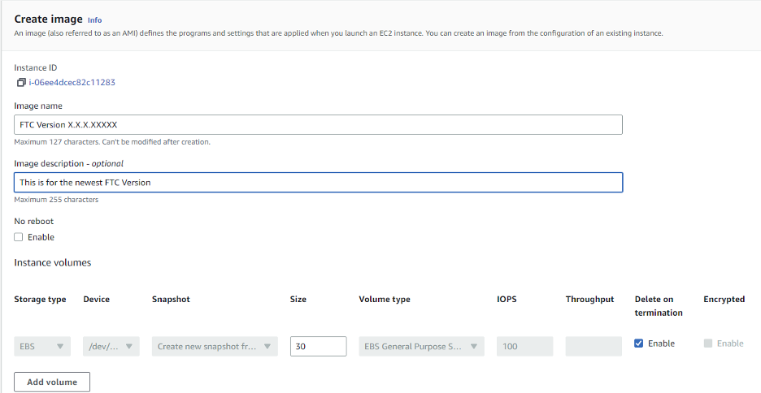

# AMI Creation and Editing

## Objective

This documentation assists with creating your own Amazon Machine Images (AMI) on Microsoft Windows Server 20XX Base for use with Cambria FTC/Cluster. These new AMIs can be used to create Amazon instances with Cambria Products. 

## Creating an EC2 instance

Please follow the steps below:

* Open the Amazon EC2 console at [https://console.aws.amazon.com/ec2/](https://console.aws.amazon.com/ec2/).
* In the navigation pane on the left, under **Images**, select **AMI Catalog**.
* Use the **Filter** options to scope the list of AMIs and select the Windows AMIs that meet your needs. For example, to view the Windows AMIs provided by AWS, select the **Search Bar**, type **Windows**, and look for the most recent **Server Base**
* Example with Microsoft Windows Server 2022 Base
   
   
   
   
* Click on **Select** for the AMI and then click **Launch Instance with AMI**. This will take you to the **Instance Creation Wizard**. Here you can choose the instance type based on your needs, add tags, configure Instance Details, set up key pairs, configure network settings, add storage, and review.
    - Name the instance something that will make it easy to figure out what it is used for. _Ex. FTC Launcher_
    - Leave **Application and OS Images** as it is, since we set that up earlier when choosing the AMI Catalog.
    - For the **Instance Type**, we recommend using **c5.large**, but you can choose an instance type of your liking. Ensure it has enough CPU and memory for your job.
    - For **Key pair**, if you do not have one already, click on **Create new key pair** and name it something easy to remember (like "FTC AMI Key"). Set the **Private key file format** to `.pem`
    - Click **Create key pair** and save the `.pem` file in a secure location. This key will be used to connect to your Windows instance later.
    - For **Network Settings**, configure **Security Groups** to allow Cambria FTC and Cambria Cluster to communicate:
        - Click **Edit** and then **Add security group rule**
        - Add the following rule: **Type Info:** Custom TCP, **Port Range:** 8090-8119, **Source Type:** Anywhere              
       - Click **Add security group rule** again and add the following rule: **Type Info:** Custom TCP, **Port Range:** 8647-8650, **Source Type:** Anywhere 

 
    
    
        
**NOTE:** Add the following **Inbound Rules** to allow the AMI to reach Cambria Floating Server and allow Cambria products to communicate.

* Select **Launch**. After launching, click on **View all instances** to see the instance you just created.

## Connecting to your EC2 instance

* Go to the **Instances** section on AWS (located on the items list on the left). Find the instance that was just created and wait until the **Instance State** displays **running** and the **Status Checks** have completed.

 
    
    
   
* Select the **Connect** button and then click on **RDP client**.
* Click on **Get Password** and then **Upload private key file**.
* Find the `.pem` file that you saved earlier and open it.
* Click **Decrypt Password** to generate a password. It should look something like this:  
*    `GA%)8Z!ADU6N1Vogb4YUR6;S=1..?8&Q`
* Click **Download remote desktop file**, open the file, and select **Connect**.
* Remote Desktop will require you to enter the **Password**.
* Copy the password and paste it into the **Password** field, then click **OK** and **Yes**.
* You should now be connected to the Windows Instance that you just created.


## Installing Cambria Products

Download and install Cluster/FTC/License Manager, preferably by copying and pasting the installer files from the physical machine being used or from the original installation source. After installing, you may follow these additional steps to prepare your AMI with licensing and Amazon S3 access. If you are using Nodelock licensing or do not need these steps, skip to Section 4.

### Floating License Client Setup

To configure a Floating License Client, if you have a Floating Licensing Server set up, point your instance to the public IP of the Floating Server Manager. This requires editing Registry settings on the AWS EC2 instance.

#### Manually setup client side after Floating Server is setup

Modify the following registry path:

```
Computer\HKEY_LOCAL_MACHINE\SOFTWARE\WOW6432Node\CAPELLA\CambriaLicenseManager

FloatServerAddress (String Value)
IP of Floating Server Machine 

FloatServerPort (32-bit DWORD) (this is port 8090 in hex)
1f9a 

LicenseMode (String Value)
CryptlexFloat
```


### Nodelock License Setup

If using **Nodelock licensing**, enter the license key as usual.  
This grants **CloudExtend** access to FTC, allowing it to work with **Cluster**.

## Preparing the Instance for AMI Image Creation

* In the **EC2 Instance** created above, open the **Start Menu** / **Windows Button** and select the down aarrow for **Amazon Web Services**. Select **Amazon EC2Launch settings application**

 
    
    
   
* In the **General Tab**, select **Random** for **Administrator password settings** (if not already selected) and click **Save**. A success popup should appear — click **OK**.
* Click **Shutdown with Sysprep**. A popup will ask if you want to prepare the instance for an image - click **Yes** and wait for Sysprep to complete shutting down Windows.

 
    

This ensures future AMIs use **random key pairs** and **separate passwords** independent of the initial state.

## Creating an AMI from the Instance

* In AWS, go to **Instances** in the **AWS Items List**.
*  Right-click the instance created in the above sections to be used as the basis for your AMI and select **Image and templates → Create Image** from the context menu.
 
    

* In the **Create Image** dialog box enter a **unique name** and **description** and select **Create Image**.
* It may take a few minutes for the AMI to be created. AMI's are located under the Images section on the EC2 Dashboard. Set the filter to **Owned by me** to see your created AMI. Note: the image may not have a name, but you can find the name you set previously under the **AMI Name tab**. Make sure to name the image after you find it.
* The AMI can now be launched into a new instance with **FTC installed**. Be sure to Terminate the original instance if it is no longer needed to avoid additional charges.
* Now, an instance can be created from the AMI Image, and it can also be used for Cluster CloudExtend.

---

For any questions or technical support, contact Capella Systems at:

📧 **support@capellasystems.net**


