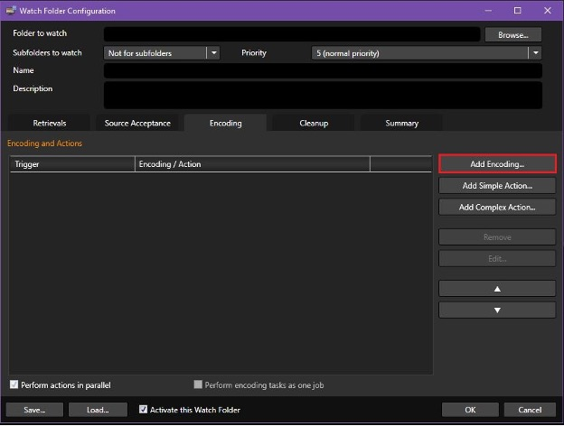

# Delete Source!

## Table of Contents
1. [Method 1: Cleanup Tab *(Preferred Method)*](#method-1-cleanup-tab-preferred-method)
2. [Method 2: Post Task Command Line](#method-2-post-task-command-line)
3. [Method 3: Simple Action](#method-3-simple-action)

---

## Method 1: Cleanup Tab *(Preferred Method)*

This is the preferred method for deletion because it is the most used and allows users to retrieve their source file within a certain time frame before deletion. This function ensures that all files used within the watch folder will be deleted after a specified time. Users can set it to delete either all files used or only those successfully processed.

### Steps
1. From the Watch Folder Configuration, go to the **"Cleanup" tab**.  
2. Adjust how often the Watch Folder will cycle through cleaning by changing the **"Clean up watch folder every:"** to the desired time.
3. Click the **"Add…"** button twice to open the Trigger section. (From here you can configure what triggers the deletion of files within the Watch Folder.)


4. In the **"Add Triggered Action"** window, navigate to the **Action dropdown menu** and select **Delete Source**.


Now, files in the Watch Folder will be cleaned within the Cleanup cycle if all requirements are met.

#### Limitations:
- You need to adjust the cycle frequency and trigger timing.
- Unlike other methods, sources are not deleted immediately after a transcoding job. Think of it as a timer where marked items are discarded when the timer reaches 0, provided all conditions are met.

---

## Method 2: Post Task Command Line

Using the Post Task Command Line, users can enter a command to delete the source file immediately after successful transcoding.

### Steps
1. From the Watch Folder Configuration, go to the **Encoding tab** and add/edit an encoding preset.  
   
2. Select the **"Post Task" tab** and look for **"Command Line"**.
3. Enter the following command:
   ```cmd
   cmd /C del "%sourceFile0%"
   
  
   
   
   
Now, the source file will be successfully deleted when the job finishes.

Limitations:
The quotes around "%sourceFile0%" are required to handle filenames with spaces.
This method is less convenient since it requires entering a command into a text field.
Entering the wrong command will result in the source not being deleted.

## Method 3: Simple Action

Using the Simple Action feature allows users to delete a source in a queue format. This method is useful if additional tasks, such as uploading the source to S3, need to be performed before deletion.

### Steps
1. From the Watch Folder Configuration, go to the **Encoding tab** and click **"Add Simple Action…"**.  
2. In the **Action dropdown menu**, select **"Delete source"**.

  
  
3. In the **Encoding tab**, uncheck the **"Perform actions in parallel"** checkbox at the bottom left.

  

Now, the source file will be successfully deleted when the job finishes.

#### Limitations
- Ensure that **"Perform actions in parallel"** is unchecked; otherwise, the source being transcoded will be deleted during the job.
- Make sure the Encoding job is queued before the **Delete source** action to ensure the transcoding job happens first.
