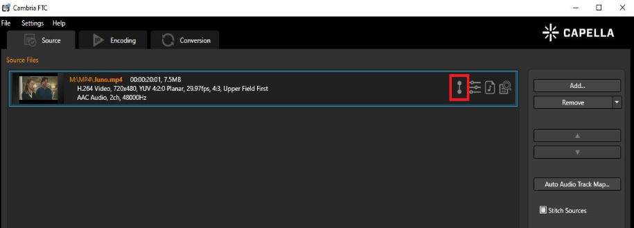
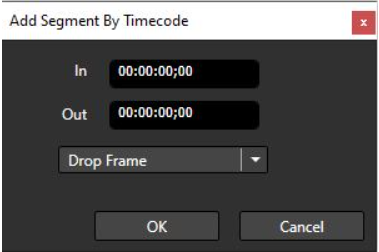

Upload a video file to FTC and click on the video segments icon

Below is a breakdown of the functions in the video segments UI

These series of buttons control the scrolling of the source. You may scrub through the source or use the buttons.

From left to right they are: Go to Beginning, Go to Previous Frame, Pause / Play, Go to Next Frame, and Go to End.

This is where you can set your in and out points for your segment. Selecting In / Out will set the time to the current time in the source. An outpoint can not be before an inpoint and will give you an error.

After choosing your in and out points, select add segment and it will appear in the segment properties box (#5). You may also choose to modify the segment.

This box shows the current time in the video, the current timecode, and the total duration of the video.

Added segments will appear here. You may also add segments by timecode or remove segments.

This is where you can fade in or out of your segment. Select an in and out point, add the fade in and out times, then click add segment.

Instead of using the buttons to scroll the source, you may skip directly to the time or timecode.

Once finished, press the OK button to save the segments that were added.

Example Workflow

Scrub or use buttons to get to inpoint. Select In.

Scrub or use buttons to get to outpoint. Select Out.

Add fade if needed.

Click Add segment and the segment will appear in Segment Properties (#5)

Click the segment and choose new in or outpoint.

Click modify segment. The segment will have its time changed.

Click OK to save.

