# AWS Kubernetes Documentation
**Cambria Stream / Stream Manager 5.4.0**

## Document History

| Version | Date       | Description                                                          |
|---------|-----------|----------------------------------------------------------------------|
| 5.3.0   | 05/21/2024 | Updated for release candidate version 5.3.0.19481 (Linux, Windows)   |
| 5.4.0   | 12/27/2024 | Updated for release version 5.4.0.22610 (Linux)                     |
 

***Do not move forward with the installation process if you do not agree with the End User License Agreement (EULA) for our products. You can download and read the EULA for Cambria Stream, Cambria Stream Manager, and Cambria License Manager from the links below:***
  
[EULA_Cambria_License_Manager.pdf](https://www.dropbox.com/s/1wg7ee7a59kzi8h/EULA_Cambria_License_Manager.pdf?dl=0)

[EULA_Cambria_Stream_Manager.pdf](https://www.dropbox.com/s/cdttx4flzb7nxp1/EULA_Cambria_Stream_Manager.pdf?dl=0)

[EULA_Cambria_Stream.pdf](https://www.dropbox.com/s/fla62h4o9kuqn7k/EULA_Cambria_Stream.pdf?dl=0)

## Limitations and Security Information

Cambria Stream, Stream Manager, and License Manager are installed on Linux in containers. Limitations and security checks done for this version are included in our general Linux Document below.

Note: this document is for referencing the software limitations for Linux only. The setup for Kubernetes starts in **Section 2. Create Kubernetes Cluster**.

Cambria Stream Manager / Stream:  
[Linux_Cambria_Stream_5_4_0_Guide.pdf](https://www.dropbox.com/scl/fi/733nj6wr6geyy8kxzsh2q/Linux_Cambria_Stream_5_4_0_Guide.pdf?rlkey=glvif1o980smzmfcrs421lnqd)

Note: this document references Kubernetes version 1.31 only

:::note

**Important: Before You Begin**

The sections below provide instructions on creating a NEW basic Kubernetes cluster with Cambria Stream with default settings and more open security settings. For more granular control and non-default settings, consult AWS and eksctl documentation.

:::

## Document Overview

The purpose of this document is to provide a walkthrough of the installation and initial testing process of the Cambria Stream Manager and Cambria Stream applications in the AWS Kubernetes (EKS) environment. The basic structure of the document is the following:

1. Overview of the Cambria Stream / Stream Manager Environment in AWS Kubernetes  
2. Create and configure the Kubernetes Cluster on AWS EKS  
3. Install Cambria Stream Manager and Cambria Stream on the Kubernetes Cluster  
4. Verify the installation is working properly  
5. Use / Test the Cambria Stream / Stream Manager applications  
6. Performance Metrics Setup
7. Delete / Update the Kubernetes Cluster / Cambria Stream applications  
8. Updating Kubernetes Cluster
9. Quick Reference of Kubernetes Installation  
10. Quick Reference of Important Kubernetes Components (urls, template projects, test player, etc)  
11. Glossary  

## 1. Overview

This section is meant to provide a brief overview of what the Cambria Stream / Stream Manager system in AWS Kubernetes entails and how the components interact.

Capella’s Cambria Stream Manager deployment is recommended to run on at least 3 nodes (replica = 3) with a service (Load Balancer) that exposes the application externally. Each pod has 2 working containers:

* **Cambria Stream Manager (application)**
* **Leader Elector tool** that chooses which of the Cambria Stream Manager pods to label as the main Cambria Stream Manager. The other Stream Manager pods serve as backup in case the leader stops working or goes down.

Also for the Cambria Stream Manager deployment, there is a PostgreSQL database in a separate pod for each of the Cambria Stream Manager nodes. The data is replicated between the different pods in order to preserve data in case of issues with the database and/or the Stream Manager application.

There is also a separate pod for the Cambria Stream Manager Web UI that also runs in one of the Cambria Stream Manager nodes. This is used to access the main UI for the application.

Capella’s Cambria Stream deployments run on every other pod that is created (in the node group where Stream instances are allowed). Each Cambria Stream pod has three containers:

* **Cambria Stream (application)**
* **Auto-Connect Stream Instance dotnet tool** that does the following: 
    * list pods 
    * attempts to find Cambria Stream Manager 
    * connects the Cambria Stream instance running in the pod to the Cambria Stream Manager that it found.

Each node in the Kubernetes Cluster will either be running the Stream Manager deployment or the Stream deployment.

## 2. Create Kubernetes Cluster

The following section provides the basic steps needed to create a Kubernetes Cluster on Akamai Cloud. Create a specific directory in your filesystem to store all of the files for this setup. This will be called your **kubernetes kirectory**.

Windows:

`mkdir -p %USERPROFILE%\kubernetes\AWS`

Linux / MacOS:

`mkdir -p $HOME/kubernetes/AWS`

**Note:** the kubernetes directory should have read/write permissions enabled. For Linux and MacOS, run this command:

`chmod -R 700 $HOME/kubernetes/AWS`

### 2.1. Prerequisites: eksctl and aws-cli Tools

#### 2.1.1. Installing and Configuring eksctl

The eksctl tool is used specifically with the AWS Kubernetes (EKS) system. The idea is that this tool will make it simple to create and manage the AWS Kubernetes Cluster all from one place.

##### 2.1.1.1. Installation

In your local server where kubectl and helm are installed, follow the instructions in the link below to download eksctl:

Note: for Linux, we assume an amd64 system. For MacOS, we use Homebrew to install as well as the ZSH terminal. These commands may or may not work on other systems, but it is not guaranteed. For more install options, see [https://eksctl.io/installation/](https://eksctl.io/installation/)

Windows:

`curl -LO https://github.com/eksctl-io/eksctl/releases/latest/download/eksctl_windows_amd64.zip`

Linux:

`ARCH=amd64`  
`PLATFORM=$(uname -s)_$ARCH ` 
`sudo curl -sLO https://github.com/eksctl-io/eksctl/releases/latest/download/eksctl_$PLATFORM.tar.gz` 
`sudo tar -xzf eksctl_$PLATFORM.tar.gz -C . && sudo rm eksctl_$PLATFORM.tar.gz ` 
`sudo mv ./eksctl /usr/local/bin` 

MacOS:

`brew tap weaveworks/tap` 
`brew install weaveworks/tap/eksctl` 

##### 2.1.1.2. Verify Installation

Run the following command to verify that eksctl was installed correctly. 

Note: If the command does not work, make sure to add eksctl to your PATH environment variable (Windows) or that it is properly installed on Linux / MacOS (/usr/local/bin/eksctl).

`eksctl version`

#### 2.1.2.  AWS Command Line Interface (CLI)

The aws-cli tool is used to interact with all of AWS features. In this case, the eksctl tool uses aws-cli to perform actions on the AWS account that has the proper permissions for the Kubernetes Cluster.

#### 2.1.2.1. Installation

Download and install the aws-cli on your local machine using the following guide:

Note: for Linux, we assume an amd64 system. For MacOS, we use Homebrew to install as well as the ZSH terminal. These commands may or may not work on other systems, but it is not guaranteed. For more install options, see [https://docs.aws.amazon.com/cli/latest/userguide/getting-started-install.html](https://docs.aws.amazon.com/cli/latest/userguide/getting-started-install.html)

Windows:

`msiexec /i https://awscli.amazonaws.com/AWSCLIV2.msi`

Linux:

`sudo curl https://awscli.amazonaws.com/awscli-exe-linux-x86_64.zip -o awscliv2.zip` 
`sudo unzip awscliv2.zip` 
`sudo ./aws/install` 
`sudo rm -rf ./aws*` 

MacOS:

`curl https://awscli.amazonaws.com/AWSCLIV2.pkg -o AWSCLIV2.pkg` 
`sudo installer -pkg AWSCLIV2.pkg -target /` 
`rm AWSCLIV2.pkg` 

##### 2.1.2.2. Verify Installation

Run the following command to verify that aws-cli was installed correctly. 

Note: If the command does not work, make sure to add aws-cli to your PATH environment variable (Windows) or that it is properly installed on Linux / MacOS (/usr/local/bin/aws).

`aws --version`

### 2.2. Prerequisites: AWS EKS IAM User and Credentials

The following section will provide the steps to get the AWS Kubernetes Cluster up and running in a pre-installation state (before installing Cambria Stream / Stream Manager).

#### 2.2.1. Prerequisite: Create IAM User for use with AWS EKS

***!Important!*** double check the policies below in your environment to make sure that they match as they may change over time.

Skip this step if you already have an AWS IAM User that has all the required permissions to access AWS EKS and other dependencies / utilities. If unsure, please review the policies in this section and match them to the IAM user that is already in your AWS account.

1\. Log in to the root AWS account (or an account that is allowed to create / manage / delete IAM users, user groups, policies, roles, etc) and go to the IAM service

2\. Go to the **Policies** and click on the **Create policy**

3\. Select the JSON option and delete the contents that are in the text editor. Download the following JSON AWS EKS Policy file:

[https://www.dropbox.com/scl/fi/jcq04djsmo2cqunk0z15x/EksAllAccess.json?rlkey=oji5rucsamzu4fb48sfca7sjr&st=a0bniear&dl=1](https://www.dropbox.com/scl/fi/jcq04djsmo2cqunk0z15x/EksAllAccess.json?rlkey=oji5rucsamzu4fb48sfca7sjr&st=a0bniear&dl=1)

Open this file in a text editor, copy the contents of the file, and paste them into the text editor for the policy on AWS (replace the `<account_id>` with your AWS account's id. You can find this on the top right corner of the AWS Dashboard where the account name is located. Click on the name and the Account ID will be shown. Example: 113035226127):

4\. Click on **Next**. Set the **Policy Name** to **EksAllAccess**. (Optional) Add any tags to help find this policy. Finish creating this policy by clicking on the **Create Policy** button.

5\. Create another policy called **IamLimitedAccess** and delete the default JSON contents in the text editor. Download the following JSON AWS IAM Policy file:

[https://www.dropbox.com/scl/fi/p8do4g9v3p6y188ai9s6g/IamLimitedAccess.json?rlkey=8c7y04h4ohwyjfp46kfrzmuww&st=vncf3jft&dl=1](https://www.dropbox.com/scl/fi/p8do4g9v3p6y188ai9s6g/IamLimitedAccess.json?rlkey=8c7y04h4ohwyjfp46kfrzmuww&st=vncf3jft&dl=1)

Open this file in a text editor, copy the contents of the file, and paste them into the text editor for the policy on AWS (replace the `<account_id>` tags with your AWS account's id):

6\. Still in the IAM service, go to the **User Groups **section and create a new user group via the **Create Group** button

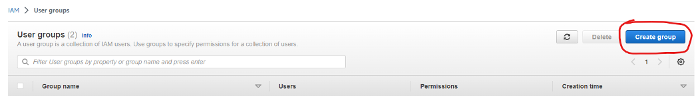

7\. Enter a name for the user group (Eg. EKS_Admins) and scroll down to the Attach permission policies
 
8\. Search for the following policies and add them to the list:
-	AmazonEC2FullAccess
-	AWSCloudFormationFullAccess
-	EksAllAccess
-	IamLimitedAccess

9\. Create the User Group by clicking on the **Create user group** button

10\. Still in the IAM service, go to Users and add a user. Pick a name for the user and make sure to check the **Provide user access to the AWS Management Console - optional** checkbox. Select the **I want to create an IAM user** option. You can choose to auto-generate a password or choose one of your own.

11\. In the **Set Permissions** section, make sure the **Add user to group** option is selected and choose the EKS group that was created in the previous steps

12\. Click on the **Next** button, add any number of tags to the user to help identify the user (optional), and create the user. Download the CSV file and place it in the **kubernetes directory**

#### 2.2.2. Prerequisite: Create AWS Access Credentials for use with aws-cli

Skip this step if the local server where you have aws-cli already has AWS Credentials for the IAM user that has permissions for the EKS services and dependencies / utilities.

1\. In the IAM service, go to **Users** and select the IAM user with the EKS service access

2\. Select the Security credentials tab and scroll down to Access keys. Create an access key with Command Line Interface (CLI) permissions. Check the **I understand the above recommendation and want to proceed to create an access key** checkbox. Click on the **Next** button.

3\. Click on the **Create access key** button. Do not exit the window yet. You will need the credentials on the page for the next step.

4\. Now in your favorite text editor, create a file called **credentials** with the following contents (Replace Access Key with the access key from step 3 and Secret Access Key with the secret access key from step 3):

`[default]` 
`aws_access_key_id = [ Access Key ]` 
`aws_secret_access_key = [ Secret Access Key ]` 

5\. Save the credentials file and move it to the .aws user folder

**Windows:** `%USERPROFILE%/.aws/credentials`
**Linux / MacOS:** `$HOME/.aws/credentials`

#### 2.2.3. Create AWS Kubernetes Cluster with eksctl

1\. In a command line / terminal window, go to the kubernetes directory and run the following command to create the base Kubernetes Cluster (replace the highlighted values to those of your specific environment):

:::note
Information / Recommendation
Cambria Stream Manager manages scheduling and handling Cambria Stream encoding / packaging programs. You will want to think about how many programs you will intend to run and choose an instance type accordingly. Our lowest recommended machine type for the manager machines is c7i.xlarge. 

We also recommend setting the node count to 3. This is because 1 of the nodes will act as the Cambria Stream Manager node while the other 2 nodes act as backup (web server and database are replicated / duplicated). In the case that the Cambria Stream Manager node goes down or stops responding, one of the other two nodes will take over as the Cambria Stream Manager node. Depending on your workflow(s), you will want to think about how many backup nodes you may need (if any).
:::

**--name=CapellaEKS**: the name for your Kubernetes Cluster (Eg. CapellaEKS)

**--region=us-west-2**: the AWS region where the Kubernetes Cluster will reside (Eg. us-west-2)

**--version=1.31**: the Kubernetes version. Recently tested version is 1.31

**--nodes=3**: the number of nodes for Cambria Stream Manager. The recommended value is 3.

**--kubeconfig=./CapellaEKS-kubeconfig.yaml**: the path / name of the kubeconfig file that will be created

**--instance-types=c7i.xlarge**: the instance type for the Cambria Stream Manager. The recommended type is c7i.xlarge.

`eksctl create cluster --name=CapellaEKS --region=us-west-2 --version=1.31 --nodes=3 --kubeconfig=./CapellaEKS-kubeconfig.yaml --instance-types=c7i.xlarge`

2\. Run the following command to create the Node Group for the Cambria Stream instances (replace the highlighted values to those of your specific environment):

:::note

Currently, Cambria Stream nodes need to be added manually. Therefore, you will need to think about what machine / instance type you need for running your Cambria Stream workflows. Based on benchmarks (See section 3.4. Creating and Editing Helm Configuration File), our recommended machine / instance type to get started is c6a.2xlarge.

For workflows that use GPU capabilities, you will need to use an instance type that supports GPUs. The tested GPU instances are the g5 instances.

initially, you only need 1 instance running in the node group. Later in this guide, you will configure the maximum number of Cambria Stream instances that you will need. When you are ready to use Cambria Stream machines, you can manually create nodes in this node group with the desired machine / instance type (from 1 up to the configured maximum number of Cambria Stream instances). To get started, we recommend setting this number to 2. This way, when the installation is complete, you will already have two Cambria Stream machines / instances to test with. You can always scale Cambria Stream nodes up and down depending on your needs.

:::

**--cluster=CapellaEKS**: the name of the Kubernetes Cluster from step 1

**--region=us-west-2**: the AWS region where the Kubernetes Cluster will reside

**--nodes=2**: the number of nodes that will be able to run Cambria Stream. The recommended value is 2.

**--instance-types=c6a.2xlarge**: the type of the Cambria Stream nodes. The recommended value is c6.2xlarge.

**--node-ami-family=Ubuntu2204**: what type of OS to install in the worker nodes. We currently recommend using the Ubuntu2204 image. Capella has also tested with AmazonLinux2, but this image does not work with GPU.

`eksctl create nodegroup --cluster=CapellaEKS --name=cambria-stream-nodes --region=us-west-2 --nodes=2 --instance-types=c6a.2xlarge --node-ami-family=Ubuntu2204`

3\. Create an IAM OIDC Provider association to your Kubernetes Cluster (replace highlighted values to those of your specific environment):

**--cluster=CapellaEKS**: the name of the Kubernetes Cluster from step 1

**--region=us-west-2**: the AWS region where the Kubernetes Cluster will reside

`eksctl utils associate-iam-oidc-provider --cluster=CapellaEKS --region=us-west-2 --approve`

4\. Create the IAM Role that will interact with AWS EBS CSI Driver to use volumes in the AWS Kubernetes environment (replace highlighted values to those of your specific environment):

**--cluster=CapellaEKS**: the name of the Kubernetes Cluster from step 1

**--region=us-west-2**: the AWS region where the Kubernetes Cluster will reside

**--role-name=AmazonEKS_EBS_CSI_DriverRole**: this is the role name that will have permissions for the CSI plugin. The name should follow this convention: AmazonEKS_EBS_CSI_DriverRole* (Eg. AmazonEKS_EBS_CSI_DriverRole_Test, AmazonEKS_EBS_CSI_DriverRole, AmazonEKS_EBS_CSI_DriverRole_2)

`eksctl create iamserviceaccount --name=ebs-csi-controller-sa --namespace=kube-system --cluster=CapellaEKS --region=us-west-2 --role-name=AmazonEKS_EBS_CSI_DriverRole --role-only --attach-policy-arn=arn:aws:iam::aws:policy/service-role/AmazonEBSCSIDriverPolicy --approve`

5\. Add the AWS EBS CSI Driver to the Kubernetes Cluster (replace highlighted values to those of your specific environment):

**Important:** this step will install a plugin to handle volumes in AWS. This must be installed correctly and the plugin must have an **Active** status before continuing. Otherwise, the Cambria product installation will always fail. If this step fails, you will want to consider re-creating the Kubernetes cluster from scratch as the safest option

**--cluster=CapellaEKS**: the name of the Kubernetes Cluster from step 1

**--region=us-west-2**: the AWS region where the Kubernetes Cluster will reside

`<account-id>`: your AWS account id

**AmazonEKS_EBS_CSI_DriverRole**: the role name that you chose for the command above

`eksctl create addon --name aws-ebs-csi-driver --cluster=CapellaEKS --region=us-west-2 --service-account-role-arn=arn:aws:iam::<account-id>:role/AmazonEKS_EBS_CSI_DriverRole --force`

6\. In a web browser, go to the AWS dashboard and log in with the IAM user that has the EKS service credentials (the one created in the prerequisite step):

7\. Go to the **Elastic Kubernetes Service** application. You should see the Kubernetes Cluster listed in the Clusters. If you don’t see the Kubernetes Cluster listed, make sure your AWS account is in the correct region where your cluster was deployed.

8\. Click on the cluster and go to the Add-ons tab. You should see the Amazon EBS CSI Driver with an Active status.

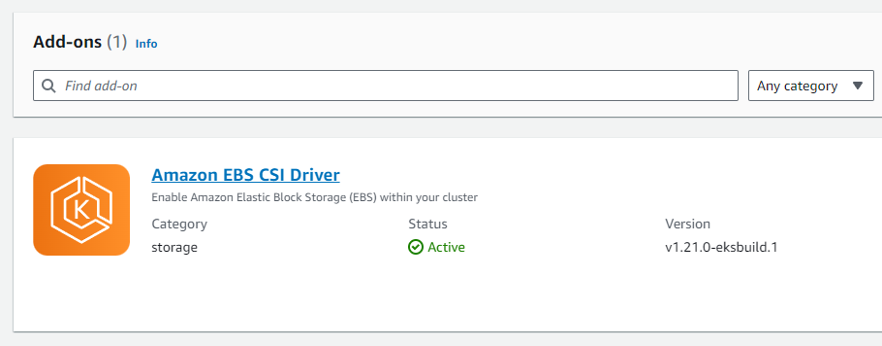

 **DO NOT MOVE ON TO THE NEXT STEP UNTIL THE ABOVE PLUGIN SHOWS ‘ACTIVE’**

## 3. Install Cambria Stream Manager, Cambria Stream, and Dependencies

### 3.1. Prerequisite: Installing and Configuring Kubectl and Helm

In order to install Cambria Stream Manager, Cambria Stream, and dependencies, you will need to first install the command line tools **kubectl** and **helm** on a local server and configure those tools to work with your Akamai Cloud Kubernetes environment.

#### 3.1.1.1 Installation

Download and install kubectl on your local machine using the following guide:

**Note:** make sure the kubectl version is not more than 1 version ahead of the Kubernetes version. Eg. for Kubernetes version: 1.31, kubectl version: 1.31 or 1.32.

**Note:** for Linux, we assume an amd64 system. For MacOS, we use Homebrew to install as well as the ZSH terminal. These commands may or may not work on other systems, but it is not guaranteed. For more install options, see [https://kubernetes.io/docs/tasks/tools/](https://kubernetes.io/docs/tasks/tools/)

Windows:

`curl -LO https://dl.k8s.io/release/v1.31.0/bin/windows/amd64/kubectl.exe`

Linux:

`curl -LO https://dl.k8s.io/release/v1.31.0/bin/linux/amd64/kubectl`  
`sudo install -o root -g root -m 0755 kubectl /usr/local/bin/kubectl` 
`rm ./kubectl`

MacOS:

`brew install kubectl`

#### 3.1.1.2. Verify Installation

1\. Run the following command to verify that kubectl was installed correctly.

`kubectl version --client`

**Note:** If the command does not work, make sure to add kubectl to your PATH environment variable (Windows) or that it is properly installed on Linux / MacOS (/usr/local/bin/kubectl).

2\. Open a command line / terminal window if not already open and set the **KUBECONFIG** environment variable with the path to the **kubeconfig.yaml** file you downloaded from the Kubernetes Dashboard:

Windows:

`set KUBECONFIG=<path-to-your-kubeconfig-file>.yaml`

Linux:

`export KUBECONFIG=<path-to-your-kubeconfig-file>.yaml`

**Note:** you will need to repeat this step every time you close the command line / terminal window as this only sets the environment variable for the command line / terminal session.

3\. Test that you can use kubectl with your Kubernetes environment

`kubectl get nodes`

You should get something similar to this:

`NAME                            STATUS        ROLES           AGE         VERSION` 
`lke104917-156831-64480c085671     Ready     <none>            32m         v1.26.3`      
 `blke104917-156831-64480c087c83    Ready     <none>           32m         v1.26.3 `  
`lke104917-156831-64480c08a1de     Ready     <none>            32m         v1.26.3` 

If having issues, make sure your KUBECONFIG path is correct and that the Kubernetes environment is running properly.

#### 3.1.2. Installing and Configuring Helm

In your local server where kubectl is installed, follow the instructions in the link below to install Helm:

##### 3.1.2.1. Installation

Download and install helm on your local machine using the following guide:

Note: for Linux, we assume an amd64 system. For MacOS, we use Homebrew to install as well as the ZSH terminal. These commands may or may not work on other systems, but it is not guaranteed. For more install options, see [https://helm.sh/docs/intro/install/](https://helm.sh/docs/intro/install/)

Windows:

`curl -LO https://get.helm.sh/helm-v3.15.1-windows-amd64.zip`

Linux:

`curl -fsSL -o get_helm.sh https://raw.githubusercontent.com/helm/helm/main/scripts/get-helm-3 ` `chmod 700 get_helm.sh ` `./get_helm.sh  rm ./get_helm.sh`

MacOS:

`brew install helm`

##### 3.1.2.2. Verify Installation

Run the following command to verify that helm was installed correctly. 

**Note:** If the command does not work, make sure to add helm to your PATH environment variable (Windows) or that it is properly installed on Linux / MacOS (/usr/local/bin/helm).

`helm version`

### 3.2 Prerequisite: Install External Kubernetes Tools

Now that kubectl is installed, you can use kubectl to install some tools that will be used for tasks such as using events to trigger Cambria Stream events, accessing Cambria Stream Manager Web UI via domain name, etc.

#### 3.2.1. Deploy Cloud Native Postgres

Cloud Native Postgres is the database used in the Kubernetes environment for the Cambria Stream and Stream Manager software data.

`kubectl apply -f https://raw.githubusercontent.com/cloudnative-pg/cloudnative-pg/release-1.20/releases/cnpg-1.20.1.yaml`

#### 3.2.2. Deploy argo-rollouts

Argo-rollouts is a third-party orchestration system that we use, in this case, for updating the Cambria Stream and Kubernetes environment through a rollout process.

`kubectl create namespace argo-rollouts` 
`kubectl apply -n argo-rollouts -f https://github.com/argoproj/argo-rollouts/releases/download/v1.5.1/install.yaml`

#### 3.2.3. Deploy argo-events

We will also be using argo-events in the future for handling tasks in Cambria Stream based on specific events (triggers).

`kubectl create namespace argo-events`  
`kubectl apply -f https://raw.githubusercontent.com/argoproj/argo-events/stable/manifests/install.yaml`

#### 3.2.4. Deploy cert-manager 

The cert-manager tool is used for handling SSL certificates to the services in the Kubernetes Cluster (such as the Cambria Stream Manager WebUI, REST API, etc).

`kubectl apply -f https://github.com/cert-manager/cert-manager/releases/download/v1.12.0/cert-manager.yaml`

#### 3.2.5. Deploy ingress-nginx

The ingress-nginx service is used to allow you to configure a domain name for the Kubernetes Cluster services (Eg. https://mydomainname.com).

`kubectl apply -f https://raw.githubusercontent.com/kubernetes/ingress-nginx/controller-v1.8.1/deploy/static/provider/cloud/deploy.yaml`

**Note:** If planning to use a proper domain name for Cambria Stream Manager / Stream, Echo Request needs to be enabled in the firewall for the Kubernetes Cluster load balancer. 

* Go to Load Balancer on AWS to find the VPC ID of the VPC of your AWS Kubernetes Cluster. 
* Go to Security Groups and find the VPC ID of the load balancer. Click on the Security group ID that matches the VPC ID. 
* Next, in Inbound rules click Edit inbound rules and click Add rule. Select Custom ICMP - IPv4 for type and select Echo Request as the Protocol. For the source select 0.0.0.0/0 and click Save rules.

### 3.3. Prerequisite: Install GPU Operator for NVENC

This section is only required for a Kubernetes cluster that will use GPUs. Skip this step if you will not use GPUs in this Kubernetes cluster.
 
**Important:** you must have at least one node with a GPU already deployed in your kubernetes environment. 
 
 
In your command prompt / terminal, run the following commands to deploy the GPU Operator to the Kubernetes cluster:

`helm repo add nvidia https://helm.ngc.nvidia.com/nvidia ` ` helm repo update`  
`helm install nvidia-operator nvidia/gpu-operator --namespace gpu-operator --create-namespace`

**Wait at least 5 minutes for the GPU operator to install completely**

Run this command with 'kubectl' and make sure that all of the pods are in a Running or Completed state:

`kubectl get pods -n gpu-operator`

If any pod is still in an Init state or PodCreating state, wait another 5 minutes to see if the pods will complete their install process.

For any pods that are in an errored state or that are still in an Init state after 10 minutes, do the following:

* Check that at least one node is one of the supported AWS GPU instances
* Use the following command to check the state of a failing pod (check the Events section):

`kubectl describe pod <your-pod-name> -n gpu-operator`

You can either look up the error for a potential solution or send the entire Events section to the Capella support team for investigation.

### 3.4. Creating and Editing Helm Configuration File

With Helm and Kubectl installed on your local server, you can now create the Helm configuration file (yaml) that will be used to deploy Cambria Stream Manager / Cambria Stream to the Kubernetes environment. 

Download the Capella Stream Manager Configuration Files Archive. There are two options:

**Option 1: (Default) Regular Cambria Stream Application**

`curl -Lo capella-stream.tgz "https://www.dropbox.com/scl/fi/x2vyn3yt39avh65pqh699/capella-stream-0.4.11.tgz?rlkey=8lx2sm2fnqx91xibc7hnj3h7z"`

**Option 2: Cambria Stream Application with Auto Ad Break (OCR) Feature**

`curl -Lo capella-stream.tgz "https://www.dropbox.com/scl/fi/nyx66r07ilfcjbmy045a6/capella-stream-0.4.11-ocr.tgz?rlkey=4nz8paifjodia1v7zxydiss2q"`

In a command line / terminal window, run the following command to create the configuration file:

`helm show values capella-stream.tgz > capellaStreamConfig.yaml`

Open the configuration file in your favorite text / document editor and edit the following values:

 Blue:  values in blue will be given to you by Capella. These values in the chart below are for the release version. 
 Red: values in red are proprietary values that need to be changed based on your specific environment

<table style={{ width: '100%', tableLayout: 'fixed' }}>
    <colgroup>
    {/* First column gets a fixed width, or you can omit width if you like */}
    <col style={{ width: '30%' }} />
    {/* Second column: let it wrap */}
    <col style={{ width: '70%', whiteSpace: 'normal', wordWrap: 'break-word' }} />
  </colgroup>
  <thead>
    <tr>
      <th>capellaStreamConfig.yaml</th>
      <th>Explanation</th>
    </tr>
  </thead>
  <tbody>
    <tr>
      <td>
        workersUseGPU: allow workers to use nvidia GPU 
        workersUseGPU: false
      </td>
      <td>
        If working with GPUs or NVENC workflows, set this value to true.
        Otherwise, leave as false.
      </td>
    </tr>
    <tr>
      <td>
        nbGPUs: how many GPUs are on the nodes. Only has an effect if workersUseGPU is set 
        nbGPUs: 1
      </td>
      <td>
        If workersUseGPU is true, set this to the number of GPUs available on the worker nodes.
        Note that your Cambria Stream license must include support for multiple GPUs.
      </td>
    </tr>
    <tr>
      <td>
        managerInstanceType: database and Cambria StreamManager will be restricted 
        managerInstanceType: "g6-dedicated-4"
      </td>
      <td>
        The instance type for Cambria Stream Manager machines. Change this to the instance type chosen when creating the Cambria Stream Manager nodes, for example g6-dedicated-4.
      </td>
    </tr>
    <tr>
      <td>
        workerInstanceType: instance type for the worker nodes 
        workerInstanceType: "g6-dedicated-8"
      </td>
      <td>
        The instance type for the Cambria Stream worker nodes. Change this to the instance type chosen when creating the Cambria Stream nodes, for example g6-dedicated-8.
      </td>
    </tr>
    <tr>
      <td>
        maxWorkerInstances: maximum number of worker instances (ie replicas)  
        maxWorkerInstances:  20  
      </td>
      <td>
        The maximum number of Cambria Stream machines that can be spawned. By default, this is 20, but it is recommended to start with a smaller number for testing.
      </td>
    </tr>
    <tr>
      <td>
        workerRolloutStep1Weight: when upgrading Cambria Stream version  
        workerRolloutStep1Weight:  10   
        workerRolloutStep1Weight: when upgrading Cambria Stream version   
        workerRolloutStep2Weight:  40 
      </td>
      <td>
        For upgrades, Capella uses argo-rollouts to incrementally upgrade nodes. The first value is
        the percentage of all the nodes that should be upgraded first. The second value is the
        percentage of all the nodes that should be upgraded second. See the Upgrading Kubernetes
        Cluster section for more information.
      </td>
    </tr>
    <tr>
      <td>
        workerRolloutMaxUnavailable: during argo-rollout Cambria Stream upgrade 
        workerRolloutMaxUnavailable: 1
      </td>
      <td>
        Determines how many worker pods can be offline at once during an upgrade. It is recommended
        to set this to [maxWorkerInstances] - [min # of active nodes] + 1. For example, if
        maxWorkerInstances=20 and you want at least 2 active, workerRolloutMaxUnavailable=19.
      </td>
    </tr>
    <tr>
      <td>
        pgInstances: number of postgresql database instances (ie replicas) 
        pgInstances: 3 
        managerReplicas: number of Cambria StreamManager instances (ie replicas) 
        managerReplicas: 3
      </td>
      <td>
        The number of instances for Cambria Stream Manager and postgres database. These two values
        must match each other and also the amount of nodes for Stream Manager created in step 1.
        In this case, the value will be 3.
      </td>
    </tr>
    <tr>
      <td>
        routingInputPortBegin: the beginning input port for Akamai Cloud Routing. 
        routingInputPortBegin: 1935 
        routingInputPortCount: the number of ports for Akamai Cloud Routing. 
        routingInputPortCount: 3
      </td>
      <td>
        These are settings for routing RTMP streams to Cambria Stream instances.
      </td>
    </tr>
    <tr>
      <td>
        defaultMachineMaximumInstances: maximum allowed instances for each new machine. 
        Default: -1 (up to the license limit) 
        defaultMachineMaximumInstances: -1
      </td>
      <td>
        Configures the maximum number of channels each Cambria Stream node can run. A value of -1
        means there is no explicit limit other than what the license allows.
      </td>
    </tr>
    <tr>
      <td>
        externalAccess: 
        &nbsp;&nbsp;exposeStreamServiceExternally: main Cambria Stream service 
        &nbsp;&nbsp;exposeStreamServiceExternally: true
      </td>
      <td>
        Set to true if you want Cambria Stream Manager to be accessible from outside the cluster.
        Otherwise, set this to false.
      </td>
    </tr>
    <tr>
      <td>
        &nbsp;&nbsp;enableIngress: enable ngingx ingress 
        &nbsp;&nbsp;enableIngress: true 
        &nbsp;&nbsp;hostName: use for the nginx ingress. Replace this with your domain name. 
        &nbsp;&nbsp;hostName: myhost.com 
        &nbsp;&nbsp;acmeRegistrationEmail: email for Automated Certificate Management 
        &nbsp;&nbsp;acmeRegistrationEmail: test@example.com 
        &nbsp;&nbsp;acmeServer: server to get TLS certificate from 
        &nbsp;&nbsp;acmeServer: https://acme-staging-v02.api.letsencrypt.org/directory
      </td>
      <td>
        These fields allow you to have a self-signed certificate and use a purchased domain name
        for your Kubernetes Cluster. If you do not plan to use this feature, you can either set
        enableIngress to false or leave the fields as is. If planning to use this feature, follow
        these steps:
        https://www.dropbox.com/scl/fi/p6i363hz5n0s9uney1zxf/Cambria_Kubernetes_Domain_DNS_Guide.pdf?rlkey=k8zjj0zqdwvsjtp3yozr7uzh8&st=2xuzj2qj&dl=1
      </td>
    </tr>
    <tr>
      <td>
        externalStreamIPs: 
        &nbsp;&nbsp;limitExternalAccess: Firewall, limit which external IPs can send streams 
        &nbsp;&nbsp;limitExternalAccess: false 
        &nbsp;&nbsp; 
        allowedExternalStreamIPs: list of allowed external IPs which can send streams 
        &nbsp;&nbsp;note that "10.0.0.0/8" and "192.168.255.0/24" must exist… 
        &nbsp;&nbsp;allowedExternalStreamIPs: 
        &nbsp;&nbsp;- 10.0.0.0/8 
        &nbsp;&nbsp;- 192.168.255.0/24 
        &nbsp;&nbsp;- yourIPhere
      </td>
      <td>
        This setting is for controlling what ip addresses can send streams to the Cambria Stream
        instances running on Kubernetes. By default, it is set to false to indicate that there are
        no ip restrictions. Set this value to true if you want to restrict to certain ip addresses.
        Add the ip addresses to allow in the list of allowedExternalStreamIPs.
      </td>
    </tr>
    <tr>
      <td>
        secrets: 
        &nbsp;&nbsp;pgClusterPassword: password for the postgresql database 
        &nbsp;&nbsp;pgClusterPassword: "xrtVeQ4nN82SSiYHoswqdURZ…"
      </td>
      <td>
        The PostgreSQL database password. It is recommended to replace the default value with
        something secure.
      </td>
    </tr>
    <tr>
      <td>
        &nbsp;&nbsp;cpLicenseKey: license key 
        &nbsp;&nbsp;cpLicenseKey: "XXXXXX-XXXXXX-XXXXXX-XXXXXX-XXXXXX-XXXXXX"
      </td>
      <td>
        The Cambria Stream product license key. Replace the XXXXXX placeholder with your actual key.
      </td>
    </tr>
    <tr>
      <td>
        &nbsp;&nbsp;cpLicenseKeyManager: license key for the manager nodes 
        &nbsp;&nbsp;cpLicenseKeyManager: "YYYYYY-YYYYYY-YYYYYY-YYYYYY-YYYYYY-YYYYYY"
      </td>
      <td>
        The Cambria Stream Manager license key. Replace the YYYYYY placeholder with the real manager
        license key.
      </td>
    </tr>
    <tr>
      <td>
        &nbsp;&nbsp;cambriaStreamManagerAPIToken: API token for Cambria StreamManager 
        &nbsp;&nbsp;cambriaStreamManagerAPIToken: "12345678-1234-43f8-b4fc-53afd3893d5f"
      </td>
      <td>
        An API token for Cambria Stream Manager. Change this to a secure value.
      </td>
    </tr>
    <tr>
      <td>
        &nbsp;&nbsp;cambriaStreamManagerWebUIUser: user/password to access Cambria Stream 
        &nbsp;&nbsp;cambriaStreamManagerWebUIUser: "admin,defaultWebUIUser,RZvSSd3ffsElsCEEe9"
      </td>
      <td>
        Credentials for the Cambria Stream Manager Web UI. The format is role,username,password.
        You can list multiple sets separated by commas.
      </td>
    </tr>
    <tr>

            </tr>
  </tbody>
</table>

**AWS Machine Information**

Cambria Stream has two types of workflows: encode and packager. The benchmarks below are separated into these two workflows. The recommended machines for the Cambria Stream instances are the ones that the Capella QA team has been using for testing. 

For encoding workflows, the recommended machine has been able to handle 1 program with an Adaptive Streaming HLS output at real-time with the following 4 video quality levels (1920x1080, 1280x720, 854x480, 640x360) at 29.97 FPS, and 1 audio quality level (128 Kbps).

Tested Machine: c6a.2xlarge [ AMD EPYC 7R13 ]

| Name             | RAM   | vCPU | Instance Storage | Network Bandwidth | EBS Bandwidth     | On-Demand Hourly Rate                  |
|------------------|-------|------|---------|----------|---------------------|--------------------------------|
| c6a.2xlarge  | 16 GB | 8    | EBS-only  | Up to 12.5 Gbps     | Up to 10 Gbps   | $0.306 (As of 04/22/2024)      |

For packager workflows, the recommended machine has been able to handle 1 program with an Adaptive Streaming HLS output at real-time with the following 4 video quality levels (1920x1080, 1280x720, 854x480, 640x360) at 29.97 FPS, and 1 audio quality level (128 Kbps). 

| Name             | RAM   | vCPU | Instance Storage | Network Bandwidth | EBS Bandwidth     | On-Demand Hourly Rate                  |
|-------------|-------|------|---------|----------|-------------------|------------------------------------|
| t3a.medium | 4 GB  | 2    | EBS-Only   | Up to 5 Gbps   | Up to 2085 Mbps  | $0.0376 (As of 04/22/2024)       |

### 3.5. Installing Cambria Stream Manager and Cambria Stream

 **Wait at least 5 minutes after installing prerequisites before moving on to this step.** 

In a command line / terminal window, run the following command:

`helm upgrade --install capella-stream capella-stream.tgz --values capellaStreamConfig.yaml`

The result of running the command should look something like this:

`Release "capella-stream" does not exist. Installing it now.`  
`NAME: capella-stream`  
`LAST DEPLOYED: Wed May 30 10:09:47 2023`  
`NAMESPACE: default`  
`STATUS: deployed ` 
`REVISION: 1 T ` 
`EST SUITE: None`  

At this point, several components are being deployed to the Kubernetes environment.  **Wait a few minutes for everything to be deployed.** 

## 4. Verify Cambria Stream Manager / Stream Installation

### 4.1. Verifying Helm Deployment

In the Kubernetes dashboard, review that the following resources / services are available / running in the **Default** namespace:

| **Namespace**   | **Content**                                                                                                                                                                                                                                                                                                                                                                                  |
|-----------------|-----------------------------------------------------------------------------------------------------------------------------------------------------------------------------------------------------------------------------------------------------------------------------------------------------------------------------------------------------------------------------------------------|
| argo-events     | Several components; no errors shown in events                                                                                                                                                                                                                                                                                                                                     |
| argo-rollouts   | Several components; no errors shown in events                                                                                                                                                                                                                                                                                                                                     |
| capella-worker  | - X pods with **cambriastream** in the name (X = Max # of Cambria Stream’s specified in config file)                                                                                                                                                                                                                        |
| cert-manager    | Several components; all should have a green status circle                                                                                                                                                                                                                                                                                                                                     |
| cnpg-system     | Several components; all should have a green status circle                                                                                                                                                                                                                                                                                                                                     |
| default         | - 1 **cambriastreammanagerapp** deployment - 1 **cambriastreammanagerwebui** deployment - 1 **live-stream-firewall deployment** deployment - 1 **live-stream-router** deployment - X pods with **cambriastreammanagerapp** in the name (X = # of replicas specified in config file)  - 1 pod with **cambriastreammanagerwebui** in the name - 1 pod with **live-stream-firewall** in the name - X pods with **pgcluster** in the name (X = # of replicas specified in config file); - 3 services with **pgcluster** in the name - 1 service named **cambriastreamservice** - 1 service named **cambriastreammanagerwebuiservice** |
| ingress-nginx   | Several components; no errors in events                                                                                                                                                                                                                                                                                                                                     |

  
### 4.2. Checking Cambria Stream Manager Web UI is Accessible

1\. In the command line / terminal, run the following command:

`kubectl get services -n default`

You should see a list of services in the Kubernetes Cluster. Get the EXTERNAL-IP of the **cambriastreammanagerwebuiservice**:

`NAME                                  TYPE           CLUSTER-IP       EXTERNAL-IP                                                                       PORT(S)                                        AGE` 
`cambriastreammanagerwebuiservice   LoadBalancer   10.100.30.167    a3ed88e747bf84e769fc85d689bd9713-329199856.us-west-1.elb.amazonaws.com   8171:31538/TCP   18m` 
`cambriastreamservice  LoadBalancer 10.100.44.27   a7e4559218cg923a8dfc85d689bd9713-329199856.us-west-1.elb.amazonaws.com   8758:32410/TCP,8678:31204/TCP  18m` 
`kubernetes             ClusterIP      10.100.0.1       <none>                                                                   443/TCP                                        62m` 
`pgcluster-capella-r    ClusterIP      10.100.206.133   <none>                                                                   5432/TCP                                       18m` 
`pgcluster-capella-ro   ClusterIP      10.100.158.159   <none>                                                                   5432/TCP                                       18m` 
`pgcluster-capella-rw   ClusterIP      10.100.39.167    <none>                                                                 5432/TCP                                       18m` 

2. In a web browser, type in the address https://[ EXTERNAL IP ]:8171 where the [ EXTERNAL IP ] is the copied EXTERNAL-IP from the previous step. You should see a page like the following:

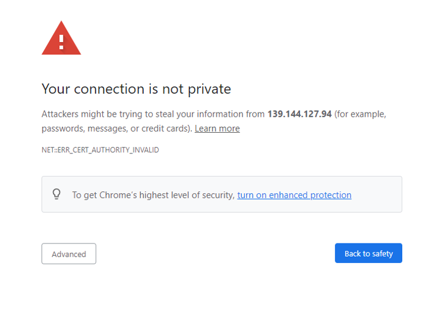

Click on **Advanced** and **Proceed to [ EXTERNAL IP ] (unsafe)**. This will show the login page for the Web UI (**Note**: you may have to repeat this step a few times as there is currently an issue with duplicate access to the WebUI).

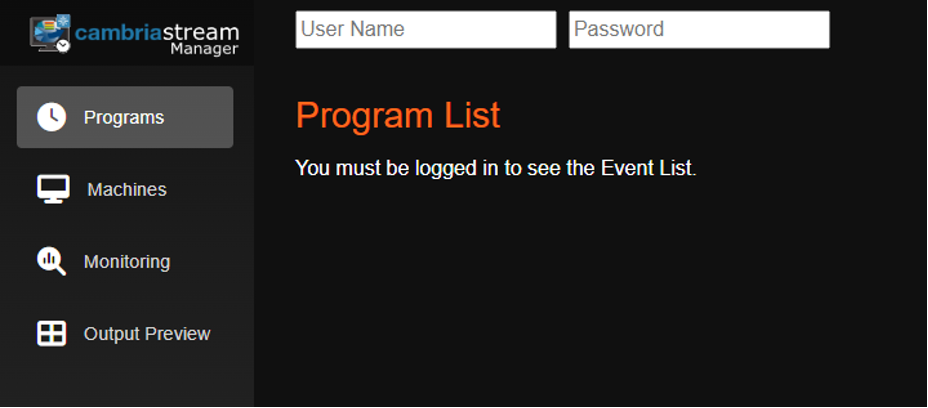

## 5. Running Live Encoding Programs

### 5.1. Prerequisite: Configuration for Cambria Stream Manager | Cambria Stream

Before using Cambria Stream, configure the following in the Kubernetes environment.

#### 5.1.1. Enable Firewall Ports for Incoming Streams

In order to stream to the Cambria Stream machines, the AWS firewall needs to have ports open to allow those incoming streams to reach the Cambria Stream instances. You will first need to identify which machines to open ports for.

1\. Log in to the AWS Console with the IAM User that has the EKS credentials and go to the **Elastic Kubernetes Service** application. Click on your Kubernetes Cluster

2\. In the Cambria Stream Manager Web UI, go to the machine tab and select one of the machines (Pods) that will be used for Cambria Stream. Get the name of the machine (Pod) that you want to use for Cambria Stream.

3\. Back in the AWS Kubernetes dashboard, go to Resources > Workloads > Pods. Set the Namespace to **capella-worker**. Look for the Cambria Stream pod name in this list.

4\. Click on the Pod that has the same name as the machine. Click on the Node and then click on the Instance

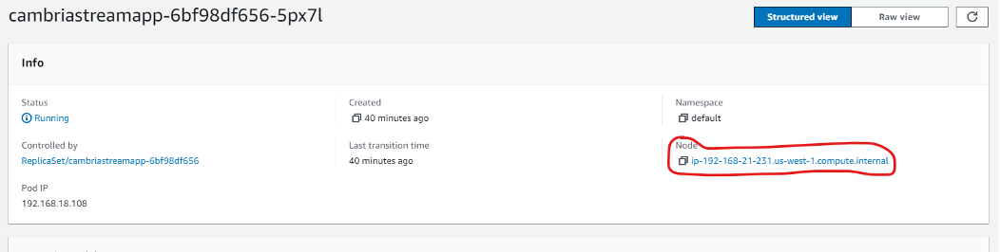

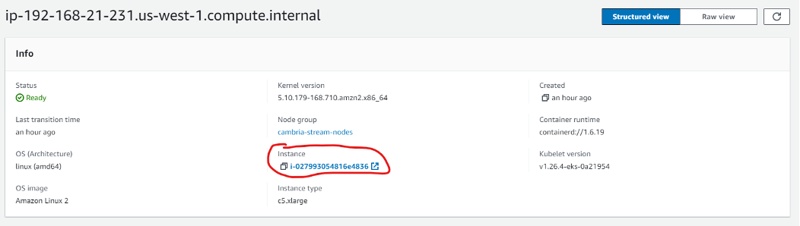

5\. In the instance details, click on the Security tab and click on the security group for that instance. In the Inbound Rules, edit the inbound rules and enter the following ports  (**both for ipv4 and ipv6**).

| Port(s)             | Description                 |
|---------------------|-----------------------------|
| 5004-5013 (UDP) |	For UDP streaming. Default ports for RTP     |
|8000-8009 (UDP)	| For UDP streaming. Default ports for SRT |
|1935-1943 (TCP) |	For TCP streaming. Default ports for RTMP |
|5000 (UDP)   5001-5003 (UDP/TCP)    5014-5050 (UDP/TCP)    5100-5150 (UDP/TCP)    5200-5250 (UDP/TCP)    5300-5350 (UDP/TCP)    5400-5450 (UDP/TCP) |	For Cambria Stream packager |
|8281 (TCP)	| For accessing Cambria Stream ABC Web UI | 
| 8678 (TCP) | 	Cambria License Manager Web Server |
| 8579 (TCP)	| Cambria Stream Web Server |
| 8580-8639 (TCP) | 	Cambria Stream REST API Ports
8646 (TCP)   5000 (TCP) |	WebRTC server port |
| 50000-50009 (UDP) |	WebRTC UDP ports |

Save the port configuration when finished. Verify that the ports are open correctly and are visible in the **Incoming Rules** section.

In most cases, all of the Cambria Stream pods will share the same security group. However, if any Cambria Stream has a different security group, repeat steps 3-5 for every other machine (Pod) that will be using Cambria Stream in a different security group.

#### 5.1.2. Verify Cambria Stream Instances are Connected

By default, the auto-connect container in each Cambria Stream pod should automatically add all new Cambria Stream instances to Cambria Stream Manager and activate them. All usable Cambria Stream instances will show an Online status.

**Note:** for Cambria Stream with OCR, it may take 5+ minutes on top of the amount of time that it normally takes for nodes to be up and running. The OCR build is heavy and requires more time to create the Cambria Stream container.

If a Cambria Stream instance does not show up in the list, do the following:

1\. Run the following command to get the internal ip address of the pod that the Cambria Stream instance belongs to (replace `<pod-name>` with your pod name):

`kubectl get pod/<pod-name> -o=jsonpath={.status.podIP} -n capella-worker`

2\. In the Cambria Stream Manager Web UI, go to the **Machines** tab and click on the Add button. Enter the ip address from step 2. This should add the Cambria Stream instance to the list of machines. Repeat steps 1 and 2 for each Cambria Stream pod that you want to add.

If a Cambria Stream instance shows the status **Standby**, this means the instance is up and running but is not currently usable by Cambria Stream Manager to stream. In order to make this instance available for streaming, do the following:

a.	Right-click on the machine and select **Activate**. This should change the status of the instance to **Online**.

#### 5.1.3 Setup for Incoming Live Streams

The streams will have to be sent directly to the Kubernetes nodes that are hosting the Cambria Stream application containers (**cambriastreamapp**).

##### 5.1.3.1. Option 1: Use External Application to Stream

1\. In the Cambria Stream Manager WebUI, get the name of the Cambria Stream instance that is running the program:

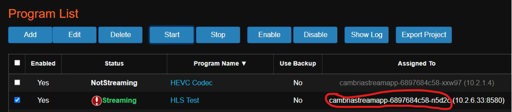

2\. Run the following command to get the name of the node that is hosting the Cambria Stream instance (replace `<pod-name>` with your pod name):

`kubectl get pod/<pod-name> -n capella-worker -o=jsonpath="{.spec.nodeName}"`

3\. Get the external ip address of the node with the following command (replace `<node-name>` with the node name from step 2):

`kubectl get node/<node-name> -o=jsonpath="{.status.addresses[1].address}"`

4\. Configure the source signal in your preferred application with the external ip of the Cambria Stream node and the **configured port** from the project. Example with RTP:

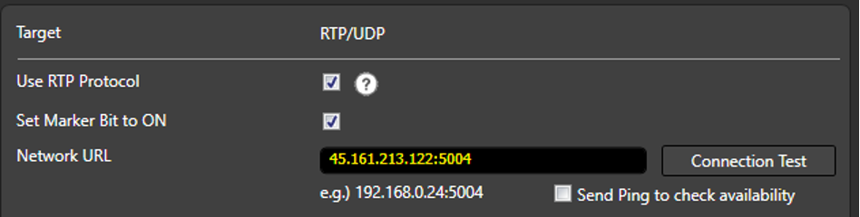

##### 5.1.3.2. Option 2: Using RtpSender.out Tool [ FOR TESTING PURPOSES ONLY ]

1\. In the Cambria Stream Manager Web UI, go to the machines tab and choose one of the machines to act as the RTP sender machine.

2\. Deactivate the RTP sender machine by right-clicking on the machine and selecting the Deactivate option. This will make the machine unusable as a Cambria Stream instance. This step is needed because using both RtpSender.out and Cambria Stream on the same instance could cause issues.

3\. Get the internal IP address of the instance the Cambria Stream program will run on. Write this IP address down somewhere as you will need it for a later step.

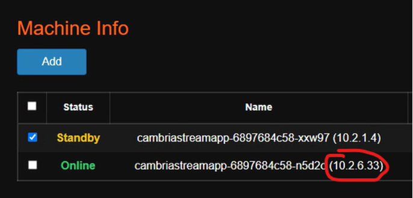

4\. You will need to log-in to the **cambriastreamapp** container in the deactivated pod with kubectl. Run this command (replace the highlighted value with your pod name):

`kubectl exec -it cambriastreamapp-559f7ddc5d-85gpx -c cambriastreamapp -n capella-worker -- /bin/bash`

5\. If using sources from an S3 compatible storage, you will need to set the credentials as environment variables in this container. Run the following commands (use your specific credentials):

`export AWS_ACCESS_KEY_ID=ABCAAZ893YTL79`
`export AWS_SECRET_ACCESS_KEY=xBn9800;ad&lm1928`

6\. Use the cd command to go to the directory with RptSender.out

`cd /opt/capella/CambriaStream/bin`

7\. Run this command to start RtpSender.out (use the internal IP from step 6 and the port you set for the Cambria Stream program created):

**Note:** only TS sources work with RtpSender.out

**Option 1 - With S3 sources:**

`mybucket`: the name of the S3 bucket where the source is located.  
`bucket-region`: the region that the S3 bucket resides in (Eg. us-east-1). 
`path/to/my/sourcefile.ts`: the path inside the S3 bucket to the TS file 
`<StreamIP>`: the IP address from step 4 

`./RtpSender.out --src [s3]mybucket@bucket-region:path/to/my/sourcefile.ts --mode 0 --url <StreamIP> --port 5004 --loop 1`

**Option 2 - With sources locally / in volume accessible to the container:**

`<StreamIP>`: the IP address from step 4

`./RtpSender.out --src /path/to/my/sourcefile.ts --mode 0 --url <StreamIP> --port 5004 --loop 1`

8\. To stop the RtpSender.out, use CTRL/CMD + C

### 5.2. Using / Testing Cambria Stream

For information on how to configure, run, and use Cambria Stream and Cambria Stream Manager, see the following:

[CHANGE ME] [https://www.dropbox.com/scl/fi/g5sutb23eijb88l18ntno/Cambria_Stream_Manager_and_Cambria_Stream_5_4_0_User_Guide.pdf?rlkey=w4joarnl7sf16bnsf99jtzpcm&st=g5o4p8uj&dl=1](https://www.dropbox.com/scl/fi/g5sutb23eijb88l18ntno/Cambria_Stream_Manager_and_Cambria_Stream_5_4_0_User_Guide.pdf?rlkey=w4joarnl7sf16bnsf99jtzpcm&st=g5o4p8uj&dl=1)

### 5.3. (Optional) Using the REST API

To get the url for the REST API server, do the following:

1\. In the command line / terminal, run the following command:

`kubectl get services -n default`

2\. You should see a list of services in the Kubernetes Cluster. Get the EXTERNAL-IP of the **cambriastreamservice**:

`NAME                   TYPE           CLUSTER-IP       EXTERNAL-IP                                                              PORT(S)                                        AGE` 
`cambriastreammanagerwebuiservice   LoadBalancer   10.100.30.167    a3ed88e747bf84e769fc85d689bd9713-329199856.us-west-1.elb.amazonaws.com   
8171:31538/TCP   18m` 
`cambriastreamservice  LoadBalancer 10.100.44.27 a7e4559218cg923a8dfc85d689bd9713-329199856.us-west-1.elb.amazonaws.com   8758:32410/TCP,8678:31204/TCP  18m` 
`kubernetes             ClusterIP      10.100.0.1       <none>                                                                   443/TCP                                      62m `   `pgcluster-capella-r    ClusterIP      10.100.206.133   <none>                                                                   5432/TCP                                       18m` `pgcluster-capella-ro   ClusterIP      10.100.158.159   <none>                                                                   5432/TCP                                       18m`   `pgcluster-capella-rw   ClusterIP      10.100.39.167    <none>                                                                   5432/TCP                                       18m`   

Example of REST API URL:

`https://a7e4559218cg923a8dfc85d689bd9713-329199856.us-west-1.elb.amazonaws.com:8758/CambriaLM/v1/Events?usertoken=12345678-1234-43f8-b4fc-53afd3893d5f`

As shown in the example above, the Cambria Stream API token will need to be included in the ‘usertoken’ argument at the end of the url. This token will be needed for most REST API calls to the Cambra Stream Manager web server.

## 6. Performance Metrics Graph Setup via Prometheus / Grafana & Logging via Loki / Promtail 

See the following document for setting up Cambria Stream Manager metrics (graphs):

[CHANGE ME]
[https://www.dropbox.com/scl/fi/ny1sttpgxoiszjt8oz37u/Prometheus_Grafana_Setup_for_Cambria_Stream_Manager_5_4_0_on_AWS_Kubernetes.pdf?rlkey=l0hvtq5filram5mcvju61v5wk&st=icz4krzc&dl=1](https://www.dropbox.com/scl/fi/ny1sttpgxoiszjt8oz37u/Prometheus_Grafana_Setup_for_Cambria_Stream_Manager_5_4_0_on_AWS_Kubernetes.pdf?rlkey=l0hvtq5filram5mcvju61v5wk&st=icz4krzc&dl=1)

## 7. Deleting Kubernetes Cluster 

Use the following steps to delete your Kubernetes environment:

1\. Open a command line / terminal window where the eksctl tool is located. Run the following command to delete the Kubernetes Cluster:

**--name=CapellaEKS**: the name of your Kubernetes Cluster

**--region=us-west-2**: the AWS region where the Kubernetes Cluster will reside

`eksctl delete cluster --name=CapellaEKS --region=us-west-2 --wait`

2\. **Wait several minutes for the Kubernetes Cluster to delete completely.** To verify that the cluster was deleted, go to the AWS Console and log in with the IAM user that has the EKS permissions. Check the following:

a\. Search for Elastic Kubernetes Service in the region that the Kubernetes Cluster is located. Make sure the deleted cluster does not show up on the list

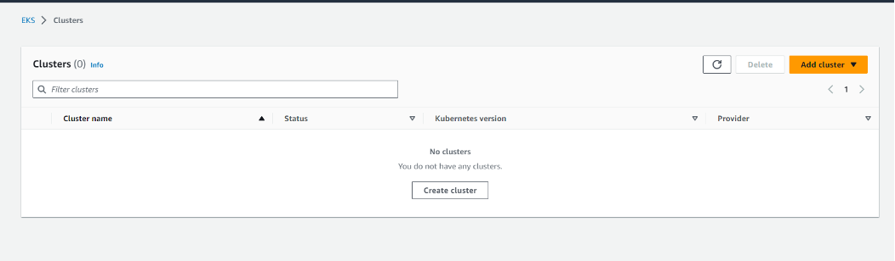

b\. Search for CloudFormation in the region that the Kubernetes Cluster is located. Make sure there are no stacks specific to the Kubernetes Cluster on the list

c. **Important**: Delete the volumes that were created for the Kubernetes cluster by going to the Volumes section in the **EC2** Service and deleting the volumes with the name of your Kubernetes cluster.

## 8. Updating / Upgrading Kubernetes Cluster

The current way to update a Kubernetes Cluster is through a third-party tool called argo-rollouts. This process allows you to manually upgrade pods incrementally. There are four steps involved in the upgrade process:

1\.	Upgrade X% of total Cambria Stream worker pods (workerRolloutStep1Weight value). That means if you have 5 pods and step 1 is to upgrade 10%, that means 1 pod will be upgraded.

2\.	When the pods are upgraded successfully, argo-rollouts goes into a pause state. While in this state, argo-rollouts waits for the user to manually move on to the next step. This is so that the user can verify that the upgraded pods are working properly.

3\.	Upgrade X% of total Cambria Stream worker pods (workerRolloutStep2Weight value). That means if you have 5 pods and step 3 is to upgrade to 40%, that means 2 pods will be upgraded. However, since 1 pod has already been upgraded from step 1, that means only 1 pod will be upgraded in this step.

4\.	This is the same as step 2. In this case, argo-rollouts waits for the user to manually verify that the upgraded pods are working properly. After this step, the rest of the pods in the cluster are upgraded.

Follow these steps to upgrade your Cambria Stream Manager, Cambria Stream, and/or Helm-managed Kubernetes environment:

**Before doing any upgrades**, you will need to make sure you are fully aware of your current setup and save all configurations, programs, keys (such as DRM keys, AWS keys, etc), and previous yaml files (Eg. cambriaStreamConfig.yaml). There are some things to keep in mind:

-	For upgrading to new Cambria Stream / Stream Manager versions, please use our newest Cambria Stream Kubernetes guide. This should have been provided for you. If you do not have a new version of the document, contact Capella’s support team: support@capellasystems.net
-	Cambria Stream nodes may change. This means that the ip addresses, names, etc may also change. This is more likely the case when running the non-normal upgrade steps. In the case that the Cambria Stream nodes do change, you will need to manually re-configure your incoming streams to point to the new Cambria Stream nodes after the upgrade. 
-	Cambria Stream Manager WebUI and Cambria Stream Manager REST API urls may also change during the installation process. This is more likely to be the case if not running the normal upgrade process
-	Upgrading is not currently seamless. Programs will need to be taken down during the upgrade process
-	In the case that argo-rollouts does not work on upgrading the Cambria Stream environment, the Cambria Stream application will need to be uninstalled and then re-installed with the new information. In this case, the database will be wiped and all programs will be deleted. This is why it is important to save all programs, configuration files, keys, etc.

To save all programs from the Cambria Stream WebUI:

-	Select all of the programs in the Programs list
-	Click on the Export Program button. This should prompt you to download the set of programs to a .lpef file

**Note:** in certain cases (Eg. small number of nodes), the argo-rollouts tool becomes stuck trying to upgrade the Cambria Stream worker nodes / argo-rollouts does not properly upgrade to the new pods. In this case, skip to section **8.2. Option 2: Upgrade via Cambria Stream Reinstall**.

### 8.1. Option 1: Normal Upgrade via Argo-Rollouts

This upgrade method is best for when changing version numbers, secrets such as the license key, WebUI users, etc, and Cambria Stream | Stream Manager specific settings such as max number of pods, replicas, etc.

:::warning

Known Issues  
- cambriaStreamManagerAPIToken cannot currently be updated via this method  
- pgClusterPassword cannot currently be updated via this method

:::

1\. In the kubernetes directory, download the argo-rollouts dashboard executable from the following location (Download the one for your OS):

`https://github.com/argoproj/argo-rollouts/releases/tag/v1.7.1`

Rename the file to **kubectl-argo-rollouts.exe** if on Windows or **kubectl-argo-rollouts** on Linux / MacOS. 

If on Linux / MacOS, do the following:

-	Move the file to /usr/local/bin in order for it to work (Eg. sudo mv ./kubectl-argo-rollouts /usr/local/bin/kubectl-argo-rollouts).
-	Make the file executable:  
`sudo chmod +x /usr/local/bin/kubectl-argo-rollouts`

2\. Follow section **3.4. Creating and Editing Helm Configuration File** to download and edit your new capellaStreamConfig.yaml file.

3\. Make sure there are enough nodes in your Kubernetes environment for pods to get attached to. 

For number of **managerReplicas**, there should be an equal amount of nodes running (Ex. managerReplicas = 3; There should be 3 nodes with the managerInstanceType running). 
For number of **maxWorkerInstances**, there should be an equal amount of nodes running (Ex. maxWorkerInstances = 2; There should be 2 nodes with the workerInstanceType running)

4\. Run the following command to perform the update / upgrade (Note: for this case, the postgres database should be preserved)

`helm upgrade capella-stream capella-stream.tgz --values capellaStreamConfig.yaml`

5\. Run this command in order to activate the argo-rollouts dashboard

`kubectl argo rollouts dashboard`

6\. In a web browser, go to the address http://localhost:3100/rollouts. You should see a dashboard similar to the following:

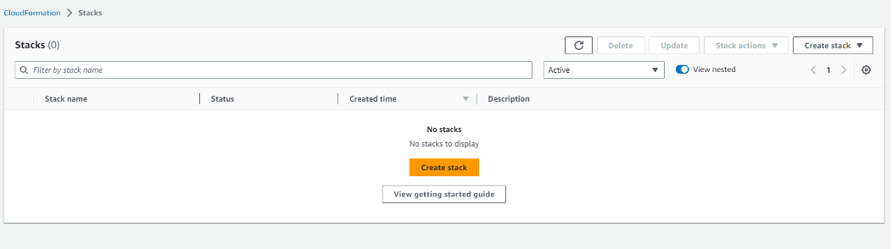

Make sure that the window says **cambriastreamapp**. If it does not, you will need to change the namespace. You can change this by going to the dropdown on the top right corner of this page and choosing the **capella-worker** namespace.

Click on the button next to **Weight** (the gray button). At this point, argo-rollouts is running step one of the four steps. When step one is done, you should see something similar to the following:

**Note:** if it seems like it is taking a while for the UI to move on to the next step, click on the Promote button to get to the next step. 

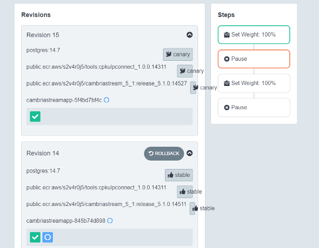

8\. If the first set of nodes were upgraded correctly, verify that the upgraded node(s) are working properly. Once done, click the **Promote** button to move on to step 3 which will upgrade the next set of nodes.

9\. If the second set of nodes were upgraded correctly, verify that the upgraded node(s) are working properly. Once done, click the Promote All button to finish upgrading the rest of the Cambria Stream nodes.

10\. Back in your terminal window, use CTRL/CMD + C to exit the argo-rollouts tool. Run the following commands to upgrade the Cambria Stream Manager pods:

`kubectl rollout restart deployment cambriastreammanagerapp -n default`  
`kubectl rollout restart deployment cambriastreammanagerwebui -n default`  

11\. Wait a few minutes for the kubernetes pods to install properly.

### 8.2. Option 2: Upgrade via Cambria Stream Reinstallation

For any upgrade cases for the Cambria Stream environment, this is the most reliable option. This upgrade option basically uninstalls all of the Cambria Stream components and then reinstall with the new Helm chart and values (.yaml) file. As a result, **this will delete the database and delete all of your programs in the Cambria Stream UI.** 

1\. Save all of your Cambria Stream programs and any configuration files, keys (Eg. DRM keys, AWS keys, etc)

2\. Follow section **3.4. Creating and Editing Helm Configuration File** to download and edit your new capellaStreamConfig.yaml file.

3\. In a command line / terminal window in your local server, run the following command:
 
`helm uninstall capella-stream --wait`

4\. Deploy the Helm configuration file with the following command.

`helm upgrade --install capella-stream capella-stream.tgz --values capellaStreamConfig.yaml --wait`

### 8.3. Upgrade Verification

Perform the following checks to make sure your Cambria Stream Manager and Cambria Stream are running with the correct version and are ready to use:

1\. Follow section 4.0. Verify Cambria Stream Manager / Stream Installation to make sure the expected components are installed correctly, pods are in a Running state, and that you can access the WebUI.

2\. In a command-line / terminal window, get the Cambria Stream REST API url:

` kubectl get service/cambriastreamservice -o=jsonpath='{.status.loadBalancer.ingress[0].hostname}'`

The command will give you the IP address / hostname. The full REST API url will look something like this:

`https://<hostname>:8758/CambriaLM/v1`

3\. Check the Cambria Stream Manager version. In a command-line / terminal window, run the following command (replace `<hostname>` with your Cambria Stream Manager node’s hostname):

`curl -k https://<hostname>:8758/CambriaLM/v1/SystemInfo`

You can also check this in a web browser by putting in the url bar: 

`https://<hostname>:8758/CambriaLM/v1/SystemInfo`

Check that the version matches the Cambria Stream Manager version that you are expecting (Eg. 5.3.0.18678). 

If it does not, double check your Helm values file to make sure the correct version is configured and follow the upgrade steps again. 

4\. In the Cambria Stream Manager WebUI, check the **Machines** tab and make sure any Cambria Stream nodes have been added automatically.  **It may take more than five minutes for new Cambria Stream nodes to show up in the Machines tab.** 

If the Cambria Stream nodes that you are expecting are not showing up in the Machines tab, try to add them manually by doing the following:

- Get the IP address of the Cambria Stream pod (Eg. cambriastreamapp-xxxxx):

`kubectl get pod/<CambriaStreamPodName> -n capella-worker -o=jsonpath={.status.podIP}`

If no IP address shows up, this means the Cambria Stream pod is not connected to a node. Make sure you use Cambria Stream pods that are connected to a Kubernetes node.

- In the Cambria Stream Manager WebUI in the **Machines** tab, click on the **Add** button and put the pod IP. This should add a new machine with the pod’s IP address. It may take a few minutes for the machine to go to a **Standby / Online** state. If, after a few minutes, the machine is not in a Standby / Online state, this means Cambria Stream is not running on the pod. Retry the upgrade steps again.

5\. If during the upgrade process there are programs missing from the UI or all of the programs are gone, you can re-import the saved programs by doing the following:

- In the Cambria Stream Manager WebUI, click on the **Import Program** button. This will trigger the upload file explorer window where you can select the .lpef program file(s) with the programs before the upgrade

6\. You will need to setup your incoming streams to the new Cambria Stream node IP addresses. Follow the steps in Section **5. Running Live Encoding Programs**

## 9. Quick Reference: Installation, Testing, and Teardown

### 9.1. Installation (Deploy from Windows to AWS Kubernetes)

Create your **kubernetes directory** (Eg. %USERPROFILE%\kubernetes\AWS) and start the terminal in the kubernetes directory.

Download / Install Kubernetes tools into the kubernetes directory (extract the helm.exe and eksctl.exe files from the zip archives):

`curl.exe -LO https://dl.k8s.io/release/v1.31.0/bin/windows/amd64/kubectl.exe` 
`curl.exe -LO https://get.helm.sh/helm-v3.15.1-windows-amd64.zip` 
`curl.exe -LO https://github.com/eksctl-io/eksctl/releases/latest/download/eksctl_windows_amd64.zip` 
`msiexec.exe /i https://awscli.amazonaws.com/AWSCLIV2.msi` 

Create an AWS IAM User with permissions to EKS and dependencies and create AWS Credentials from the user. Write the credentials to %USERPROFILE%\.aws\credentials (See section **2.2. Prerequisites: AWS EKS IAM User and Credentials**)

Create AWS Kubernetes Cluster with eksctl (replace highlighted fields as needed):

`eksctl create cluster --name=CapellaEKS --region=us-west-2 --version=1.31 --nodes 3 --kubeconfig=./CapellaEKS-kubeconfig.yaml --instance-types=c7i.xlarge`
`eksctl create nodegroup --cluster=CapellaEKS --name=cambria-stream-nodes --region=us-west-2 --nodes=2 --instance-types=c6a.2xlarge --node-ami-family=Ubuntu2204`
`eksctl utils associate-iam-oidc-provider --cluster=CapellaEKS --region=us-west-2 --approve`
`eksctl create iamserviceaccount --name=ebs-csi-controller-sa --namespace=kube-system --cluster=CapellaEKS --region us-west-2 --role-name=AmazonEKS_EBS_CSI_DriverRole --role-only --attach-policy-arn arn:aws:iam::aws:policy/service-role/AmazonEBSCSIDriverPolicy --approve`
`eksctl create addon --name=aws-ebs-csi-driver --cluster=CapellaEKS --region=us-west-2 --service-account-role-arn=arn:aws:iam::<account-id>:role/AmazonEKS_EBS_CSI_DriverRole --force`

Go to the AWS Kubernetes dashboard and check that the EBS CSI Driver is Active.

Configure kubectl environment variable:

`set KUBECONFIG=<path-to-your-kubeconfig-file>.yaml`

Install Prerequisites as needed:

`kubectl apply -f https://raw.githubusercontent.com/cloudnative-pg/cloudnative-pg/release-1.20/releases/cnpg-1.20.1.yaml` 
`kubectl create namespace argo-rollouts` 
`kubectl apply -n argo-rollouts -f https://github.com/argoproj/argo-rollouts/releases/download/v1.5.1/install.yaml` 
`kubectl create namespace argo-events` 
`kubectl apply -f https://raw.githubusercontent.com/argoproj/argo-events/stable/manifests/install.yaml` 
`kubectl apply -f https://github.com/cert-manager/cert-manager/releases/download/v1.12.0/cert-manager.yaml` 
`kubectl apply -f https://raw.githubusercontent.com/kubernetes/ingress-nginx/controller-v1.8.1/deploy/static/provider/cloud/deploy.yaml` 

If using GPU instances, run these commands to install NVIDIA driver and toolkit:

`helm repo add nvidia https://helm.ngc.nvidia.com/nvidia` 
`helm repo update` 
`helm install nvidia-operator nvidia/gpu-operator --namespace gpu-operator --create-namespace` 

**Wait at least 5 minutes for prerequisites to fully install before moving on to the next step.** Meanwhile, create Helm value configuration yaml file and edit the file based on your environment:

Option 1: (Default) Regular Cambria Stream Application**

`curl -Lo capella-stream.tgz "https://www.dropbox.com/scl/fi/fwa1ztewwy8u9du7e21r6/capella-stream-0.4.11-aws.tgz?rlkey=wt2ddnvwdm0jlrzsk05n45385"`

Option 2: Cambria Stream Application with Auto Ad Break (OCR) Feature**

`curl -Lo capella-stream.tgz "https://www.dropbox.com/scl/fi/zyyuhkll6ywabfmx074z4/capella-stream-0.4.11-aws-ocr.tgz?rlkey=xwwsjhx64bflxrxqjogedmras"`

Must run after choosing one of the above options

`helm show values capella-stream.tgz > capellaStreamConfig.yaml`

Deploy Cambria Stream | Stream Manager:

`helm upgrade --install capella-stream capella-stream.tgz --values capellaStreamConfig.yaml`

**Wait a few minutes until you see that all of the pg-clusters have been created** (Eg. for 3 manager nodes, there should be 3 **pg-cluster-x** created)

### 9.2. Installation (Deploy from Linux to AWS Kubernetes)

Create your kubernetes directory (Eg. $HOME/kubernetes/AWS) and start the terminal in the kubernetes directory. Set the kubernetes directory to have read/write access:

`mkdir -p $HOME/kubernetes/AWS`

`chmod -R 700 $HOME/kubernetes/AWS`

Download and Install the Kubernetes tools (The example shown is for installation on a amd64 system):

`curl -LO https://dl.k8s.io/release/v1.31.0/bin/linux/amd64/kubectl`
`sudo install -o root -g root -m 0755 kubectl /usr/local/bin/kubectl`
`rm ./kubectl`
`curl -fsSL -o get_helm.sh https://raw.githubusercontent.com/helm/helm/main/scripts/get-helm-3`
`chmod 700 get_helm.sh`
`./get_helm.sh`
`rm ./get_helm.sh`
`ARCH=amd64`
`PLATFORM=$(uname -s)_$ARCH `
`sudo curl -sLO https://github.com/eksctl-io/eksctl/releases/latest/download/eksctl_$PLATFORM.tar.gz`
`sudo tar -xzf eksctl_$PLATFORM.tar.gz -C . && sudo rm eksctl_$PLATFORM.tar.gz `
`sudo mv eksctl /usr/local/bin`
`sudo curl https://awscli.amazonaws.com/awscli-exe-linux-x86_64.zip -o awscliv2.zip`
`sudo unzip awscliv2.zip`
`sudo ./aws/install`
`sudo rm -rf ./aws*`

Create an AWS IAM User with permissions to EKS and dependencies and create AWS Credentials from the user. Write the credentials to ~/.aws/credentials (See section 2.2. Prerequisites: AWS EKS IAM User and Credentials)

Create AWS Kubernetes Cluster with eksctl (replace highlighted fields):

`eksctl create cluster --name=CapellaEKS --region=us-west-2 --version=1.31 --nodes 3 --kubeconfig=./CapellaEKS-kubeconfig.yaml --instance-types=c7i.xlarge`
`eksctl create nodegroup --cluster=CapellaEKS --name=cambria-stream-nodes --region=us-west-2 --nodes=2 --instance-types=c6a.2xlarge --node-ami-family=Ubuntu2204`
`eksctl utils associate-iam-oidc-provider --cluster=CapellaEKS --region=us-west-2 --approve`
`eksctl create iamserviceaccount --name=ebs-csi-controller-sa --namespace=kube-system --cluster=CapellaEKS --region us-west-2 --role-name=AmazonEKS_EBS_CSI_DriverRole --role-only --attach-policy-arn arn:aws:iam::aws:policy/service-role/AmazonEBSCSIDriverPolicy --approve`
`eksctl create addon --name=aws-ebs-csi-driver --cluster=CapellaEKS --region=us-west-2 --service-account-role-arn=arn:aws:iam::<account-id>:role/AmazonEKS_EBS_CSI_DriverRole --force`

Go to the AWS Kubernetes dashboard and check that the EBS CSI Driver is Active.

Configure kubectl environment variable: 

`export KUBECONFIG=<path-to-your-kubeconfig-file>.yaml`

Install Prerequisites as needed:

`kubectl apply -f https://raw.githubusercontent.com/cloudnative-pg/cloudnative-pg/release-1.20/releases/cnpg-1.20.1.yaml`
`kubectl create namespace argo-rollouts`
`kubectl apply -n argo-rollouts -f https://github.com/argoproj/argo-rollouts/releases/download/v1.5.1/install.yaml`
`kubectl create namespace argo-events`
`kubectl apply -f https://raw.githubusercontent.com/argoproj/argo-events/stable/manifests/install.yaml`
`kubectl apply -f https://github.com/cert-manager/cert-manager/releases/download/v1.12.0/cert-manager.yaml`
`kubectl apply -f https://raw.githubusercontent.com/kubernetes/ingress-nginx/controller-v1.8.1/deploy/static/provider/cloud/deploy.yaml`

If using GPU instances, run these commands to install NVIDIA driver and toolkit:

`helm repo add nvidia https://helm.ngc.nvidia.com/nvidia`
`helm repo update`
`helm install nvidia-operator nvidia/gpu-operator --namespace gpu-operator --create-namespace`

**Wait at least 5 minutes for prerequisites to fully install before moving on to the next step.** Meanwhile, create Helm value configuration yaml file and edit the file based on your environment:

Option 1: (Default) Regular Cambria Stream Application

`curl -Lo capella-stream.tgz "https://www.dropbox.com/scl/fi/fwa1ztewwy8u9du7e21r6/capella-stream-0.4.11-aws.tgz?rlkey=wt2ddnvwdm0jlrzsk05n45385"`

Option 2: Cambria Stream Application with Auto Ad Break (OCR) Feature

`curl -Lo capella-stream.tgz "https://www.dropbox.com/scl/fi/zyyuhkll6ywabfmx074z4/capella-stream-0.4.11-aws-ocr.tgz?rlkey=xwwsjhx64bflxrxqjogedmras"`

Must run after choosing one of the above options

`helm show values capella-stream.tgz > capellaStreamConfig.yaml`

Deploy Cambria Stream | Stream Manager:

`helm upgrade --install capella-stream capella-stream.tgz --values capellaStreamConfig.yaml`

 **Wait a few minutes until you see that all of the pg-clusters have been created**  (Eg. for 3 manager nodes, there should be 3 pg-cluster-x created)

### 9.3. Installation (Deploy from MacOS to Kubernetes)

Create your kubernetes directory (Eg. $HOME/kubernetes/AWS) and start the terminal in the kubernetes directory. Set the kubernetes directory to have read/write access:

`mkdir -p $HOME/kubernetes/AWS`
`chmod -R 700 $HOME/kubernetes/AWS`

Download and Install the Kubernetes tools (The example shown is for installation on a amd64 system):

`brew tap weaveworks/tap`
`brew install weaveworks/tap/eksctl`
`curl https://awscli.amazonaws.com/AWSCLIV2.pkg -o AWSCLIV2.pkg`
`sudo installer -pkg AWSCLIV2.pkg -target /`
`rm AWSCLIV2.pkg`
`brew install kubectl`
`brew install helm`

Create an AWS IAM User with permissions to EKS and dependencies and create AWS Credentials from the user. Write the credentials to ~/.aws/credentials (See section **2.2. Prerequisites: AWS EKS IAM User and Credentials**)

Create AWS Kubernetes Cluster with eksctl (replace highlighted fields as needed):

`eksctl create cluster --name=CapellaEKS --region=us-west-2 --version=1.31 --nodes 3 --kubeconfig=./CapellaEKS-kubeconfig.yaml --instance-types=c7i.xlarge`

`eksctl create nodegroup --cluster=CapellaEKS --name=cambria-stream-nodes --region=us-west-2 --nodes=2 --instance-types=c6a.2xlarge --node-ami-family=Ubuntu2204`

`eksctl utils associate-iam-oidc-provider --cluster=CapellaEKS --region=us-west-2 --approve`

`eksctl create iamserviceaccount --name=ebs-csi-controller-sa --namespace=kube-system --cluster=CapellaEKS --region us-west-2 --role-name=AmazonEKS_EBS_CSI_DriverRole --role-only --attach-policy-arn arn:aws:iam::aws:policy/service-role/AmazonEBSCSIDriverPolicy --approve`

`eksctl create addon --name=aws-ebs-csi-driver --cluster=CapellaEKS --region=us-west-2 --service-account-role-arn=arn:aws:iam::<account-id>:role/AmazonEKS_EBS_CSI_DriverRole --force`

Go to the AWS Kubernetes dashboard and check that the EBS CSI Driver is Active.

Configure kubectl environment variable::

`export KUBECONFIG=<path-to-your-kubeconfig-file>.yaml`

Install Prerequisites as needed:

`kubectl apply -f https://raw.githubusercontent.com/cloudnative-pg/cloudnative-pg/release-1.20/releases/cnpg-1.20.1.yaml`
`kubectl create namespace argo-rollouts`
`kubectl apply -n argo-rollouts -f https://github.com/argoproj/argo-rollouts/releases/download/v1.5.1/install.yaml`
`kubectl create namespace argo-events`
`kubectl apply -f https://raw.githubusercontent.com/argoproj/argo-events/stable/manifests/install.yaml`
`kubectl apply -f https://github.com/cert-manager/cert-manager/releases/download/v1.12.0/cert-manager.yaml`
`kubectl apply -f https://raw.githubusercontent.com/kubernetes/ingress-nginx/controller-v1.8.1/deploy/static/provider/cloud/deploy.yaml`

If using GPU instances, run these commands to install NVIDIA driver and toolkit:

`helm repo add nvidia https://helm.ngc.nvidia.com/nvidia`

`helm repo update`

`helm install nvidia-operator nvidia/gpu-operator --namespace gpu-operator --create-namespace`

**Wait at least 5 minutes for prerequisites to fully install before moving on to the deploy step**. Meanwhile, create Helm value configuration yaml file and edit the file based on your environment:

Configure kubectl, create Helm value configuration yaml file and edit the file based on your environment:

Option 1: (Default) Regular Cambria Stream Application

`curl -Lo capella-stream.tgz "https://www.dropbox.com/scl/fi/fwa1ztewwy8u9du7e21r6/capella-stream-0.4.11-aws.tgz?rlkey=wt2ddnvwdm0jlrzsk05n45385"`

Option 2: Cambria Stream Application with Auto Ad Break (OCR) Feature

`curl -Lo capella-stream.tgz "https://www.dropbox.com/scl/fi/zyyuhkll6ywabfmx074z4/capella-stream-0.4.11-aws-ocr.tgz?rlkey=xwwsjhx64bflxrxqjogedmras"`

Must run after choosing one of the above options

`helm show values capella-stream.tgz > capellaStreamConfig.yaml`

Deploy Cambria Stream | Stream Manager:

`helm upgrade --install capella-stream capella-stream.tgz --values capellaStreamConfig.yaml`

**Wait a few minutes until you see that all of the pg-clusters have been created** (Eg. for 3 manager nodes, there should be 3 pg-cluster-x created)

### 9.4. Testing

Prerequisite: Open UDP/TCP port for incoming streams in your AWS security groups. See section 5.1.1. Enable Firewall Ports for Incoming Streams for details.

Get the external IP address of the Cambria Stream Manager service and log in to the Web UI. Create a new Cambria Stream program. See section 5.2. Using / Testing Cambria Stream for details
Start streaming the program. Get the ip address of the node that the program is streaming on:

Replace `<pod-name> `with your pod name
`kubectl get pod/<pod-name> -n capella-worker -o=jsonpath={.spec.nodeName}`

Replace `<node-name>` with the result from the above command
`kubectl get node/<node-name> -n capella-worker -o=jsonpath={.status.addresses[1].address}`

Setup your sender stream with the ip address of the node + the port number(s) for the source streams.
**If using the RtpSender tool to send an incoming stream, see section 5.1.3.2. Option 2: Using RtpSender.out.**

### 9.5. Upgrades and Teardown

#### 9.5.1. Cambria Stream | Stream Manager and/or the Kubernetes Cluster Upgrades

Edit the capellaStreamConfig.yaml file and then run the following commands (See **Section 8. Updating / Upgrading Kubernetes Cluster** for more details and warnings):

`helm upgrade capella-stream capella-stream.tgz --values capellaStreamConfig.yaml` 
`kubectl argo rollouts dashboard`

In a web browser, go to http://localhost:3100/rollouts. Go through each of the **Weight** steps to upgrade.

Restart Cambria Stream Manager deployments:

`kubectl rollout restart deployment cambriastreammanagerapp -n default` 
`kubectl rollout restart deployment cambriastreammanagerwebui -n default`

#### 9.5.2. Cambria Stream | Stream Manager Uninstall

If you want to to uninstall Cambria Stream Manager and Cambria Stream, run the following command:

`helm uninstall capella-stream --wait`

#### 9.5.3. Kubernetes Cluster Teardown

To teardown the entire Kubernetes Cluster, run the following command (replace highlighted fields):

`eksctl delete cluster --name=CapellaEKS --region=us-west-2 --wait`

## 10. Quick Reference: Helpful Commands/Info for After Installation

This section provides helpful commands and other information that may be useful after the installation process such as how to get the WebUI address, what ports are available to use for incoming sources, etc.

**AWS Kubernetes Kubeconfig File [ For use with kubectl and AWS Kubernetes Dashboard ]**

- This file can only be generated the first time the AWS Kubernetes Cluster is created with eksctl. There is currently no known method to retrieve this yaml file after the cluster has been created.

**AWS Kubernetes Dashboard**

- Log in to the Akamai Cloud dashboard and go to your Kubernetes Cluster. Click on the Kubernetes Dashboard link.
- Use the AWS Kubernetes Cluster Configuration File to log in to the dashboard

**Cambria Stream Manager WebUI (via kubectl)**

- Run this command to get the webui address:

`kubectl get service/cambriastreammanagerwebuiservice -n default -o=jsonpath="{'https://'}{.status.loadBalancer.ingress[0].hostname}{':8171'}"`

- To log in to the WebUI, the credentials are located in the Helm values .yaml file that you configure (See section **3.4. Creating and Editing Helm Configuration File**)

**Cambria Stream Manager WebUI (via Kubernetes Dashboard)**

- In the AWS Kubernetes Dashboard for your cluster, go to Services and look for the cambriastreammanagerwebuiservice service. Copy the IP address of one of the External Endpoints

- The WebUI address should be https://[ EXTERNAL IP ]:8171. To log in to the WebUI, the credentials are located in the Helm values .yaml file that you configure (See section 3.4. Creating and Editing Helm Configuration File)

**Cambria Stream Manager REST API (via kubectl)**

- Run the following command to get the base REST API Web Address:

`kubectl get service/cambriastreamservice -n default -o=jsonpath="{'https://'}{.status.loadBalancer.ingress[0].hostname}{':8758'}"`

The REST API url should look similar to this:

` https://45-79-231-137.ip.linodeusercontent.com:8758/CambriaLM/v1/Events?usertoken=12345678-1234-43f8-b4fc-53afd3893d5f`

**Cambria Stream Manager REST API (via Kubernetes Dashboard)**

- In the AWS Kubernetes Dashboard for your cluster, go to Services and look for the cambriastreamservice service. Copy the IP address of one of the External Endpoints

The REST API should look similar to this:

`https://45-79-231-137.ip.linodeusercontent.com:8758/CambriaLM/v1/Events?usertoken=12345678-1234-43f8-b4fc-53afd3893d5f`

**Leader Cambria Stream Manager Pod**

- Run the following command to get the name of the Cambria Stream Manager leader pod:

 `kubectl get lease -o=jsonpath="{.items[0].spec.holderIdentity}"`

**Cambria Stream Instance External IP**

- In the Cambria Stream Manager WebUI, go to the Machines tab and copy the name of the machine (pod)

- Run the following commands with the name of the machine (aka. `<pod-name>`):

- Replace `<pod-name>` with your pod name

`kubectl get pod/<pod-name> -n capella-worker -o=jsonpath={.spec.nodeName}`

- Replace `<node-name>` with the result from the above command

`kubectl get node/<node-name> -n capella-worker -o=jsonpath={.status.addresses[1].address}`

**Remote Access to Kubernetes Pod**

- The general command for remote accessing a pod is:

`kubectl exec -it <pod name> -n <namespace> --  /bin/bash`

- Example with Cambria Stream:

`kubectl exec -it cambriastreamapp-5c79586784-wbfvf -n capella-worker -- /bin/bash`

**Extracting Cambria Stream Manager | Cambria Stream | Cambria License Logs**

In a machine that has kubectl and the kubeconfig file for your Kubernetes cluster, open a terminal window and make sure to set the KUBECONFIG environment variable to the path of your kubeconfig file. Then run one or more of the following commands depending on what types of logs you need (or that Capella needs). You will get a folder full of logs. Compress these logs into one zip file and send it to Capella:

`<pod-name>`: the name of the pod to grab logs from (Eg. cambriastreamapp-5c79586784-wbfvf)

**Cambria Stream**

`kubectl cp <pod name>:/opt/capella/CambriaStream/Logs ./CambriaStrmLogs  -n capella-worker`

**Cambria Stream Manager**

`kubectl cp <pod-name>:/opt/capella/CambriaStreamManager/Logs ./CambriaStrmManLogs -n default`

**Cambria License Manager (Cambria Stream)**

`kubectl cp <pod-name>:/opt/capella/CambriaLicenseManager/Logs ./CambriaStrLicLogs -n capella-worker`

**Cambria License Manager (Cambria Stream Manager)**

`kubectl cp <pod-name>:/opt/capella/CambriaLicenseManager/Logs ./CambriaStrmManLicLogs -n default`

**Copy File(s) to Cambria Stream Pod**

In some cases, you might need to copy files to a Cambria Stream pod. For example, you have an MP4 file  you want to use as a failover source for your stream. In this case, to copy the file over to the Cambria Stream pod, do the following:

`kubectl cp <host-file-path> [ Pod name ]:[ Path Inside Pod to Copy File ] -n capella-worker`

Example:

- Copy file to Cambria Stream pod

`kubectl cp /mnt/n/MyFailoverSource.mp4 cambriastreamapp-7c55887db9-t42v7:/var/media/MyFailoverSource.mp4 -n capella-worker`

- Copy file to Cambria Stream Manager pod

`kubectl cp C:\MyKeys\MyKeyFile.key cambriastreammanagerapp-695dcc848f-vjpc7:/var/keys/MyKeyFile.key -n default`

- Copy directory to Cambria Stream container

`kubectl cp /mnt/n/MyMediaFiles cambriastreamapp-7c55887db9-t42v7:/var/temp/mediafiles -n capella-worker`

**Restarting / Re-creating Pods**

Kubectl does not currently have a way to restart pods. Instead, a pod will need to be “restarted” by deleting the pod which causes a new pod to be created / existing pod to take over the containers.

`kubectl delete pod <pod-name> -n <namespace>`

Example:

- Delete Cambria Stream Container

`kubectl delete pod cambriastreamapp-7c55887db9-t42v7 -n capella-worker`

- Delete Cambria Stream Manager Container

`kubectl delete pod cambriastreammanagerapp-695dcc848f-vjpc7 -n default`

## 11. Glossary
This glossary provides a brief definition / description of some of the more common terms found in this guide.

### 11.1. Kubernetes

For Kubernetes terms, please refer to the Kubernetes Glossary:
[https://kubernetes.io/docs/reference/glossary/?fundamental=true](https://kubernetes.io/docs/reference/glossary/?fundamental=true)

### 11.2. AWS

**CloudFormation**: this AWS service is used to facilitate dependent multi-service deployment in the form of stacks. The eksctl tool creates a CloudFormation stack to manage Kubernetes Cluster components.

**Elastic Kubernetes Service (EKS)**: this AWS service allows users to create, delete, update, and manage Kubernetes clusters.

**IAM**: this AWS service is for creating, deleting, updating, and managing credentialing and permissions for other AWS services. In this case, IAM is used to get permissions to perform functions to the different services that interact with EKS Clusters.

### 11.3. Third-Party Tools

**Argo:** the Argo third-party system is a collection of tools for orchestrating parallel jobs in a Kubernetes environment.

**Argo-Rollouts:** an Argo tool used for upgrading containers in a Kubernetes Cluster in a rollout fashion (Eg. upgrade 50% of the containers first, then 80% of the containers, then 100% of the containers).

**Argo-Events:** an Argo tool that triggers specific Kubernetes functions based on events from other dependencies such as webhook, s3, etc.

**Cert-Manager:** the cert-manager addon automates the process of retrieving and managing TLS certificates. These certificates are periodically renewed to keep the certificates up to date and valid.
Helm: the Helm third-party tool is used for deploying / managing (install, update, delete) deployments for Kubernetes Cluster applications. 

**Ingress-Nginx:** the ingress-nginx addon is an ingress server using Nginx as a reverse proxy and load balancer. In this case, ingress-nginx is used for applying domain name use to the Kubernetes services (REST API, WebUI, etc).

### 11.3. Capella Applications

**cambrialeaderelector:** this container is used for Cambria Stream Manager replication in that it decides which of the Cambria Stream Manager instances is the primary instance. This container exists in all cambriastreammanagerapp-xyz pods.

**cambriastreamapp:** the Cambria Stream application container. This container exists in all cambriastreamapp-xyz pods.

**cambriastreammanagerapp:** the Cambria Stream Manager application container. This container exists in all cambriastreammanagerapp-xyz pods.

**pgcluster-capella:** this type of pod holds the PostgreSQL database that Cambria Stream Manager uses / interacts with.

**cambriaworkerconnect:** this container is used for automatically connecting Cambria Stream instances to Cambria Stream Manager. This container exists in all cambriastreamapp-xyz pods.

  
---

For any questions or technical support, contact Capella Systems at:

**support@capellasystems.net**

