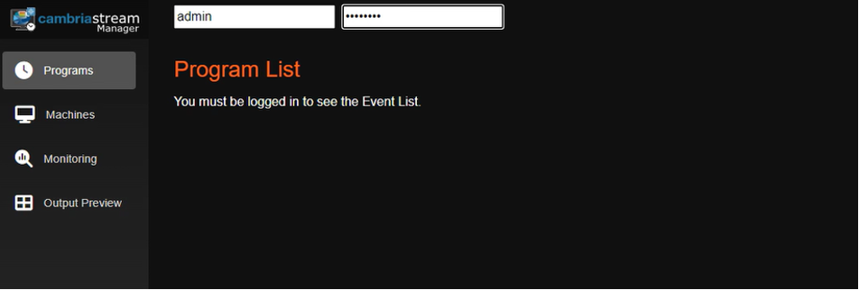

# Cambria Stream 5.4
**Linux Help Documentation**


## Document History

| Version | Date       | Description                                                          |
|---------|-----------|----------------------------------------------------------------------|
| 5.3.0	| 05/21/2024	| Updated for release version build 5.3.0.19481 (Linux, Windows)|
| 5.4.0	| 12/27/2024	| Updated for release version 5.4.0.22610 (Linux)|

 
**Download the online version of this document for the latest information and latest files. Always download the latest files**

## 1.  Introduction

This document contains information to help with installation, focused testing, tips. 
**Do not move forward with the installation process if you do not agree with the End User License Agreement (EULA) for our products. You can download and read the EULA for Cambria Stream Manager  and Cambria Stream from the links below:**

Cambria Stream Manager | Cambria Stream | Cambria License Manager (EULA):

[CHANGE THESE TO LINKS TO DOCUMENTS ON DOC SITE]
  
[EULA_Cambria_License_Manager.pdf](https://www.dropbox.com/s/1wg7ee7a59kzi8h/EULA_Cambria_License_Manager.pdf?dl=0)

[EULA_Cambria_Stream_Manager.pdf](https://www.dropbox.com/s/cdttx4flzb7nxp1/EULA_Cambria_Stream_Manager.pdf?dl=0)

[EULA_Cambria_Stream.pdf](https://www.dropbox.com/s/fla62h4o9kuqn7k/EULA_Cambria_Stream.pdf?dl=0)

:::note

!Important! Before You Begin
PDF documents have a copy/paste issue. For best results, download this document and any referenced PDF documents in this guide and open them in a PDF viewer such as Adobe Acrobat.

For commands that are in more than one line, copy each line one by one and check that the copied command matches the one in the document.

:::

### 1.1 Cambria Stream Version 5.4.0 | Linux Help Documentation 5.4.0

The Cambria Stream build that includes support for Linux is now in version 5.4.0. Not all the functionality in the Windows version is expected to work on Linux. 

There are three Capella applications that can be installed with this guide:

1. Cambria Stream Manager (the management application for streaming nodes)
2. Cambria Stream (the standalone streaming node(s))
3. Cambria License Manager (the application used to license the above products)

:::note

!Important! Cambria Stream Manager and Cambria Stream Restrictions and Information
-	Cambria Stream Manager and Cambria Stream cannot be installed on the same host machine
-	If enabled in your Cambria Stream Manager license, Cambria Stream Manager can also serve as a live streaming / encoding machine

:::

### 1.2 Requirements/Prerequisites

The following section provides instructions / information on what needs to be installed in the host system before installing Cambria Stream Manager and Cambria Stream. **Run the steps below for every machine that will host either Cambria Stream Manager or Cambria Stream.**

#### 1.2.1 Install Docker Engine and Docker Compose Plugin

This guide makes use of Docker Engine and the Docker Compose plugin. There are two options available for installing these two tools in your host system:

**Option 1: If you have Ubuntu 24.04 / apt-get**

`curl -Lo installDockerOnUbuntu20_04.sh "https://www.dropbox.com/scl/fi/kgrqut0pn2fbmf4a871h0/installDockerOnUbuntu.sh?rlkey=qqgrfmtxf1yvofcp8o7pcqtww"`<br />
`sudo chmod +x ./installDockerOnUbuntu.sh`<br />
`./installDockerOnUbuntu.sh`<br />
`sudo rm ./installDockerOnUbuntu.sh`<br />

**Option 2: If using a different Linux distribution without apt-get**

`https://docs.docker.com/engine/install/ `

#### 1.2.2. (Optional) Install Nvidia Related Components

**If you do not plan to run Cambria Stream with GPU capabilities, move to section 1.2.3. Firewall Ports for Cambria Stream Manager and Cambria Stream**. For GPU workflows, your host system will need to have a compatible Nvidia driver and the Nvidia Container Toolkit installed. 

##### 1.2.2.1. Nvidia Driver + Nvidia Container Toolkit

There are two options to install the NVIDIA driver and toolkit:

**Option 1: if you have Ubuntu 24.04 / apt-get:**

`curl -Lo installNvidiaDriverAndToolkit.sh "https://www.dropbox.com/scl/fi/hm6ehwi2wkrqamkgi9ehr/installNvidiaDriverAndToolkit.sh?rlkey=asbgrm05oa8i7h9zwqhefsb81"`<br />
`sudo chmod +x ./installNvidiaDriverAndToolkit.sh`<br />
`./installNvidiaDriverAndToolkit.sh`<br />
`sudo rm ./installNvidiaDriverAndToolkit.sh`<br />

Restart your machine after installation

**Option 2: if using different Linux distribution without apt-get**

Nvidia Driver: `https://docs.nvidia.com/datacenter/tesla/tesla-installation-notes/index.html`<br />
Nvidia Toolkit: `https://docs.nvidia.com/datacenter/cloud-native/container-toolkit/latest/install-guide.html`

**Restart your machine after installation**

#### 1.2.3. Firewall Ports for Cambria Stream Manager and Cambria Stream

The following ports are exposed by default in the docker configuration for Cambria Stream Manager and Cambria Stream. It is recommended that your firewalls expose these ports in order to give access to external systems (Eg. RTP Cambria Stream ingest, access Cambria Stream WebUI outside of the machine, etc).

**Note:** the UDP and TCP ports can be modified to your needs. The ones mentioned are our default recommendation.

| Port(s)     	| Traffic	| Description | 
|----------------|------------|-------------------|
| 8758	| Inbound	| Cambria Stream Manager HTTPS REST API Port |
| 8171	| Inbound	| Cambria Stream Manager HTTPS WebUI Port |
| 8678	| Inbound	| Cambria License Manager Web Server (Cambria Stream Manager) |
| 8481	| Inbound	| Cambria License Manager WebUI Port |
| 9400	| Inbound	| Prometheus System Exporter for Cambria Stream Manager |
| 8579	| Inbound	| Cambria Stream Web Server |
| 8281	| Inbound	| Cambria Stream ABC Web UI Port |
| 8381	| Inbound	| Cambria AdBreak Control Web UI Ports |
| 8580-8639	| Inbound	| Cambria Stream REST API Ports 
| 5000 <br /> 8646 <br /> 50000-50009/udp | 	Inbound	| WebRTC (Server + UDP ports)| 
| 5004-5104/udp <br /> 8000-8100/udp |	Both | For UDP streaming (Eg. 5004 for RTP or 8000 for SRT)| 
| 1935-2045	| Both	| For TCP streaming (Eg. 1935 for RTMP) |
| 8777	| Inbound	| Default port for HLS/TS (Push) but any TCP port can be used |
| 2077 | 	Outbound	| For Zixi streaming (Pull) | 
| 2088	| Outbound	| For Zixi streaming (Push) |

Also, for Cambria licensing, any Cambria Stream Manager and Cambria Stream machine requires that at least the following domains be exposed in your firewall (both inbound and outbound traffic):

| Domain	| Port(s)| 	Traffic |
|-------------|-----------|------------|
| api.cryptlex.com	| 443	| Outbound |
| cryptlexapi.capellasystems.net | 	443 | Outbound |
| cpfs.capellasystems.net	| 8483	| Outbound|


## 2. Installation: Cambria Stream Manager | Cambria Stream

This section contains instructions for Cambria Stream Manager installation and also post install verification.

### 2.1. Cambria Stream Manager + Cambria Stream Install

Download the sample docker compose yaml file:


!Warning! Using Cambria Stream Bundled in Cambria Stream Manager
By default, Cambria Stream Manager and Cambria Stream come bundled together. If you plan to use the Cambria Stream that comes bundled with Cambria Stream Manager, make sure to use a strong machine to handle the Cambria Stream workflows. 
:::

**Option 1:** Nvidia drivers and toolkit installed

`curl -Lo docker-compose-cambria-stream-manager.yaml "https://www.dropbox.com/scl/fi/vgnw1wszjcehfchvhjg1n/docker-compose-cambria-stream-manager.yaml?rlkey=pg3qt30nn3091jzj635d9ilvn"`

**Option 2:** No Nvidia drivers / toolkit installed

`curl -Lo docker-compose-cambria-stream-manager.yaml "https://www.dropbox.com/scl/fi/lsxikn1q2pr94o6zbj0wm/docker-compose-cambria-stream-manager-no-nvidia.yaml?rlkey=yfwxvdt2egvqfhpqv0hkzll25"`


Edit the following lines in your favorite text editor:

<span style={{ color: 'blue' }}>Blue:</span> values in blue will be given to you by Capella. These values in the chart below are for the release version.
<span style={{ color: 'red' }}>Red:</span> values in red are proprietary values that need to be changed based on your specific environment

**Note:** the table below only contains the lines in the yaml that need to be reviewed / edited. This is not the full yaml file.

| docker-compose-cambria-stream-manager.yaml |Description |
|------------------------|----------------------|
**name:** cambriastreammanager <br />**services:** <br /> &nbsp;&nbsp; **cpstreammanager:** <br /> &nbsp;&nbsp;&nbsp;&nbsp; **image:** <span style={{ color: 'blue' }}>public.ecr.aws/capella-systems/cambriastreammanager_5_4:release_5.4.0.22610 </span> | The Cambria Stream Manager version should already be provided for you. If you are given a different version than the one provided (Eg. test version), modify this value. 
|   **logging:** <br /> &nbsp;&nbsp;**options:** <br /> &nbsp;&nbsp;&nbsp;&nbsp;**max-size:** <span style={{ color: 'blue' }}>‘500m’</span> | Cambria stream manager writes logging information to the console. By default, this gets stored in a log file in the Docker container. By default, the max size of this log file has been set to 500 MB, but this size limit can be changed to a size that is appropriate for your environment (Eg. 1g, 100k, 900m) |
| **deploy:** <br />  &nbsp;&nbsp;**resources:** <br />  &nbsp;&nbsp; &nbsp;&nbsp;**reservations:** <br />  &nbsp;&nbsp; &nbsp;&nbsp;**devices:** <br />  &nbsp;&nbsp; &nbsp;&nbsp; &nbsp;&nbsp;... <br />  &nbsp;&nbsp; &nbsp;&nbsp; &nbsp;&nbsp;**count:** <span style={{ color: 'blue' }}>all </span><br /> &nbsp;&nbsp; &nbsp;&nbsp; &nbsp;&nbsp; ... | Note: this part only applies to Option 1: Nvidia drivers and toolkit installed. <br /> <br /> This is the number of gpu devices to use. Change this value to 0 if you do not have nvidia cards on your host machine. |
| **Ports:** <br /> &nbsp;&nbsp;... <br /> &nbsp;&nbsp;- <span style={{ color: 'blue' }}>5004-5104:5004-5104/udp</span> |These are some UDP ports for use with RTP. These can be modified as needed or removed completely if not planning to use RTP. You can also use these ports for SRT.|
|      - <span style={{ color: 'blue' }}>8000-8100:8000-8100/udp</span> | These are some UDP ports for use with SRT. These can be modified as needed or removed completely if not planning to use SRT. You can also use these ports for RTP. |
| - <span style={{ color: 'blue' }}>1935-2045:1935-2045</span> | These are some TCP ports for use with RTMP. These can be modified as needed or removed completely if not planning to use RTMP. |
| ... <br /> - <span style={{ color: 'blue' }}>50000-50009:50000-50009/udp</span> | These are the UDP ports needed for Web RTC. These ports are configurable to your needs. If you update these values, make sure to also update the environment variables **WEBRTC_PortRangeBegin** and **WEBRTC_PortRangeEnd** |
| ...  <br /> **environment:** <br /> &nbsp;&nbsp;... <br /> &nbsp;&nbsp;- **cpPostgresHost**=<span style={{ color: 'blue' }}>mypg</span> | The ip address / hostname of the postgres database for Cambria Stream Manager. This must match the postgres service name. By default, this is **mypg.** |
| - **cpPostgresPassword**=<span style={{ color: 'red' }}>postgrespassword1234</span> | The password for your postgres database |
| - **cpWebUIUsers**=<span style={{ color: 'red' }}>”admin,defaultWebUIUser,RZvSSd3ffsElsCEEe9”</span> | This is the login credentials for Cambria Stream Manager’s Web UI. Each user is listed in the form: <br /><br />role,username,password <br /> <br />Allowed roles: <br /> **admin** - can view/create/edit/delete anything on the WebUI. Can also create/manage WebUI users. <br />**superuser** - can view/create/edit/delete anything on the WebUI. <br /> **user** - can only view anything on the WebUI. <br /> <br />For multiple users, separate each by a comma. <br />Example: <br />admin,admin,changethispassword1234,user,guest,password123 |
| - **LicenseKey**=<span style={{ color: 'red' }}>XXXXXX-XXXXXX-XXXXXX-XXXXXX-XXXXXX-XXXXXX</span> | The Cambria Stream Manager product license. The Capella team should have provided this value for you. Replace the “XXXXXX-XXXXXX-XXXXXX-XXXXXX-XXXXXX-XXXXXX” with the license key. |
| **WEBRTC_HOST_OVERRIDE_TO**=<span style={{ color: 'blue' }}>SERVER_REFLEXIVE</span> | If running Cambria Stream and Stream Manager in an intranet / locally, change this value to the IP of the host machine. Usually, this is the first value from the command: <br />  <br />hostname -I <br /> <br /> For all other cases, leave this value as SERVER_REFLEXIVE. This means that the public ip address will be retrieved and used. |
| - **WEBRTC_PortRangeBegin**=<span style={{ color: 'blue' }}>50000</span> <br /> - **WEBRTC_PortRangeEnd**=<span style={{ color: 'blue' }}>50009</span> | If you modified the WebRTC UDP ports, you will also need to change these two values accordingly. |
| **mypg:** <br /> &nbsp;&nbsp;... <br /> &nbsp;&nbsp;**environment:** <br /> - &nbsp;&nbsp;&nbsp;&nbsp;**POSTGRES_PASSWORD**=<span style={{ color: 'red' }}>postgrespassword1234</span> | The password for your postgres database. Match this password to the **cpPostgresPassword** above. |
| **volumes:** <br /> &nbsp;&nbsp;- <span style={{ color: 'blue' }}>/var/capella/postgresql16/data:/var/lib/postgresql/data </span>| This volume will be used to preserve the postgres database data for Cambria Stream Manager. If you don’t want this data to persist, remove this volume from this file.| 

Execute the Docker Compose command to run the container:

`sudo docker compose -f ./docker-compose-cambria-stream-manager.yaml up -d`

The container created will install Cambria Stream Manager, Cambria License Manager, and the Cambria Stream Manager WebUI.

It may take a few minutes for the applications to install correctly and the license(s) to activate and sync. Therefore, <span style={{ color: 'red' }}>**wait a few minutes before moving on to the next step.**</span>

### 2.2. Cambria Stream Install

<span style={{ color: 'red' }}>Skip this section if you installed Cambria Stream Manager using the steps above or if you do not plan to install Cambria Stream on a separate machine.</span> The steps in this section are for installing Cambria Stream as a standalone application. Download our template docker compose yaml file.

**Option 1:** Nvidia drivers and toolkit installed

`curl -Lo docker-compose-cambria-stream.yaml "https://www.dropbox.com/scl/fi/kurnw8nq2alwakn5itqss/docker-compose-cambria-stream.yaml?rlkey=gg41anl71ak6lqhvkt254kg9h"`

**Option 2:** No Nvidia drivers / toolkit installed

`curl -Lo docker-compose-cambria-stream.yaml "https://www.dropbox.com/scl/fi/i74fqckijblcsr4l38c4w/docker-compose-cambria-stream-no-nvidia.yaml?rlkey=ni3ntqbohllk2ry9rol4jq6nr"`

Edit the following lines in your favorite text editor:

<span style={{ color: 'blue' }}>Blue:</span> values in blue will be given to you by Capella. These values in the chart below are for the release version. <br />
<span style={{ color: 'red' }}>Red:</span> values in red are proprietary values that need to be changed based on your specific environment

Note: the table below only contains the lines in the yaml that need to be reviewed / edited. This is not the full yaml file.

| docker-compose-cambria-stream.yaml |Description |
|------------------------|----------------------|
|**name:** cambriastream <br />**services:**<br />&nbsp;&nbsp;**cpstream:**<br />&nbsp;&nbsp;&nbsp;&nbsp;**image:** <span style={{ color: 'blue' }}>public.ecr.aws/capella-systems/cambriastream_5_4:release_5.4.0.22610 </span> | The Cambria Stream version should already be provided for you. If you are given a different version than the one provided (Eg. test version), modify this value.<br /><br /> **Note:** if you plan to use our auto ad break (OCR) feature, add _ocr to the end of the build number (Eg. dev_5.4.0.20655_ocr)|
|**logging:**<br /> &nbsp;&nbsp;**options:** <br />&nbsp;&nbsp;&nbsp;&nbsp;**max-size:** <span style={{ color: 'blue' }}>‘500m’</span> | Cambria stream writes logging information to the console. By default, this gets stored in a log file in the Docker container. By default, the max size of this log file has been set to 500 MB, but this size limit can be changed to a size that is appropriate for your environment (Eg. 1g, 100k, 900m) |
| **deploy:**<br />&nbsp;&nbsp;**resources:**<br /> &nbsp;&nbsp;&nbsp;&nbsp;**reservations:** <br /> &nbsp;&nbsp;&nbsp;&nbsp;&nbsp;&nbsp;**devices: **<br />&nbsp;&nbsp;&nbsp;&nbsp;&nbsp;&nbsp;&nbsp;&nbsp;... <br />&nbsp;&nbsp;&nbsp;&nbsp;&nbsp;&nbsp;&nbsp;&nbsp;**count:** <span style={{ color: 'blue' }}>all</span> | **Note:** this part only applies to **Option 1: Nvidia drivers and toolkit installed** <br /> <br />This is the number of gpu devices to use. Change this value to 0 if you do not have nvidia cards on your host machine. |
| **ports:** <br />&nbsp;&nbsp; ...<br /> &nbsp;&nbsp;- <span style={{ color: 'blue' }}>50000-50009:50000-50009/udp</span> | These are the UDP ports needed for Web RTC. These ports are configurable to your needs. If you update these values, make sure to also update the environment variables WEBRTC_PortRangeBegin and WEBRTC_PortRangeEnd|
|&nbsp;&nbsp;- <span style={{ color: 'blue' }}>5004-5104:5004-5104/udp</span>| These are some UDP ports for use with RTP. These can be modified as needed or removed completely if not planning to use RTP. You can also use these ports for SRT.|
| &nbsp;&nbsp;- <span style={{ color: 'blue' }}>8000-8100:8000-8100/udp </span>| These are some UDP ports for use with SRT. These can be modified as needed or removed completely if not planning to use SRT. You can also use these ports for RTP. |
| &nbsp;&nbsp;- <span style={{ color: 'blue' }}>1935-2045:1935-2045 </span> | These are some TCP ports for use with RTMP. These can be modified as needed or removed completely if not planning to use RTMP. |
| **environment:**<br />- **WEBRTC_HOST_OVERRIDE_TO**=<span style={{ color: 'blue' }}>SERVER_REFLEXIVE</span> | If running Cambria Stream and Stream Manager in an intranet / locally, change this value to the IP of the host machine. Usually, this is the first value from the command: <br /> <br /> hostname -I <br /> <br />For all other cases, leave this value as **SERVER_REFLEXIVE**. This means that the public ip address will be retrieved and used.|
| ... <br /> - **WEBRTC_PortRangeBegin**=<span style={{ color: 'blue' }}>50000<br /></span> - **WEBRTC_PortRangeEnd**=<span style={{ color: 'blue' }}>50009 </span>| If you modified the WebRTC UDP ports, you will also need to change these two values accordingly. |
|-**cpWebUIUsers**=<span style={{ color: 'red' }}>"admin,defaultWebUIUser,RZvSSd3ffsElsCEEe9”</span> | This is the login credentials for Cambria Stream Manager’s Web UI. Each user is listed in the form:<br /> <br />role,username,password<br /> <br /> Allowed roles:<br /> **admin** - can view/create/edit/delete anything on the WebUI. Can also create/manage WebUI users.<br />**superuser** - can view/create/edit/delete anything on the WebUI.<br /> **user** - can only view anything on the WebUI.<br /> <br /> For multiple users, separate each by a comma. <br /> Example:<br /> <br /> admin,admin,changethispassword1234,user,guest,password123 | 
|- **LicenseKey**=<span style={{ color: 'red' }}>YYYYYY-YYYYYY-YYYYYY-YYYYYY-YYYYYY-YYYYYY</span> | The Cambria Stream product license. The Capella team should have provided this value for you. Replace the “YYYYYY-YYYYYY-YYYYYY-YYYYYY-YYYYYY-YYYYYY” with the corresponding license key.|
| **#volumes:** <br /> &nbsp;&nbsp;# - `<host-path>`:`<container-path>` (Eg. /mnt/x:/var/temp) | To use the file features of Cambria Stream, you will need to configure paths from your host system to your container. See section **3.2. Working with Cambria Stream File Features** for more information. <br /> <br />In this case, remove the ‘#’ from volumes and add a new path for each host location you want to read from / write to.|

Execute the Docker Compose command to run the container:

`sudo docker compose -f ./docker-compose-cambria-stream.yaml up -d`

The container created will install Cambria Stream and Cambria License Manager.

It may take a few minutes for the applications to install correctly and the license(s) to activate and sync. Therefore, <span style={{ color: 'red' }}>**wait a few minutes before moving on to the next step.**</span>

***Troubleshoot***

If you run into these issues while using docker-compose to install Cambria Stream, run these steps:

**Error:** NVIDIA_SMI has failed because it couldn’t communicate with the NVIDIA driver. Make sure that the latest NVIDIA driver is installed and running

-	Make sure to install the latest nvidia-driver-535-server driver on your host machine
-	Make sure to reboot the host machine if a driver has been installed / uninstalled

**Error:** Error response from daemon: could not select driver “nvidia” with capabilities: [[gpu]]

-	Make sure the nvidia-container-toolkit is installed properly on your host machine
-	Make sure to reboot the host machine if any nvidia driver / toolkit was installed


### 2.3. (Optional) Cambria AdBreak Control Install

By default, Cambria Stream already comes with its own Cambria AdBreak control. In cases where you want to use Cambria AdBreak Control for multiple Cambria Stream programs and/or you want to have Cambria AdBreak control separately from Cambria Stream / Cambria Stream Manager, we provide a standalone application you can install on any machine.

Follow these instructions to install Cambria AdBreak Control in your system. Download our template docker compose yaml file.

**Note:** you must have a license with Cambria AdBreak control enabled in order to use ad insertion features

`curl -Lo  docker-compose-cambria-adbreakcontrol.yaml "https://www.dropbox.com/scl/fi/49dds4o1p1z2ibpqv57vs/docker-compose-cambria-adbreakcontrol.yaml?rlkey=nf5l4jrbxcl5k2pxd18kifvkx"`

Edit the following lines in your favorite text editor:

<span style={{ color: 'blue' }}>Blue:</span> values in blue will be given to you by Capella. These values in the chart below are for the release version.<br />
<span style={{ color: 'red' }}>Red:</span> values in red are proprietary values that need to be changed based on your specific environment

**Note:** the table below only contains the lines in the yaml that need to be reviewed / edited. This is not the full yaml file.

| docker-compose-cambria-adbreakcontrol.yaml |Description |
|------------------------|----------------------|
| **name:** cambriaadbreakcontrol<br />**services:**<br />&nbsp;&nbsp;**cpadbreakcontrol:**<br />&nbsp;&nbsp;&nbsp;&nbsp;**image:** <span style={{ color: 'blue' }}>public.ecr.aws/capella-systems/cambriaadbreakcontrol_5_4:release_5.4.0.22610 </span>| The Cambria AdBreak Control version should already be provided for you. If you are given a different version than the one provided (Eg. test version), modify this value.|
| logging:<br />&nbsp;&nbsp;**options:**<br /> &nbsp;&nbsp;&nbsp;&nbsp;**max-size:** <span style={{ color: 'blue' }}>‘500m’</span> | Cambria AdBreak Control writes logging information to the console. By default, this gets stored in a log file in the Docker container. By default, the max size of this log file has been set to 500 MB, but this size limit can be changed to a size that is appropriate for your environment (Eg. 1g, 100k, 900m) |
|   **ports:**<br />&nbsp;&nbsp;…<br />&nbsp;&nbsp;-	<span style={{ color: 'blue' }}>8180-8181</span>:8180-8181<br />&nbsp;&nbsp;-	<span style={{ color: 'blue' }}>8678</span>:8678<br />&nbsp;&nbsp;-	<span style={{ color: 'blue' }}>8481</span>:8481 | If installing this application in a machine that already has a Capella product, change these highlighted ports to any ports that are not already taken. This is because other Capella products might already be using these ports. |
| **environment:**<br />&nbsp;&nbsp;- cpStreamManagerIPAddress=<span style={{ color: 'red' }}>127.0.0.1</span> | This should be the public / intranet network IP address of the Cambria Stream Manager machine that has the programs you want to have ABC Web UI control for. If hosted outside of intranet, use SERVER_REFLEXIVE. If installed on a separate machine from Cambria Stream Manager, set the IP address of the Cambria Stream Manager machine instead.|
| - cpWebUIUsers=<span style={{ color: 'red' }}>”admin,defaultWebUIUser,RZvSSd3ffsElsCEEe9” </span>| This is the login credentials for Cambria Stream Manager’s Web UI. Each user is listed in the form: <br /><br />role,username,password <br /> <br />Allowed roles: <br /> **admin** - can view/create/edit/delete anything on the WebUI. Can also create/manage WebUI users. <br />**superuser** - can view/create/edit/delete anything on the WebUI. <br /> **user** - can only view anything on the WebUI. <br /> <br />For multiple users, separate each by a comma. <br />Example: <br />admin,admin,changethispassword1234,user,guest,password123 |
|- LicenseKey=<span style={{ color: 'red' }}>YYYYYY-YYYYYY-YYYYYY-YYYYYY-YYYYYY-YYYYYY</span> | The Cambria AdBreak Control product license. The Capella team should have provided this value for you. Replace the “XXXXXX-XXXXXX-XXXXXX-XXXXXX-XXXXXX-XXXXXX” with the corresponding license key. |
| **<span style={{ color: 'blue' }}>#</span>volumes:**<br />&nbsp;&nbsp;# - `<host-path>`:`<container-path>` (Eg. /mnt/x:/var/temp)<br />&nbsp;&nbsp;... | To use the file features of Cambria AdBreak Control, you will need to configure paths from your host system to your container. See section **3.2. Working with Cambria Stream File Features **for more information. <br /> In this case, remove the ‘#’ from volumes and add a new path for each host location you want to read from / write to. |

Execute the Docker Compose command to run the container:

`sudo docker compose -f ./docker-compose-cambria-adbreakcontrol.yaml up -d`

The container created will install Cambria AdBreak Control and Cambria License Manager.

It may take a few minutes for the applications to install correctly and the license(s) to activate and sync. Therefore, <span style={{ color: 'red' }}>**wait a few minutes before moving on to the next step.**</span>

### 2.4. Verify Cambria Stream Manager | Cambria Stream Installation

#### 2.4.1. Verify Cambria Stream Manager Installation

1\. Verify that the Cambria Stream Manager Web UI is running.

-	You will need to get the IP address of the host where your Cambria Stream Manager container is running on.
-	In a web browser, go to the address: https://`<Host IP Address>`:8171
-	Log in with the Web UI credentials you configured in your docker-compose-cambria-stream-manager.yaml
-	You should see an empty list of programs, no errors like invalid license or database not running. 

2\. Verify that the Cambria Stream Manager REST API is accessible

-	You will need to get the IP address of the host where your Cambria Stream Manager container is running on.
-	In a web browser, go to the address: https://`<Host IP Address>`:8758/CambriaLM/v1/SystemInfo. Alternatively, you can run a GET request to that address. Here is an example:

`curl -k -X GET https://<Host IP Address>:8758/CambriaLM/v1/SystemInfo`
	
You should see an XML output with information such as the version number of Cambria Stream Manager


#### 2.4.2. Verify Cambria Stream Installation

1\. Verify that the Cambria Stream server is running

-	You will need to get the IP address of the host where your Cambria Stream container is running on.
-	In a web browser, go to the address: 
https://`<Host IP Address>`:8579/CambriaLivePackager/v1/SystemInfo. Alternatively, you can run a GET request to that address. Here is an example:

`curl -k -X GET https://<Host IP Address>:8579/CambriaLivePackager/v1/SystemInfo`
	
You should see an XML output with information such as the version number of Cambria Stream.
This XML should also show if there is a valid license detected.


#### 2.4.3. Verify Cambria AdBreak Control Installation (If Installed)

1\. Verify that the Cambria AdBreak Control Web UI is running:

-	You will need to get the IP address of the host where your Cambria AdBreak Control container is running on.
-	In a web browser, go to the address: https://`<Host IP Address>`:8381
-	Log in with the Web UI credentials you configured in your docker-compose-cambria-adbreakcontrol.yaml
-	You should see an empty UI. When you start running programs, you will see AdBreak Control instances here

## 3. Cambria Stream User Guide

### 3.1. Prerequisite: Configuration for Cambria Stream Manager | Cambria Stream

Before using Cambria Stream, configure the following in the Docker environment:

#### 3.1.1. Verify Cambria Stream Instances are Connected

1\. Open the Web UI (https://`<Your Docker Host IP address>`:8171) and log in with one of the users you configured in the **docker-compose-stream-manager.yaml**:

 

2\. Select the **Machines** tab and connect your Cambria Stream Machine by selecting the machine name, right-clicking on the machine, and selecting **Activate**. The Cambria Stream machine should show Online. This means that the machine can be used by Cambria Stream Manager. 

If no machine shows up on the **Machines** tab and/or you have more Cambria Stream machines to connect, click on the **Add** button for each Cambria Stream machine to add and use the IP address of the machine. On systems like Ubuntu, you can get the IP address with this command:

`hostname -I`

There may be more than one IP address on this list. The first IP address should work (usually this is the address of the host machine). If you cannot add the Cambria Stream machine, verify that Cambria Stream is running and that the correct ports are open in your firewall.

### 3.2. Working with Cambria Stream File Features

Cambria Stream has a few features that allow users to use files as sources, ad slates, failover sources, etc. There are also features that allow users to write to files in the filesystem. **Important:** these steps must be applied to each Cambria Stream / Stream Manager machine that will use the file features.

#### 3.2.1. Configuring Docker Volumes

In order to use these features properly, users need to configure **volumes** in the corresponding **docker-compose-cambria-xxxx.yaml** configuration file under the volumes attribute:

```...
volumes:
  - <host-path>:<container-path> # (Eg. /mnt/x:/var/temp)
...
```

Configure one of these lines for every host location for reading and/or writing. This is just one way of using volumes for this purpose (more information here: [https://docs.docker.com/storage/](https://docs.docker.com/storage/)).

You need to make sure the host path is created. If the host path has not been created, create it using this command:

` sudo mkdir -p <host-path>`

You will also need to set the correct permissions on your host system for the host paths configured. These permissions get propagated to the container when it is created. To give full permissions to a drive, run the following command:

`sudo chmod -R 777 <host-path>`

#### 3.2.2. (Optional) Using Windows Shared Paths / Network Share Paths

In certain cases where the file paths needed for Cambria Stream file features are to a Windows and/or network location, you will need to map the Windows paths to Linux paths by “mounting” the Windows shared location to your Linux machine. 

Execute the following commands in order to mount Windows shared locations on a Linux machine. Note, you may be required to provide the root account credentials when prompted. 

`sudo apt install smbclient`<br />
`sudo apt install cifs-utils`

For every Windows shared location to mount, execute the following commands. Note, You will also be prompted to enter your Windows shared location password for each location mounted.

`sudo mkdir /mnt/[drive letter]` <br />
`sudo mount -t cifs -o username=[username] [My Windows Path] /mnt/[drive letter]`

**Note:** Linux does not automatically save these mounted locations upon reboot. Therefore, you will need to repeat the mounting process every time that you reboot the Linux machine. If you want to preserve the mounted paths, you will want to set up mounting on boot. See [https://linuxconfig.org/how-to-mount-a-samba-shared-directory-at-boot](https://linuxconfig.org/how-to-mount-a-samba-shared-directory-at-boot)

#### 3.2.3. Apply the Volumes to the Cambria Stream Container(s)

In order to use the volumes configured in this section, the Cambria Stream container needs to be created (if not already done so) or recreated (if the Cambria Stream container is running). Run this command for both cases:

**Option 1: **For Cambria Stream in Cambria Stream Manager Machine:

`sudo docker compose -f ./docker-compose-cambria-stream-manager.yaml up -d --force-recreate`

**Option 2:** For Cambria Stream standalone:

`sudo docker compose -f ./docker-compose-cambria-stream.yaml up -d --force-recreate`

### 3.3. Using / Testing Cambria Stream

For information on how to configure, run, and use Cambria Stream and Cambria Stream Manager, see the following:

[CHANGE THIS TO DOCUSAURUS LINK]
https://www.dropbox.com/scl/fi/g5sutb23eijb88l18ntno/Cambria_Stream_Manager_and_Cambria_Stream_5_4_0_User_Guide.pdf?rlkey=w4joarnl7sf16bnsf99jtzpcm&st=g5o4p8uj&dl=1


## 4. Updates / Upgrades: Cambria Stream | Cambria Stream Manager

This section contains information on how to upgrade Cambria Stream and/or Cambria Stream Manager.

### 4.1 Upgrade Cambria Stream Manager

1\. Update the docker-compose-stream-manager.yaml in your favorite document editor. This can be to update the Cambria Stream Manager version number, license key, etc.

2\. Run this command to update the running container (make sure you are in the same directory as the docker-compose-cambria-stream-manager.yaml file)

`sudo docker compose -f ./docker-compose-cambria-stream-manager.yaml up -d --force-recreate`

### 4.2. Upgrade Cambria Stream

1\. Update the docker-compose-stream.yaml in your favorite document editor. This can be to update the Cambria Stream version number, license key, etc.

2\. Run this command to update the running container (make sure you are in the same directory as the docker-compose-cambria-stream.yaml file)

`sudo docker compose -f ./docker-compose-cambria-stream.yaml up -d --force-recreate`

### 4.3. Upgrade Cambria AdBreak Control

1\. Update the docker-compose-cambria-adbreakcontrol.yaml in your favorite document editor. This can be to update the Cambria AdBreak Control version number, license key, etc.

2\. Run this command to update the running container (make sure you are in the same directory as the docker-compose-cambria-adbreakcontrol.yaml file)

`sudo docker compose -f ./docker-compose-cambria-adbreakcontrol.yaml up -d --force-recreate`

## 5. Uninstall: Cambria Stream | Cambria Stream Manager

To uninstall Cambria Stream Manager, tear down the running container by running the following command (make sure you are in the same directory as the docker-compose-cambria-stream-manager.yaml file):

`sudo docker compose -f ./docker-compose-cambria-stream-manager.yaml down`

To uninstall Cambria Stream, tear down the running container by running the following command (make sure you are in the same directory as the docker-compose-cambria-stream.yaml file):

`sudo docker compose -f ./docker-compose-cambria-stream.yaml down`

To uninstall Cambria AdBreak Control, tear down the running container by running the following command (make sure you are in the same directory as the docker-compose-cambria-adbreakcontrol.yaml file):

`sudo docker compose -f ./docker-compose-cambria-adbreakcontrol.yaml down`

Note that the above commands only remove the container from the system. The Docker images tied to the containers are still present. If you want to remove the images as well, run the following commands for each of the images you want to delete (**make sure that no container is using those images still**):

Cambria Stream Manager:

`sudo docker images --format "{{.Repository}}:{{.Tag}}" | grep -E "streammanager" | xargs -r sudo docker rmi -f`

Cambria Stream:

`sudo docker images --format "{{.Repository}}:{{.Tag}}" | grep -E "stream" | xargs -r sudo docker rmi -f`

Cambria Adbreak Control:

`sudo docker images --format "{{.Repository}}:{{.Tag}}" | grep -E "adbreakcontrol" | xargs -r sudo docker rmi -f`

Postgres:

`sudo docker images --format "{{.Repository}}:{{.Tag}}" | grep -E "postgres" | xargs -r sudo docker rmi -f`

### 5.1. (Optional) Remove Postgres Database Files

If you would also like to wipe your postgres database files, run the following command:

**Warning:** this will delete your postgres data for any application using this specific postgres database. If you would like to keep this data, make sure to back it up before deleting.

`sudo rm -rf /var/capella/postgresql/data`

## 6. Retrieving Cambria Logs

If there are issues with one or more Cambria Stream / related products, follow these steps to retrieve Cambria logs from the failing application / system:

1\. Log in (Eg. SSH) to the machine that has a problem. You will run commands in a terminal window.

2\. Unless the Capella Support team has asked for specific logs, identify the application that seems to be running into problems

3\. If being asked for Cambria Stream logs, you will need to find out what type of setup you have on the machine:

-	Check if this command returns a JSON output. If it does, it means that you are running Cambria Stream with Cambria Stream Manager on the same machine:

`sudo docker inspect cpstreammanager`

-	Skip this step if the previous step worked. Check if this command returns a JSON output. If it does, it means that you are running Cambria Stream standalone (without Cambria Stream Manager installed on the machine):

`sudo docker inspect cpstream`

4\. Run one or more of the following commands depending on which application to retrieve logs from:

**Cambria Stream:**

**Option 1:** If Cambria Stream is installed on the machine without Cambria Stream Manager:

`sudo docker cp cpstream:/opt/capella/CambriaStream/Logs ./CambriaStrmLogs`

**Option 2:** If Cambria Stream is installed on the same machine as Cambria Stream Manager:

`sudo docker cp cpstreammanager:/opt/capella/CambriaStream/Logs ./CambriaStrmLogs`

**Note:** if you are unsure about 

**Cambria Stream Manager:**

`sudo docker cp cpstreammanager:/opt/capella/CambriaStreamManager/Logs ./CambriaStrmManLogs`

**Cambria AdBreak Control:**

`sudo docker cp cpadbreakcontrolr:/opt/capella/CambriaAdBreakControl/Logs ./CambriaCSABCLogs`

**Cambria License Manager (Cambria Stream):**

`sudo docker cp cpstream:/opt/capella/CambriaLicenseManager/Logs ./CambriaStrmLicLogs`

**Cambria License Manager (Cambria Stream Manager):**

`sudo docker cp cpstreammanager:/opt/capella/CambriaLicenseManager/Logs ./CambriaStrmManLicLogs`

**Cambria License Manager (Cambria AdBreak Control):**

`sudo docker cp cpadbreakcontrol:/opt/capella/CambriaLicenseManager/Logs ./CambriaCSABCLicLogs`

## 7. Quick Reference: Helpful Commands/Info for After Installation

This section provides helpful commands and other information that may be useful after the installation process such as how to get the WebUI address, what ports are available to use for incoming sources, etc.

**Cambria Stream Manager WebUI**

`https://<host-machine-ip>:8171`

**Cambria Stream Manager REST API**

`https://<host-machine-ip>:8758/CambriaLM/v1/<endpoint>`

The REST API url should look similar to this:

`https://45.79.231.137:8758/CambriaLM/v1/Events`

**Cambria Stream ABC WebUI**

To access the WebUI, you will need to know the port of the program that you want to run Cambria Stream ABC for. You can find this port in the Cambria Stream Manager WebUI in the program’s ‘Assigned To’ column.

`https://<host-machine-ip>:8281/abc?=<program-port>`

Example:

`https://45.79.231.137:8281/abc?=8581`

**Cambria AdBreak Control WebUI**

`https://<host-machine-ip>:8381`

Example:

`https://45.79.231.137:8381`

**Access to Cambria Stream | Stream Manager Container**

In order to access a Cambria Stream / Stream Manager container, you will need to be logged in to the host machine where the containers are running.

The general command for remote accessing a container is:

`sudo docker exec -it <container-name> bash`

Example with Cambria Stream:

`sudo docker exec -it cpstream bash`

Example with Cambria Stream Manager:

`sudo docker exec -it cpstreammanager bash`

Example with Cambria AdBreak Control:

`sudo docker exec -it cpadbreakcontrol bash`

**Copy File(s) to Cambria Stream | Stream Manager Container(s)**

In some cases, you might need to copy files to a Cambria Stream or Cambria Stream Manager container. For example, you have an MP4 file  you want to use as a failover source for your stream. In this case, to copy the file over to the Cambria Stream pod, do the following:

`sudo docker cp <host-file-path> <container-name>:<path-to-copy-file>`

Example:

Copy file to Cambria Stream container <br />
`sudo docker cp /mnt/n/MyFailoverSource.mp4 cpstream:/var/media/MyFailoverSource.mp4`

Copy file to Cambria Stream Manager container <br />
`sudo docker cp C:\MyKeys\MyKeyFile.key cpstreammanager:/var/keys/MyKeyFile.key`

Copy directory to Cambria Stream container <br />
`sudo docker cp /mnt/n/MyMediaFiles cpstream:/var/temp/mediafiles`

**Restarting Docker Containers**

In case of issues with any of the Cambria Stream containers, you can restart the container using the following command:

`sudo docker restart <container-name>`

Example:

Restart Cambria Stream Container <br />
`sudo docker restart cpstream`

Restart Cambria Stream Manager Container <br />
`sudo docker restart cpstreammanager`

Restart Cambria AdBreak Control Container <br />
`sudo docker restart cpadbreakcontrol`

If restarting does not work, you can also re-create the containers with the docker-compose yaml file using the following command:

`sudo docker compose -f <docker-compose-yaml-file-path> up -d --force-recreate`

Example:

Restart Cambria Stream Container <br />
`sudo docker compose -f ./docker-compose-cambria-stream.yaml up -d --force-recreate`

Restart Cambria Stream Manager Container + postgres <br />
`sudo docker compose -f ./docker-compose-cambria-stream-manager.yaml up -d --force-recreate`

Restart Cambria AdBreak Control Container
`sudo docker compose -f ./docker-compose-cambria-stream-adbreakcontrol.yaml up -d --force-recreate`

## 8. Current Limitations and Usage Information

This section will cover information about current limitations known of the Linux version of Cambria Stream and Stream Manager.

### 8.1 Limitations

These are the known limitations compared to the Windows version of Cambria Stream and Stream Manager

**Cambria Stream Manager**

-	Timeline View 
-	Machine Reboot
-	Gmail Oauth Email Notifications	
-	Consolidate Cambria Stream Logs
-	Reserved Capacity
-	Automatic / Manual Program Launch Checkbox
-	Output Preview Refresh Rate	
-	Output Preview Audio Meter Refresh Rate 
-	Override External IP Address / Port

**Cambria Stream (Encoder)**

-	Single Stream Out (RTMP, RTP, SRT, Zixi)
-	Multiple target output
-	HLS Video/Audio Interleave	
-	RTMPS Input
-	Multicast Input / Output	
-	SNMP

**Cambria Stream (Packager)**

-	Multiple target output	
-	RTMPS Input
-	Multicast Input / Output	
-	Multiple Audio Tracks (HLS, CMAF)
-	SNMP

**Docker Specific (Cambria Stream)**
-	SDI (AJA)		

## 9. Security Related Information

For this release of Cambria Stream, these were the security vulnerability cases encountered

| Vulnerability Level	| Description	| Fixed / Not Fixed In Product |
|------------------|--------------------|-------------|
|Critical	| No vulnerabilities were detected | --- |
| High	 | CVE-2021-33503, from urllib3 1.25.8<br />Won’t Fix - could open up a denial of service attack. This library is not used directly by our software, so it should not be possible to exploit this | Won’t Fix |
| High | CVE-2022-23491, from certifi 2019.11.28<br />Won't Fix - root certificates from "TrustCor" should not be trusted. Should not cause a problem or risk for the operation of our software. | 	Won’t Fix | 


 


---

For any questions or technical support, contact Capella Systems at:

**support@capellasystems.net**


