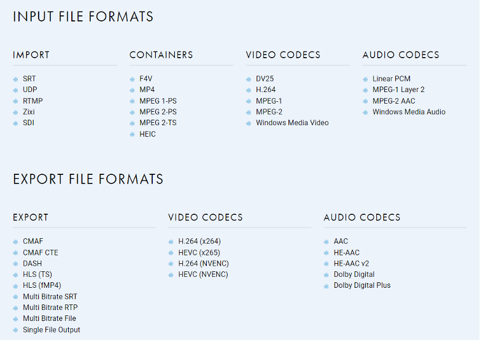
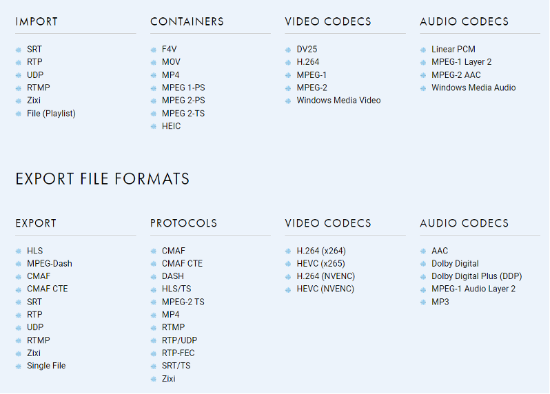

# Cambria Stream Technical Specifications

Version: 5.3.0, Published: 9/9/2024

## Purpose of this Document 

This document provides an overview of the Cambria Stream packager and encoder and its functionality, differentiates the available versions, identifies key features, and details the minimum system requirements and available licensing options. 

Note: Cambria Stream can be abbreviated as CS and Cambria Stream Manager can be 
abbreviated as CSM in this document.

## Overview of Functionality

Cambria Stream is a software-based production suite for professional packaging and live streaming/encoding broadcast production. This all-in-one system handles live ad insertion production functions, encoding, packaging and distribution. 

Cambria Stream operates in 2 main modes: **Encoding** and **Packaging**. Packaging mode can either be ABR (HLS/DASH/CMAF) passthrough packaging or Single Stream (RTP,SRT,RTMP) in/out passthrough packaging. 

Cambria Stream Manager’s has a web-based UI. Please follow the deployment/installation guide on how to access the UI. [NEED LINK TO INSTALL GUIDE]

Cambria Stream does not have a UI, however Ad Break Control for an individual CS instance has a web-based UI. 

CS and CSM can be installed either on-premise (Windows or Ubuntu) through a local installation, or through a Docker container deployment. Kubernetes deployment is also supported. Please refer to the Kubernetes/Docker guide for installation instructions. [NEED LINK TO KUBERNETES GUIDE]

## General Overview

**Comprehensive Live and File-Based Inputs**

Input a variety of live and VOD sources at up to 4K, including RTMP, RTP, SRT, Zixi and SDI

**Exceptional Output Format Support**

Encode video into DASH, HLS (TS) transport stream, HLS (fMP4) fragmented MP4, and CMAF encoding ladders for immediate distribution. Native support for various CDNs and Object Storage services such as Akamai (MSL), AWS MediaStore, AWS Media Package v1, AWS S3, Unified Streaming, WebDAV, and Akamai Object Storage. Encode video into Multi Bitrate SRT, RTP and File targets. Single stream passthrough is supported to RTMP, SRT/TS, Zixi/TS, RTP/UDP and File based targets.

**Unique Monetization Features**

Supports SCTE-35 (RTP/SRT), ESAM and manual server side ad insertion (only for Encode project type).

**Broadcast Automation**

Control Cambria Stream via the WEB-based UI or REST API with a scheduler, live machine failover, and other automation features. 
 
**Access Additional Functionality via Sister Products**

Sister products include Cambria Stream Manager and Cambria Ad Break Control. 

**DRM support for ABR outputs**

Cambria Stream Encoder supports multi-DRM via CPIX and is compatible with all major DRM systems. DRM providers: CPIX, Irdeto and Axinom. DRM Types are:
    * HLS/TS, HLS/MP4, - Fairplay
    * DASH  - Widevine or PlayReady
    * CMAF/DASH -  Widevine or PlayReady
    * CMAF/HLS - Fairplay 
    
**Encoders: CPU-based and GPU-based**

CPU-based encoding: Cambria Stream integrates x264 and x265 encoders to ensure the highest-quality video output. Fully licensed and integrated with x264 for H264 codec and x265 for HEVC codec.
 
GPU-based encoding: Cambria Stream uses Nvidia cards with NVENC for hardware-based encoding. 7th NVENC Generation (or newer) Qualified GPUs are recommended for better performance and least limitations. For a list of GPUs, please visit [https://developer.nvidia.com/video-encode-and-decode-gpu-support-matrix-new](https://developer.nvidia.com/video-encode-and-decode-gpu-support-matrix-new) 

**Note:** The only officially supported card (Capella tested): PNY NVIDIA Quadro RTX 4000
	
H264 NVENC and HEVC NVENC codecs were added to all Cambria Stream Encode targets. Please make sure that the project type is set to Encode. In the video settings, the user can find this option in the codec dropdown.

**Note**: the user must have an H264 (NVENC) and HEVC (NVENC) license and supported graphics card in order to use this. Cambria Stream will provide an error if no proper graphics card was detected or if the graphics card driver version needs to be updated.

## Input Features
**AJA Capture Card Support**

Cambria Stream supports four OEM capture boards from AJA(Corvid 88 – 8 I/O channels; Corvid 44 – 4 independent channels; Kona LHi – single channel (SDI/HDMI);  Kona 1 – single channel.
 
**Video File Input Support and File Playlist**

Cambria Stream can import numerous video file formats, including MP4, TS, WMV, and MOV files and use them as sources during a broadcast. Project type must be **Single Stream Out passthrough** or **ABR out passthrough**. Please select the source to be Playlist. Create a single playlist with a group of files for repeated playback. 

**IP Stream input: UDP/RTP/RTMP/SRT** 

Use an incoming RTP/UDP, RTMP, SRT and Zixi live stream as a live capture input. Supported in all project types. Latency in all sources can be set to Normal, Low or Prioritize Stability. RTP and Zixi sources also support FEC mode. 

Here are the file types recommended for importing into a Cambria Stream project for deployment without slowing system performance:

| Input Format   | Container  | Video Codec             | Audio Codec                         |
|---------------|------------|-------------------------|-------------------------------------|
| Flash Video    | F4V        | H.264                   | MPEG-2 AAC                          |
| Generic MP4    | MP4        | H.264                   | MPEG-2 AAC                          |
| Generic TS     | MPEG-2 TS  | H.264                   | MPEG-2 AAC, MPEG-1 Layer-2, AC-3*   |
| Generic TS     | MPEG-2 TS  | MPEG-2                  | MPEG-2 AAC, MPEG-1 Layer-2, AC-3*   |
| Generic PS     | MPEG-2 PS  | MPEG-2                  | MPEG-2 AAC, MPEG-1 Layer-2, AC-3*   |
| MPEG-1 PS      | MPEG-1     | MPEG-1                  | MPEG-2 AAC, MPEG-1 Layer-2, AC-3*   |
| HDV            | MPEG-2 TS  | MPEG-2                  | MPEG-1 Layer 2                      |
| QuickTime\*\*  | MOV        | DSV25                   | Linear PCM                          |
| Windows Media  | WMV        | Windows Media Video     | Windows Media Audio                 |

**Cambria Stream Encoder mode supported formats**

**Cambria Stream Packager mode supported formats**

## Ad Insertion, Closed Caption, CSM, OCR 
**Ad Slate**

Can designate a file as an Ad slate to play insert into production when ad is supposed to be playing, so if Ad insertion fails on server side, viewers will see the slate rather than live action. Currently Ad slate source is only supported if project type is set to Encode. 

**Closed Caption Support**

*Encode mode:* 

* Inputs Teletext in RTP and SRT sources.
* Output: HLS and DASH 
* Subtitle format: 
	* For HLS: WebVTT 
	* For Dash: WebVTT, TTML and EBU-TT-D 
	* User needs to specify subtitle tracks in HLS and Dash targets.
	* User needs to specify Teletext page number of the captions from the source
	* In Encode mode, user also has an option to burn in DVB captions on the video by specifying the DVB subtitle page ID. Setting can be found in sources tab. 
	* ARIB STD-B37 captions in SDI input are also supported in single target encode mode. Outputs can be RTP or SRT (TS based) and output will be embedded as ARIB STD-B24, ARIB STD-B40, and/or SMPTE2038.
	* Cambria Stream also supports converting ARIB STD B37 from SDI to WEBVTT captions inside HLS and Dash

*ABR passthrough mode:*

* Inputs Teletext in RTP and SRT sources.
* Output: HLS and DASH
* Subtitle format:
    * For HLS: WebVTT
    * For Dash: WebVTT, TTML and EBU-TT-D
    * User needs to specify subtitle tracks in HLS and Dash targets.
    * User needs to specify Teletext page number of the captions from the source
    * User will need to pick which source the teletext captions are coming from

*Single stream out (passthrough) mode:*

* Captions: Native 608/708 captions in h264 in TS will be passed through to TS based targets. 
* Input: RTP, 
* Output RTP, SRT

**Cambria Stream Manager**

The Cambria Stream Manager is specifically designed for streaming broadcasters handling a high-volume, automated live streaming workflow with commercial ad insertion. This highly scalable solution manages multiple Cambria Stream instances over a network monitoring scheduled events, job failover, email notifications and monitoring, SDI rerouting, and regular machine maintenance with redundancy support. Cambria Stream Manager offers a cost-effective alternative to hardware encoders within a fully automated live streaming workflow.

**OCR auto ad break**

Current implementation of auto ad break is a feature that uses OCR to detect specific text in a stream and use this information to insert ad breaks into the stream.

The user configures the area in the video frames where the text is expected to appear and the OCR tool will receive this information and determine whether the text has been found.

If the text has been found, Cambria Stream uses a user-configurable Python script to do the ad insertion work.
	

## Distribution, Monetization, Low Latency and Output Features

**Streaming to Akamai MSL servers via ABR**

Can stream to Akamai servers via HLS, CMAF (including CMAF-CTE chunked), and MPEG-DASH formats. If project type is Encode then HLS can be specified as either TS or fMP4.

**Streaming to WebDAV servers via ABR**

Can stream to WebDAV servers via HLS, CMAF (including CMAF-CTE chunked), and MPEG-DASH formats. If project type is Encode then HLS can be specified as either TS or fMP4.

**Streaming to AWS MediaStore via ABR**

Can stream to AWS Media Store via HLS, CMAF (including CMAF-CTE chunked), and MPEG-DASH formats. User will need to enter AWS MediaStore End Point along with Subfolder, AWS Region, AWS Access Key ID, and AWS Secret Key. If project type is Encode then HLS can be specified as either TS or fMP4.
    
**Streaming to AWS S3 via ABR**

Can stream to AWS S3 via HLS, CMAF (including CMAF-CTE chunked), and MPEG-DASH formats. User will need to enter AWS S3 Bucket name along with Subfolder, AWS Region, AWS Access Key ID, and AWS Secret Key. If project type is Encode then HLS can be specified as either TS or fMP4.

**Streaming to Akamai Object Storage** 

Can stream to Akamai Object Storage via HLS, CMAF (including CMAF-CTE chunked), and MPEG-DASH formats. User will need to enter their Access Key ID and Secret Key for the storage along with the bucket name, subfolder and region. If project type is Encode then HLS can be specified as either TS or fMP4.

**Streaming to AWS Media Package v1**

Can stream to AWS Media Package v1 via HLS, CMAF (including CMAF-CTE chunked), and MPEG-DASH formats. User will need to enter username and password along with the target URL. If project type is Encode then HLS can be specified as either TS or fMP4.

**RTP/UDP, SRT/TS, Zixi/TS, Generic RTMP Support**

If project type is set to Single Stream Out passthrough, then CS supports distribution via RTP/UDP, SRT/TS, Zixi/TS and RTMP to any compatible server. Can distribute to generic RTMP server if no service-specific preset exists. 

**Comprehensive Output Format Support for Streaming/Recording**

Encode program stream to H.264/HEVC output in single file MP4 or TS or HLS, DASH, or CMAF formats for immediate distribution and/or archiving. 

**Low Latency**

Cambria Stream supports low latency streaming for both encoding and packaging. There is standard low latency with all of the available output options, as well as CMAF Chunked Transfer Encoding (CTE), also known as ultra-low latency. In order for low latency to work properly, users will need to configure the following:

For encoding projects:

* In the source, set the Latency Mode to 'Low'
* In the target, go to the Video settings and check the 'Low Latency' checkbox

For All projects:

* Make sure the incoming stream is in some sort of low latency mode and that the timestamp is accurate and matching to the Cambria Stream instance the stream will run on.
* For Adaptive Streaming targets (DASH/CMAF/HLS), lower the Initial Cache Size (sec) value. Test different values as this could also impact the stream stability.

For CMAF CTE:

* Follow the steps above depending on the type of project
* In the CMAF CTE settings, check the CMAF CTE checkbox and set the chunk size as desired. The lower the value, the lower the latency will be. Test different values as this could also impact the stream stability

Capella measures latency in stages, but the value recorded is the end-to-end latency. To measure end-to-end latency, use an incoming source that has timestamp information. Capture the timestamp of the incoming signal and also of the stream playing back on the player (Eg. DASH.JS Reference player) at the same time, such as by using a screenshot capturing tool. Compare the two values to get the relative end-to-end latency. Perform this action several times to get an average latency value. 

The measured latency values (SRT is used as source) are as follows:

* CMAF CTE (Encoder): ~7-8 seconds
* CMAF (Encoder): ~9-10 seconds

## Automation Features

**Modern REST API**

All aspects of the live production can be controlled via the Rest API, including Ad insertion. Cambria Stream’s REST architecture is similar to popular APIs such as Facebook or Twitter and is familiar to developers.

**Comprehensive Logging Functionality**

The system can log all events during a broadcast and save the log files automatically. 

## Cambria Stream Manager

**Overview**

The Cambria Stream Manager is specifically designed for streaming broadcasters handling a high-volume, automated live streaming/packaging workflow with commercial ad insertion. This highly scalable solution manages multiple Cambria Stream instances over a network, monitoring scheduled events, job failover, and regular machine maintenance with redundancy support through pod failover in the kubernetes environment. Cambria Stream Manager offers a cost-effective alternative to hardware encoders within a fully automated live streaming and packaging workflow.

**Program Scheduler**

Allows broadcasters to automatically start and stop streams of registered live events broadcast via Cambria Stream. Users can preset multiple live events with individual project settings and recurring timetables. Configurable program settings include:

* Name and Description.
* Frequency: One time, daily, weekly.
* Maximum Retry Duration if event fails.
* Starting date, time and ending time (or none if unlimited duration).
* Cambria Stream machine assignment.

**Machines**

* Overview. Users can add, remove, and control all Cambria Stream installations from a single user interface.
* Program assignments. Assigning programs to a Cambria Stream instance or allowing Stream Manager to control. 
* Failover. Automatically reassign a job to an available Cambria Stream instance in case of a failure on the network. 
* Project density. Set the number of programs that can be run on any single Cambria Stream instance. 
* Monitoring. Monitor the encode speed, network speed, CPU usage, memory usage, IP Address, Uptime, and the Cambria Stream Version on any Cambria Stream instance.
 
**Redundancy in Windows deployment**

* Note: The following redundancy workflow is legacy and is intended to be used only for on-premise Windows installation with a Desktop UI. Desktop UI for a Windows installation can be found here:
"C:\Program Files (x86)\Capella\CambriaStreamManager\cpx64\CambriaLiveManager.exe" Below features will not work through a regular/default WebUI for CSM. 	
* Cambria Stream Manager can be made fully redundant by adding a backup Cambria Stream Manager. In the event of a failure to the main Cambria Stream Manager, the backup takes over immediately without downtime.
* You can assign each Stream Manager instance a redundancy role (Primary, Backup, No Backup, Stopped). Backups monitor primary machine and automatically assume operation in the case of failure. 

**Redundancy in a Linux Kubernetes Deployment** 

* Users can specify the number of Manager pods desired in a kubernetes cluster. Recommended count is 3 manager pods per cluster. By default only one manager pod will be selected as a leader and will be functional. In case the leader pod goes offline, then another available manager pod in the pool will be selected as a leader. Database is also replicated in the Kubernetes environment. Users can specify how many Postgres replicas are needed for the cluster. 

**Monitoring**

Note: the below works on an on-premise local installation in Linux or Windows. In the Kubernetes environment please check with your Kubernetes vendor if emailing within the cluster is supported. 

Users can send email notifications as follows:

|  Category | Notification |
|---|---|
| Machine                 | - License expiration   - Machine has not been rebooted   - Periodically send machine status   - Running out of disk space (Manager Machine) |
| Program (Information)  | - Prior to program   - Streaming starts   - Streaming stops                                              |
| General Running Program Error | - Program / streaming error   -  Low processing or delivering speed                                        |

**Output Preview**

Displays program output from all running programs. Capabilities include:

Status bars. Show the status of encoding and network performance. 

**Ad Break Control**

* **Overview.** Cambria Stream supports a variety of advertising related workflows, including: 
* **Manual ad triggering.** Can use an Ad preset, reuse an Ad break, and adjust start and end points. Ad settings must be specified at the event creation in the project settings. On the fly ad setting adjustments are not supported such as changing the Ad Marker Source. 
* **SCTE-35 commercial cue tone support.** Ingest SCTE35 signals and output to various streaming output formats such as HLS, MPEG-Dash and CMAF.
* **API-based cues ESAM.** Includes support for ESAM-based ad signaling (per CableLabs).  Post/fetch ESAM XML with ad splice points and insert SCTE35 markers for ad pod insertion.
* **ARIB STD-B39.** Supports ad signals through ARIB STD-B39 from SDI signal source. Works on on-prem Docker-Linux or Windows installation only. Docker or kubernetes for ARIB in SDI is not supported. 

## Deployment and Operating Systems

These requirements are for build 5.2.0.17038 of Cambria Stream and Cambria Stream Manager 

**Operating System**
	
For on-premise direct installation Windows 11, Server 2022 is required. (Windows should be updated through Microsoft Windows Update before installing the application)

Note: For Linux, installation can be done through Docker. 

Docker host should preferably be Ubuntu as well, however other Linux distributions may also be supported as a Docker host. Please refer to the installation/deployment guide for Kubernetes. [NEED LINK] 

Recommended Windows Settings for Cambria Stream and Stream Manager

* Disable automatic Windows Update 	
* Disable screen saver 
* Avoid installing other programs on the Cambria Stream machine
* Do not install applications (filter) that uses DirectShow as this could conflict with Cambria Stream
* Please do not set any power save mode for HDD and CPU 
* Install Cambria Stream on the admin account 
* Anti-Virus settings. Cambria Stream will be connected to an Internet connection. Ensure to install antivirus software such as Microsoft Security Essentials as necessary to avoid unwanted malware on the machine.

**Deployment**

Please refer to the Kubernetes Installation guide for further information. [NEED LINK]

* On-premise installation: Windows and Ubuntu 20.04.6
* Docker: through Docker Compose
* Kubernetes (Akamai Clous Kubernetes, etc)  

**Cambria Stream Benchmarks** 

Note: Please refer to Kubernetes installation guide for cloud machine benchmarks.

Real-time Performance Benchmarks: Cambria Stream projects can be configured in a variety of ways; this generally results in differences in resource usage. Below are examples of typical cases running on the recommended system specification. 

* Machine Configuration: HP Z4 
* Operating System: Windows 10 SP1 64-bit 
* Processor Intel Core i9-7940X @ 3.10GHz (14-core Skylake-X) 
* Memory 32 GB (4x8 GB) DDR4-2666

Benchmark Configuration: Packaging Only Programs (3 video/audio layers) 
Packager only programs! 75 input RTP streams and 25 HLS output streams (each with 3 video/audio layers – 1080p/720p/480p).

| Input                                | Output                            | CPU Utilization                                 |
|--------------------------------------|------------------------------------|-------------------------------------------------|
| 25x RTP groups (3x RTP streams each) | 25x HLS (1080p/720p/480p)          | 50% and 30% with previews disabled             |

Benchmark Configuration: Encoding Programs output to HLS (4 video/audio layers). Two input RTP streams, both are encoding to different HLS output streams (each with 4 video/audio layers – 1080p/720p/480p/360p).

| Input             | Output                                       | CPU Utilization |
|-------------------|----------------------------------------------|-----------------|
| 3x RTP (1080p)    | 3x HLS (1080p/720p/480p/360p)                 | 75%             |

## Operational Modes and Licensing Models

This section describes how Cambria Stream can operate and the licensing models. 

**Operational Modes**

The Cambria Stream Manager series automates live streaming of multiple events based on your schedule. It seamlessly integrates with your existing playout and ad scheduling systems and combines live and file assets.

CSM manages multiple Cambria Stream instances for a fully automated live streaming workflow that handles ad insertion, scheduled live streaming, monitoring, notifications and more.

CSM includes a scheduler that allows broadcasters to automatically start and stop streams of registered live events. Operators can present multiple live events with individual project settings and recurring timetables. 

Cambria Stream operates in 2 main modes: **Encoding** and **Packaging**. Packaging mode can either be ABR (HLS/DASH/CMAF) passthrough packaging or Single Stream (RTP,SRT,RTMP) in/out passthrough packaging. 

**Licensing Models**

Cambria Stream is purchased on a per-channel basis. The number of individual video layers (ABR packaging or Multi-bitrate SRT/RTP) in the channel **is not restricted**. 

Cambria Stream Manager is purchased on a per-machine basis. 
    							   
---

For any questions or technical support, contact Capella Systems at:

📧 **support@capellasystems.net**

