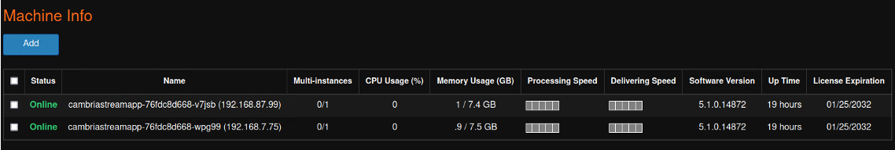
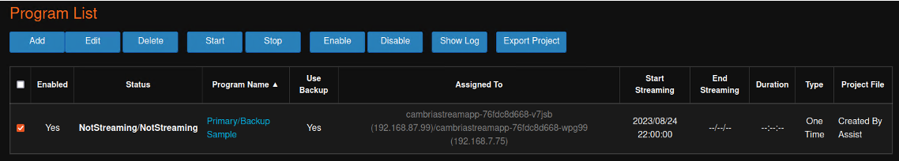

# Cambria Stream Primary and Backup Program 

 To see how to set up a Kubernetes Cluster with Stream Manager and Stream please follow this guide  [CONNECT TO DOCUSAURUS DOC] **Linode_Kubernetes_Help_Document**. In order to use a Primary and Backup make sure you have two worker instances specified in your YAML. If you are just testing Primary and Backup we recommend that you only have two worker instances deployed to make testing easier. You will know if you have two worker instances if you go to the **Machine** tab in the webui and it displays two cambriastreamapp machines.

## How To Setup Primary/Backup Workflow

It is important to note that Cambria Stream Manager will randomly assign streams to machines that are online. So, these are the list of steps that you will need in order to set up a Primary and Backup Workflow.

1\.	Get the external IP address of all machines that are online. In order to do this please refer to the [CONNECT TO DOCUSAURUS DOC] **Linode_Kubernetes_Help_Document** and follow section **3.5.1 Use External Application to Stream** steps 1 to 4.

2\.	Once you find the IP of the machines, go back to the Stream webui and create a program by going to the **Programs** tab, clicking **Add**, and then **Create By Assist**.

3\.	Set up the **Project Type** that you would like and click on **Add** to add a Source.

4\.	Next, go to the **Target** tab and create **TWO targets** as two are required for Primary and Backup.

5\.	Save the configurations and then at the bottom check the **Use Backup** box.

6\.	Click on **Config** next to the box and set your desired Primary and Backup stream.

7\.	After, save the program and you should see that the program has been created in the **Program List**.

8\.	The status of the program should be **NotStreaming/NotStreaming** and there should be two machines in the **Assigned To** column

---

For any questions or technical support, contact Capella Systems at:

**support@capellasystems.net**

