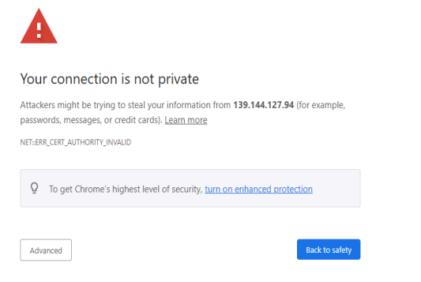

## Document History

| Version | Date       | Description                                      |
|---------|------------|--------------------------------------------------|
| 5.5.0   | 04/11/2025 | Updated for release 5.5.0.23529 (Linux)          |
| 5.6.0   | 10/31/2025 | Updated for release 5.6.0.26533 (Linux)          |

> **Download the online version of this document for the latest information and latest files. Always download the latest files.**

Do not move forward with the installation process if you do not agree with the End User License Agreement (EULA) for our products.  
You can download and read the EULA for Cambria FTC, Cambria Cluster, and Cambria License Manager from the links below:

- [Cambria License Manager EULA](https://www.dropbox.com/s/1wg7ee7a59kzi8h/EULA_Cambria_License_Manager.pdf?dl=0)  
- [Cambria Cluster EULA](https://www.dropbox.com/s/oemlax63aatjjiw/EULA_Cluster.pdf?dl=0)  
- [Cambria FTC EULA](https://www.dropbox.com/s/ualv9usxsowh6m2/EULA_FTC.pdf?dl=0)

---

### Limitations and Security Information

Cambria FTC, Cluster, and License Manager run inside Linux Docker containers.  
Security checks for this version are included in the general Linux documentation:

- **Cambria FTC / Cluster (sections 8 and 9):**  
  https://www.dropbox.com/scl/fi/rvf02h8tajsxrfbhpgmzy/Linux_Cambria_FTC_5_6_0_Guide.pdf?rlkey=gtqeowx2b9gartth8s6dwo95j&st=4wpy1dfi&dl=0

---

## ⚠️ Important: Before You Begin

PDF documents often have copy/paste issues. For best results, download this document and any referenced PDFs and open them in a viewer such as Adobe Acrobat.

For commands that span multiple lines, copy each line individually and verify accuracy.

This document references **Kubernetes version 1.34 only**.

---

## ⚠️ Critical Information: Read Before Proceeding

Before starting the installation, review the following key points:

### 1. A New Kubernetes Cluster Will Be Deployed
The installation process creates a **brand-new AWS EKS cluster**, isolated from other applications.

### 2. Default Installation is Non-Secure
- The default deployment uses open, non-secure settings.  
- Secure or hardened deployments require AWS expertise (not covered in this guide).  
- Firewall details are provided in **Section 1.5**.

### 3. Understand Your Transcoding Requirements
Know your:
- Expected encoding workload  
- Input/output specifications  
- GPU requirements  

See **Section 1.3** for AWS machine recommendations.

### 4. Administrative AWS Rights Required
Many steps require IAM-level administrative permissions in AWS.

### 5. Verify AWS Account Quota
Ensure your AWS account has enough quota to deploy all required EKS resources  
(see **Section 1.2**).

### 6. A Separate Linux Machine is Required
A dedicated Linux machine is required to:
- Install AWS and Kubernetes tools  
- Run AWS CLI  
- Safely store kubeconfig files  

### 7. Verify Region-Specific Resource Availability
GPU availability and instance types vary by AWS region.  
Check AWS documentation to confirm support in your region of operation.

## Document Overview

This guide provides a full walkthrough for installation and testing of Cambria Cluster and Cambria FTC on AWS Kubernetes.

It includes:

1. Overview of the Cambria Cluster / FTC Environment in a Kubernetes Environment
2. Preparation for the installation (Prerequisites)
3. Create and configure the Kubernetes Cluster
4. Install Cambria Cluster and Cambria FTC on the Kubernetes Cluster
5. Verify the installation is working properly
6. Test the Cambria Cluster / FTC applications
7. Update the Cambria Cluster / FTC applications on Kubernetes Cluster
8. Delete a Kubernetes Cluster
9. Quick Reference of Kubernetes Installation
10. Quick Reference of Important Kubernetes Components (urls, template projects, test player, etc)
11. Glossary of important terms 

---

## 1. Overview

### 1.1 Cambria Cluster / FTC Kubernetes Deployment

Two major applications are deployed in this environment:

---

### **Cambria Cluster**

This deployment is recommended to run on at least 3 nodes (replica = 3) with a service (Load Balancer) that
exposes the application externally. For each of these nodes, Cambria Cluster will be installed on its own pod and
designated to its own node. One node acts as the leader and the other two are replicas for the purpose of
replacing the leader in the case it becomes inactive, corrupted, etc. Each Cambria Cluster pod has three
containers:

1. **Cambria Cluster (application)**  
2. **Leader Elector** that chooses which of the Cambria Cluster node / pod will be the leader)  
3. **FTC Autoscaler**, that when the FTC autoscaler is enabled, it will automatically deploy worker nodes for encoding purposes based on the number of encoding jobs queued to the system. This is based on the calculation (rounded down):

Number of Nodes = (Queued Jobs + 2) / 3


Also for the Cluster deployment, there is a corresponding PostgreSQL database installed on a separate pod for each active Cambria Cluster pod. The data is replicated between the different database pods in order to preserve data in case of issues with the database and/or Cluster.

---

### **Cambria FTC**

Capella’s Cambria FTC deployment consists of one or more nodes that (by default) are of different instance
types than the Cambria Cluster nodes. These nodes focus specifically on running encoding tasks. Similar to
Cambria Cluster, the Cambria FTC application is installed on its own pod and designated to its own node. Each
Cambria FTC pod has three containers:

1. **Cambria FTC application**  
2. **Auto-Connect FTC .NET tool**, that does the following: 1. list pods, 2. attempts to find Cambria
Cluster, and 3. connects the Cambria FTC application running in the pod to the Cambria Cluster that it
found. This container also deletes its own node pool or recycles its node if no Cambria Cluster is found
within a specific time (~20 minutes)
  
3. **Pgcluster database** for storing its encoder's own job contents and other such information for as long as the pod is running.


Each node in the Kubernetes Cluster will either be running the Cluster deployment or the FTC deployment.

---

### 1.2 Resource Usage
The resources used and their quantities will vary depending on requirements and different
environments. Below is general information about some of the major resource usage (other resources may be
used. Consult AWS and eksctl documentation for other resources created, usage limits, etc):

---

#### Useful AWS Documentation

- https://docs.aws.amazon.com/eks/latest/userguide/eks-deployment-options.html  
- https://eksctl.io/usage/creating-and-managing-clusters/  
- https://eksctl.io/usage/vpc-networking/  
- https://docs.aws.amazon.com/eks/latest/best-practices/subnets.html  
- https://docs.aws.amazon.com/AWSEC2/latest/UserGuide/AvailableIpPerENI.html  
- https://docs.aws.amazon.com/eks/latest/best-practices/network-security.html  

---

### Approximate Components

| Resource         | Notes                                                                                 |
|------------------|----------------------------------------------------------------------------------------|
| Load Balancers   | 0–3 Classic LBs (WebUI, Web Server, Grafana), 0–1 NLB (Ingress)                       |
| Nodes            | 3 Cambria Manager nodes (default), plus FTC nodes                                      |
| Networking       | 1 VPC, 3 public + 3 private subnets                                                    |
| IP Space         | Default `/16`, subnets `/19`                                                           |
| Security Groups  | Default is 1 security group for control plane, Default is X security groups
                                      

---

## 1.3 AWS Machine Information and Benchmark

The following is a benchmark of two AWS machines. The information below is as of October 2025. Note that the
benchmark involves read from / write to AWS S3 which influences the real-time speed of transcoding jobs.

**Benchmark Input**

- Source: **TS H.264 @ 1080p 8 Mbps**  
- Outputs: **HLS variants** (1080p → 240p)

**a. c6a.4xlarge [ AMD EPYC 7R13 ]**

### 1.3 AWS Machine Information and Benchmark

#### **a. c6a.4xlarge – AMD EPYC 7R13**

| Spec | Value      |
|------|------------|
| RAM  | 32 GB      |
| CPUs | 16         |
| Network | 12.5 Gbps |
| Cost | $0.612/hr  |

**Benchmark Results**

| Concurrent Jobs | Speed     | CPU   |
|------------------|-----------|--------|
| 2                | 0.67x RT  | 100%  |

---

#### **b. c6a.16xlarge – AMD EPYC 7R13**

| Spec | Value        |
|------|--------------|
| RAM  | 128 GB       |
| CPUs | 64           |
| Network | 25 Gbps   |
| Cost | $2.448/hr    |

**Benchmark Results**

| Concurrent Jobs | Speed     | CPU   |
|------------------|-----------|--------|
| 2                | 1.59x RT  | 94%   |

---

**Benchmark Finding:**  
The results show the **c6a.16xlarge** has higher overall throughput. This is expected as the instance has more
processing power than the **c6a.4xlarge.** However, if you take into account the cost per hour for each machine,
the more cost efficient option is to go with the c6a.4xlarge

---

## 1.4 Cambria Application Access
The Cambria applications are accessible via the following methods:

### 1.4.1 External Access via TCP Load Balancer
The default Cambria installation configures the Cambria applications to be exposed through load balancers.
There is one for the Cambria Manager WebUI + License Manager, and one for the web / REST API server. The
load balancers are publicly available and can be accessed either through its public ip address or domain name,
and the application's TCP port.

Examples:

- WebUI: **https://44.33.212.155:8161**  
- REST API: **https://121.121.121.121:8650/CambriaFC/v1/SystemInfo**

External access in this way can be turned on / off via a configuration variable. See 4.2. Creating and Editing
Helm Configuration File. If this feature is disabled, another method of access will need to be configured.

---

### 1.4.2 HTTP Ingress via Reverse Proxy

In cases where the external access via TCP load balancer is not acceptable or for using a purchased domain
name from servicers such as GoDaddy, the Cambria installation provides the option to expose an ingress.
Similar to the external access load balancers, the Cambria Manager WebUI and web / REST API server are
exposed. However, only one ip address / domain name is needed in this case.

How it works is that the Cambria WebUI is exposed through the subdomain **webui**, the Cambria web server
through the subdomain **api**, and Grafana dashboard through the subdomain monitoring. The following is an
example with the domain **mydomain.com**

- Cambria Manager WebUI: **webui.mydomain.com**  
- Cambria REST API: **api.mydomain.com**  
- Grafana Dashboard: **monitoring.mydomain.com**

Capella provides a default ingress hostname for testing purposes only. In production, the default hostname, ssl
certificate, and other such information needs to be configured. More information about ingress configuration is
explained later in this guide.

---

## 1.5 Firewall Information
By default, this guide creates a kubernetes cluster with default settings which includes the default
network firewall configurations. In the default configuration, a virtual network is created alongside the
kubernetes cluster. For custom / non-default configurations, or to explore with a more restrictive network based
on the default virtual network created, the following is a list of known ports that the Cambria applications use:


### Required Ports

| Port | Protocol | Traffic   Description                |
|------|----------|---------|--------------------|
| 8650 | TCP      | Inbound |Cluster REST API           |
| 8161 | TCP      | Inbound | Cluster WebUI              |
| 8678 | TCP      | Inbound | License Manager Web Server |
| 8481 | TCP      | Inbound | License Manager WebUI      |
| 9100 | TCP      | Inbound | Prometheus Exporter        |
| 8648 | TCP      | Inbound | FTC REST API               |
| 3100 | TCP      | Inbound | Loki                       |
| 3000 | TCP      | Inbound | Grafana                    |
| 443  | TCP      | Inbound | Ingress                    |
| ALL  | TCP/UDP  | Outbound| Outbound allowed           |

Also, for Cambria licensing, any Cambria Cluster and Cambria FTC machine requires that at least the following
domains be exposed in your firewall (both inbound and outbound traffic):


| Domain                         | Port(s) | Protocol | Traffic Direction | Description             |
|--------------------------------|---------|----------|-------------------|-------------------------|
| api.cryptlex.com               | 443     | TCP      | Inbound / Outbound | License Server          |
| cryptlexapi.capellasystems.net | 8485    | TCP      | Inbound / Outbound | License Cache Server    |
| cpfs.capellasystems.net        | 8483    | TCP      | Inbound / Outbound | License Backup Server   |


---

## 1.6 Specifications for Linux Deployment Server
In order to deploy Cambria FTC, a Linux Deployment Server is required because this is where all of the tools,
dependencies, and packages for the Cambria FTC Kubernetes deployment will be installed and/or stored. If you
already have a deployment server, you can skip this section.

**Important: Linux Deployment Server Machine Information**
The instructions in this document require IAM admin rights and IAM role assignment. For this purpose, it
is required to use an AWS EC2 instance (unless you already have a way to assign IAM roles to a machine that
is not an EC2 instance).

Capella tests deployment with the **t3.small** instance type

**Minimum Requirements:**
|--------------------------------|---------|
| Operating System (OS)          | 443     | 
| CPU(s)                         | 8485    | 
| RAM                            | 8483    | 
| Storage                        | 10 GB   |

## 2. Prerequisites
The following steps need to be completed before the deployment process.

### 2.1 Linux Tools
This guide uses curl, unzip, and jq to run certain commands and download the required tools and applications.
Therefore, the Linux server used for deployment will need to have these tools installed.

Example with Ubuntu 24.04:

```bash
sudo apt update && \
sudo DEBIAN_FRONTEND=noninteractive apt -o Dpkg::Options::="--force-confold" -y upgrade && \
sudo DEBIAN_FRONTEND=noninteractive apt -o Dpkg::Options::="--force-confold" -y install curl unzip jq
```

# 2.2 Cambria FTC Package
The components of this installation are packaged in a zip archive. Download it using the following command:

```bash
curl -o CambriaClusterKubernetesAws_5_6_0.zip -L "https://www.dropbox.com/scl/fi/dtsqn334iu6e82atem5jy/CambriaClusterKubernetesAws_5_6_0.zip?rlkey=ds31kx7hgtuazidejxu64okpq&st=4x3whwtv&dl=1"
unzip -o CambriaClusterKubernetesAws_5_6_0.zip && chmod +x *.sh ./bin/*.sh
```

*Important:* the scripts included have been tested with Ubuntu. They may work with other Linux distributions
but not tested

# 2.2.1 Kubernetes Tools: kubectl, helm, eksctl, aws-cli
There are 2 options available for installing the kubernetes required tools for deployment to AWS:

*Option 1:*  Use Installation Script (Verified on Ubuntu)

```bash
./bin/installKubeTools.sh && ./bin/installKubeToolsAws.sh
```
*Option 2:* Other Installation Options

1. Kubectl: https://kubernetes.io/docs/tasks/tools/
2. Helm: https://helm.sh/docs/intro/install/
3. Eksctl: https://eksctl.io/installation/
4. AWS CLI: https://docs.aws.amazon.com/cli/latest/userguide/getting-started-install.html

# 2.2.2 Verification
If any of the commands below fail, review the installation instructions for the failing tool and try again:

```bash
kubectl version --client && helm version && eksctl version && aws --version
```

# 2.3 Create and Configure AWS Permissions
In order to create resources on AWS for the kubernetes cluster, certain policies and roles need to be created and
configured.

### Important: AWS Admin Rights
This section requires IAM administrative permission. The steps can be done manually using the AWS
Dashboard. However, the aws-cli will be used in this guide. To follow the exact steps, the **Linux Deployment Server** (in this case, an EC2 machine with the admin IAM role) and the aws-cli will be required.

1. Create an IAM admin role (if not already done so)
2. On the AWS EC2 Dashboard, select the Linux Deployment Server created. Go to Actions > Security >
Modify IAM role and select the IAM admin role

Before continuing, the AWS account id must be temporarily set as an environment variable to run the
commands in this section.

```bash
export AWS_ACCOUNT_ID=$(aws sts get-caller-identity --query "Account" --output text)
```

# 2.3.1 Create Custom Policies
The eksctl tool used for creating the kubernetes cluster requires certain permissions. This section will configure
those permissions that AWS doesn't already manage as policies. For more details on eksctl policies, see
https://eksctl.io/usage/minimum-iam-policies/

1. Run the following command to create the EksAllAccess and IamLimitedAccess as mentioned in the eksctl
documentation

```bash
./bin/createEksctlCustomAwsPolicies.sh
```

*If the policies were created successfully, a json description of each policy will be returned.
*Otherwise, verify the information is correct and retry. If the policies already exist, delete the old
*policies and create the new ones.


# 2.3.2 Create and Assign eksctl Role
In order to deploy the kubernetes cluster and run eksctl commands, the user of the Linux deployment machine
needs to be able to assume an AWS role with the minimum permissions per eksctl documentation:

1. Create a new IAM role called eksctl-user with the following policies:
- AmazonEC2FullAccess
- AWSCloudFormationFullAccess
- EksAllAccess
- IamLimitedAccess

*Needs administrative role and instance profile creation permissions

eksctl-user: the name of the role for deploying EKS clusters via eksctl. The name must start with eksctl- in
order for permissions to work

```bash
./bin/createEksctlClusterUserRole.sh eksctl-user
```
2. Assume the new role on the Linux deployment machine. If using an AWS EC2 instance, select the instance
and go to Actions > Security > Modify IAM role. Select the eksctl-user-instance-profile from the list

## 3. Create Kubernetes Cluster

The following section provides the basic steps needed to create a Kubernetes Cluster on AWS.

---

## 3.1. Create AWS EKS Cluster and Cambria Cluster Node Group

1. In a command line / terminal window, run the following command to create the base Kubernetes Cluster
(replace the highlighted values with those of your specific environment):

### Information / Recommendation

Cambria Cluster manages scheduling and handling Cambria FTC encoding / packaging programs. It is
important to think about how many programs you will be intended to run and choose an instance type
accordingly. The lowest recommended machine type for the manager machines is c7i.xlarge.

It is also recommended to set the node count to 3. This is because 1 of the nodes will act as the Cambria
Cluster node while the other 2 nodes act as backup (web server and database are replicated / duplicated).
In the case that the Cambria Cluster node goes down or stops responding, one of the other two nodes will
take over as the Cambria Cluster node. Depending on the desired workflow(s), think about how many
backup nodes may be needed

---

1. Set environment variables for the cluster

- *--name=*cambria-cluster: Name of the Kubernetes Cluster  
- *--region=*us-west-2`: AWS region where the Cluster will run  
- *--version=1.34:* Kubernetes version (recently tested: **1.34**)  

```bash
export CLUSTER_NAME=cambria-cluster REGION=us-west-2 KUBEVERSION=1.34
```

2. Use kubectl to create the EKS cluster: 

*--nodes=*3: the number of nodes for the manager application. The recommended value is 3.

*--instance-types*=c7i.xlarge: c7i.xlarge: the instance type for the manager application. The recommended type is
c7i.xlarge. Must be a x86-64 machine.

*--node-ami-family=*Ubuntu2404: what type of OS to install in the worker nodes. It is currently recommended
to use the Ubuntu2404 image. Capella has also tested with AmazonLinux2, but this image does not work with GPU.

*--vpc-cidr=10.0.0.0/16:* the ip range for the VPC. This will depend on many factors such as number of instances, instance types, workflows. Omit this flag for the default VPC CIDR from eksctl. The lowest CIDR tested by Capella is /19.

```bash
eksctl create cluster \
--name=$CLUSTER_NAME \
--region=$REGION \
--version=$KUBEVERSION \
--kubeconfig=./$CLUSTER_NAME-kubeconfig.yaml \
--node-private-networking \
--nodegroup-name=manager-nodes \
--node-labels="capella-manager=true" \
--with-oidc \
--node-ami-family=Ubuntu2404 --nodes=3 --instance-types=c7i.xlarge --vpc-cidr=10.0.0.0/16
```

3. Set the kubeconfig as an environment variable:

```bash
export KUBECONFIG=$CLUSTER_NAME-kubeconfig.yaml
```

4. Verify that the cluster and manager nodes are accessible:

```bash
kubectl get nodes
```
This should return something similar to the following. If it does not, verify the deployment information,
credentials, permissions, etc:

```bash
NAME STATUS ROLES AGE VERSION
ip-10-0-12-44.us-west-2.compute.internal Ready <none> 118m v1.34.1
ip-10-0-16-207.us-west-2.compute.internal Ready <none> 118m v1.34.1
ip-10-0-22-84.us-west-2.compute.internal Ready <none> 118m v1.34.1
```
Recommended: Ubuntu2404

AmazonLinux2 is supported but does not work with GPU

--vpc-cidr=10.0.0.0/16: VPC IP range

Omit this flag to use eksctl's default

Lowest CIDR tested by Capella: /19

```bash
eksctl create cluster \
  --name=$CLUSTER_NAME \
  --region=$REGION \
  --version=$KUBEVERSION \
  --kubeconfig=./$CLUSTER_NAME-kubeconfig.yaml \
  --node-private-networking \
  --nodegroup-name=manager-nodes \
  --node-labels="capella-manager=true" \
  --with-oidc \
  --node-ami-family=Ubuntu2404 --nodes=3 --instance-types=c7i.xlarge --vpc-cidr=10.0.0.0/16
```

3. Set the kubeconfig as an environment variable
```bash
export KUBECONFIG=$CLUSTER_NAME-kubeconfig.yaml
```

4. Verify that the cluster and manager nodes are accessible
```bash
kubectl get nodes
```

This should return something similar to the following. If it does not, verify the deployment information,
credentials, permissions, etc:


```bash
NAME                                          STATUS   ROLES   AGE   VERSION
ip-10-0-12-44.us-west-2.compute.internal      Ready    <none>  118m  v1.34.1
ip-10-0-16-207.us-west-2.compute.internal     Ready    <none>  118m  v1.34.1
ip-10-0-22-84.us-west-2.compute.internal      Ready    <none>  118m  v1.34.1
```

### 3.2. Default Storage Class

Set gp2 as the default storage class:

```bash
kubectl patch storageclass gp2 \
  -p '{"metadata": {"annotations": {"storageclass.kubernetes.io/is-default-class": "true"}}}'
```

### 3.3. Create EBS CSI Driver
1. Create the IAM Role that will interact with AWS EBS CSI Driver to use volumes in the AWS Kubernetes environment (replace highlighted values):


**--role-name=**eksctl-ebs-csi-driver-role

```bash
eksctl create iamserviceaccount \
  --name=ebs-csi-controller-sa \
  --namespace=kube-system \
  --cluster=$CLUSTER_NAME \
  --region=$REGION \
  --role-only \
  --attach-policy-arn=arn:aws:iam::aws:policy/service-role/AmazonEBSCSIDriverPolicy \
  --approve \
  --role-name=eksctl-ebs-csi-driver-role
  ```
  
 2. Add the AWS EBS CSI Driver to the Kubernetes Cluster

**Important:**
this step will install a plugin to handle volumes in AWS. This must be installed correctly and the
plugin must have an Active status before continuing. Otherwise, the Cambria product installation will always
fail. If this step fails, consider re-creating the Kubernetes cluster from scratch as the safest option

- eksctl-ebs-csi-driver-role: IAM Role created in Step 1

```bash
eksctl create addon \
  --name aws-ebs-csi-driver \
  --cluster=$CLUSTER_NAME \
  --region=$REGION \
  --force \
  --service-account-role-arn=arn:aws:iam::$AWS_ACCOUNT_ID:role/eksctl-ebs-csi-driver-role
```

3. Run the following command to check on the state of the EBS CSI Driver plugin
```bash
eksctl get addon --name=aws-ebs-csi-driver --cluster=$CLUSTER_NAME --region=$REGION
```

## DO NOT MOVE ON TO THE NEXT STEP UNTIL THE ABOVE PLUGIN SHOWS ‘ACTIVE’

### 3.4. AWS IAM Permissions for FTC
Certain permissions need to be added in order for functionality such as S3 reading / writing and the FTC autoscaler to work.

### 3.4.1. Create FTC Role
Cambria FTC needs special permissions to perform S3 read and write operations. For this, the Cambria FTC instances will need to assume a specific role with these permissions. Run the following script to create the role:

eksctl-ftc-role: the name of the IAM role for FTC in the kubernetes cluster. This name has to start with eksctl-, be unique to the EKS cluster, and be less than or equal to 64 characters 
 
./config/ftcS3PermissionSample.json: this is the policy JSON file for the FTC instances. Capella provides this file as a sample which enables read, write, list for all S3 buckets. See AWS documentation for how to generate a policy for S3 needs.

```bash
./bin/createRoleForFtcInstances.sh eksctl-ftc-role ./config/ftcS3PermissionSample.json
```

### 3.4.2. Create FTC Autoscaler Role
Only run this if planning to use Cambria FTC's autoscaler feature. For the FTC autoscaler to work, certain permissions need to be passed to the autoscaler container. Run the following script to create the role:

eksctl-autoscaler-role: the name of the IAM role for the FTC autoscaler. This name has to start with eksctl-, be unique to the EKS cluster, and be less than or equal to 64 characters  

eksctl-autoscaler-cfg-role: the name of the IAM role for FTC autoscaler's config. This name has to start with eksctl-, be unique to the EKS cluster, and be less than or equal to 64 characters

```bash
./bin/createRolesForFtcAutoscaler.sh eksctl-autoscaler-role eksctl-autoscaler-cfg-role
```

### 3.5. Create Cambria FTC Node Group(s)
Skip this step if planning to use Cambria FTC's autoscaler. Run the following command to create the Node Group for the worker application instances (replace the highlighted values to those of your specific environment):

# Information / Recommendation
For this particular case, Cambria FTC nodes need to be added manually. Therefore, think about what machine / instance type will be needed for running the desired Cambria FTC workflows. Based on benchmarks (See 1.3. AWS Machine Information and Benchmark), the recommended machine / instance type to get started is c6a.4xlarge.

To get started, it is recommended to start with one instance. This way, when the installation is complete, there will already be one Cambria FTC instance to test with. The number of instances can always be scaled up and down, up to the maximum FTC instance count that will be configured in section 4.2. Creating and Editing Helm Configuration File.

*--nodes=1:* the number of nodes that will be able to run the worker application. The recommended value is 1.  

*--instance-types=c*6a.4xlarge: the type of the worker application nodes. The recommended value is c6a.4xlarge. Must be an x86-64 machine.  
--node-ami-family=Ubuntu2404: what type of OS to install in the worker nodes. We currently recommend using the Ubuntu2404 image. Capella has also tested with AmazonLinux2, but this image does not work with GPU.

*--node-ami-family=Ubuntu2404:* what type of OS to install in the worker nodes. We currently recommend
using the Ubuntu2404 image. Capella has also tested with AmazonLinux2, but this image does not work with GPU

```bash
eksctl create nodegroup \
--name=worker-nodes \
--cluster=$CLUSTER_NAME \
--region=$REGION \
--node-private-networking \
--node-labels="capella-worker=true" \
--nodes=1 --instance-types=c6a.4xlarge --node-ami-family=Ubuntu2404
```

(Optional) If you want Cambria Cluster nodes to also be able to run encoding jobs, set this label on the Cambria Cluster nodegroup:

```bash
export CLUSTER_NAME=<cluster_name> REGION=<region>  
eksctl set labels --cluster=$CLUSTER_NAME --region=$REGION --labels="capella-worker=true" --nodegroup=manager-nodes
```

### 3.6. [ BETA ] GPU Operator for NVENC
This section is only required for a Kubernetes cluster that will use GPUs. Skip this step if GPUs will not be used in this Kubernetes cluster.

# Important: BETA Feature  
GPU can be used in Cambria Cluster/FTC. However, this feature is still a work in progress and may not function as expected.

# Limitation: Cambria FTC Autoscaler  
This feature currently does not work with the FTC autoscaler.

In your command prompt / terminal, run the following commands to deploy the GPU Operator to the Kubernetes
cluster:

```bash
In your command prompt / terminal, run the following commands to deploy the GPU Operator to the Kubernetes cluster:
helm repo add nvidia https://helm.ngc.nvidia.com/nvidia; \
helm repo update; \
helm install nvidia-operator nvidia/gpu-operator \
--create-namespace \
--namespace gpu-operator
```

*Wait at least 5 minutes for the GPU operator to install completely.


Run this command with 'kubectl' and make sure that all of the pods are in a Running or Completed state:

```bash
kubectl get pods -n gpu-operator
```

If any pod is still in an Init state or PodCreating state, wait another 5 minutes to see if the pods will complete their install process.

For any pods that are in an errored state or that are still in an Init state after 10 minutes, do the following:

a. Check that at least one node is one of the supported Akamai Cloud GPU instances  
b. Use the following command to check the state of a failing pod (check the Events section):

```bash
kubectl describe pod <your-pod-name> -n gpu-operator
```

Either look up the error for a potential solution or send the entire Events section to the Capella support team for investigation.

### 3.7. Application Ingress: Ingress-Nginx
By default, certain parts of the Cambria applications are exposed via an ingress. In order to access these, the ingress-nginx service needs to be created and attached to the ingress via a reverse-proxy.

1. Run the following command:

```bash
kubectl apply -f https://raw.githubusercontent.com/kubernetes/ingress-nginx/controller-v1.13.0/deploy/static/provider/aws/deploy.yaml
```

2. Verify that the resources are created and in an active / online state:
- Pods should be in a **Running** STATUS and all containers in **READY** should be active
- Services should have a **CLUSTER-IP** assigned. The **ingress-nginx-controller** should have an **EXTERNAL-IP**
- All other resources (replicasets, deployments, statefulsets, etc.) should have all desired resources active

```bash
kubectl get all -n ingress-nginx
```
If any resources are still not ready, wait about a minute for them to complete. If still not complete, contact the Capella support team.

**For Production / Using Publicly Registered Domain Name and TLS Certificate.Example with Namecheap Registered Domain:**

# In AWS Route 53:
1. Go to the Route 53 console and create a **Hosted Zone** for your domain (mydomain.com)
2. After creating it, Route 53 will provide four **Name Server (NS)** addresses such as `ns-123.awsdns-01.com`. Copy these addresses.

# In Namecheap Account:
1. Go to your Namecheap domain’s **Manage** page.
2. On the **Domain** tab, find the **Nameservers** section and change the dropdown from **Namecheap BasicDNS** to **Custom DNS**.
3. Paste the four Name Server addresses you copied from Route 53 into the fields provided, then click the green checkmark to save.

# Wait for DNS Switchover
This change can take anywhere from **30 minutes to 48 hours**. During this time, control of the domain's DNS is being transferred to AWS.

### Create the Alias Record in Route 53:

1. Once the nameservers have updated, get the DNS name of the EKS cluster's ingress:

    a. Using kubectl, run the following command:

        kubectl get ingress -n monitoring

    b. You should see the DNS name of the ingress in the ADDRESS column. Example:

```bash
af14406933b624f5a825626a491236af-de6fb9599822dfc6.elb.us-west-2.amazonaws.com
```

2. Navigate to the Route 53 service in the AWS Console.

3. In the navigation pane, click **Hosted zones**. Select the hosted zone for the domain you want to use (e.g., yourdomain.com).

4. Click **Create record** and configure the record as follows:

    **Record name**  
    Enter the subdomain **monitoring** (e.g., *monitoring* for monitoring.mydomain.com)

    **Record type**  
    Select **A – Routes traffic to an IPv4 address and some AWS resources**

    **Alias**  
    Enable this toggle

    **Route traffic to**  
    Select **Alias to Network Load Balancer**

    **Region**  
    Select the Network Load Balancer's region

    **Choose load balancer**  
    Select the load balancer that matches the DNS name from step 1

5. Repeat step 4 for the following subdomains:
    - api  
    - webui  
    - licenseui  

If not working or unsure of how to do this, contact Capella support.

### 3.8. Performance Metrics and Logging
This section is required for logging and other performance information about the Cambria applications.

Follow the steps in the document below to install Prometheus, Grafana, Loki, and Promtail:

https://www.dropbox.com/scl/fi/5z8e070qyrhh2g4mwq8fl/Prometheus_Grafana_Setup_for_Cambria_Cluster_5_6_0_on_AWS_Kubernetes.pdf?rlkey=yukesitiwcevuld3mohjyjk16&st=6d3da8g1&dl=0

### 4. Install Cambria Cluster, FTC, and Dependencies

# 4.1. Prerequisite: Deploy External Kubernetes Tools
There are a few tools that need to be deployed in order to make Cambria FTC / Cluster work properly.

1. Run the following commands to deploy the pre-requisite tools for the Kubernetes cluster:

```bash
./bin/deployCambriaKubeDependencies.sh
```

2. Verify that resources are created and in an active / online state:
- Pods should be in a Running STATUS and all containers in READY should be active  
- Services should have a CLUSTER-IP assigned  
- All other resources (replicasets, deployments, statefulsets, etc.) should have all desired resources active  

```bash
kubectl get all -n cnpg-system; kubectl get all -n argo-events; kubectl get all -n cert-manager
```

If any resources are still not ready, wait about a minute for them to complete. If still not working, contact the Capella support team.

# 4.2. Creating and Editing Helm Configuration File
With Helm and Kubectl installed on the Linux deployment server, create the Helm configuration file (yaml) that will be used to deploy Cambria Cluster / FTC to the Kubernetes environment.

1. In a command line / terminal window, run the following command to create the configuration file:

```bash
helm show values ./config/capella-cluster-0.5.4.tgz > cambriaClusterConfig.yaml
```

2. Open the configuration file in your favorite text / document editor and edit the following values:

Example using nano:
```bash
nano cambriaClusterConfig.yaml
```

- <span style="color: #007bff">Blue</span>: values provided by Capella (release defaults)  
- <span style="color: #d9534f">Red</span>: values that **must be customized** for your specific environment

### cambriaClusterConfig.yaml Explanation

| Parameter | Example Value | Explanation |
|----------|----------------|-------------|
| **workersUseGPU** | workersUseGPU: false | Allow workers to use NVIDIA GPU. Set to **true** only when using GPU / NVENC workflows. Otherwise leave as false. |
| **nbGPUs** | nbGPUs: 1 | Number of GPUs available on worker nodes. Only used when workersUseGPU = true. **If more than 1 GPU**, multi-GPU must be enabled in the Cambria license. |
| **enableManagerWebUI** | enableManagerWebUI: true | Enables the Cambria Manager WebUI. If you do not plan to use the UI, set this to false. |
| **ftcEnableAutoScaler** | ftcEnableAutoScaler: true | Enables Cambria FTC autoscaler, which spawns FTC encoders based on queue size. Set to false if adding FTC nodes manually. |
| **ftcEnableScriptableWorkflow** | ftcEnableScriptableWorkflow: true | Enables scriptable workflow execution for FTC jobs. Usually left true. |
| **ftcAutoScalerExtraConfig** | cpClusterName=cambria-cluster,`<br/>`cpCloudVendor=AWS,`<br/>`cpRegion=us-west-2,`<br/>`cpNodeRole=aws:iam::12341234:role/eksctl-autoscaler-cfg-role,`<br/>`cpCapacityType=dedicated | Extra config used when autoscaler is enabled.`<br/>``<br/>`
| **maxFTCInstances** | maxFTCInstances: 20 | Maximum number of FTC encoder instances that can be created. |
| **pgInstances** | pgInstances: 3 | Number of PostgreSQL replicas. |
| **cambriaClusterReplicas** | cambriaClusterReplicas: 3 | Number of Cambria Cluster instances.`<br/>`**Must match pgInstances and manager node count.** |
| **externalAccess.exposeStreamServiceExternally** | exposeStreamServiceExternally: true | Set to true to access Cambria Cluster externally. |
| **externalAccess.enableIngress** | enableIngress: true | Enable NGINX ingress controller integration. |
| **externalAccess.hostName** | hostName: myhost.com | Hostname for ingress. Must be a valid domain name in production. |
| **externalAccess.acmeRegistrationEmail** | acmeRegistrationEmail: test@example.com | Email used by ACME for TLS certificate creation. Must be valid in production. |
| **externalAccess.acmeServer** | acmeServer: https://acme-staging-v02.api.letsencrypt.org/directory | ACME server used for requesting certificates. Use staging for tests; production requires real Let's Encrypt server. |
| **secrets.pgClusterPassword** | pgClusterPassword: "xrtVeQ4nN82SSiYHoswqdURZ…" | Password for the PostgreSQL cluster. **Must be changed** from the default. |
| **secrets.ftcLicenseKey** | ftcLicenseKey: "2XXXXX-XXXXXX-XXXXXX-XXXXXX-XXXXXX-XXXXXX" | FTC license key provided by Capella. Replace placeholder with your actual license. |
| **secrets.cambriaClusterAPIToken** | cambriaClusterAPIToken: "12345678-1234-43f8-b4fc-53afd3893d5f" | API token for Cambria Cluster API calls. Must contain letters, numbers, underscores, or dashes. |
| **secrets.cambriaClusterWebUIUser** | cambriaClusterWebUIUser: "admin,defaultWebUIUser,RZvSSd3ffsElsCEEe9" | Comma-separated list of WebUI users in the format: role,username,password.`<br/>``<br/>`**Roles:** admin, user, viewer.`<br/>`**Example:** admin,admin,changethis,user,guest,password123 |
| **secrets.argoEventWebhookSourceBearerToken** | argoEventWebhookSourceBearerToken: "L9Em5WIW8yth6H4uPtzT" | Bearer token for argo-events workflows. Can be configured to any desired value. |
| **aws.role.ftc** | ftc: arn:aws:iam::12341234:role/eksctl-ftc-role | IAM role ARN for Cambria FTC. Must match the role created in **3.4.1 Create FTC Role**. |
| **aws.role.autoscaler** | autoscaler: arn:aws:iam::12341234:role/eksctl-autoscaler-role | IAM role ARN for the FTC autoscaler. Must match role created in **3.4.2 Create FTC Autoscaler Role**. |
| **optionalInstall.enableEventing** | enableEventing: true | Enables or disables argo-events functionality. |

### 4.3. Installing Cambria FTC / Cluster

Wait at least 5 minutes after installing prerequisites before moving on to this step.

In a command line / terminal window, run the following command:

```basg
helm upgrade --install capella-cluster ./config/capella-cluster-0.5.4.tgz --values cambriaClusterConfig.yaml
```

The result of running the command should look something like this:

```bash
    Release "capella-cluster" does not exist. Installing it now.
    NAME: capella-cluster
    LAST DEPLOYED: Thu May  3 10:09:47 2023
    NAMESPACE: default
    STATUS: deployed
    REVISION: 1
    TEST SUITE: None
```

2. At this point, several components are being deployed to the Kubernetes environment. Wait a few minutes for everything to be deployed.

3. Get important information about the Cambria Stream Manager deployment:

```bash
./bin/getFtcInfo.sh
```

4. At this point, the default VPC has been created for the EKS cluster, as well as the default security groups.  
See section 1.5. Firewall Information for the recommended Capella ports. These will be in addition to AWS-recommended ports.  
For more details:

    https://docs.aws.amazon.com/eks/latest/best-practices/network-security.html

---

### 5. Verify Cambria FTC / Cluster Installation

### 5.1. Verify Cambria Cluster Deployment

**Important:** The components below are only a subset of the whole installation. These are the components considered **key** to a proper deployment.

1. Run the following command:

```bash
    kubectl get all -n default
```

2. Verify the following information:

    **Deployments**
    - 1 deployment named **cambriaclusterapp**, all items active  
    - 1 deployment named **cambriaclusterwebui**, all items active  

    **Pods**
    - X pods with **cambriaclusterapp** in the name (X = number of replicas in config file), all items active / Running  
    - 1 pod with **cambriaclusterwebui** in the name  

    **Services**
    - 1 service named **cambriaclusterservice**  
      If `exposeStreamServiceExternally = true`, this should have an **EXTERNAL-IP** assigned  
    - 1 service named **cambriaclusterwebuiservice**  
      If `exposeStreamServiceExternally = true`, this should have an **EXTERNAL-IP** assigned

3. If any of the above are not in the expected state, wait a few more minutes in case some resources take longer than expected to complete. If issues persist, contact the Capella support team.

4. Run the following command for the pgcluster configuration:

```bash
    kubectl get all -n capella-database
```
 
5. Verify the following information:

    **Pods**
    - X pods with **pgcluster** in the name (X = number of replicas specified), all items active / Running  

    **Services**
    - 3 services with **pgcluster** in the name, each with a **CLUSTER-IP** assigned

### 5.2. Verify Cambria FTC Deployment

Important: The components below are only a subset of the whole installation. These are the components considered as key to a proper deployment.

1. Run the following command:

```bash
    kubectl get all -n capella-worker
```

2. Verify the following information:

    **Pods**  
    - X pods with **cambriaftcapp** in the name (X = max number of FTCs specified in the config file)

    **Notes:**  
    1. If using Cambria FTC autoscaler, all of these pods should be in a **Pending** state.  
       Each time the autoscaler deploys a Cambria FTC node, one pod will be assigned to it.  
    2. If **not** using the autoscaler, Y pods should be **Running**, all containers active  
       (Y = number of manually-created Cambria FTC nodes)

    **Deployments**  
    - 1 deployment named **cambriaftcapp**

3. If any of the above are not in an expected state, wait a few more minutes in case some resources take longer than expected to complete. If after a few minutes there are still resources in an unexpected state, contact the Capellasupport team.

---

### 5.3. Verify Applications are Accessible

### 5.3.1. Cambria Cluster WebUI

Skip this step if the WebUI was disabled in the Helm values configuration file, or if ingress will be used instead.  
For any issues, contact the Capella support team.

1. Get the WebUI address. A web browser is required to access the WebUI.

    **Option 1: External URL (if External Access is Enabled)**  
    Run:

```bash
kubectl get svc/cambriaclusterwebuiservice -n default -o=jsonpath="{'https://'}{.status.loadBalancer.ingress[0].hostname}{':8161'}{'\n'}"
```
    Example response:

        https://192.122.45.33:8161

    **Option 2: Non-External URL Access**  
   Run the following command to temporarily expose the WebUI via port-forwarding:

```bash
        kubectl port-forward -n default svc/cambriaclusterwebuiservice 8161:8161 --address=0.0.0.0
```

   The url depends on the location of the web browser. If the web browser and the port-forward are on the same machine, use localhost. Otherwise, use the ip address of the machine with the port-forward: 

    - If browser is on the same machine:  
      https://localhost:8161  
    - If remote:  
      https://`<server>`:8161

2. In a web browser, enter the above URL. This will trigger an “Unsafe” page similar to what is shown in the installation guide.



3. Click on Advanced and Proceed to [ EXTERNAL IP ] (unsafe). This will show the login page.


4. Log in using the credentials created in the Helm values yaml file (see cambriaClusterWebUIUser)

### 5.3.2. Cambria Cluster REST API
Skip this step if the ingress will be used instead of external access or any other type of access. For any issues, contact the Capella support team.

1. Get the REST API address:

    **Option 1: External URL (if External Access is Enabled)**  
    Run:
	
```bash
kubectl get svc/cambriaclusterservice -n default -o=jsonpath="{'https://'}{.status.loadBalancer.ingress[0].hostname}{':8650'}{'\n'}"
```

    Example response:

        https://192.122.45.33:8650

    **Option 2: Non-External URL Access**  
    Run the following command to temporarily expose the REST API via port-forwarding:

```bash
        kubectl port-forward -n default svc/cambriaclusterservice 8650:8650 --address=0.0.0.0
```

 The url depends on the location of the port-forward. If the web browser and the port-forward are on the
same machine, use localhost. Otherwise, use the ip address of the machine with the port-forward:

      https://`<server>`:8650

2. Run the following API query to check if the REST API is active:

```bash
curl -k -X GET https://`<server>`:8650/CambriaFC/v1/SystemInfo
```

---

### 5.3.3. Cambria License
The Cambria license must be active in all entities where the Cambria application is deployed. A web browser is required.

1. Get the URL for the License Manager WebUI:

    **Option 1: External URL (if External Access is Enabled)**  
    Run:
```bash
kubectl get svc/cambriaclusterwebuiservice -n default -o=jsonpath="{'https://'}{.status.loadBalancer.ingress[0].hostname}{':8481'}{'\n'}"
```
    Example response:

        https://192.122.45.33:8481

    **Option 2: Non-External URL Access**  
    Run the following command to temporarily expose the License WebUI via port-forwarding:

```bash
        kubectl port-forward -n default svc/cambriaclusterwebuiservice 8481:8481 --address=0.0.0.0
```

   The url depends on the location of the port-forward. If the web browser and the port-forward are on the
same machine, use **localhost.** Otherwise, use the **ip address** of the machine with the port-forward:

      https://`<server>`:8481

2. In a web browser, enter the above URL. This should trigger an “Unsafe” SSL warning page, as expected for self-signed certificates used in testing.


3. Click on Advanced and Proceed to [ EXTERNAL IP ] (unsafe). This will show the login page.


4. Log in using the credentials created in the Helm values yaml file (See cambriaClusterWebUIUser)

5. Verify that the License Status is valid for at least either the Primary or Backup. Preferably, both Primary and
Backup should be valid. If there are issues with the license, wait a few minutes as sometimes it takes a few minutes
to properly update. If still facing issues, contact the Capella support team.

### 5.3.4. Cambria Ingress
Skip this step if not planning to test with Cambria's ingress. For any issues, contact the Capella support team.

# 5.3.4.1. Get the Ingress Endpoints
There are two ways to use the ingress:

**Option 1: Using Default Testing Ingress**  
Only use this option for testing purposes. Skip to option 2 for production.  
For testing, the hostname must be DNS resolvable on the machines that need access to Cambria applications.

1. Get the ingress HOSTS and ADDRESS:
```bash
kubectl get ingress -A
```

    Example output:

```bash
        NAMESPACE   NAME                    CLASS   HOSTS                                   ADDRESS                                                                     PORTS        AGE
        default     cambriaclusteringress  nginx   api.awscapellatest.com,webui.awscapellatest.com  a1657b4eb1fad4693ae75491619b242c-b4207eb1ce094c06.elb.us-west-2.amazonaws.com   80, 443     23m
        monitoring  cambriamonitoringingress nginx monitoring.myhost.com  a1657b4eb1fad4693ae75491619b242c-b4207eb1ce094c06.elb.us-west-2.amazonaws.com 80, 443     58m
```

2. Since AWS uses **hostnames** instead of IP addresses for ingress, resolve the hostname to an IP:
```bash
        ping a1c1d1a23a121.us-west-2.elb.amazonaws.com
```
3. On all machines that need access to the ingress, edit the hosts file (Linux: `/etc/hosts`):

```bash
        55.99.103.99 api.myhost.com
        55.99.103.99 webui.myhost.com
        55.99.103.99 monitoring.myhost.com
```

**Option 2: Using Publicly Registered Domain (Production)**  
Contact Capella if unable to set up a purchased domain with the ingress.  
If the domain has been configured, the required endpoints are:

Example for domain **mydomain.com**:

```bash
- REST API: https://api.myhost.com  
- WebUI: https://webui.myhost.com  
- Grafana Dashboard: https://monitoring.myhost.com  
```

# 5.3.4.2. Test Ingress Endpoints
If using the test ingress, these steps only work on machines that had their hosts file modified.  
The test ingress is not publicly DNS resolvable.

1. Test Cambria Cluster WebUI (endpoint begins with **webui**).  
Follow steps 2–3 of section **5.3.1. Cambria Cluster WebUI**.

    Example:
```bash  
        https://webui.myhost.com
```

2. Test Cambria REST API (endpoint begins with **api**).  
Follow step 2 of **5.3.2. Cambria Cluster REST API**.

    Example:
```bash
        https://api.myhost.com/CambriaFC/v1/SystemInfo
```

3. Test Grafana Dashboard (endpoint begins with **monitoring**).  
Use the Grafana verification steps in section **1.4. Verify Grafana Deployment** of the document referenced in **3.7. Performance Metrics and Logging**.

    Example:

```bash
        https://monitoring.myhost.com
```

### 6. Testing Cambria FTC / Cluster
The following guide provides information on how to get started testing the Cambria FTC / Cluster software:

https://www.dropbox.com/scl/fi/ymu5fln1n811a1i92radv/Cambria_Cluster_and_FTC_5_6_0_Kubernetes_User_Guide.pdf?rlkey=cd0unkt9hcs3mhjp1fjbcvi9n&st=fb030h8o&dl=0

### 7. Updating / Upgrading Cambria Cluster / FTC
There are two ways to update / upgrade Cambria FTC / Cluster in the Kubernetes environment.

### 7.1. Option 1: Normal Upgrade via Helm Upgrade
Best for version changes, secret updates (license key, WebUI users), or configuration changes (replicas, max pods, etc.).

**Warning: Known Issues**
- postgres password (**pgClusterPassword**) cannot currently be updated via this method  
- postgres version also cannot be changed via this method  

1. Edit your existing Helm values file or create a new one.  
   See section **4.2. Creating and Editing Helm Configuration File**.

2. Apply the upgrade:
```bash
helm upgrade capella-cluster ./config/capella-cluster-0.5.4.tgz --values cambriaClusterConfig.yaml
```
3. Restart the deployments:
```bash
kubectl rollout restart deployment cambriaclusterapp cambriaclusterwebui -n default
kubectl rollout restart deployment cambriaftcapp -n capella-worker
```
4. Wait a few minutes for pods to restart.

### 7.2. Option 2: Upgrade via Cambria Cluster Reinstallation
For any upgrade cases for the Cambria Cluster | Cambria FTC environment, this is the most reliable option. This
upgrade option basically uninstalls all of the Cambria FTC and Cluster components and then reinstall with the
new Helm chart and values (.yaml) file. As a result, this will delete the database and delete all of your
jobs in the Cambria Cluster UI.


1. Follow section 4.2. Creating and Editing Helm Configuration File to download and edit your new **cambriaClusterConfig.yaml file.**

2. In a command line / terminal window in your local server, run the following command:

```bash
helm uninstall capella-cluster --wait
```

3. Deploy the Helm configuration file with the following command

```bash
helm upgrade --install capella-cluster ./config/capella-cluster-0.5.4.tgz --values cambriaClusterConfig.yaml
```

### 7.3. Upgrade Verification
The best way to verify the upgrade is to use the steps in 5.0. Verify Cambria FTC / Cluster Installation. For any
issues, contact the Capella support team.

### 8. Deleting Kubernetes Cluster
Many resources are created in a Kubernetes environment. It is important that each step is followed carefully: If using FTC's autoscaler, make sure no leftover Cambria FTC nodes are running.

1. Run the following command to remove the Helm deployments:
```bash
helm uninstall capella-cluster -n default --wait
```

2. If any volumes are remaining, run the following command:
```bash
kubectl get pv -o name | awk -F'/' '{print $2}' | xargs -I{} kubectl patch pv {} -p='{"spec": {"persistentVolumeReclaimPolicy": "Delete"}}'
```

3. Only if the ingress-nginx tool was deployed, delete the namespace:
```bash
kubectl delete namespace ingress-nginx
```

4. Run the following commands to uninstall the monitoring deployment:

    **`<install_type>`**: the Loki install type.  
    - If S3 Loki version was installed → use **s3_embedcred**  
    - If Filesystem Loki version was installed → use **local**

```bash
./bin/quickDestroyMonitoring.sh `<install_type>`
```

5. Set the Kubernetes cluster name and region as environment variables (if not already done):

```bash
export CLUSTER_NAME=cambria-cluster REGION=us-west-2
```

6. Delete the inline policy for the FTC role:
```bash
aws iam delete-role-policy --role-name=eksctl-ftc-role --policy-name=S3AccessPolicy
```

7. If using FTC's autoscaler, delete the inline policy for the autoscaler role:
```bash
aws iam delete-role-policy --role-name=eksctl-autoscaler-role --policy-name=FTCAutoscalerPolicy
```

8. If using FTC's autoscaler, delete the autoscaler config role created for the cluster. This can be done manually or via aws-cli. Example:
```bash
./bin/deleteConfigRoleForFtcAutoscaler.sh eksctl-autoscaler-cfg-role
```

9. Delete the Kubernetes cluster:
```bash
eksctl delete cluster --name=$CLUSTER_NAME --region=$REGION --wait
```

    Wait several minutes for the Kubernetes cluster to delete completely.

10. To verify that the cluster was deleted, log in to the AWS Console with an IAM user that has EKS permissions. Check the following:

    a. Search for **Elastic Kubernetes Service** in the region where the cluster was located.  
       Confirm that the deleted cluster no longer appears in the list.


    b. Search for CloudFormation in the region that the Kubernetes Cluster is located. Make sure there are no stacks specific to the Kubernetes Cluster on the list 


c. Important: Check in **EC2 Volumes** and **Load Balancers** to make sure no volumes or load balancers were leftover from the Kubernetes cluster.  
Most AWS resources will include the EKS cluster name in their resource names.

11. (Optional) If you also want to delete the role created for the EKS setup, do the following:  
Requires IAM admin permissions.

a. Switch the Linux Deployment Server EC2 instance to assume an IAM admin role.  
b. In an SSH session on the Linux Deployment Server, go to the location of the Cambria FTC package (see section 2.2. Cambria FTC Package).  
c. Run the following command with the name of the IAM role to delete:

```bash
./bin/deleteRole.sh eksctl-user
```

---

### 9. Quick Reference: Installation, Testing, and Teardown

# 9.1. Installation (Deploy from Linux to Oracle Kubernetes)
This installation will be basic and not include optional content.  
For any optional components, review the detailed steps in previous sections.

# 9.1.1. Prerequisites and Administration
Review and execute the steps in **section 2. Prerequisites**.

# 9.1.2. Cambria FTC Package
The instructions below install the default Kubernetes components, including the default OKE VNC.
Optional components like Labeling will not be configured. For any deviations or help, consult sections 1-4.


```bash
sudo apt update && \
sudo DEBIAN_FRONTEND=noninteractive apt -o Dpkg::Options::="--force-confold" -y upgrade && \
sudo DEBIAN_FRONTEND=noninteractive apt -o Dpkg::Options::="--force-confold" -y install curl unzip jq

Download the package:

curl -o CambriaClusterKubernetesAws_5_6_0.zip -L "https://www.dropbox.com/scl/fi/dtsqn334iu6e82atem5jy/CambriaClusterKubernetesAws_5_6_0.zip?rlkey=ds31kx7hgtuazidejxu64okpq&st=4x3whwtv&dl=1"
unzip -o CambriaClusterKubernetesAws_5_6_0.zip && chmod +x *.sh ./bin/*.sh
```

# 9.1.3. IAM Administrator Required Steps

```bash
export AWS_ACCOUNT_ID=$(aws sts get-caller-identity --query "Account" --output text)
./bin/createEksctlCustomAwsPolicies.sh
./bin/createEksctlClusterUserRole.sh eksctl-user
```

# 9.1.4. Installation
Make sure the Linux deployment machine is assuming the IAM admin role created in **9.1.3. IAM
Administrator Required Steps.**.

The instructions below install the default Kubernetes components, including the default eksctl VPC.
Optional components like GPU and Labeling will not be configured. For any deviations or help,
consult sections 1-4.

1. Set environment variables:

```bash
export CLUSTER_NAME=cambria-cluster
export REGION=us-west-2
export KUBEVERSION=1.34
export CAMBRIA_CLUSTER_NODE_COUNT=3
export CAMBRIA_CLUSTER_INSTANCE_TYPE=c7i.xlarge
export EBS_CSI_CONTROLLER_ROLE_NAME=eksctl-ebs-csi-driver-role
export FTC_ROLE_NAME=eksctl-ftc-role
export FTC_ROLE_POLICY_JSON=ftcS3PermissionSample.json
export AUTOSCALER_ROLE_NAME=eksctl-autoscaler-role
export AUTOSCALER_CONFIG_ROLE_NAME=eksctl-autoscaler-cfg-role
```

2. Get the Cambria Cluster Helm values and configure in a text editor. See section 4.2. Creating and Editing
Helm Configuration File for details about the Helm values configuration:

```bash
helm show values ./config/capella-cluster-0.5.4.tgz > cambriaClusterConfig.yaml
```

3. Run the following commands to deploy the cluster:

Deploy the EKS cluster:

```bash
        eksctl create cluster \
        --name=$CLUSTER_NAME \
        --region=$REGION \
        --version=$KUBEVERSION \
        --kubeconfig=./$CLUSTER_NAME-kubeconfig.yaml \
        --node-private-networking \
        --nodegroup-name=manager-nodes \
        --node-labels="capella-manager=true" \
        --with-oidc \
        --node-ami-family=Ubuntu2404 --nodes=3 --instance-types=c7i.xlarge --vpc-cidr=10.0.0.0/16

        export KUBECONFIG=$CLUSTER_NAME-kubeconfig.yaml

        eksctl create iamserviceaccount \
        --name=ebs-csi-controller-sa \
        --namespace=kube-system \
        --cluster=$CLUSTER_NAME \
        --region=$REGION \
        --role-only \
        --attach-policy-arn=arn:aws:iam::aws:policy/service-role/AmazonEBSCSIDriverPolicy \
        --approve \
        --role-name=eksctl-ebs-csi-driver-role

        eksctl create addon \
        --name aws-ebs-csi-driver \
        --cluster=$CLUSTER_NAME \
        --region=$REGION \
        --force \
        --service-account-role-arn=arn:aws:iam::$AWS_ACCOUNT_ID:role/eksctl-ebs-csi-driver-role

# Only if using FTC autoscaler:

        ./bin/createRoleForFtcInstances.sh eksctl-ftc-role ./config/ftcS3PermissionSample.json
        ./bin/createRolesForFtcAutoscaler.sh eksctl-autoscaler-role eksctl-autoscaler-cfg-role

# Only if NOT using the FTC autoscaler:

        eksctl create nodegroup \
        --name=worker-nodes \
        --cluster=$CLUSTER_NAME \
        --region=$REGION \
        --node-private-networking \
        --node-labels="capella-worker=true" \
        --nodes=1 --instance-types=c6a.4xlarge --node-ami-family=Ubuntu2404
```

4. Deploy the monitoring system:

**Option 1: S3 Loki Logs**

```bash
        export LOG_RETENTION_PERIOD=7d
        export LOKI_BUCKET=my-bucket-name
        export LOKI_REGION=us-west-2
        export LOKI_ROLE_NAME=capella-loki-storage
        export REPLICAS=2
        export GRAFANA_PASSWORD=prom-capellaPsw
        export MONITORING_INGRESS_HOST=myhost.com
        ./bin/quickInstallMonitoring.sh s3
```

**Option 2: Local / Filesystem Logs**

```bash
        export STORAGE_SIZE=100
        export GRAFANA_PASSWORD=prom-capellaPsw
        export MONITORING_INGRESS_HOST=myhost.com
		
        ./bin/quickInstallMonitoring.sh local
```

5. Deploy Cambria Cluster and Dependencies:

```bash
        kubectl apply -f https://raw.githubusercontent.com/kubernetes/ingress-nginx/controller-v1.13.0/deploy/static/provider/aws/deploy.yaml
        ./bin/deployCambriaKubeDependencies.sh
        helm upgrade --install capella-cluster ./config/capella-cluster-0.5.4.tgz --values cambriaClusterConfig.yaml
```

6. Perform verification steps from section 5. Verify Cambria FTC / Cluster Installation

---

# 9.2. Upgrades and Teardown

# 9.2.1. Cambria FTC | Cambria Cluster and/or the Kubernetes Cluster Upgrades
Edit the **cambriaClusterConfig.yaml** file and run the following command  
(see section 7. Updating / Upgrading Kubernetes Cluster for warnings):

```bash
./quickUpgradeCambriaCluster.sh
```

# 9.2.2. Cambria FTC | Cambria Cluster Uninstall
If just wanting to uninstall Cambria Cluster and Cambria FTC, run the following command:

```bash
helm uninstall capella-cluster --wait
```

# 9.2.3. Kubernetes Cluster Teardown
Since teardown involves multiple components, follow the steps in:  
**section 8. Deleting Kubernetes Cluster**

---

### 10. Quick Reference: Helpful Commands / Info for After Installation
This section provides helpful commands and other information that may be useful after the installation process such as how to get the WebUI address, what ports are available to use for incoming sources, etc.

# General Cambria FTC Deployment Information
Requires the Cambria FTC Package from **section 2.2** and all prerequisites.

```bash
./bin/getFtcInfo.sh
```

# Setting Cambria FTC Label on New Nodes
For any node that should be an encoding node:

1. List nodes:

```bash
kubectl get nodes
```

2. Apply the worker label:

```bash
kubectl label node `<node-name>` capella-worker=true
```
# Setting Cambria Cluster Label on New Nodes
For any node that should be a manager node or backup:

1. List nodes:

```bash
kubectl get nodes
```

2. Apply the manager label:

```bash
kubectl label node `<node-name>` capella-manager=true
```

# Set Cambria Cluster (Manager) Label to All Nodes in Nodegroup

```bash
export CLUSTER_NAME=`<cluster_name>` REGION=`<region>` NODE_GROUP=`<node_group>`
eksctl set labels --cluster=$CLUSTER_NAME --region=$REGION --labels="capella-manager=true" --nodegroup=$NODE_GROUP
```

# Set Cambria FTC (Encoder) Label to All Nodes in Nodegroup

```bash
export CLUSTER_NAME=`<cluster_name>` REGION=`<region>` NODE_GROUP=`<node_group>`
eksctl set labels --cluster=$CLUSTER_NAME --region=$REGION --labels="capella-worker=true" --nodegroup=$NODE_GROUP
```

# AWS Kubernetes Kubeconfig File (for use with kubectl)
Using the aws-cli:

```bash
aws eks update-kubeconfig --name=CapellaEKS --region=us-west-2
```

### Cambria Cluster WebUI

1. Run the following command to get the WebUI address:
```bash
kubectl get service/cambriaclusterwebuiservice -n default -o=jsonpath="{'https://'}{.status.loadBalancer.ingress[0].hostname}{':8161'}"
```
2. To log in to the WebUI, the credentials are located in the Helm values .yaml file that you configured (see section 4.2. Creating and Editing Helm Configuration File).

## Cambria Cluster REST API

1. Run the following command to get the base REST API Web Address:
```bash
kubectl get service/cambriaclusterservice -n default -o=jsonpath="{'https://'}{.status.loadBalancer.ingress[0].hostname}{':8650'}"
```
```bash
Example REST API URL:
```

```bash
https://a7e4559218cg923a8dfc85d689bd9713-329199856.us-west-2.elb.amazonaws.com:8650/CambriaFC/v1/Jobs?usertoken=12345678-1234-43f8-b4fc-53afd3893d5f
```

## Leader Cambria Cluster Pod
Run the following command to get the name of the Cambria Cluster leader pod:

```bash
kubectl get lease -o=jsonpath="{.items[0].spec.holderIdentity}"
```

### Cambria FTC Instance External IP

1. In the Cambria Cluster WebUI, go to the Machines tab and copy the name of the machine (pod).

2. Run the following commands with the pod name:

```bash
kubectl get node/$(kubectl get pod/<pod-name> -n capella-worker -o=jsonpath={.spec.nodeName}) -o=jsonpath="{.status.addresses[1].address}{'\n'}"
```

## Remote Access to Kubernetes Pod
The general command for remote accessing a pod is:

```bash
kubectl exec -it <pod-name> -n <namespace> -- /bin/bash
```

# Example with Cambria FTC:

```bash
kubectl exec -it cambriaftcapp-5c79586784-wbfvf -n capella-worker -- /bin/bash
```

---

### Extracting Cambria Cluster | Cambria FTC | Cambria License Logs

In a machine that has kubectl and the kubeconfig file for your Kubernetes cluster, open a terminal window and
make sure to set the KUBECONFIG environment variable to the path of your kubeconfig file. Then run one or
more of the following commands depending on what types of logs you need (or that Capella needs). You will get
a folder full of logs. Compress these logs into one zip file and send it to Capella:

<pod-name>: the name of the pod to grab logs from (Eg. cambriaftcapp-5c79586784-wbfvf)

**Cambria FTC Logs**
```bash
kubectl cp <pod-name>:/opt/capella/Cambria/Logs ./CambriaFTCLogs -n capella-worker
```
**Cambria Cluster Logs**
```bash
kubectl cp <pod-name>:/opt/capella/CambriaCluster/Logs ./CambriaClusterLogs -n default
```
**Cambria License Manager (Cambria FTC)**
```bash
kubectl cp <pod-name>:/opt/capella/CambriaLicenseManager/Logs ./CambriaFTCLicLogs -n capella-worker
```
**Cambria License Manager (Cambria Cluster)**
```bash
kubectl cp <pod-name>:/opt/capella/CambriaLicenseManager/Logs ./CambriaClusterLicLogs -n default
```

# Copy Files to Cambria FTC / Cluster Pod
In some cases, you might need to copy files to a Cambria FTC / Cluster pod. For example, you have an MP4 file
you want to use as a source directly from the encoding machine’s file system. In this case, to copy the file over
to the Cambria FTC / Cluster pod, do the following:

```bash
kubectl cp <host-file-path> <pod-name>:<path-inside-container> -n <namespace>
```

Examples:

```bash
# Copy file to Cambria FTC pod  
kubectl cp /mnt/n/MySource.mp4 cambriaftcapp-7c55887db9-t42v7:/var/media/MySource.mp4 -n capella-worker

# Copy file to Cambria Cluster pod  
kubectl cp C:\MyKeys\MyKeyFile.key cambriaclusterapp-695dcc848f-vjpc7:/var/keys/MyKeyFile.key -n default

# Copy directory to Cambria FTC container  
kubectl cp /mnt/n/MyMediaFiles cambriaftcapp-7c55887db9-t42v7:/var/temp/mediafiles -n capella-worker
```

---

### Restarting / Re-creating Pods
Kubectl does not currently have a way to restart pods. Instead, a pod will need to be “restarted” by deleting the pod
which causes a new pod to be created / existing pod to take over the containers.

```bash
Kubectl does not have a direct restart command. To restart a pod, delete it:
kubectl delete pod <pod-name> -n <namespace>
```

Examples:

```bash
# Delete Cambria FTC container  
kubectl delete pod cambriaftcapp-7c55887db9-t42v7 -n capella-worker

# Delete Cambria Cluster container  
kubectl delete pod cambriaclusterapp-695dcc848f-vjpc7 -n default
```

# Find the ARN of a Role
```bash
aws iam get-role --role-name=eksctl-autoscaler-role-$CLUSTER_NAME --query "Role.Arn" --output text
```

### 11. Glossary
This glossary provides a brief definition / description of some of the more common terms found in this guide.

# 11.1. Kubernetes
For Kubernetes terms, please refer to the official Kubernetes Glossary:
https://kubernetes.io/docs/reference/glossary/?fundamental=true

# 11.2. Third-Party Tools

**Argo**  
The Argo third-party system is a collection of tools for orchestrating parallel jobs in a Kubernetes environment.

**Argo-Events**  
An Argo tool that triggers Kubernetes functions based on external events such as webhook, S3, etc.

**Cert-Manager**  
Cert-manager automates retrieving and managing TLS certificates.  
Certificates are periodically renewed to remain valid.

**Helm**  
Helm is used for deploying and managing (install, update, delete) Kubernetes applications.

**Ingress-Nginx**  
Ingress-nginx uses Nginx as a reverse proxy and load balancer.  
In this guide, it is used to apply domain names to services such as the REST API, WebUI, and monitoring.

# 11.3. Capella Applications

**cambriaclusterapp**  
 the Cambria Cluster application container. This container exists in all cambriaclusterapp-xyz pods.

**cambriaftautoscale**  
This container functions as a load balancer for the FTC autoscaler.  
It creates FTC nodes when Cambria Cluster detects queued jobs.

**cambriaftcapp**  
The Cambria FTC application container. Exists in all *cambriaftcapp-xyz* pods.

**cambriaftcconnect**  
this container is used for automatically connecting Cambria FTC instances to Cambria
Cluster. This container exists in all cambriaftcapp-xyz pods.

**cambrialeaderelector**  
Handles Cambria Cluster replication by determining the leader instance.  
Exists in all *cambriaclusterapp-xyz* pods.

**pgcluster-capella**  
A pod type containing the PostgreSQL database used by Cambria Cluster.

---

### Troubleshooting

# No Instances Are Being Deployed With FTC Autoscaler

1. On the Linux deployment machine, run:

```bash
kubectl logs -c cambriaftcautoscale -n default $(kubectl get lease -o=jsonpath="{.items[0].spec.holderIdentity}")
```

2. Check for any errors. Below are common issues:

[AWS] NodePoolCreate exception: One or more errors occurred. (No cluster found for name: xyz.)

Edit the Helm values (cambriaClusterConfig.yaml) and verify that cpClusterName in
ftcAutoScalerExtraConfig is set to the correct kubernetes cluster name. If not, change the name in the
Helm values file and run the steps in 7. Updating / Upgrading Cambria Cluster / FTC.
 
[AWS] NodePoolCreate exception: One or more errors occurred. (Cross-account pass role is not allowed.)

This error can happen for many reasons but usually it means the IAM roles were not set up correctly or
they were not configured correctly in the Helm values file. First, check the Helm values file and make
sure all IAM roles specified are correct (See 4.2. Creating and Editing Helm Configuration File).
Otherwise, destroy the kubernetes cluster and re-create it.

[AWS] NodePoolCreate exception: One or more errors occurred. (User:
arn:aws:sts::12341234:assumed-role/eksctl-XYZ/i-12341234 is not authorized to perform: ABC on resource: arn:aws::xyzabc1234)

Similar to the previous error. Verify that the correct roles were set in the Helm values file. Otherwise,
destroy the kubernetes cluster and re-create it.