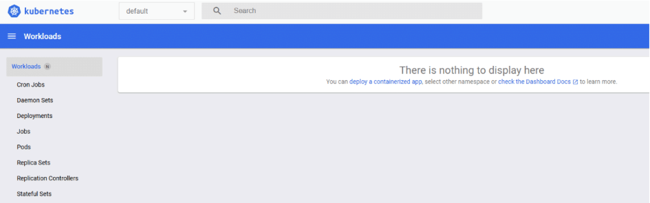
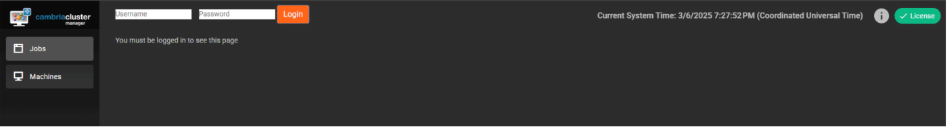
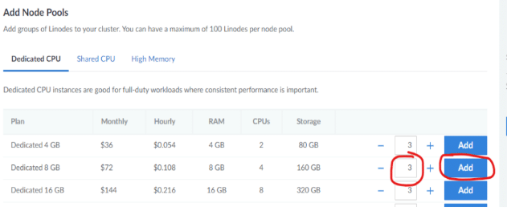

# Cambria Cluster / FTC 5.6.0 — Akamai Cloud Kubernetes Help Documentation

## Document History

| Version | Date       | Description                                   |
|---------|------------|-----------------------------------------------|
| 5.5.0   | 04/11/2025 | Updated for release 5.5.0.23529 (Linux)       |
| 5.6.0   | 10/31/2025 | Updated for release 5.6.0.26533 (Linux)       |

> *Download the online version of this document for the latest information and latest files. Always download the latest files.*

Do not move forward with the installation process if you do not agree with the End User License Agreement (EULA) for our products. You can download and read the EULA for Cambria FTC, Cambria Cluster, and Cambria License Manager from the links below:

- **Cambria Cluster** — <a href="https://www.dropbox.com/s/oemlax63aatjjiw/EULA_Cluster.pdf?dl=0">https://www.dropbox.com/s/oemlax63aatjjiw/EULA_Cluster.pdf?dl=0</a>  
- **Cambria FTC** — <a href="https://www.dropbox.com/s/ualv9usxsowh6m2/EULA_FTC.pdf?dl=0">https://www.dropbox.com/s/ualv9usxsowh6m2/EULA_FTC.pdf?dl=0</a>  
- **Cambria License Manager** — <a href="https://www.dropbox.com/s/1wg7ee7a59kzi8h/EULA_Cambria_License_Manager.pdf?dl=0">https://www.dropbox.com/s/1wg7ee7a59kzi8h/EULA_Cambria_License_Manager.pdf?dl=0</a>

### Limitations and Security Information

Cambria FTC, Cluster, and License Manager are installed on Linux Docker containers. Limitations and security checks for this version are included in the Linux document below (**informational only**; Kubernetes setup starts in **3. Create Kubernetes Cluster**).

- **Cambria FTC / Cluster (sections 8 and 9):**  
  <a href="https://www.dropbox.com/scl/fi/rvf02h8tajsxrfbhpgmzy/Linux_Cambria_FTC_5_6_0_Guide.pdf?rlkey=gtqeowx2b9gartth8s6dwo95j&st=4wpy1dfi&dl=0">https://www.dropbox.com/scl/fi/rvf02h8tajsxrfbhpgmzy/Linux_Cambria_FTC_5_6_0_Guide.pdf?rlkey=gtqeowx2b9gartth8s6dwo95j&st=4wpy1dfi&dl=0</a>

- **Important: Before You Begin
PDF documents have a copy/paste issue. For best results, download this document and any referenced PDF documents in this guide and open them in a PDF viewer such as Adobe Acrobat.  
For commands that are in more than one line, copy each line one by one and check that the copied command matches the one in the document.

When copying commands:

- If a command spans multiple lines, **copy each line individually**.
- After copying, **verify that the pasted command matches the text shown in the document**.

> **Information:** This document references **Kubernetes 1.34** only.

---

## ⚠️ Critical Information: Read Before Proceeding with Installation

Before starting the installation, carefully review the following considerations. Skipping this section
may result in errors, failed deployments, or misconfigurations.

1. **A New Kubernetes Cluster Will Be Deployed**  
● The installation process creates a brand-new Kubernetes cluster to keep the Cambria ecosystem
isolated from other applications.

2. **Default Installation is Non-Secure**  
● The guide covers installation with default settings in an open environment (not secure).  
● If you require a secure or customized setup, you will need Akamai Cloud expertise, which is not
covered in this guide.  
● Firewall information is provided in section 1.5. Firewall Information

3. **Understand Your Transcoding Requirements**  
● Know your expected transcoding volume, input/output specs, and whether a GPU is needed.  
● Refer to section 1.3. Akamai Cloud Machine Information and Benchmark for guidelines on machine
requirements.

4. **Administrative Rights Required**  
● Many of the steps in this guide require administrative rights to Akamai Cloud for adding permissions and
performing other administrative functions of that sort.

5. **Check Akamai Cloud Account Quota**  
● Ensure the Akamai Cloud account has sufficient quota to deploy Kubernetes resources.  
● See section 1.2. Resource Usage for estimated resource requirements.

6. **A Separate Linux Machine is Required**  
● A dedicated Linux machine (preferably Ubuntu on an Akamai Cloud Linode machine) is needed to
deploy Kubernetes.  
● Keeping Kubernetes tools and configuration files on a dedicated system is strongly recommended.

7. **Verify Region-Specific Resource Availability**  
● Not all Akamai Cloud regions support the same resources (e.g., GPU availability varies by region).  
● Consult Akamai Cloud documentation to confirm available resources in your desired region.


---

## Document Overview
The purpose of this document is to provide a walkthrough of the installation and initial testing process of the Cambria Cluster and Cambria FTC applications in the Kubernetes environment. The basic view of the document is the following:

1. Overview of the Cambria Cluster / FTC Environment in a Kubernetes Environment  
2. Preparation for the installation (Prerequisites)  
3. Create and configure the Kubernetes Cluster  
4. Install Cambria Cluster and Cambria FTC on the Kubernetes Cluster  
5. Verify the installation is working properly  
6. Test the Cambria Cluster / FTC applications  
7. Update the Cambria Cluster / FTC applications on Kubernetes Cluster  
8. Delete a Kubernetes Cluster  
9. Quick Reference of Kubernetes Installation  
10. Quick Reference of Important Kubernetes Components (URLs, template projects, test player, etc.)  
11. Glossary of important terms

---

## 1. Overview

### 1.1. Cambria Cluster / FTC Kubernetes Deployment

There are two major applications involved in this installation: **Cambria Cluster** and **Cambria FTC**.

**Cambria Cluster** This deployment is recommended to run on at least 3 nodes (replica = 3) with a service (Load Balancer) that exposes the application externally. For each of these nodes, Cambria Cluster will be installed on its own pod and designated to its own node. One node acts as the leader and the other two are replicas for the purpose of replacing the leader in the case it becomes inactive, corrupted, etc. Each Cambria Cluster pod has three containers::

1. **Cambria Cluster** (application)  
2. **Leader Elector** — that chooses which of the Cambria Cluster node / pod will be the leader  
3. **Cambria FTC Autoscaler** — that when the FTC autoscaler is enabled, it will automatically deploy worker nodes for encoding purposes based on the number of encoding jobs queued to the system. This is based on the calculation (rounded down):  
   
   **Number of Nodes to Deploy = (Number of Queued Jobs + 2) / 3**

Also for the Cluster deployment, there is a corresponding PostgreSQL database installed on a separate pod for each active Cambria Cluster pod. The data is replicated between the different database pods in order to preserve data in case of issues with the database and/or Cluster.

### Cambria FTC:

Capella’s Cambria FTC deployment consists of one or more nodes that (by default) are of different instance
types than the Cambria Cluster nodes. These nodes focus specifically on running encoding tasks. Similar to
Cambria Cluster, the Cambria FTC application is installed on its own pod and designated to its own node. Each
Cambria FTC pod has three containers:

1. Cambria FTC (application)
2. Auto-Connect FTC dotnet tool that does the following: 1. list pods, 2. attempts to find Cambria
Cluster, and 3. connects the Cambria FTC application running in the pod to the Cambria Cluster that it
found. This container also deletes its own node pool or recycles its node if no Cambria Cluster is found
within a specific time (~20 minutes)
3. Pgcluster database for storing its encoder's own job contents and other such information for as long
as the pod is running.

Each node in the Kubernetes Cluster will either be running the Cluster deployment or the FTC deployment.


### 1.2. Resource Usage

The resources used and their quantities will vary depending on requirements and different
environments. Below is general information about some of the major resource usage (other resources may be
used. Consult Akamai Cloud documentation for other resources created, usage limits, etc):

Akamai Cloud Documentation:  
https://techdocs.akamai.com/cloud-computing/docs/getting-started-with-lke-linode-kubernetes-engine

| Resource       | Details                                                                 |
|----------------|-------------------------------------------------------------------------|
| NodeBalancers  | 0–3 NodeBalancers (Manager WebUI, Manager Web Server, Grafana)<br/>0–1 NodeBalancer (Ingress) |
| Nodes          | X Cambria Manager Instances (Default is 3)<br/>Y Cambria FTC Instances (Depends on max FTC instance configuration; Default is 20) |
| Networking     | No VPCs are created                                                     |
| Security       | By default, no firewalls are created. However, Firewalls can be applied to the LKE cluster nodes for stricter security |

---

### 1.3. Akamai Cloud Machine Information and Benchmark

The following is a benchmark of two Akamai Cloud machines. The information below is as of October 2025.  
Note that the benchmark involves read from / write to Akamai ObjectStorage which influences the real-time speed of
transcoding jobs.

#### Benchmark Job Information

| Container | Codec   | Frame Rate | Resolution | Bitrate |
|-----------|---------|------------|------------|---------|
| Source    | TS H.264 | 30        | 1920 x 1080 | 8 Mbps |
| Output    | HLS/TS H.264 | 29.97 | 1920 x 1080 @ 4Mbps<br/>1280 x 720 @ 2.4Mbps<br/>640 x 480 @ 0.8Mbps<br/>320 x 240 @ 0.3Mbps | — |

---

## a. g6-dedicated-16 \[ AMD EPYC 7713 ]

### Machine Info

| Name            | RAM   | CPUs | Storage | Transfer | Network In/Out       | Cost per Hour             |
|-----------------|--------|------|---------|----------|------------------------|----------------------------|
| Dedicated 32 GB | 32 GB | 16   | 640 GB  | 7 TB     | 40 Gbps / 7 Gbps      | $0.432 (As of 10/15/2025) |

### Benchmark Results

- **# of Concurrent Jobs:** 2  
- **Real Time Speed:** For each job: 0.65x RT (slower than real-time)  
- **Throughput:** 1.30x RT (it takes around 47 seconds to transcode 1 minute of source)  
- **CPU Usage:** 100%

---

## b. g6-dedicated-56 \[ AMD EPYC 7713 ]

### Machine Info

| Name               | RAM     | CPUs | Storage | Transfer | Network In/Out       | Cost per Hour             |
|--------------------|----------|------|---------|----------|------------------------|----------------------------|
| Dedicated 256 GB   | 256 GB  | 56   | 5000 GB | 11 TB    | 40 Gbps / 11 Gbps     | $3.456 (As of 05/28/2024) |

### Benchmark Results

- **# of Concurrent Jobs:** 2  
- **Real Time Speed:** For each job: 1.56x RT (faster than real-time)  
- **Throughput:** 3.12x RT (it takes around 20 seconds to transcode 1 minute of source)  
- **CPU Usage:** ~90%

---

### Benchmark Findings

The results show the g6-dedicated-56 has higher overall throughput. This is expected as the instance has
more processing power than the g6-dedicated-16. However, if you take into account the cost per hour for
each machine, the more cost efficient option is to go with the **g6-dedicated-16**.


### 1.4. Cambria Application Access
The Cambria applications are accessible via the following methods:

#### 1.4.1. External Access via TCP Load Balancer
The default Cambria installation configures the Cambria applications to be exposed through load balancers.
There is one for the Cambria Manager WebUI + License Manager, and one for the web / REST API server. The
load balancers are publicly available and can be accessed either through its public ip address or domain name,
and the application's TCP port.

Examples:

Cambria Manager WebUI:

https://44.33.212.155:8161  
Cambria REST API:  
https://121.121.121.121:8650/CambriaFC/v1/SystemInfo  

External access in this way can be turned on / off via a configuration variable. See **4.2. Creating and Editing
Helm Configuration File**. If this feature is disabled, another method of access will need to be configured.

### 1.4.2. HTTP Ingress via Reverse Proxy

In cases where the external access via TCP load balancer is not acceptable or for using a purchased domain
name from servicers such as GoDaddy, the Cambria installation provides the option to expose an ingress.

Similar to the external access load balancers, the Cambria Manager WebUI and web / REST API server are
exposed. However, only **one** IP address / domain name is needed in this case.

How it works is that the Cambria WebUI is exposed through the subdomain **webui**, the Cambria web server
through the subdomain **api**, and Grafana dashboard through the subdomain **monitoring**. The following is an
example with the domain **mydomain.com**:

- Cambria Manager WebUI:  
  https://webui.mydomain.com  
- Cambria REST API:  
  https://api.mydomain.com  
- Grafana Dashboard:  
  https://monitoring.mydomain.com  

Capella provides a default ingress hostname for testing purposes only. In production, the default hostname, SSL
certificate, and other such information needs to be configured. More information about ingress configuration is
explained later in this guide.


### 1.5. Firewall Information
By default, this guide creates a kubernetes cluster with default settings which do not include a
Firewall. For custom / non-default configurations, or to explore with a more restrictive network based on the
default virtual network created, the following is a list of known ports that the Cambria applications use:

| Port(s) | Protocol | Direction | Description |
|--------:|:--------:|:---------:|-------------|
| 8650 | TCP | Inbound | Cambria Cluster REST API |
| 8161 | TCP | Inbound | Cambria Cluster WebUI |
| 8678 | TCP | Inbound | Cambria License Manager Web Server |
| 8481 | TCP | Inbound | Cambria License Manager WebUI |
| 9100 | TCP | Inbound | Prometheus System Exporter for Cambria Cluster |
| 8648 | TCP | Inbound | Cambria FTC REST API |
| 3100 | TCP | Inbound | Loki Logging Service |
| 3000 | TCP | Inbound | Grafana Dashboard |
| 443  | TCP | Inbound | Capella Ingress |
| ALL  | TCP/UDP | Outbound | Allow all outbound traffic |

Also, for Cambria licensing, any Cambria Cluster and Cambria FTC machine requires that at least the following
domains be exposed in your firewall (both inbound and outbound traffic):

| Domain                       | Port(s) | Protocol | Traffic | Description              |
|------------------------------|---------|----------|---------|--------------------------|
| api.cryptlex.com            | 443     | TCP      | In/Out  | License Server           |
| cryptlexapi.capellasystems.net | 8485 | TCP      | In/Out  | License Cache Server     |
| cpfs.capellasystems.net     | 8483    | TCP      | In/Out  | License Backup Server    |

### 1.6. Specifications for Linux Deployment Server

In order to deploy Cambria FTC, a Linux Deployment Server is required because this is where all of the tools,
dependencies, and packages for the Cambria FTC Kubernetes deployment will be installed and/or stored. If you
already have a deployment server, you can skip this section.

Important: Linux Deployment Server Machine Information  
The instructions in this document perform functions using a root user. To keep things consistent, Capella
strongly recommends using Akamai Linode instances for the deployment process.

Capella tests deployment with the Dedicated 4GB (g6-dedicated-2) instance type  

Minimum Requirements:  
Operating System (OS): Ubuntu 24.04  
CPU(s): 2  
RAM: 2 GB  
Storage: 10 GB  

## 2. Prerequisites

The following steps need to be completed before the deployment process.

### 2.1. Linux Tools

This guide uses curl, unzip, and jq to run certain commands and download the required tools and applications.
Therefore, the Linux server used for deployment will need to have these tools installed.

Example with Ubuntu 24.04:

```bash
sudo apt update && \
sudo DEBIAN_FRONTEND=noninteractive apt -o Dpkg::Options::="--force-confold" -y upgrade && \
sudo DEBIAN_FRONTEND=noninteractive apt -o Dpkg::Options::="--force-confold" -y install curl unzip jq
```

### 2.2. Cambria FTC Package

The components of this installation are packaged in a zip archive. Download it using the following command:

```bash
curl -o CambriaClusterKubernetesAkamai_5_6_0.zip -L \
"https://www.dropbox.com/scl/fi/58x4oeiijhf3au3hnit38/CambriaClusterKubernetesAkamai_5_6_0.zip?rlkey=\
uppqqa29s9yresdk2xk7qh7lt&st=s2mus6im&dl=0"
```

```bash
unzip -o CambriaClusterKubernetesAkamai_5_6_0.zip && chmod +x *.sh ./bin/*.sh
```

Important: the scripts included have been tested with Ubuntu. They may work with other Linux distributions
but not tested


#### 2.2.1. Kubernetes Tools: kubectl, helm, linode‑cli
There are 2 options available for installing the kubernetes required tools for deployment to Akamai Cloud:

**Option 1 (script, verified on Ubuntu):**
```bash
./bin/installKubeTools.sh && ./bin/installKubeToolsAkamai.sh
```
> If successful, use a new terminal window or restart the terminal window where the above steps were run

**Option 2 (manual):**  
- kubectl — <a href="https://kubernetes.io/docs/tasks/tools/">https://kubernetes.io/docs/tasks/tools/</a>  
- helm — <a href="https://helm.sh/docs/intro/install/">https://helm.sh/docs/intro/install/</a>  
- linode‑cli — <a href="https://techdocs.akamai.com/cloud-computing/docs/install-and-configure-the-cli">https://techdocs.akamai.com/cloud-computing/docs/install-and-configure-the-cli</a>

#### 2.2.2. Verification
If any of the commands below fail, review the installation instructions for the failing tool and try again:

```bash
kubectl version --client && helm version && linode-cli --version
```

---

## 3. Create Kubernetes Cluster (Akamai LKE)
The following section provides the basic steps needed to create a Kubernetes Cluster on Akamai Cloud.


### 3.1. Create LKE Cluster and Cambria Cluster Node Group

In the Akamai Cloud Dashboard, go to Kubernetes and Create Cluster and configure as follows:

|---|---|
| Cluster Label | e.g., `cambria-cluster` |
| Cluster Tier | LKE In most cases, this should be LKE |
| Region | e.g., Your region of operation (Eg. US, Los Angeles, CA (us-lax)) |
| Kubernetes Version | **1.34** |
| Akamai App Platform | No |
| HA Control Plane | For testing, set to No. For production, it is recommended to set this to Yes (Incurs additional cost. See Akamai documentation) |
| Control Plane ACL | Only enable this if you already know which IP CIDRs will need access to the LKE control plane. Otherwise, leave as is Only if you know allowed CIDRs |

> Do **not** create the cluster yet; add nodegroups first.

#### 3.1.1. Cambria Cluster Nodegroup (Managers)

One set of nodes that need to be added are the Cambria Cluster nodes. These are also referred to as the
Manager Nodes. At least one Cambria Cluster node needs to be running at all times in the Kubernetes cluster.  
To create these nodes, select the number of nodes to assign to the Cambria Cluster node pool in the Add Node
Pools section

#### Information / Recommendation

Cambria Cluster manages scheduling and handling Cambria FTC encoding / packaging programs. Think about
how many programs will be intended to run and choose an instance type accordingly. The lowest recommended
machine type for the manager machines is **Dedicated 8GB**.

It is also recommended to set the node count to **3**. This is because **1 of the nodes will act as the Cambria
Cluster node** while the other **2 nodes act as backup** (web server and database are replicated / duplicated).
If the Cambria Cluster node goes down or stops responding, one of the other two nodes will take over as the
Cambria Cluster node. Depending on your workflow(s), think about how many backup nodes may be needed.

**Plan:** Dedicated 8GB (this is the recommended plan, but can be configured as needed)  
**Nodes:** 3 (this is the recommended for manager redundancy, but can be configured as needed)


#### 3.1.2. Create Cambria FTC Node Group(s) (Workers)
Skip this step if planning to use Cambria FTC's autoscaler. Run the following steps to create the Node
Group(s) for the worker application instances (replace the highlighted values to those of your specific
environment):

#### Information / Recommendation

For this particular case, **Cambria FTC nodes need to be added manually**. Therefore, you will need to think
about what machine / instance types are needed for running the Cambria FTC workflows. Based on benchmarks  
(See **1.3. Akamai Cloud Machine Information and Benchmark**), the recommended machine / instance type
to get started is **g6-dedicated-16**.

To get started, it is recommended to start with **one instance**. This way, when the installation is complete,
there will already be one Cambria FTC instance available to test with. The number of instances can always be
scaled up or down, up to the maximum FTC instance count configured in  
**section 4.2. Creating and Editing Helm Configuration File**.

**Plan:** Dedicated 32GB (this is the recommended plan, but can be configured as needed)  
**Nodes:** 1+

#### 3.1.3. Deploy the Kubernetes Cluster

1. After selecting the initial node group(s), create the cluster. This will begin the LKE cluster deployment with
the initial nodes.
  
It may take a few minutes for everything configured so far to be in a usable state. Wait for the nodes to all have
a Status of Running. 
 
2. Once the LKE Cluster is running, labels need to be added to the Cambria Cluster node pool:
a. In the Akamai Cloud Dashboard, go into the kubernetes cluster and look for the Cambria Cluster
node pool 
b. Select Labels and Taints and Add Label. In the Label field, enter capella-manager: true and then
save the changes  

3. Only if you added Cambria FTC nodes, do the following:
a. In the Akamai Cloud Dashboard, go to the kubernetes cluster and look for the Cambria FTC node pool
b. Select Labels and Taints and Add Label. In the Label field, enter capella-worker: true and then
save the changes

4. (Optional) If you want Cambria Cluster nodes to also be able to run encoding jobs, set this label on the
Cambria Cluster node pool as well: capella-worker: true

5. Copy the contents of the Kubeconfig file:
a. In the Linux Deployment Server, run the following commands (replace cambria-cluster with the
Kubernetes Cluster's name):  
export CLUSTER_NAME=cambria-cluster && nano $CLUSTER_NAME-kubeconfig.yaml  
b. In the Akamai dashboard, navigate to the Kubernetes cluster that was created. In the Kubeconfig
section, click on View and copy the contents  
c. In the Linux Deployment Server, paste the kubeconfig contents. Save the file by holding CTRL/CMD
+ X, pressing the letter 'y', and then the Enter/Return key  

6. Still in the Linux Deployment Server, set the KUBECONFIG environment variable for terminal interaction
with the LKE cluster:  
export KUBECONFIG=$CLUSTER_NAME-kubeconfig.yaml

7. Verify that kubectl works with the cluster  
kubectl get nodes

```text
NAME STATUS ROLES AGE VERSION
lke525068-759150-2bfe0e460000 Ready <none> 20m v1.34.0
lke525068-759150-4661256b0000 Ready <none> 20m v1.34.0
lke525068-759150-5d7b909a0000 Ready <none> 20m v1.34.0```


8. Back in the Akamai dashboard in the LKE cluster, click on Copy Token. Then, on Kubernetes Dashboard, use the token to log in to the dashboard

This will show details about the LKE cluster in its current state. This dashboard can be used to view and manage
the LKE cluster from a graphical point of view.



#### 3.1.4. Default Storage Class
Set the storage class linode-block-storage as the default storage class:

```bash
kubectl patch storageclass linode-block-storage \
  -p '{"metadata": {"annotations": {"storageclass.kubernetes.io/is-default-class": "true"}}}'
```

### 3.2. \[BETA] GPU Operator for NVENC (optional)
This section is only required for a Kubernetes cluster that will use GPUs. Skip this step if GPUs will
not be used in this Kubernetes cluster.

> **BETA Feature:** GPU can be used in Cambria Cluster/FTC. However, this feature is still a work in progress and may not function as expected.
> **Limitation: Cambria FTC Autoscaler** This feature currently does not work with the FTC autoscaler

In your command prompt / terminal, run the following commands to deploy the GPU Operator to the Kubernetes
cluster:


```bash
helm repo add nvidia https://helm.ngc.nvidia.com/nvidia; \
helm repo update; \
helm install nvidia-operator nvidia/gpu-operator \
  --create-namespace \
  --namespace gpu-operator
```

Wait at least 5 minutes for the GPU operator to install completely

Run this command with 'kubectl' and make sure that all of the pods are in a Running or Completed state:
kubectl get pods -n gpu-operator

If any pod is still in an Init state or PodCreating state, wait another 5 minutes to see if the pods will complete
their install process.

For any pods that are in an errored state or that are still in an Init state after 10 minutes, do the following:

a. Check that at least one node is one of the supported Akamai Cloud GPU instances

b. Use the following command to check the state of a failing pod (check the Events section):

kubectl describe pod `<your-pod-name>` -n gpu-operator

Either look up the error for a potential solution or send the entire Events section to the Capella support team for
investigation.

### 3.3. Application Ingress: ingress‑nginx
By default, certain parts of the Cambria applications are exposed via an ingress. In order to access these, the
ingress-nginx service needs to be created and attached to the ingress via. This is done via a reverse-proxy.

1. Run the following command:
```bash
kubectl apply -f https://raw.githubusercontent.com/kubernetes/ingress-nginx/controller-v1.13.0/deploy/static/provider/cloud/deploy.yaml
kubectl get all -n ingress-nginx
```

2. Verify that the resources are created and in an active / online state:
- Pods should be in a Running STATUS and all containers in READY should be active
- Services should have a CLUSTER-IP assigned. The ingress-nginx-controller should have an EXTERNAL-IP
- All other resources (Eg. replicasets, deployments, statefulsets, etc) should have all desired resources active.
  
<a href="https://www.dropbox.com/scl/fi/kxt7tnv9q18fqjmjjuwrc/Cambria_Kubernetes_Domain_DNS_Guide.pdf?rlkey=mvm4jnplyji95snq4109noiwj&st=6a7nial5&dl=0">https://www.dropbox.com/scl/fi/kxt7tnv9q18fqjmjjuwrc/Cambria_Kubernetes_Domain_DNS_Guide.pdf?rlkey=mvm4jnplyji95snq4109noiwj&st=6a7nial5&dl=0</a>

If any resources are still not ready, wait about a minute for them to complete. If still not complete, contact the
Capella support team.

### 3.4. Performance Metrics and Logging
This section is required for logging and other performance information about the Cambria
applications.

Install **Prometheus, Grafana, Loki, Promtail**:  
<a href="https://www.dropbox.com/scl/fi/cb75lsh6ipvbf0x1y4ysp/Prometheus_Grafana_Setup_for_Cambria_Cluster_5_6_0_on_Akamai_Kubernetes.pdf?rlkey=kcxit4i6ntj5ynv2e26zydhiy&st=douvkvi9&dl=0">https://www.dropbox.com/scl/fi/cb75lsh6ipvbf0x1y4ysp/Prometheus_Grafana_Setup_for_Cambria_Cluster_5_6_0_on_Akamai_Kubernetes.pdf?rlkey=kcxit4i6ntj5ynv2e26zydhiy&st=douvkvi9&dl=0</a>

---

## 4. Install Cambria Cluster, FTC, and Dependencies

### 4.1. Prerequisite: Deploy External Kubernetes Tools
There are a few tools that need to be deployed in order to make Cambria FTC / Cluster work properly.

```bash
./bin/deployCambriaKubeDependencies.sh

kubectl get all -n cnpg-system
kubectl get all -n argo-events
kubectl get all -n cert-manager
```

### 4.2. Creating and Editing Helm Configuration File

With Helm and Kubectl installed on the Linux deployment server, create the Helm configuration file (yaml) that
will be used to deploy Cambria Cluster / FTC to the Kubernetes environment.
1. In a command line / terminal window, run the following command to create the configuration file:

2. Open the configuration file in your favorite text / document editor and edit the following values:

```bash
helm show values ./config/capella-cluster-0.5.4.tgz > cambriaClusterConfig.yaml
nano cambriaClusterConfig.yaml
```

2. Open the configuration file in your favorite text / document editor and edit the following values:


Blue: values in <span style={{ color: 'blue' }}>Blue</span> will be given to you by Capella.  
Red: values in <span style={{ color: 'red' }}>Red</span> are proprietary values that need to be changed based on your specific environment.

| **Field / Key** | **Value (Example)** | **Description** |
|-----------------|----------------------|------------------|
| **workersUseGPU** | `false` | Allow workers to use NVIDIA GPU. Set to **true** for GPU / NVENC workflows; otherwise leave as false. |
| **nbGPUs** | `1` | Number of GPUs available on the worker nodes. Only used when `workersUseGPU=true`. **Note:** More than 1 GPU requires multi-GPU support in the Cambria license. |
| **enableManagerWebUI** | `true` | Deploys the Cambria Manager WebUI. Set to false if you do not plan to use the WebUI. |
| **ftcEnableAutoScaler** | `true` | Deploy the Cambria FTC autoscaler, which spawns FTC encoders based on queue size. Set to false to add FTC nodes manually. |
| **ftcEnableScriptableWorkflow** | `true` | Enables Scriptable Workflow system used in Cambria FTC Jobs. |
| **ftcInstanceType** | `"g6-dedicated-16"` | Instance type for autoscaled Cambria FTC nodes. Default is `g6-dedicated-16`. Check Akamai Cloud documentation for available types. |
| **maxFTCInstances** | `20` | Maximum number of Cambria FTC encoder instances that can be spawned. Default is 20. |
| **pgInstances** | `3` | Number of PostgreSQL database replicas. Must match `cambriaClusterReplicas` and number of nodes created in Step 1. |
| **cambriaClusterReplicas** | `3` | Number of Cambria Cluster instances. Must match `pgInstances` and the node count. |
| **externalAccess.exposeStreamServiceExternally** | `true` | Set to true to access Cambria Cluster externally. |
| **externalAccess.enableIngress** | `true` | Enables nginx ingress. |
| **externalAccess.hostName** | `myhost.com` | Domain name for ingress. Must be replaced with a real domain for production. |
| **externalAccess.acmeRegistrationEmail** | `test@example.com` | Email used for Automated Certificate Management (Let's Encrypt). Must be a valid email for production. |
| **externalAccess.acmeServer** | `https://acme-staging-v02.api.letsencrypt.org/directory` | ACME TLS certificate server. Provided staging value is for testing only. |
| **secrets.pgClusterPassword** | `"xrtVeQ4nN82SSiYHoswqdURZ…”"` | Password for PostgreSQL database. Should be changed to a strong password. |
| **secrets.ftcLicenseKey** | `"2XXXXX-XXXXXX-XXXXXX-XXXXXX-XXXXXX-XXXXXX"` | FTC product license key. Replace placeholder with the real key provided by Capella. |
| **secrets.cambriaClusterAPIToken** | `"12345678-1234-43f8-b4fc-53afd3893d5f"` | Token for making API calls to Cambria Cluster. Change to your environment’s token. Allowed characters: letters, numbers, underscores, dashes. |
| **secrets.cambriaClusterWebUIUser** | `"admin,defaultWebUIUser,RZvSSd3ffsElsCEEe9"` | WebUI login credentials in the form: `role,username,password`. Multiple users allowed, separated by commas. Roles: **admin**, **user**, **viewer**. |
| **secrets.akamaiCloudAPIToken** | `"d02732530a2bcfd4d028425eb55f366f74631…”"` | Akamai Cloud API token. Needed for horizontal scaling. |
| **secrets.argoEventWebhookSourceBearerToken** | `"L9Em5WIW8yth6H4uPtzT"` | Token used for argo-events workflows. Can be any value. |
| **optionalInstall.enableEventing** | `true` | Enables eventing. | This is used for enabling / disabling the argo-events feature.


### 4.3. Installing Cambria FTC / Cluster
Wait at least 5 minutes after installing prerequisites before moving on to this step. In a command line
/ terminal window, run the following command:

```bash
helm upgrade --install capella-cluster ./config/capella-cluster-0.5.4.tgz --values cambriaClusterConfig.yaml
```

The result of running the command should look something like this:

```bash
./bin/getFtcInfo.sh
```

2. At this point, several components are being deployed to the Kubernetes environment. Wait a few minutes
for everything to be deployed.
3. Get important information about the Cambria Stream Manager deployment:
./bin/getFtcInfo.sh

---

## 5. Verify Cambria FTC / Cluster Installation

### 5.1. Verify Cambria Cluster Deployment
Important: The components below are only a subset of the whole installation. These are the components
considered as key to a proper deployment.

1. Run the following command:

```bash
kubectl get all -n default
```

2. Run the following command:

| Resources  | Content |
|------------|---------|
| Deployments | - 1 cambriaclusterapp deployment with all items active<br/>- 1 cambriaclusterwebui deployment with all items active |
| Pods | - X pods with cambriaclusterapp in the name (X = # of replicas specified in config file)<br/>with all items active / Running<br/>- 1 pod with cambriaclusterwebui in the name |
| Services | - 1 service named cambriaclusterservice. If exposeStreamServiceExternally is true,<br/>this should have an EXTERNAL-IP<br/>- 1 service named cambriaclusterwebuiservice. If exposeStreamServiceExternally is<br/>true, this should have an EXTERNAL-IP |


3. If any of the above are not in an expected state, wait a few more minutes in case some resources take longer than
expected to complete. If after a few minutes there are still resources in an unexpected state, contact the Capella
support team.
4. Run the following command for the pgcluster configuration:

```bash
kubectl get all -n capella-database
```

5. Verify the following information:

| Resources | Content |
|------------|----------|
| Pods | - X pods with pgcluster in the name (X = # of replicas specified in config file) with all items active / Running |
| Services | - 3 services with pgcluster in the name with a CLUSTER-IP assigned |


### 5.2. Verify Cambria FTC Deployment
Important: The components below are only a subset of the whole installation.These are the components
considered as key to a proper deployment.

1. Run the following command:

```bash
kubectl get all -n capella-worker
```

2. Verify the following information:

| Resources | Content |
|------------|----------|
| Pods | - X pods with cambriaftcapp in the name (X = Max # of FTCs specified in the config file)<br/><br/>**Notes:**<br/>1. If using Cambria FTC autoscaler, all of these pods should be in a pending state. Every time the autoscaler deploys a Cambria FTC node, one pod will be assigned to it.<br/>2. If not using Cambria FTC autoscaler, Y of the pods should be in an active / running state and all containers running (Y = # of Cambria FTC nodes active). |
| Deployments | - 1 cambriaftcapp deployment. |

3. If any of the above are not in an expected state, wait a few more minutes in case some resources take longer than
expected to complete. If after a few minutes there are still resources in an unexpected state, contact the Capella
support team.

### 5.3. Verify Applications are Accessible

#### 5.3.1. Cambria Cluster WebUI
Skip this step if the WebUI was set to disabled in the Helm values configuration yaml file or the
ingress will be used instead. For any issues, contact the Capella support team

1. Get the WebUI address. A web browser is required to access the WebUI:

**Option 1: External URL (if enabled):**

Run the following command:

```bash
kubectl get svc/cambriaclusterwebuiservice -n default -o=jsonpath="{'https://'}{.status.loadBalancer.ingress[0].hostname}{':8161'}{'\n'}"
```
The response should look something like this:
https://192.122.45.33:8161

Option 2: Non-External Url Access
Run the following command to temporarily expose the WebUI via port-forwarding:

```bash
kubectl port-forward -n default svc/cambriaclusterwebuiservice 8161:8161 --address=0.0.0.0
# URL: https://`<server>`:8161
```

The url depends on the location of the web browser. If the web browser and the port-forward are on the
same machine, use localhost. Otherwise, use the ip address of the machine with the port-forward:

https://``<server>``:8161                   

2. In a web browser, enter the above url. This should trigger an "Unsafe" page similar to the one below:


3. Click on Advanced and Proceed to [ EXTERNAL IP ] (unsafe). This will show the login page.


4. Log in using the credentials created in the Helm values yaml file (See cambriaClusterWebUIUser)

#### 5.3.2. Cambria Cluster REST API
Skip this step if the ingress will be used instead of external access or any other type of access. For
any issues, contact the Capella support team.

1. Get the REST API address:

**Option 1: External Url if External Access is Enabled

Run the following command:


```bash
kubectl get svc/cambriaclusterservice -n default -o=jsonpath="{'https://'}{.status.loadBalancer.ingress[0].hostname}{':8650'}{'\n'}"
```

The response should look something like this:
https://192.122.45.33:8650

**Option 2: Non-External Url Access

Run the following command to temporarily expose the REST API via port-forwarding:

```bash
kubectl port-forward -n default svc/cambriaclusterservice 8650:8650 --address=0.0.0.0
curl -k -X GET https://`<server>`:8650/CambriaFC/v1/SystemInfo
```
The url depends on the location of the port-forward. If the web browser and the port-forward are on the
same machine, use localhost. Otherwise, use the ip address of the machine with the port-forward:

https://`<server>`:8650

2. Run the following API query to check if the REST API is active:
curl -k -X GET https://`<server>`:8650/CambriaFC/v1/SystemInfo

#### 5.3.3. Cambria License WebUI
Skip this step if the ingress will be used instead of external access or any other type of access. The
Cambria license needs to be active in all entities where the Cambria application is deployed. Run the following
steps to check the cambria license. Access to a web browser is required:

1. Get the url for the License Manager WebUI:

**Option 1: External Url if External Access is Enabled

Run the following command:

```bash
kubectl get svc/cambriaclusterwebuiservice -n default -o=jsonpath="{'https://'}{.status.loadBalancer.ingress[0].hostname}{':8481'}{'\n'}"
```
The response should look something like this:
https://192.122.45.33:8481

**Option 2: Non-External Url Access

Run the following command to temporarily expose the License WebUI via port-forwarding:

```bash
kubectl port-forward -n default svc/cambriaclusterwebuiservice 8481:8481 --address=0.0.0.0
# URL: https://`<server>`:8481
```
The url depends on the location of the port-forward. If the web browser and the port-forward are on the
same machine, use localhost. Otherwise, use the ip address of the machine with the port-forward:

https://`<server>`:8481

Proceed past the unsafe warning; sign in with `cambriaClusterWebUIUser`. Ensure License Status is valid (Primary and/or Backup).

2. In a web browser, enter the above url. This should trigger an "Unsafe" page similar to the one below:



3. Click on Advanced and Proceed to [ EXTERNAL IP ] (unsafe). This will show the login page.



4. Log in using the credentials created in the Helm values yaml file (See cambriaClusterWebUIUser)

5. Verify that the License Status is valid for at least either the Primary or Backup. Preferably, both Primary and
Backup should be valid. If there are issues with the license, wait a few minutes as sometimes it takes a few minutes
to properly update. If still facing issues, contact the Capella support team.

#### 5.3.4. Cambria Ingress
Skip this step if not planning to test with Cambria's ingress. For any issues, contact the Capella support
team.

##### 5.3.4.1. Get the Ingress Endpoints
There are two ways to use the ingress:

**Option 1: Using Default Testing Ingress
Only use this option for testing purposes. Skip to option 2 for production. In order to use the
ingress in the testing state, the hostname needs to be DNS resolvable on the machines that will need
access to the Cambria applications.

1. Get the ingress HOSTS and ADDRESS:

```bash
kubectl get ingress -A
```
The response should look similar to the following:

_Example output:_

```
NAMESPACE    NAME                       CLASS   HOSTS                              ADDRESS      PORTS  AGE
default      cambriaclusteringress      nginx   api.mydomain.com,webui.mydomain.com 55.99.103.99 80,443 23m
monitoring   cambriamonitoringingress   nginx   monitoring.mydomain.com             55.99.103.99 80,443 58m
```

2. In your local server(s) or any other server(s) that need to access the ingress, edit the hosts file (in
Linux, usually /etc/hosts) and add the following lines (Example):


```
55.99.103.99  api.mydomain.com
55.99.103.99  webui.mydomain.com
55.99.103.99  monitoring.mydomain.com
```

**Option 2 (production):** Use a publicly registered domain and proper DNS/TLS (see DNS guide above).
Contact Capella if unable to set up a purchased domain with the ingress. If the domain is set up,
the endpoints needed are the following:

Example with mydomain.com as the domain:

#### 5.3.4.2. Test Ingress Endpoints
If using the test ingress, these steps can only be verified in the machine(s) where the hosts file was
modified. This is because the test ingress is not publicly DNS resolvable and so only those whose
hosts file (or DNS) have been configured to resolve the test ingress will be able to access the
Capella applications in this way.

1. Test Cambria Cluster WebUI with the ingress that starts with webui. Run steps 2-3 of 5.3.1. Cambria Cluster
WebUI. Example:
https://webui.myhost.com

2. Test Cambria REST API with the ingress that starts with api. Run step 2 of 5.3.2. Cambrai Cluster REST API.
Example:
https://api.myhost.com/CambriaFC/v1/SystemInfo

3. Test Grafana Dashboard with the ingress that starts with monitoring. Run the verification steps for the
Grafana Dashboard section 1.4. Verify Grafana Deployment (steps 2-4) in the document in 3.7. Performance
Metrics and Logging. Example:
https://monitoring.myhost.com
---

## 6. Testing Cambria FTC / Cluster
The following guide provides information on how to get started testing the Cambria FTC / Cluster software:

See:  
<a href="https://www.dropbox.com/scl/fi/ymu5fln1n811a1i92radv/Cambria_Cluster_and_FTC_5_6_0_Kubernetes_User_Guide.pdf?rlkey=cd0unkt9hcs3mhjp1fjbcvi9n&st=fb030h8o&dl=0">https://www.dropbox.com/scl/fi/ymu5fln1n811a1i92radv/Cambria_Cluster_and_FTC_5_6_0_Kubernetes_User_Guide.pdf?rlkey=cd0unkt9hcs3mhjp1fjbcvi9n&st=fb030h8o&dl=0</a>

---

## 7. Updating / Upgrading Cambria Cluster / FTC
There are currently two ways to update / upgrade Cambria FTC / Cluster in the kubernetes environment.

### 7.1. Option 1 — Normal Upgrade (Helm Upgrade)
This upgrade method is best for when changing version numbers, secrets such as the license key, WebUI users,
etc, and Cambria FTC | Cambria Cluster specific settings such as max number of pods, replicas, etc.

> **Known issues:** `pgClusterPassword` and PostgreSQL version cannot be changed via this method.

1. Edit the Helm configuration file (yaml) for your Kubernetes environment or create a new configuration file
and edit the new file. See section 4.2. Creating and Editing Helm Configuration File for more details.

2. Run the following command to apply the upgrade

```bash
helm upgrade capella-cluster ./config/capella-cluster-0.5.4.tgz --values cambriaClusterConfig.yaml

3. Restart the deployments

kubectl rollout restart deployment cambriaclusterapp cambriaclusterwebui -n default
kubectl rollout restart deployment cambriaftcapp -n capella-worker
```

### 7.2. Option 2 — Reinstall (Deletes DB and Jobs)
For any upgrade cases for the Cambria Cluster | Cambria FTC environment, this is the most reliable option. This
upgrade option basically uninstalls all of the Cambria FTC and Cluster components and then reinstall with the
new Helm chart and values (.yaml) file. As a result, this will delete the database and delete all of your
jobs in the Cambria Cluster UI.

1. Follow section 4.2. Creating and Editing Helm Configuration File to download and edit your new
cambriaClusterConfig.yaml file.

2. In a command line / terminal window in your local server, run the following command:

```bash
helm uninstall capella-cluster --wait

3. Deploy the Helm configuration file with the following command

helm upgrade --install capella-cluster ./config/capella-cluster-0.5.4.tgz --values cambriaClusterConfig.yaml
```

### 7.3. Upgrade Verification

The best way to verify the upgrade is to use the steps in 5.0. Verify Cambria FTC / Cluster Installation. For any
issues, contact the Capella support team.

---

## 8. Deleting Kubernetes Cluster
Many resources are created in a Kubernetes environment. It is important that each step is followed carefully:

1. Run the following commands to remove the Helm deployments:

```bash
helm uninstall capella-cluster -n default --wait
```
2. If any volumes are remaining, run the following command:

```bash
kubectl get pv -o name | awk -F'/' '{print $2}' | xargs -I{} kubectl patch pv {} -p='{"spec": {"persistentVolumeReclaimPolicy": "Delete"}}'
```
3. Delete the ingress controller:

Delete ingress controller:

```bash
kubectl delete namespace ingress-nginx
```

4. Run the following commands to uninstall the monitoring deployment:

`<install_type>:` the loki install type. If the S3 loki version was installed, use 's3_embedcred'. If the Filesystem
loki version was installed, use 'local'

```bash
./bin/quickDestroyMonitoring.sh <install_type>   # 's3_embedcred' or 'local'
```

5. In the Oracle Cloud dashboard, search for OKE. Look for your kubernetes cluster and click into it for more
details.

7. In the Akamai Cloud Home page, go into the Kubernetes Cluster and Delete Cluster
Wait several minutes for the Kubernetes Cluster to delete completely.

---

## 9. Quick Reference: Installation, Testing, and Teardown

### 9.1. Installation (Terraform quick path)
For quick installation, use the Terraform installation instructions:

<a href="https://www.dropbox.com/scl/fi/0vhx8634n6s12qjwxw25f/Cambria_Cluster_and_FTC_5_6_0_Terraform_on_Akamai_Kubernetes.pdf?rlkey=xamh1hkjbli55mwfm6gs67tti&st=yp5057bh&dl=0">https://www.dropbox.com/scl/fi/0vhx8634n6s12qjwxw25f/Cambria_Cluster_and_FTC_5_6_0_Terraform_on_Akamai_Kubernetes.pdf?rlkey=xamh1hkjbli55mwfm6gs67tti&st=yp5057bh&dl=0</a>

### 9.2. Upgrades and Teardown

**9.2.1. Cambria FTC | Cambria Cluster and/or the Kubernetes Cluster Upgrades
Edit the capellaClusterConfig.yaml file and then run the following commands (See section 7. Updating /
Upgrading Kubernetes Cluster for more details and warnings):

- **Upgrade helper:**
  ```bash
  ./quickUpgradeCambriaCluster.sh
  ```
  
 **9.2.2. Cambria FTC | Cambria Cluster Uninstall
If just wanting to uninstall Cambria Cluster and Cambria FTC, run the following command:

- **Uninstall apps only:**
  ```bash
  helm uninstall capella-cluster --wait
  ```
  
**9.2.3. Kubernetes Cluster Teardown
As this involves several components, it is best to do the cluster teardown using the steps in section 8. Deleting
Kubernetes Cluster.

---

## 10. Quick Reference: Helpful Commands / Info (Post‑Install)
This section provides helpful commands and other information that may be useful after the installation process
such as how to get the WebUI address, what ports are available to use for incoming sources, etc.

**General Cambria FTC Deployment Info**
Requires the Cambria FTC Package from 2.2. Cambria FTC Package and all of the prerequisites.

```bash
./bin/getFtcInfo.sh
```
Adding Extra Cambria FTC Nodes

1. Go to your kubernetes cluster in the Akamai Cloud dashboard and Add A Node Pool. Select a Plan and
number of nodes to add. Add Pool.

2. In the new node pool's "..." settings, choose Labels and Taints. In the Labels, add a new Node Label:

```bash
kubectl label node `<node-name>` capella-worker=true
```
3. Save Changes

## Adding Extra Cambria Manager Nodes

1. Go to your kubernetes cluster in the Akamai Cloud dashboard and Add A Node Pool. Select a Plan and
number of nodes to add. Add Pool.

2. In the new node pool's "..." settings, choose Labels and Taints. In the Labels, add a new Node Label:

```bash
kubectl label node `<node-name>` capella-manager=true
```

3. Save Changes

## Setting Cambria FTC Label on New Nodes
For any node that should be an encoding node:

1. Find out which node(s) will be used as Cambria FTC nodes:

**Kubeconfig** — copy from Akamai console (Clusters → Kubeconfig).

2. Apply the following label to each of those nodes:
```bash
kubectl label node ``<node-name>`` capella-worker=true
```

## Setting Cambria Cluster Label on New Nodes
For any node that should be a Cambria management node / management backup:

1. Find out which node(s) will be used as Cambria Cluster nodes:
```bash
kubectl get nodes
```

2. Apply the following label to each of those nodes:
```bash
kubectl label node `<node-name>` capella-manager=true
```

## Akamai Kubernetes Kubeconfig File  

Log in to the Akamai Cloud dashboard and go to Clusters. Select your cluster from the list and click on the
link below Kubeconfig to download or click on View to see/copy the contents of the kubeconfig.

---

## Akamai Kubernetes Dashboard

1. Log in to the Akamai Cloud dashboard and go to your Kubernetes Cluster. **Copy Token**
2. Click on the **Kubernetes Dashboard** link. Use the token from step 1 to log in.

## Cambria Cluster WebUI (via kubectl)

1. Run the following command to get the webui address:

```bash
kubectl get service/cambriaclusterwebuiservice -n default \
-o=jsonpath="{'https://'}{.status.loadBalancer.ingress[0].hostname}{':8161'}"
```

2. To log in to the WebUI, the credentials are located in the Helm values .yaml file that you configure
(See section 4.2. Creating and Editing Helm Configuration File)

---

## Cambria Cluster WebUI (via kubectl)

1. In the Akamai Kubernetes Dashboard for your specific cluster, go to Services and look for the cambriaclusterwebuiservice service. Copy the IP address of one of the External Endpoints.

2. The WebUI address should behttps: https//[ EXTERNAL IP ]:8161. To log in to the WebUI, the credentials are
located in the Helm values .yaml file that you configure (See section 4.2. Creating and Editing Helm
Configuration File)

## Cambria Cluster REST API (via kbectl)
1. Run the following command to get the base REST API Web Adress:

```bash
kubectl get service/cambriaclusterwebuiservice -n default \
-o=jsonpath="{'https://'}{.status.loadBalancer.ingress[0].hostname}{':86161'}"
```

The REST API url should look similar to this:

```bash
https://23-45-226-151.ip.linodeusercontent.com:8650/CambriaFC/v1/Jobs?usertoken=12345678-1234-43f8-b4fc-53afd3893d5f
```

## Cambria Cluster WebUI (via Kubernetes Dashboard)
1. In the Akamai Kubernetes Dashboard for your specific cluster, go to Services and look for the cambriaclusterwebuiservice service. Copy the IP address of one of the External Endpoints.

The REST API should look similar to this:

```bash
https://23-45-226-151.ip.linodeusercontent.com:8650/CambriaFC/v1/Jobs?usertoken=12345678-1234-43f8-b4fc-53afd3893d5f
```

## Cambria FTC Instance External IP
1. In the Cambria Cluster WebUI, go to the Machines tab and copy the name of the machine (pod)  
2. Run the following commands with the name of the machine (aka. ``<pod-name>``):

```bash
# Replace `<pod-name>` with your pod name
kubectl get pod/`<pod-name>` -n capella-worker -o=jsonpath={.spec.nodeName}

# Replace `<node-name>` with the result from the above command
kubectl get node/`<node-name>` -n capella-worker -o=jsonpath={.status.addresses[1].address}
```

### Leader Cambria Cluster Pod
Run the following command to get the name of the Cambria Cluster leader pod:

```bash
kubectl get lease -o=jsonpath="{.items[0].spec.holderIdentity}"
```

### Remote Access to Kubernetes Pod
The general command for remote accessing a pod is:

```bash
kubectl exec -it `<pod-name>` -n <namespace> -- /bin/bash
```

Example with Cambria FTC:

```bash
kubectl exec -it cambriaftcapp-5c79586784-wbfvf -n capella-worker -- bash
```
## Extracting Cambria Cluster | Cambria FTC | Cambria License Logs
In a machine that has kubectl and the kubeconfig file for your Kubernetes cluster, open a terminal window and
make sure to set the KUBECONFIG environment variable to the path of your kubeconfig file. Then run one or
more of the following commands depending on what types of logs you need (or that Capella needs). You will get
a folder full of logs. Compress these logs into one zip file and send it to Capella:

`<pod-name>`: the name of the pod to grab logs from (Eg. cambriaftcapp-5c79586784-wbfvf)

### Cambria FTC

```bash
kubectl cp `<pod-name>`:/opt/capella/Cambria/Logs ./CambriaFTCLogs -n capella-worker
```

### Cambria Cluster

```bash
kubectl cp `<pod-name>`:/opt/capella/CambriaCluster/Logs ./CambriaClusterLogs -n default
```

### Cambria License Manager (Cambria FTC)

```bash
kubectl cp `<pod-name>`:/opt/capella/CambriaLicenseManager/Logs ./CambriaFTCLicLogs -n capella-worker
```

### Cambria License Manager (Cambria Cluster)

```bash
kubectl cp `<pod-name>`:/opt/capella/CambriaLicenseManager/Logs ./CambriaClusterLicLogs -n default
```
---

## Copy File(s) to Cambria FTC / Cluster Pod
In some cases, you might need to copy files to a Cambria FTC / Cluster pod. For example, you have an MP4 file
you want to use as a source directly from the encoding machine’s file system. In this case, to copy the file over
to the Cambria FTC / Cluster pod, do the following:

```bash
kubectl cp <host-file-path> `<pod-name>`:<path-inside-container> -n <namespace>
```

Example:

```bash
# Copy file to Cambria FTC pod
kubectl cp /mnt/n/MySource.mp4 cambriaftcapp-7c55887db9-t42v7:/var/media/MySource.mp4 -n
capella-worker

# Copy file to Cambria Cluster pod
kubectl cp C:\MyKeys\MyKeyFile.key cambriaclusterapp-695dcc848f-vjpc7:/var/keys/MyKeyFile.key -n
default

# Copy directory to Cambria FTC container
kubectl cp /mnt/n/MyMediaFiles cambriaftcapp-7c55887db9-t42v7:/var/temp/mediafiles -n capella-worker
```

## Restarting / Re-creating Pods
Kubectl does not currently have a way to restart pods. Instead, a pod will need to be “restarted” by deleting the
pod which causes a new pod to be created / existing pod to take over the containers.

```bash
kubectl delete pod `<pod-name>` -n <namespace>
```

Example:

```bash
# Delete Cambria FTC Container

kubectl delete pod cambriaftcapp-7c55887db9-t42v7 -n capella-worker

# Delete Cambria Cluster Container

kubectl delete pod cambriaclusterapp-695dcc848f-vjpc7 -n default
```

---

## 11. Glossary
This glossary provides a brief definition / description of some of the more common terms found in this guide.

### 11.1. Kubernetes

For Kubernetes terms, see the official glossary: <a href="https://kubernetes.io/docs/reference/glossary/?fundamental=true">https://kubernetes.io/docs/reference/glossary/?fundamental=true</a>

### 11.2. Third‑Party Tools

- **Argo:** the Argo third-party system is a collection of tools for orchestrating parallel jobs in a Kubernetes
environment.

- **Argo-Events:** an Argo tool that triggers specific Kubernetes functions based on events from other
dependencies such as webhook, s3, etc.

- **Cert-Manager:** the cert-manager addon automates the process of retrieving and managing TLS certificates.
These certificates are periodically renewed to keep the certificates up to date and valid.

- **Helm:** the Helm third-party tool is used for deploying / managing (install, update, delete) deployments for
Kubernetes Cluster applications.

- **Ingress-Nginx:** the ingress-nginx addon is an ingress server using Nginx as a reverse proxy and load balancer.
In this case, ingress-nginx will be used for applying domain name use to the Kubernetes services (REST API, WebUI,
etc).


### 11.3. Capella Applications

- **cambriaclusterapp:** the Cambria Cluster application container. This container exists in all
cambriaclusterapp-xyz pods.

- **cambriaftautoscale:** this container is used like a load balancer. It spawns new nodes with Cambria FTC
specific content whenever Cambria Cluster has jobs in the queue.

- **cambriaftcapp:** the Cambria FTC application container. This container exists in all cambriaftcapp-xyz pods.

- **cambriaftcconnect:** this container is used for automatically connecting Cambria FTC instances to Cambria
Cluster. This container exists in all cambriaftcapp-xyz pods.

- **cambrialeaderelector:** this container is used for Cambria Cluster replication in that it decides which of the
Cambria Cluster instances is the primary instance. This container exists in all cambriaclusterapp-xyz pods.

- **pgcluster-capella:** this type of pod holds the PostgreSQL database that Cambria Cluster uses / interacts with.
