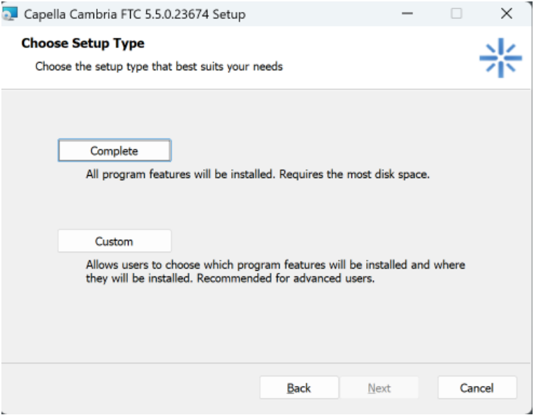
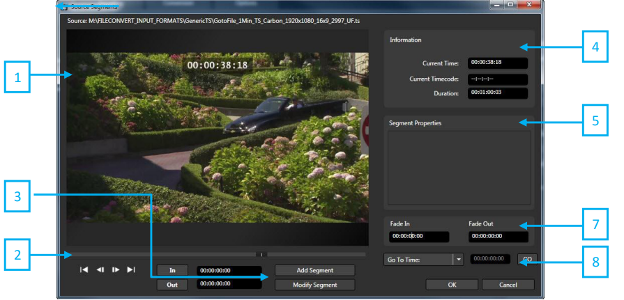
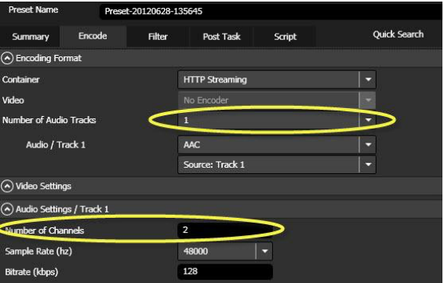
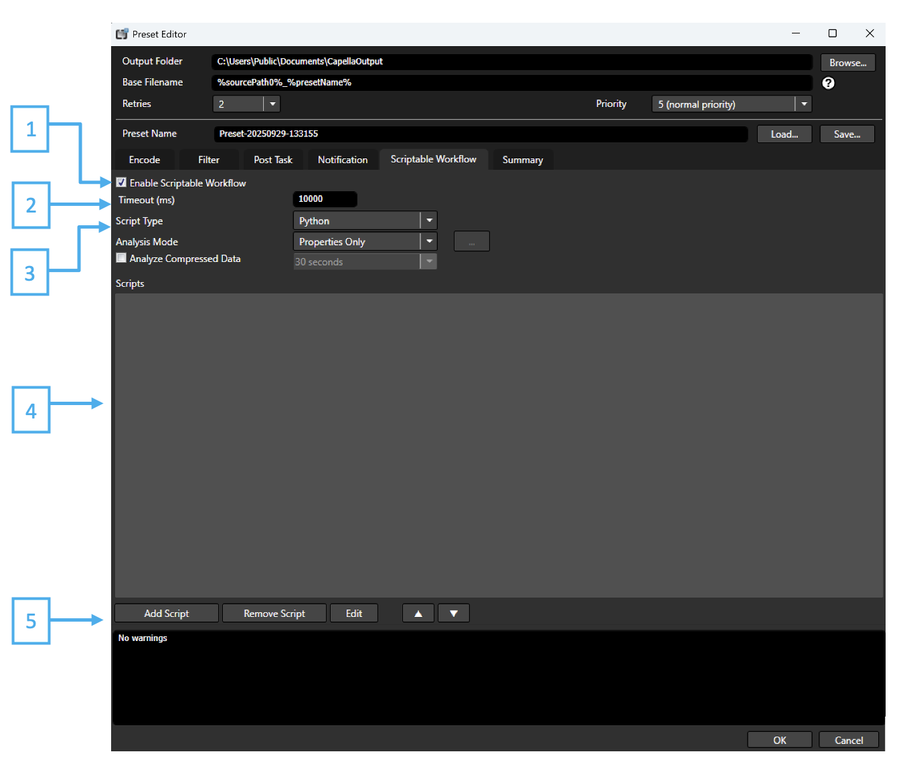
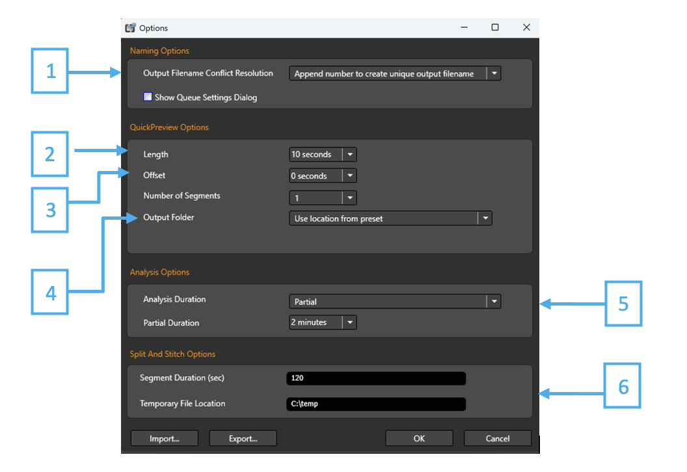
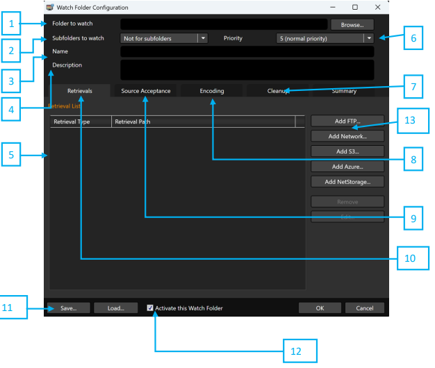
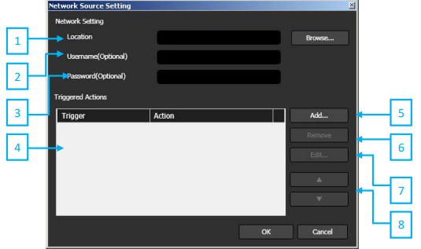
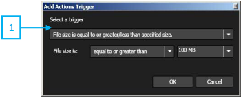

# Cambria FTC 5.x  
## Installation and User Guide  
**January 2026**

---

## Trademark Acknowledgements and Copyright Notices

- Manufactured under license from Dolby Laboratories.
- Dolby and the double-D symbol are trademarks of Dolby Laboratories.
- Confidential unpublished works. Copyright 2003–2012 Dolby Laboratories. All rights reserved.
- Names of other products mentioned in this document are registered trademarks of products used in Cambria’s software.

---

## Overview

### Product Overview

Cambria FTC is a professional-grade transcoding solution built for today’s media workflows. It supports a wide range of broadcast, streaming, VOD, mobile, and archiving formats, making it easy to repurpose and deliver content across multiple platforms without compromising quality.
With extensive format support, advanced audio/video processing, and enterprise-grade workflow management, Cambria FTC is trusted by broadcasters, streaming services, and media companies worldwide.

---

### Flexible Import and Export

Cambria FTC handles a wide variety of professional input and output formats, enabling fast, reliable delivery to virtually any platform.

#### Common Input Formats

- MXF (Sony XDCAM, Panasonic P2, OP-1a, OP-Atom)
- Apple ProRes (422 and 4444 profiles)
- Avid DNxHD/DNxHR
- QuickTime MOV
- MPEG-2 TS/PS

#### Common Output Formats

- H.264/AVC (x264 or NTT-AT encoder)
- HEVC/H.265 (HDR10, Dolby Vision*)
- MPEG-2 (4:2:0 and 4:2:2)
- Apple ProRes
- Avid DNxHD/DNxHR
- MXF OP-1a
- HLS, MPEG-DASH, and CMAF adaptive streaming*

\*Requires optional modules (see Specifications section).

---

### Typical Use Cases

- Resolution changes (HD ↔ UHD, up/downscaling)
- Frame rate conversion (NTSC ↔ PAL, interlace ↔ progressive)
- Aspect ratio adjustments (pillarbox, letterbox, anamorphic)
- SDR ↔ HDR conversions (with supported modules)

---

### Broadcast-Grade Encoding

Cambria FTC integrates multiple best-in-class encoders to deliver exceptional quality:

- **NTT-AT H.264 Encoder** – Optimised for premium broadcast and OTT delivery.
- **x264** – Widely adopted AVC encoder for maximum compatibility.
- **HEVC/H.265 (optional)** – Efficient compression for UHD and HDR streaming.
- **MPEG-2** – Professional-grade encoding for broadcast workflows.

The engine is multi-threaded and cluster-ready, maximising throughput across multicore CPUs or distributed Cambria Cluster deployments.

---

### Advanced Video and Audio Processing

Enhance and customise content during transcoding with built-in processing features:

- Logo and title insertion
- Timecode burn-in
- Auto-crop and scaling
- Audio channel mapping, mixing, and volume adjustment
- Color correction (brightness, contrast, saturation, gamma)
- Metadata editing (track labels, properties)

Profiles let you apply filters consistently across large-scale, automated workflows.

---

## Workflow Management with Cambria Cluster

Cambria Cluster provides full control over your transcoding jobs:

- Monitor active, queued, completed, and failed jobs
- Re-queue or troubleshoot failed conversions with diagnostic logs
- Adjust job priority in real time
- Benchmark system performance
- Distribute workloads across multiple nodes with Cambria Cluster

---

## Automation and Scalability

### Watch Folder Automation

The Watch Folder feature enables fully automated batch transcoding.

- Define one or more folders and assign a preset to each.
- Drop files into the folder, and Cambria FTC will automatically pick them up, transcode them, and deliver the outputs.
- Post-processing actions are supported, such as:
- Moving or copying output files to a local or network path
- Uploading to FTP/SFTP destinations
- Sending email notifications for job start, completion, or errors

This feature is ideal for high-volume workflows that require unattended operation.

---

### Subtitle Burn-In (Optional)

Cambria FTC can burn SMPTE Timed Text (SST) or other supported subtitle formats directly into output files during transcoding. Using Watch Folders, subtitle burn-in can be automated at scale:

- Input and subtitle files are automatically matched by filename.
- Multiple files can be transcoded and burned simultaneously.
- Ensures consistent subtitle integration across large batches of content.

---

## Cambria Cluster

Cambria Cluster enables scalable, distributed transcoding across multiple machines. With Cluster, you can manage numerous Cambria FTC installations under a single environment, ensuring maximum throughput and system utilisation.

Key features include:

- **Centralised Management** – Monitor and control all jobs from one interface.
- **High Throughput** – Encode many jobs simultaneously across multiple servers.
- **Load Balancing** – Jobs are distributed according to user-defined priority and available system resources.
- **Failover Handling** – If a node becomes unavailable, jobs are automatically rerouted to other active machines.

---

## Cambria Cluster in the Cloud

Cambria Cluster can also be deployed in a cloud or hybrid environment:

- Run Cambria FTC instances on cloud-based virtual machines (AWS, Azure, GCP, or private cloud).
- Scale capacity up or down on demand to handle peak workloads.
- Maintain the same management and monitoring workflow as on-prem deployments.
- Use Cluster to seamlessly distribute jobs across both on-premises and cloud resources.

This approach combines enterprise scalability with cloud elasticity, ensuring you can handle both steady-state and burst workloads efficiently.

## Cambria FTC Specification

### Supported Import Formats

| Formats | Containers | Video Codecs | Audio Codecs |
|-------|------------|--------------|--------------|
| AVCHD | AVI | AVCI 100 | AES3 |
| AVI | F4V | AVCI 50 | Dolby Digital |
| Avid DNxHD/DNxHR | INTERIM (Capella) | DNxHD/DNxHR | Dolby Digital Plus |
| Capella Intermediate | MKV | DV25 | Dolby E |
| DVD | MOV | DVCAM (DV25) | Linear PCM |
| Flash Video | MP4 | DVCPRO | MPEG-1 Layer 2 |
| Generic MP4 | MPEG-1 PS | DVCPRO 50 | MPEG-2 AAC |
| Generic PS | MPEG-2 PS | DVCPRO HD | RealAudio |
| Generic TS | MPEG-2 TS | Grass Valley HQ | Uncompressed |
| HDV | MXF | H.264 | Windows Media Audio |
| Still Images | R3D | HEVC | |
| JPEG2000 | RMVB | IEC DV25 | |
| MOV |  | JPEG2000 | |
| Panasonic P2 |  | Microsoft DV | |
| RealMedia |  | MPEG-1 | |
| REDCODE RAW | | MPEG-2 | |
| Sony XAVC | | MPEG-2 IMX | |
| Sony XDCAM | | MPEG-2 XDCAM HD | |
| Sony XDCAM-EX | | ProRes | |
| Still Image (DPX, TIFF, TGA, BMP, JPG) | | RealVideo | |
| Windows Media |  | Uncompressed | |
| | | Uncompressed QT (in323 codec) | |
| | | XAVC H.264, Intra/Long GOP  | |

---

### Supported Export Formats

| Formats | Containers | Video Codecs | Audio Codecs |
|--------|------------|--------------|--------------|
| AV1 | AVI | AV1 | AAC |
| Avid AAF* | Elementary Streams | AVC-Intra* | AES3/PCM |
| Avid DNxHD/DNxHR* | F4V | Canopus HQ | ALS* |
| Canopus HQ | AVI | MXF* | DNxHD/DNxHR* |
| Dolby Vision* | MLV | DV | Dolby Atmos* |
| Elementary Streams | MOV | DVCAM | Dolby Digital |
| Flash Video | MP4 | DVCPRO HD | Dolby Digital Plus* |
| Generic MP4 | MPEG-1 PS | H.264 | Dolby E |
| Generic PS | MPEG-2 PS | HEVC* | Linear PCM |
| Generic TS | MPEG-2 TS | HEVC (Dolby)* | MPEG |
| HLS* | MXF | JPEG2000 | Passthrough |
| JPG2000 | WMV | MPEG-1 | PCM |
| Microsoft Smooth Streaming* | | MPEG-2 | Windows Media Audio |
| MKV | | MPEG-2 IMX | |
| MOV | | MPEG-2 XDCAM HD* | |
| MPEG-DASH* | | Passthrough | |
| ProRes | | ProRes | |
| Sony XAVC* | | Uncompressed | |
| Sony XDCAM* | | Windows Media Video | |
| Still Image (TIFF, TGA, BMP, JPG) | | VP9 | |
| Windows Media | | XDCAM DV* | |

\*Options are available at additional cost

**Note:** Some files can only be imported if certain 3rd party codecs/modules are enabled.

---

### Importing QuickTime (MOV) Files

Cambria FTC supports QuickTime MOV containers natively, including professional codecs such as Apple ProRes (all 422 and 4444 profiles), Avid DNxHD/DNxHR, and uncompressed video.

All supported MOV codecs are processed directly by Cambria FTC without third-party dependencies.

---

### Importing Grass Valley HQ / HQX Files

Cambria FTC can import legacy Grass Valley HQ and HQX formats when required.

- Install the Grass Valley HQ/HQX codec package:  
  https://www.edius.net/hqx.html
- Once installed, Cambria FTC can decode AVI files encoded with HQ/HQX.

Grass Valley HQ/HQX is primarily used in EDIUS editing workflows. If you are working outside of EDIUS, it is recommended to use MXF, ProRes, or DNxHD/DNxHR as interchange formats instead.

---

### Supported Platforms (2025)

Cambria FTC is supported on the following operating systems:

### Desktop Operating Systems

- Windows 10 Pro / Enterprise (64-bit)
- Windows 11 Pro / Enterprise (64-bit)

### Server Operating Systems

- Windows Server 2016 (Desktop Experience)
- Windows Server 2019 (Desktop Experience)
- Windows Server 2022 (Desktop Experience)

### Important Notes

- Server Core installations are not supported. Cambria FTC requires a full desktop GUI environment.
- Legacy Windows versions (Windows 7, Windows 8.x, Windows Server 2008/2012) are no longer supported.
- For workflows requiring virtualised environments, Cambria FTC is compatible with VMware, Hyper-V, and major cloud providers (AWS, Azure, GCP), provided the virtual machines meet the system requirements.
- Please refer to the latest release notes for changes to supported operating systems.

---

### Importing DPX Image Sequences

Cambria FTC supports importing DPX (Digital Picture Exchange) image sequences for conversion. Because DPX is a frame-based format, an accompanying XML sidecar file is required to define sequence properties.

### Steps

1. Create an XML file containing property information for the sequence and place it in the same folder as the DPX files.

**Example XML:**

```xml
<?xml version="1.0" encoding="UTF-8"?>
<AudioVideoSource
  Type="DPX"
  FrameRateNum="24000"
  FrameRateDen="1001"
  PixAspRatioVer="1"
  PixAspRatioHor="1" />

```

1. Load the XML file into Cambria FTC as a source.  
   The software will automatically load the DPX sequence in alphabetical order.
2. (Optional) Add audio using the Map Audio Tracks feature if you want to combine external audio with the image sequence.

## Best Practices for DPX Workflows

- **Consistent Naming:** Ensure DPX frames use a consistent, zero-padded numbering convention (for example, `frame_000001.dpx`).
- **High-Speed Storage:** Use SSD or RAID storage for DPX sequences, as large frame-based workflows are I/O intensive.
- **Color Management:** Verify that the color space, gamma, and bit depth of the DPX source are correctly specified in the XML.

---

### Cambria FTC System Requirements (2025)

### Minimum Recommended Hardware

**CPU**
- Intel Xeon / Core i7 or higher, or AMD equivalent
- Multi-core (8 cores or more recommended)
- AVX2 instruction set support required

**Memory**
- 8 GB minimum
- 32 GB or more recommended for UHD/HDR or multi-job environments

**Storage**
- 500 GB SSD minimum (OS + application)
- High-speed SSD or NVMe storage recommended for source/output media
- RAID or SAN/NAS storage supported for high-throughput workflows

**GPU / Hardware Acceleration (optional)**
- Intel Quick Sync Video (10th Gen and newer)
- NVIDIA GPU (Turing architecture or newer, driver 530+)
- NETINT VPUs (via Cambria VPU integration module)

**Network**
- 1 Gbps minimum
- 10 Gbps recommended for clustered or cloud-hybrid workflows

**USB Port**
- For hardware USB license key (dongle) if used
- Software license option available (MAC-address or cloud-based activation)

---

### Recommended Configurations

The following configurations are provided as guidelines for common deployment scenarios. Actual performance will vary depending on source format, output complexity, and the number of concurrent jobs.

| Workflow | CPU | Memory | Storage | GPU / Accel. | Notes |
|--------|-----|--------|---------|--------------|------|
| HD / SDR Single-Job | 8-core Intel i7 / AMD Ryzen 7 | 16 GB | 500 GB SSD | Optional (Quick Sync / NVIDIA Turing+) | Occasional transcoding on a standalone workstation |
| HD / SDR Multi-Job | 12–16 core Intel Xeon / AMD Ryzen 9 | 32 GB | 1 TB SSD/NVMe | Optional GPU or VPU | 2–3 concurrent HD jobs |
| UHD / HDR Single-Job | 16-core Intel Xeon / AMD Threadripper | 32 GB | 1 TB NVMe + RAID | NVIDIA RTX A4000+ or NETINT VPU | Efficient for 4K HDR |
| UHD / HDR Multi-Job | Dual Xeon Silver/Gold or AMD EPYC (24+ cores) | 64 GB+ | Enterprise SSD/NVMe RAID or SAN | Multiple GPUs or VPUs | Parallel UHD jobs |
| Cluster Deployment | Multiple servers (24+ cores each) | 64–128 GB per node | SAN/NAS (10 Gbps+) | Optional GPUs/VPUs | Managed via Cambria Cluster |
| Cloud / Hybrid | **AWS:** c6i.4xlarge (16 vCPU) or higher<br/>**Azure:** F16s_v2<br/>**GCP:** C2-standard-16<br/>**OCI:** VM.Standard.E4.Flex<br/>**Akamai:** Linode Dedicated 32GB Plan | 32 GB | EBS gp3 (provisioned IOPS) | N/A or GPU instance (g4 / g5) | Elastic scaling with Cluster + CloudBurst |

---

### Additional Notes

- GPU/VPU acceleration is optional but provides significant performance gains for H.264/HEVC, especially with UHD/HDR workloads.
- Storage throughput is often the bottleneck for image sequences (DPX/TIFF). NVMe or RAID is recommended.
- Networking: For cluster or cloud deployments, ensure 10 Gbps or higher connectivity to storage for sustained throughput.
- Scaling: Cambria Cluster enables linear scalability — adding more nodes increases job capacity with minimal overhead.

### Windows System Settings

Machine Administrator for Installation:

It is required that machine administrator account be used for the Cambria software installation.

After installation, a non-administrator account can be used for normal File Convert operation.
However, for Cluster it is required that the logon user has administrator privilege. Cluster
service by default is logon with LOCALSYSTEM, which has administrator privilege. If it is being
logon with other users, that user must be a local administrator as well. Otherwise, the Cluster
may not start.
To add a user to local administrator: Run lusrmgr.msc, go to Groups -> Administrators, Add that
user to this group.

### Service Credentials

After installation check the Capella CpServiceManager (File Convert) or CpClusterManager
(Cluster) service! These services will need to have the appropriate access rights to read from
and write to network file locations. Here are the instructions on how to modify ‘Capella
CpServiceManager’ service credentials:

1. Open the Services panel (Control Panel>Administrative Tools>Services)
2. Open Properties panel for Capella CpServiceManager
3. In the Log On tab, select “This account:”
4. Enter the full domain account and password. (ie. Yourname@company.com)
5. This domain account must have access rights to the locations
6. Restart the service as prompted

### Windows Virtual Memory Setting
To prevent some memory allocation errors that can occur, we recommend changing a Windows
Virtual Memory setting to allow for “System managed size”:

1. Open up to the Advanced tab in the System Properties panel (Control Panel>System and
Security>System>Advanced system settings)
2. Select Settings ``under Performance
3. From the Advanced tab select Change under Virtual Memory
4. Uncheck “Automatically manage paging file size for all drives”, select “System managed
size”

## Cambria FTC Structure

Cambria FTC consists of several integrated components:

### Cambria File Converter

The core transcoding engine, supporting a wide range of input and output formats. Handles
video/audio processing such as scaling, frame rate conversion, logo insertion, metadata
handling, and audio channel mapping.

### Cambria Manager / Cluster

Provides monitoring and control of active, queued, completed, and failed conversions. Includes
diagnostic logging, job re-queuing, priority management, and a benchmark tool for measuring
system performance.

### Cambria Watch Folder

Automates batch transcoding: assign presets to watch folders, drop files in, and Cambria FTC
automatically processes them. Supports post-conversion tasks such as network delivery
(FTP/SFTP, local copy/move) and email notifications.

### Cambria FTC Installation

Run `setup.exe` from the Cambria FTC folder and click **Install**.


Click **Next** to begin the File Convert application installation.


Read the End-User License Agreement. If you accept the terms of the License Agreement, check the checkbox. The application will not install if you do not accept the terms of the License Agreement. Click **Next**.


Enter in your information, this is used when you choose to create diagnostics logs. These diagnostics logs are used for troubleshooting problems with encoding jobs.


Firewall Rules must be created for File Convert to interact with Cambria Cluster. Choose the profiles you would like to add the rules for, or consult with your network administrator if you are unsure which to select. Click **Next**.


Choose which installation mode you would like to proceed with. It is recommended to select the **Complete** option



Click **Install** to install the application.


File Convert will install. Once finished, click **Finish** and **OK**.


---

## Reinstalling Cambria FTC

It is recommended that Cambria FTC be uninstalled when updating to a new version.It is recommended that Cambria FTC is uninstalled when trying to update to the new version.
The steps to uninstall are detailed in the next section, Uninstalling Cambria FTC.

To uninstall:

Start → All Programs → Capella → Cambria → Uninstall  
Click **Next**.


Select **Remove** and click **Next**.


Click **Remove**.


Click **OK**.


Click **Finish** to complete the uninstallation.


---

### Using Cambria Software License in a Cloud Environment

Software license can be provided to use Cambria in a cloud environment. Please send us the
MAC address for the machine which Cambria will be installed. It only runs on the specific MAC
address, hence please notify us of a new MAC address when it is changed.

Instructions: Copy the software license to the assigned folder and start Cambria FTC.

Software license name: CapellaSoftwareLicense.lic

Assigned folder name: C:\Program Files (x86)\Capella\Cambria


**Note:** When Cambria FTC is uninstalled to install a newer version, the software license is not removed. If Cambria FTC does not start after installing an update, check the assigned folder to verify that the software license exists.

---

## Cambria FTC

### Getting Started with Cambria FTC

Start → All Programs → Capella → Cambria → Cambria FTC  
(or open File Convert from the desktop shortcut icon)


---

## Encoding Workflow

Cambria FTC transcodes files using the following workflow:

### Add Source File(s)

- From the **Sources** tab, click **Add Sources** to add source files, or drag and drop files.
- In/Out point segments can be specified for the source.
- Filters can be added to alter or enhance video/audio transcoding.
- Source audio can be added, removed, and remapped.

### Add Encoding Preset(s)

- From the **Encoding** tab, click **Add** or double-click the screen to add an encoding preset.
- Encoding presets specify output container and codec.
- Presets can include video/audio filters, post-task functions (FTP delivery and command line), notifications, and scripts.
- Encoding packs are groups of presets that can be exported or reimported.

### Convert Job(s)

- From the **Encoding** tab, click **Convert All Jobs** to start transcoding.
- **Convert** should be used when converting a small number of files (1–5).
- **Quick Preview** allows short output generation for quality analysis.
- **Queue** submits jobs for background processing, managed through Cambria Manager.

---

## File Convert Source Tab


1. **File**  
   Load and save project files.

2. **Source Files**  
   List of imported source files. You can add sources by either clicking ‘Add Sources’ or
through drag-and-drop from Explorer. Thumbnail of sources, audio/video properties
are displayed. Refer to Cambria FTC Specification section for supported file formats.

3. **Add Sources**  
   Add sources through a Windows File Open Dialog. Alternatively, you can add sources
through drag-and-drop from Explorer.

4. **Remove Sources**  
   Remove selected sources.

   Keyboard Shortcuts:
   - CTRL + A: Select all sources
   - CTRL + Click: Select individual sources
   - SHIFT + Click: Select range

5. **Up / Down Arrow**  
   Change source order.

6. **Auto Audio Track Mapping**  
   Opens up the Auto Audio Track Mapping interface. Audio tracks will be mapped if
source audio configuration (number of tracks, number of channels per track) matches
with a mapped audio track's source audio configuration. Create audio track mapping
(.cfma) using FTC's User Interface

7. **Create Presets From Source**  
   Analyizses the source and creates a Encoding preset that create output to the
same specifications and properties as the source.

8. **Stitch Sources**  
   Stitches all selected sources. Once checked, rightclicking on one of the sources will
allow setting it as the main source. All other sources will respect the properties
(resolution, frame rate etc) of the Main Source.


---

### Source Segments Settings



1. **Preview Window**  
   Displays current video frame.

2. **Preview Scrub Bar**  
   Seeking can be done by clicking on a specific location on the scrub bar, dragging the
scrub bar, or clicking control button.

3. **Add or Modify Segment**  
   The ‘In’ and ‘Out’ button can be used to set the In/Out point to the current time as
indicated by the frame shown in the Preview Window. You can also specify the in and
out time by typing directly into the time field. Specify and In point and Out point then
you can use ‘Add Segment’ button to add it to the Segment Properties list.

4. **Information**  
   This section provides time and timecode information about the preview position. It
displays total source duration and indicates if a source is unable to seek as ‘!
Cannot Seek’
Current Time: Time position of the preview

Current Timecode: Timecode position of the preview Duration: Indicates total
duration of the video

5. **Segment Properties**  
   This section is used to specify source segments that will be encoded. By default, no
source segments are specified and the entire source will be encoded. By setting In/Out
points and adding segment(s), you are defining which section(s) of the source will be
encoded. Right-click segment property enables you to
remove or change the order. When segments are added by ‘Add by Timecode’, the
indicator “[TC]” will be used to differentiate these segments from the segments added
by Time. 

6. **Add by Timecode**  
   Segments can be added by inputting Timecode. Specify drop frame or non drop frame.
This function will only work with files that supported by File Convert for TC reading. If
the file has no TC or the specific TC point is not found, the transcode will give an error. 

7. **Fade In / Fade Out**  
   Add a fade in from black at the beginning of your video and/or a fade to black at the
end of the video.

8. **Input Seek**  
   Seek by entering a Timecode or Time in the source video.

---

## Source Filters Setting


1. **Add**  
   Select filter to apply.

2. **Edit**  
   Change settings for the selected filter.
   
3. **Remove**  
   Remove selected or all filters.

4. **Up / Down Arrow**  
   Change the order of the filters.

5. **Import / Export**  
   Save filters to preset filter files (.cflt) and import saved preset filter files (.cflt)

6. **Filter List**  
   It displays the selected filters which will be applied for encoding

---

## Available Source Filters

| Filter | Description |
|------|-------------|
| 601/709 Correction | Converts between ITU-R BT 601 (typically SD) and ITU-R BT709 (typically HD) color ranges |
| Auto Crop | Crop letterbox or pillarbox automatically |
| Black Segments Remover | Remove black video frames |
| Closed Caption Burn-In | Closed caption burn-in |
| Color Bars Remover | Removes color bars from the start or end of a clip |
| Color Channels Remapper | Remap Y channel to alpha channel |
| Colors Control | Adjust video brightness, contrast, gamma value |
| Color Range Adjustment | Clip, shrink, expand color range |
| Color Space Conversion | Convert between common SDR and HDR color spaces |
| Crop | Manual crop |
| Denoiser | Image noise reduction based on frame data |
| DVB Subtitle Burn-In | DVB Subtitle burn-in via PID value |
| DVD Subtitle Burn-In | Text burn-in from IFO language tracks |
| Expand Width (Copy Contents + Blur) | Expand portrait frames to landscape |
| Face Blur Filter | Automatic face detection and blur |
| Interlacing Auto Adjust | Automatically detect and correct interlacing |
| Logo | Insert and position image overlay |
| Markers | SCTE35 and MPEG-2 / H.264 markers |
| Preroll/Postroll | Add preroll and postroll black or image frames |
| Property Changer | Override aspect ratio, interlacing mode, and frame rate properties |
| RGB to YUV Conversion | Convert RGB (BT.2020) to YUV (BT.2020) |
| Rotation | Rotate clip |
| Speed Adjustment | Change speed and correct audio pitch |
| SCTE35 Inject | Inject SCTE35 from ESAM XML file |
| SST Text Burn-In | Text burn-in from Canvass SST file (available with SST option) |
| Subtitle Burn-In | Text burn-in from Cavena 890, Adobe double timecode, VisTitle single timecode formats |
| Subtitle Inject | Inject subtitles from STL, TTML, XML, and SCC |
| Teletext Extractor | Extract teletext |
| Temporal | Image noise reduction based on temporal video data |
| Text Burn In | Insert text (set font type, color, style, alignment) |
| Thumbnail Generation | Automatic thumbnail generation |
| Timecode Burn In | Adjust font, color, and style of timecode burn-in |
| Timecode Overwrite | Set timecode overwrite mode |
| TS Teletext Burn-In | Transport Stream Teletext burn-in |
| VITC Extractor | Extract VITC |
| VITC Generator | Generate VITC |
| XML Titler | Text burn-in from user-generated XML |
| Audio Compressor | Reduce difference between maximum and minimum level |
| Audio Delay | Audio can be delayed up to 1000 seconds from video |
| Audio Fade | Fade audio in and out over one or all tracks |
| Audio Speech Extraction | AI speech-to-text extraction |
| Audio Normalizer | Normalize audio to peak audio sample or ITU-R BS.1770-2 loudness |
| Audio Remapper | Remapping, splitting, and combining of audio tracks |
| Audio Surround To Stereo | Convert 5.1 source audio to stereo target audio |
| Audio Voice Over Control Renderer | Mix down 4ch with voiceover to 2ch with voiceover |
| SNAP Audio Watermark | Secure Nielsen Audio Processing watermark |
| Volume Adjustment | Adjust audio volume |


### Auto Crop Filter Settings


1. **Analysis Duration**
Select the duration between ‘Automatic’, ‘Entire’, ‘Specify’.
‘Automatic’: When source is HD file, ‘Automatic’ setting analyzes the first 15
frames. When source is SD file, ‘Automatic’ setting analyzes the first 100 frames.
‘Entire’: Analyze the entire source file and decide cropping range.
‘Specific’: Analyze the specified duration and decide cropping range.

Note: If letterbox and pillarbox are the same in an entire source, selecting
‘Automatic’ or ‘Specific’ can reduce process time.

2. **Symmetrical Crop Setting**
By selecting ‘Use Symmetrical Letterbox Cropping’, top and bottom cropping
percentage will be the same.
By selecting ‘Use Symmetrical Pillarbox Cropping’, left and right cropping
percentage will be the same.

3. **Maximum Percentage Audio Crop Setting**
‘Max Percentage Auto Crop Letterbox/Pillarbox’ and sets the maximum
percentage. The file will not be cropped more than the value.

4. **Edge Detection**
The frame height and frame width must be a multiple of 4. So after we detect
sizes of the letterbox and pillarbox, we need to round the crop values to the
nearest multiple of 4. By checking ‘Preserve Non-Black Content’ we will perform
ensure that this rounding operation will not remove any non-black video content,
which may result in leaving a few black lines.

---

## Audio Track Mapping


1. **Add Audio Sources**  
   Multiple audio sources can be added.

2. **Remove Source**  
   Selected audio sources can be removed.

3. **Add Track**  
   Add new audio track configuration.
   
4. **Remove Track**  
   Remove selected audio track configuration.

5. **Edit**  
   Configure the channel mapping for a track

6. **Load / Save**  
   Allows you to save and load .cfma files. These audio preset files can also be used
as the configuration file for the Conditional Audio Map function for a Watch Folder.

**Audio Track Mapping Example:**

Source file: MOV video, 4 track (2ch) audio

Audio file: WAV

Target: HTTP video, 1 track (2ch) audio

Setup Directions:

Add source file and select ‘Map Audio Tracks’ to display original audio tracks of the
source file.


Add/Remove Audio Source


Add/Remove Track


Edit Track
At HTTP target setting, select 1 for ‘Number of Audio Tracks’ and 2 for ‘Number of Channels’



**File Converter Encoding Tab**


Note: You can export and save encode settings. Alternatively, you can click save in ‘Preset Editor’.
Presets in the Encoding Presets list will not be automatically remembered.

1. **Encoding Pack**
Displays a list of presets in the Encoding Pack. You can configure multiple presets
in encoding pack. Various target files can be created from one source file. It is
useful when comparing video quality in various parameters with same encode. It
also allows users to create two different targets (e.g. Blue-ray format and
streaming format) at the same time.

2. **Encoding Pack Information Window**
Displays information of the selected preset. Encode, video filter and post tasks
configured in the preset are shown here.

3. **Add**
Opens up the Preset Editor to create preset and add to the Encoding Pack.
Alternatively, the existing preset can be loaded.

4. **Remove**
Removes selected preset from the Encoding Pack.

5. **Edit**
Opens up the Preset Editor to modify the selected preset.

6. **Import/Export**
Loads presets from a saved Encoding Pack into the current Encoding Pack. Saves all
presets in the Encoding Pack to a .cep file.

7. **Queue All Jobs**
Sends jobs to encoding queue managed by Cambria Manager. You will have to
open up Cambria Manager to view or manage the jobs. The dropdown allows you
to send all jobs or only selected jobs.

Note: QuickPreviews queing can be selected through the dropdown. This allows you
to encode a short segment of the source based on the QuickPreview options
configured in the ‘Options’ tab. QuickPreview encodes allows users to output
preview file to verify encode settings and video quality.

8. **Convert All Jobs**
Converts jobs directly in File Convert without using Cambria Manager. Jobs will be
sent to the Conversion tab to monitor. The dropdown allows you to send all jobs
or only selected jobs.

Note: QuickPreviews converting can be selected through the dropdown. This
allows you to encode a short segment of the source based on the QuickPreview
options configured in the ‘Options’ tab. QuickPreview encodes allows users to
output preview file to verify encode settings and video quality
   
### Preset Editor Summary


1. **Output Folder**
Specifies the location of the encoded video. Click ‘Browse’ to select folder location.

2. **Base Filename**
Specifies the name of the output file that is generated from the current preset.
%sourcePath0% - base filename uses source file name
%presetName% - base file name uses preset name
Default setting: %sourcePath0%_%presetName%

3. **Retries**
Change the number of times the job will retry if an error occurs during the
transcode. Default setting is 2.

4. **Priority**
Set the priority of the job created from the current preset.
1: Highest priority – 10: Lowest priority
Default setting is 5.

5. **Preset Name**
Change the name of the current preset.

6. **Load/Save**
After the preset has been configured, ‘Save’ button can be used to save the preset settings for later use. To use default or previously saved presets, click ‘Load’
button and select the desired preset.
Default saved preset can be found in:
C:\Users\Public\Documents\Capella\Cambria\Encoder Presets

7. **Summary**
Displays preset setting.
‘Encode’ – Displays the encode settings that are applied to the current preset.
Settings can be changed in the ‘Encode’ tab of the preset editor.
‘Filter’ – Displays the filters that are applied to the current preset. Settings
can be changed in the ‘Filter’ tab.
‘Post Task’ – Displays the post tasks that are applied to the current preset. Settings
can be changed in the ‘Post Task’ tab.

8. **Error**
Displays errors in encode parameter.

9. **Encode Tab**
Displays the encode settings that are applied to the current preset. Settings can be
changed in the ‘Encode’ tab of the preset editor.

Note: Please refer to “Preset Editor • Encode Settings” page.

10. **Filter Tab**
Apply filters to the current preset. Available filters are logo, text burn in, denoiser,
temporal, colors control, timecode burn in, timecode overwrite, audio compressor,
volume adjustment.

Note: Please refer to “Preset Editor • Filter Settings” page.

11.**Post Task Tab**
Add post tasks to the current preset.

Note: Please refer to “Preset Editor • Post Task Settings” page.

12. **Notification Tab**
Name notification and select notification event type. Configure email notification.

13. **Script Tab**
Edit job XML. When applying SST subtitle filter, load Perl script file and match
subtitle filter with source file.

---

### Preset Editor Encode Settings


Encoding settings are divided into 5 basic categories.

Note: Please refer to “Parameter Details” sections below for more information regarding specific settings
found in these categories. 

1. **Encoding Format**
Container : Select container format (target file format)
Video : Select video codec
Audio : Select audio codec

2. **Video Settings**
Configure video settings details.

3. **Audio Settings**
Configure audio settings details.

4. **Container Format Settings**
Configure container format.

5. **Transcoding Preferences**
Settings that may apply to the transcode if certain conditions are met.

**Default Preset File List**
Cambria FTC prepares default preset files. It is recommended to load the file and use it.
C:\Users\Public\Documents\Capella\CambriaCluster\Encoder Presets

| Folder            | Preset File                                                        |
| ----------------- | ------------------------------------------------------------------ |
| actvila           |                     |
|            | acTVila_H264_AAC192kbps_1920x1080i_6000kbps.cen                    |
|            | acTVila_H264_AAC192kbps_480i_3000kbps_ClosedGOP.cen                |
|            | acTVila_H264_AAC5_1Surround256kbps_480i_2000kbps.cen               |
|            | acTVila_H264_AAC5_1Surround384kbps_1080i_6000kbps.cen              |
|            | acTVila_H264_AAC_1080i_6000kbps.cen                                |
|            | acTVila_H264_AAC_1080i_7000kbps.cen                                |
|            | acTVila_H264_AAC_1080i_8000kbps.cen                                |
|            | acTVila_H264_AAC_1920x1080i_6000kbps.cen                           |
|            | acTVila_H264_AAC_480i_2000kbps.cen                                 |
|            | acTVila_H264_AAC_480i_4_3_2000kbps.cen                             |
| AdaptiveStreaming |                                              |
|  | HLS-H264-7Bitrates.cen                                             |
|  | MPEG-DASH-H264_7Bitrates.cen                                       |
|  | SmoothStreaming-H264_7Bitrates.cen                                 |
| ARIB              |                |
|               | ARIB4KHEVC_5994fps_CBR40Mbps_420_10bit_Defaultv4.cen               |
|               | ARIB4KHEVC_5994fps_CBR40Mbps_420_10bit_Qualityv4.cen               |
|               | ARIB4KHLGHEVC_5994fps_CBR40Mbps_420_10bit_Defaultv4.cen            |
|               | ARIB4KHLGHEVC_5994fps_CBR40Mbps_420_10bit_Qualityv4.cen            |
|               | ARIB4KPQHEVC_5994fps_CBR40Mbps_420_10bit_Defaultv4.cen             |
|               | ARIB4KPQHEVC_5994fps_CBR40Mbps_420_10bit_Qualityv4.cen             |
|               | ARIB8KHEVC_5994fps_CBR120Mbps_420_10bit_Defaultv4.cen              |
|               | ARIB8KHEVC_5994fps_CBR120Mbps_420_10bit_Qualityv4.cen              |
|               | ARIB8KHLGHEVC_5994fps_CBR120Mbps_420_10bit_Defaultv4.cen           |
|               | ARIB8KHLGHEVC_5994fps_CBR120Mbps_420_10bit_Qualityv4.cen           |
|               | ARIB8KPQHEVC_5994fps_CBR120Mbps_420_10bit_Defaultv4.cen            |
|               | ARIB8KPQHEVC_5994fps_CBR120Mbps_420_10bit_Qualityv4.cen            |
| Blu Ray           |                                            |
|            | BluRay_ES_15000kbps.cen                                            |
| Flash             |    
|              | F4V_H264_AAC_480p_1000kbps.cen                                   |
| MP4               |  |
|                | HEVCv4_MP4_2passVBR_1280x720_5994fps_3500Kbps_420_8bit_Default.cen |
|                | HEVCv4_MP4_2passVBR_1280x720_5994fps_3500Kbps_420_8bit_Quality.cen |
|                | HEVCv4_MP4_2passVBR_1920x1080_11988fps_16Mbps_420_8bit_Default.cen |
|                | HEVCv4_MP4_2passVBR_1920x1080_11988fps_16Mbps_420_8bit_Quality.cen |
|                | HEVCv4_MP4_2passVBR_1920x1080_2997fps_4Mbps_420_8bit_Default.cen   |
|                | HEVCv4_MP4_2passVBR_1920x1080_2997fps_4Mbps_420_8bit_Quality.cen   |
|                | HEVCv4_MP4_2passVBR_1920x1080_5994fps_8Mbps_420_8bit_Default.cen   |
|                | HEVCv4_MP4_2passVBR_1920x1080_5994fps_8Mbps_420_8bit_Quality.cen   |
|                | HEVCv4_MP4_2passVBR_3840x2160_11988fps_60Mbps_420_8bit_Default.cen |
|                | HEVCv4_MP4_2passVBR_3840x2160_11988fps_60Mbps_420_8bit_Quality.cen |
|                | HEVCv4_MP4_2passVBR_3840x2160_2997fps_15Mbps_420_8bit_Default.cen  |
|                | HEVCv4_MP4_2passVBR_3840x2160_2997fps_15Mbps_420_8bit_Quality.cen  |
|                | HEVCv4_MP4_2passVBR_3840x2160_5994fps_30Mbps_420_8bit_Default.cen  |
|                | HEVCv4_MP4_2passVBR_3840x2160_5994fps_30Mbps_420_8bit_Quality.cen  |
|                | HEVCv4_MP4_2passVBR_720x480_2997fps_1Mbps_420_8bit_Default.cen     |
|                | HEVCv4_MP4_2passVBR_720x480_2997fps_1Mbps_420_8bit_Quality.cen     |
|                | iPod_H264_AAC_480p_1000kbps.cen                                                |
| MXF            |                                                 |
|                | AS10_CNN_HD_2012.cen     |
|                | AS10_HIGH_HD_2014.cen     |
|                | AS10_JVC_HD_25_CBR_2012.cen     |
|                | AS10_NRK_HD_2012.cen     |
|                | XDCAM_HD420_1080i_HQ.cen    |
|                | XDCAM_HD420_720p_HQ.cen     |
|                | XDCAM_HD422_1080i_50Mbps.cen     |
|                | XDCAM_HD422_720p_50Mbps.cen     |
|                | XDCAM_HD420_1080i_HQ.cen    |
| Program Stream               |     
|                | Adobe_Encore_MPEG2-PS_480i_4000kbps.cen     |
|                | Adobe_Encore_MPEG2-PS_480i_6000kbps.cen     |
|                | Adobe_Encore_MPEG2-PS_480i_8000kbps.cen     |
|                | CANVASs_MPEG1-PS_NTSC_240p_1150kbps.cen     |
|                | CANVASs_MPEG1-PS_PAL_240p_1150kbps.cen     |
| QuickTime               |      |
|                | MOV_DVCPROHD_1080i.cen     |
|                | MOV_DVCPROHD_720p.cen     |
| Transport Stream               |      |
|                | H264_AAC_1080i_10000kbps.cen     |
|                | H264_AAC_1080i_9000kbps.cen     |
|                | HEVCv4_TS_1280x720_5994fps_3500Kbps_420_8bit_Default.cen     |
|                | HEVCv4_TS_1280x720_5994fps_3500Kbps_420_8bit_Quality.cen     |
|                | HEVCv4_TS_1920x1080_2997fps_4Mbps_420_8bit_Default.cen     |
|                | HEVCv4_TS_1920x1080_2997fps_4Mbps_420_8bit_Quality.cen     |
|                | HEVCv4_TS_3840x2160_11988fps_60Mbps_420_8bit_Quality.cen     |
|                | HEVCv4_TS_3840x2160_2997fps_15Mbps_420_8bit_Default.cen     |
|                | HEVCv4_TS_3840x2160_2997fps_15Mbps_420_8bit_Quality.cen     |
|                | HEVCv4_TS_3840x2160_5994fps_30Mbps_420_8bit_Default.cen     |
|                | HEVCv4_TS_3840x2160_5994fps_30Mbps_420_8bit_Quality.cen     |
|                | HEVCv4_TS_720x480_2997fps_1Mbps_420_8bit_Default.cen     |
|                | HEVCv4_TS_720x480_2997fps_1Mbps_420_8bit_Quality.cen     |
|                | HEVCv4_TS_7680x4320_5994fps_100Mbps_420_10bit_Default.cen     |
|                | HEVCv4_TS_7680x4320_5994fps_100Mbps_420_10bit_Quality.cen     |
| WMV               |      |
|                | WM_WMV3_480p_1Mbps.cen     |
|                | WM_WVC1_1080_24p_45Mbps.cen     |

## Parameter Details – Transcoding Preferences

| Setting | Function |
|-------|----------|
| On Transcoding Failure | Set transfer options for failed jobs: Keep Output Files, Delete Output Files, Move Output Files, Copy Source Files |
| Audio Track Handling | Fail, skip, or create silence if track does not exist |
| Sync Mode – Start of Stream | Discard or preserve audio that starts before video |
| Sync Mode – End of Stream | End-of-stream synchronization handling |
| Dolby E Decode | Decode (if licensed) or do not decode |
| Pulldown Preference | Allows users to selected which pulldown method is applied, if pulldown is used. Options include 2:3:2:3 or 2:3:3:2. |
| Frame Rate Conversion Mode | Blend Frames: Smooths motion by blending frames. Nearest Frame: Sharper but may appear less fluid. Auto: Cambria FTC selects the optimal method based on source/target frame rates and interlacing.. |
| Motion Compensation Strength | Dynamic or Static (100 is smoothest) |
| Source Speed Adjustment | Allows speed adjustment (e.g., 24 ↔ 25 fps conversions)rather than dropping/duplicating frames. Preserves motion quality but changes duration |
| Downscale Mode | Allows speed adjustment (e.g., 24 ↔ 25 fps conversions)rather than dropping/duplicating frames. Preserves motion quality but changes duration. |
| Auto 601/709 Correction | By default, this setting is disabled. When enabled with the “Based on source/target frame size” option, Cambria FTC automatically applies 601↔709 color conversion filters during HD↔SD transcodes to maintain correct color mapping between standard and high-definition sources |
| Deinterlacer Mode | Options include: Best Quality (motionadaptive) or Faster (single field/frame per pair). |
| VBI Preservation | Preserve VBI if present in target or never preserve |

## Preset Editor • Filter Settings


1. **Add**
Select filter to add.

2. **Edit**
Opens to edit selected filter.

3. **Remove**
Remove selected or all filters.

4. **Filter Order**
When more than 2 filters are selected, change order of selected filters.

5. **Import / Export**
Filter setting can be exported and saved to file or imported saved setting (.cflt).

6. **Filter List**
Displays filters to be applied.

## Available Target Filters

| Filter                 | Description                                                                               |
| ---------------------- | ----------------------------------------------------------------------------------------- |
| Colors Control         | Adjust video brightness, contrast, gamma value                                            |
| Color Range Adjustment | Clip, shrink, expand color range                                                          |
| 601/709 Correction     | Converts between ITU-R BT 601 (typically SD) and ITU-R BT 709 (typically HD) color ranges |
| Denoiser               | Image noise reduction based on frame data                                                 |
| Temporal               | Image noise reduction based on temporal video data                                        |
| Logo                   | Insert and position image overlay                                                         |
| Text Burn In           | Insert text (set font type, color style, alignment)                                       |
| XML Titler             | Text burn-in from user-generated XML                                                      |
| DVD Subtitle Burn In   | Text burn-in from IFO language tracks                                                     |
| Subtitle Burn In       | Text burn-in from Cavena 890, Adobe double timecode, VisTitle single timecode formats     |
| SST Text Burn In       | Text burn-in from Canvass SST file (available with SST option)                            |
| Timecode Burn In       | Adjust font, color, style of timecode burn-in                                             |
| Timecode Overwrite     | Set timecode overwrite mode                                                               |
| DVD Markers            | Set DVD markers for use with DVD authoring software                                       |
| Volume Adjustment      | Adjust audio volume                                                                       |
| Audio Compressor       | Reduce difference between maximum and minimum level                                       |
| Audio Delay            | Audio can be delayed up to 1000 seconds from video                                        |

---

### Preset Editor – Post Task Settings


1. **Use Upload**  
   Check the box to upload a video after it has completed being encoded. Checking
this box will allow the user to specify a location in which an encoded file will be
transferred to. For example, a video file can be uploaded to FTP after it is
complete.

2. **Post Conversion Task**  
   Set a task after an encode is complete. A post conversion task can run a
executable (command line command) after an encode completes. Settings can be
changed with the “Settings” button. Set the amount of time before the task is
cancelled. If the job does not complete within the time specified here the post
conversion task will be terminated.

---

### Preset Editor – Notification


1. **Name**  
   Name of the notification email.

2. **Notification Event Type**
   - ‘On Transcoding Non-Source Error’ sends an email when source import error occurs.
   - ‘On Transcoding Source error’ sends an email when source file error occurs.

3. **Destination Email Address**  
   Sets an email address where a notification gets send to.

---

### Preset Editor – Scriptable Workflow



1. **Use Script Checkbox**  
   Enable or disable script usage.

2. **Timeout (ms)**  
   Timeout for system response of script execution.

3. **Script Type**  
   Currently only Perl scripts are supported.

4. **Script Content**  
   Area where script can be added. You can modify the script directly in the window.

5. **Load / Save**  
   Load a script file to Script Content window (.pl or .txt).
Save Script Content to a txt file. 

## Scripting Support

Cambria FTC supports Perl and Python scripting to dynamically adjust job parameters before transcoding begins. This feature allows advanced automation and conditional processing, giving fine control over how jobs are executed.

---

### What Scripts Can Do

Typical use cases include:

- Inspect source properties (codec, resolution, frame rate) and automatically adjust encoding parameters
- Reject jobs if certain conditions are detected (for example, unsupported frame rate or missing HDR metadata)
- Programmatically set in/out points for trimming or segmentation
- Automate subtitle burn-in or time-based overlays via Watch Folders
- Optimise encoding profiles based on resolution or HDR/SDR status

### How Scripts Work

1. At the start of a job, Cambria FTC analyses the source file.

2. The source metadata (video/audio tracks, frame rate, resolution, etc.) is injected into the job XML.

3. The script executes, reading the Input XML and writing a new Output XML.

4. The job runs using the settings defined in the Output XML.

Temporary files are created during this process (script, input XML, output XML) and are
automatically deleted unless debugging is enabled.
---


## Example Augmented XML (Source Section)
```md
<Source Location="\\storage\media\MP4\juno_6ch.mp4" Name="Src1">
  <VideoTrackInfo
    Format="H.264 Video"
    FrameMode="Progressive"
    FrameRateNum="30000"
    FrameRateDen="1001"
    Width="640"
    Height="480"
    PixelAspectRatioHor="4"
    PixelAspectRatioVer="3" />
  <AudioTrackInfo
    Format="AAC Audio"
    NbChannels="6"
    SampleRate="48000"
    BitsPerSample="16" />
</Source>
```

---

## Sample Scripts

The installation includes sample scripts that can be used directly or customised.

Default location:  
C:\Users\Public\Documents\Capella\CambriaCluster\Scripts

| Name                                                  | Description                                                                                                                  | Category           |
| ----------------------------------------------------- | ---------------------------------------------------------------------------------------------------------------------------- | ------------------ |
| AdaptiveBitrateLadderBasedOnVideoComplexity.py        | Adjusts the adaptive bitrate ladder dynamically based on the complexity value of the source video.                           | Bitrate Control    |
| AddPreroll_Postroll.py                                | Stitches the source file with a pre-roll file and/or a post-roll file.                                                       | Preroll/Postroll   |
| AddPreroll_Postroll_WithFilterSupport.py              | Similar to AddPreroll_Postroll, with added support for applying filters during stitching.                                    | Preroll/Postroll   |
| AddPreroll_Postroll_WithFilterSupportForMainSource.py | Stitches the source file with a pre-roll and/or post-roll file, with filter support applied specifically to the main source. | Preroll/Postroll   |
| Create5MinuteSegment.py                               | Sets an In point at 0 and an Out point at 5 minutes to create a 5-minute segment.                                            | Segmentation       |
| FailIfNotHD.py                                        | Fails the job if the source resolution is below 1280×720.                                                                    | Fail Conditions    |
| FailIfPAL.py                                          | Fails the job if the source frame rate is not 25 or 50 (PAL standards).                                                      | Fail Conditions    |
| MapAdditionalAudio.py                                 | Maps audio files from the Watch Folder’s group of files as additional source audio tracks.                                   | Audio Mapping      |
| ModifyBitrateBasedOnSourceResolution.py               | Sets the bitrate to 5000 kbps for HD sources, or 2000 kbps for SD sources.                                                   | Bitrate Control    |
| MultiTargetBitrateLadderBasedOnVideoComplexity.py     | Generates a multi-target bitrate ladder dynamically based on the source video complexity.                                    | Bitrate Control    |
| PassthroughAudioIfAC3.py                              | Sets audio to passthrough if the source contains AC3 audio.                                                                  | Audio Mapping      |
| ReplaceOutputFilenameSpaces.py                        | Replaces spaces in the output filename with safe characters.                                                                 | File Handling      |
| SameAsSource_VideoBitrate.py                          | Uses “same as source” for the video bitrate setting.                                                                         | Bitrate Control    |
| Segmenter.py                                          | Adds in/out segments throughout the source video.                                                                            | Segmentation       |
| SetInOutAtPercentage.py                               | Sets an In point at a certain percentage of the source, and an Out point one second later.                                   | Segmentation       |
| SetInTimecodeTo_01_00_00_00.py                        | Sets an In point at timecode 01:00:00:00.                                                                                    | Segmentation       |
| SkipAdaptiveStreamingLayersBasedOnSourceResolution.py | Removes adaptive streaming layers (DASH/HLS) for which the video height exceeds the source height.                           | Adaptive Streaming |
| UseHalfSourceFrameRateIfMoreThan30fps.py              | Sets the output to half the frame rate if the source frame rate is greater than 30 fps.                                      | Frame Rate Control |
| watchFolderStitchSources.py                           | Stitches multiple sources together from a Watch Folder.                                                                      | Stitching          |

---

## Debugging Scripts

By default, Script Transform files are deleted automatically.

To debug:

1. Queue a job with a script.
2. In Cambria Manager, right-click → Diagnostics → Extract Job XML. This creates JobData.xml.
3. Run manually from Command Prompt:

cd "C:\Program Files\Capella\Cambria"  
CpJobExec.exe --xml JobData.xml --s 1

The --s 1 option disables automatic deletion of script files.

---

### Script File Locations

Temporary script files are stored in:

C:\Users\Public\Documents\Capella\Cambria\Scripts_Tmp\

- Input XML – src_xxxxx.xml
- Output XML – tgt_xxxxx.xml
- Perl Script – script_xxxxx.pl

---

### Testing Workflow

1. Edit the script_xxxxx.pl file in the temporary folder.
2. Run manually:

cd "C:\Program Files\Capella\Cambria\Perl\bin"  
perl.exe script_xxxxx.pl src_xxxxx.xml newtgt_xxxxx.xml

Inspect newtgt_xxxxx.xml to confirm expected changes.

---

**Notes**

• Scripts are executed before decoding; they cannot adjust mid-transcode behaviour.

• Perl is the supported language (Python/PowerShell are not).

• For bulk automation, use Watch Folders or Cambria Cluster with scripts for maximum
flexibility.

• For further information on Scriptable workflows, please refer to our documentation:
https://documents.capellasystems.net/docs/Cambria_FTC/Tutorials/Scriptable_Workflow/

### FTC Conversion Tab


1. **Conversion List**
Displays a list of the jobs that have been triggered by ‘Convert All Jobs’ or ‘Convert
Selected Jobs’ (Button). Select a job and right-click for the following action.

Pause : Pauses the selected job

Stop : Cancels the selected job

Reconvert Job : Reconverts the selected job

Remove : Removes the selected job

Move Up Arrow : Move the selected job higher in the queue

Move Down Arrow : Move the selected job lower in the queue

Diagnostics : Extract job XML

2. **Move Up / Move Down**
Move the selected job higher or lower in the queue.

3. **Open Output Folder**
Browse to the output folder in Explorer.

4. **Preview**
Displays a live preview of the source frame decode during the encoding process.

5. **Overall Progress**
Shows the progress of all jobs in the Conversion List.

Green : Jobs are running

Yellow : Jobs are paused

Red : Jobs have failed

Purple : Jobs have been canceled or failed

6. **Job Information**
Displays a live preview of the source frame decode, job progress, job error if any
during the encoding process.

### FTC Options Tab



1. **Output Filename Conflict Resolution**
Choose the method used to resolve naming conflicts during file creation.

‘Overwrite existing file’ – If a file in the output folder contains the same name of
the current encode, the file will be overwritten by the new encode. Warning! The
old file will be overwritten if this option is selected.

‘Append number to create unique filename’ – If a file in the output folder contains
the same filename as the current encode, the new encode will add a number at
the end of the filename. This will preserve the original file and allow user to create
a separate video.

‘Fail to create file’ – The job will throw an error. Encode jobs will not start and no
output will be created.

2. **QuickPreview Options**
Enable users to output preview file to verify encode settings and video quality.
Select ‘Queue All QuickPreviews’ or ‘Queue Selected QuickPreviews’ to output
preview files to a specified folder.

3. **Offset**
Sets in point to create preview file

4. **Output Folder**
Select location from preset or alternate location.

5. **Analysis Duration**
‘Full’ – Entire file will be analyzed.
‘Partial’ – First two minutes will be analyzed.

6. **Split and Stitch Options**
Set the duration of each segment and set the temporary file location

### Cambria Manager

**How to Start Cambria Manager**


1. **File**
Clean up jobs, Database management or Exit the application.

2. **Recent Activity**
Green : Jobs are running

Yellow : Jobs are paused

Red : Jobs have failed

Purple : Jobs have been canceled or failed

3. **Preview Window**
Displays preview of selected job. When encoding job is selected, it displays
preview at regular intervals.

4. **Jobs Tab**
Lists all jobs and their status

5. **Watch Folder Tab**
Note: Please refer to “Cambria Manager • Watch Folder” section.


1. **Job Management Settings**
‘Number of Simultaneous Transcode Jobs’ – Sets the number of jobs that can be
run concurrently. Transcode jobs are actions queued from File Convert or Capture.

‘Number of Simultaneous Management Jobs’ – Sets the number of jobs
management jobs that can be run concurrently. Management jobs are actions
such as retrievals / deliveries and cleanup performed by the Watch Folder.

‘Job Stall Timeout’ – Allows for increasing the timeout duration to avoid failure
caused by slow network speed or job progress.

2. **Watch Folder Settings**
‘Sender name’ – Specify the name displayed by automated Email services.
Automated Emails are sent if set by a Watch Folder trigger.

‘Sender e-mail address’ – The Email address used to send automatic E-mails.

‘Email (SMTP) server’ – SMTP server is required for automated E-mail services.
Specify SMTP server here. Each Email services contains a different E-mail server.
For example, Gmail's SMTP server is smtp.gmail.com.

‘Username’ – The username that is used for the Email service.

‘Password’ – The password used for the Email service.

‘Port#’ – Set the port number that is used by the Email service. The port number is
different for different E-mail services. SSL is required if Gmail is used. The port
number is 587 for Gmail.

Note: Use the ‘Send Test’ to verify your configuration and send test email.

3. **Cluster Settings**
‘Output filename conflict resolution’ – Choose the method used to resolve naming
conflicts during file creation. This applied to Watch Folder jobs only.

‘Overwrite existing file’ – If a file in the output folder contains the same name of
the current encode, the file will be overwritten by the new encode. Warning! The
old file will be overwritten if this option is selected.

‘Append number to create unique filename’ – If a file in the output folder contains
the same filename as the current encode, the new encode will add a number at
the end of the filename. This will preserve the original file and allow user to create
a separate video.

‘Fail to create file’ – The job will throw an error. Encode jobs will not start and no
output will be created.

4. **Auto Shutdown Setting**
‘Auto shutdown computer’ – Allows you to automatically shut down the machine
Cambria FTC 5
Installation And User Guide
after the specified wait time if no transcoding jobs are running on the machine

### Cambria Manager • Diagnostics

Diagnostic mode allows jobs to be run with a more detailed logging. Select error job and right-click to
select Diagnostics and run ‘Requeue with Diagnostics’. Re-run the job and error occurs, log file can be
checked.
Default log location is:
C:\Users\Public\Documents\Capella\Cambria\Logs\Diagnostics


---

### Watch Folder Service Credentials (Network Location Access)

**Watch Folder Summary (Basic Workflow)**

1. **Setup Watch Folder**

**Watch Folder Configuration**
- From the Cambria Manager Watch Folder tab, click Add to launch the Watch Folder configuration dialog box.
- A Watch Folder can be placed on a network location other than local storage by configuring FTP and network settings.

**Source Acceptance**
- Open the Source Acceptance tab. Adjust the polling time to check whether the source file is completely available before processing.

**Actions**
- from the Actions tab, select Add Simple Action. Choose Encoding to target preset and configure the desired encoding preset.
- Uploading to FTP after encoding can be configured using the Post Task feature in the Encode Preset settings.

Click OK to add the Watch Folder to the Watch Folder List.

2. **Add Sources to Watch Folder**
- Copying short cut works to run jobs.
- Jobs can be monitored in Job Manager tab in Cambria Manager.

**Add source files to the Watch Folder.

3. **Cleanup**

**Configure cleanup settings.**
- Select Watch Folder to cleanup and configure cleanup settings (send email, move source, delete source).

---

### Watch Floder Service Credentials (Network Location Acess)
The services will need to have the appropriate access rights to read from and write to network file
locations. Here are the instructions on how to modify ‘Capella CpServiceManager’ service credentials.

1. Open the Services panel (Control Panel – Administrative Tools – Services)
Open Properties panel for Capella CpServiceManager

2. In the Log On tab, select “This account:”

3. Enter the full domain account and password (i.e. Yourname.company.com)

4. This domain account must have access rights to the locations

5. Restart the service as prompted

### Watch Folder Tab


1. **Watch Folder List**
Displays saved Watch Folder configurations. This window will display the status,
name description and Watch Folder path of all Watch Folders.

2. **Watch Folder Information Window**
Displays details of the selected Watch Folder. All configured settings will show up
here.

3. **Display Watch Folder**
Displays details of all or selected Watch Folder. All configured settings will show
up here.

4. **Add / Remove**
Opens the Watch Folder Configuration window to add a new Watch Folder to the
list. Removes the selected Watch Folder from the Watch Folder list.

5. **Edit**
Allows modifications of the selected Watch Folder.

6. **Activate / Deactivate**
Activates the selected Watch Folder. Marking a Watch Folder active will allow the
actions configured in the Watch Folder to perform.
Deactivate turns the Watch Folder off. Actions configured in the deactivated
Watch Folder will not work.

7. **Reprocess**
Restarts all jobs and actions of the Watch Folder. Previous actions will be
performed again.

8. **Import / Export**
Loads a Watch Folder that have been saved previously. Saves the Watch Folder so
it can be loaded at another time.

### Watch Folder Configuration



1. **Folder to watch**
Enter or browse for a location for the Watch Folder.

2. **Subfolders to watch**
Select subfolders to watch.

3. **Name**
Enter the name of the current Watch Folder.

4. **Description**
Enter the description of the current Watch Folder.

5. **Summary**
Displays the current settings of the Watch Folder from the retrievals, source
acceptance, actions and cleanup tab.

6. **Job Priority**
Select job priority of the current Watch Folder.
Note: Urgent jobs will be escalated to run immediately and will have the majority
of the machines resources dedicated to completing the job.

7. **Cleanup**
Set the time before files in the Watch Folder are deleted.
Note: Please refer to “Cleanup” section.

8. **Encoding**
Add a basic action to the Watch Folder. Available simple actions include encoding
to target preset, send Emails, copy sources, move sources or deleting sources.
Note: Please refer to “Actions” section.

9. **Source Acceptance**
The timer set in this option will not start until the upload is complete and the file
size has not changed.
Note: Please refer to “Source Acceptance” section.

10. **Retrievals**
Configure type of retrievals for the current Watch Folder. Available retrievals are
FTP and Network retrievals.

11. **Save/Load**
Saves the current Watch Folder settings for later use. Loads a previous Watch
Folder configuration.

12. **Activate this Watch Folder**
Check to enable the Watch Folder after accepting configuration settings.

13. **Retrieval**
Add Network location to retrieve files


1. **Retrieval List**
Displays the type of retrievals that are configured for the current Watch Folder.
Available retrievals are FTP and Network retrievals.

2. **Add FTP**
Use to set up a FTP location to retrieve files.

3. **Add Network**
Use to set up a Network location to retrieve files.

4. **Remove**
Remove the selected FTP or network retrieval.

5. **Edit**
Change the settings for the selected retrieval.


1. **Server**
Enter the FTP location in which files will be retrieved.

2. **Username**
Enter the username to log into the FTP server specified in the Server field.

3. **Password**
Enter the password to log into the FTP server specified in the Server field.

4. **Port#**
Enter port number used by the FTP server.

5. **Retries**
Number of times the action will perform if there is an error during the retrieval.

6. **Connection Test**
Test if the server, username, password and port number are valid.

7. **Triggered Actions**
Displays the triggers configured for FTP retrievals. Click Add to include additional
actions.

8. **Add**
Add new trigger actions.

9. **Remove**
Remove the selected trigger.

10. **Edit**
Opens the configuration window for the selected trigger.

11. **▲▼**
Move the selected trigger up/down on the Triggered Actions list.

---

### FTP Retrieval • Add Triggered Action


1. **Trigger**
Add a condition for the FTP retrieval Watch Folder.

2. **Action**
Add an action to perform when a FTP retrieval is activated.

3. **Email Address**
Specify an Email address to send notifications for when the send Email trigger is
selected. This field will change depending on the Action selected.

### Network Source Setting



1. **Location**
Select the network location in which the file retrieval will move files into the
Watch Folder.

2. **Username (Optional)**
Enter the username for access to files located in the specified network.

3. **Password (Optional)**
Enter the password for access to files located in the specified network.

4. **Triggered Actions**
Displays a list of triggers and actions that was configured through the Add
Triggered Action window.

5. **Add**
Opens the Add Triggered Action window. Select specific triggers and Actions in
this window.

6. **Remove**
Removes the selected trigger from the Triggered Actions list.

7. **Edit**
Opens the Add Triggered Action window for the selected trigger. This allows quick
editing of the trigger.

8. **▲▼**
Move the selected trigger up on the Triggered Actions list. Move the selected
trigger down on the Triggered Actions list.

### Add Triggered Action


1. **Trigger**
Add a condition for the network retrieval Watch Folder.

2. **Action**
Add an action to perform when a network retrieval is activated.

3. **E-mail Address**
Specify an E-mail address to send notifications for when the send E-mail trigger is
selected. This field will change depending on the Action selected.

### Source Acceptance


1. **Accept if source file size is constant for**
Set the time that a file in a watch folder, FTP location or network location must be
constant before the watch job is executed. For example, if a file is currently being
uploaded to an FTP location, the file size is growing. The timer set in this option
will not start until the upload is complete and the file size has not changed. The
duration in this field can be changed to seconds, minutes, hours or days.

2. **Ignore files(s)**
Ignore files with specific extensions. File extensions should be specified similar to this
“*.txt; *.xml”. ‘;’ (semi-colon) is to be used to separate the different extensions.

3. **Allow growing files**
Allows transcoding to begin on a source file that is still being transferred into the
watch folder.

4. **Source is a group of files**
Check this box to setup and define what constitutes a group of files to be accepted
together as source input.

### Encoding & Actions


1. **Triggered Actions**
Displays a list of triggered actions that are added to the current Watch Folder.

2. **Add Encoding**
Add an encoding preset

3. **Add Simple Action**
Add a basic action to the Watch Folder. Available simple actions include encoding
to target preset, send E-mails, copy sources, move sources or deleting sources.

4. **Add Complex Action**
Add an advanced action to the Watch Folder. Available advanced conditions
include activating a trigger by filename parameters, file size parameters. These
conditions can trigger encodes to specific presets, send E-mails, copy sources,
move sources or deleting sources.

5. **Remove**
Removes the selected action trigger configuration.

6. **Edit**
Opens the configuration window for the selected action trigger.

7. **▲▼**
Moves the selected action trigger up on the Triggered Actions list. Moves the
selected action trigger down on the Trigger Actions list.

8. **Perform actions in parallel**
Check to run multiple triggers as multiple jobs in the manager queue. If unchecked
all triggers will be one job that will perform each trigger separately.

---

### Add simple Action


1. **Action**
Add an action for the simple action trigger.

Available actions:
‘Encoding to target preset’ - Encodes a file been moved into the watch folder. A
job will start with the settings specified in the encoding preset.

‘Send Email’ - Sends an e-mail if a file is detected in the watch folder. E-mail
address is specified under the drop down menu when 'Send Email' is selected.

‘Copy Source’ - Makes a copy of a file that has been detected in the watch folder.
The location of the copy can be specified in the 'Target folder' field when 'Copy
Source' is selected.

‘Move Source’ - Moves a file that has been detected in the watch folder. The
location that the file will be moved to can be specified in the 'Target folder' field
when 'Move source' is selected.

‘Delete Source’ - Deletes the source file if a file is not needed.

2. **Source Filters**
If the Action is encoding to target preset, these filters are applied.

3. **Conditional Audio Mapping**
Audio track mapping will be applied if conditions in the .cfma file are satisfied.

### Add Complex Action


1. **Trigger List**
Displays a list of triggers added from the Add Actions Trigger window.

2. **Condition**
Modifies the criteria which triggers the action. Available conditions are 'All of the
following' and 'Any of the following'. 'All of the following' requires the file to meet
the requirements of all of the triggers in order for the job to execute. 'Any of the
following' requires only one of the triggers to be met for the job to execute.

3. **Add**
Opens the Add Actions Trigger window. Use this to add an action trigger.

4. **Remove**
Remove the selected trigger from the Trigger List.

5. **Edit**
Opens the Add Actions Trigger window for the selected trigger.

6. **Action Drop Down**
A list of selected actions:
‘Encoding to target preset’ - Encodes a file been moved into the watch folder. A
job will start with the settings specified in the encoding preset.

‘Send Email’ - Sends an e-mail if a file is detected in the watch folder. E-mail
address is specified under the drop down menu when 'Send Email' is selected.

‘Copy Source’ - Makes a copy of a file that has been detected in the watch folder.
The location of the copy can be specified in the 'Target folder' field when 'Copy
Source' is selected.

‘Move Source’ - Moves a file that has been detected in the watch folder. The location that the file will be moved to can be specified in the 'Target folder' field
when 'Move source' is selected.

‘Delete Source’ - Deletes the source file if a file is not needed.

7. **Source Filters**
If the Action is encoding to target preset, these filters are applied.

8. **Conditional Audio Mapping**
Audio track mapping will be applied if conditions in the .cfma file are satisfied

### Add Complex Action • Actions Trigger



1. **Select a Trigger**

Available conditions:
‘File name is matched to specified criteria ‘- This trigger will activate if a file in the
watch folder matches the file name and extension specified in the 'Criteria' field.
‘File size is equal to or greater than specified size’ - This trigger will activate if a file
in the watch folder is equal to or greater than the size specified here. The size can
be changed in the dropdown that appears when this option is selected.
‘File size is equal to or less than specified size’ - This trigger will activate if a file in
the watch folder is equal to or less than the size specified here. The size can be
changed in the dropdown that appears when this option is selected.
500KB, 1MB, 100MB, 500MB, 1GB can be selected from dropdown menu. Any size
can be overwritten as well.

---

### Cleanup


1. **Clean up watch folder every:**
Set the time before files in the Watch Folder are deleted.
12 hours, 1 day, 3 days, 7 days, 10 days can be selected from dropdown menu. Any
numbers and unit can be overwritten as well.

2. **Triggered Actions**
Displays the cleanup configurations of the cleanup window.

3. **Add**
Add a new cleanup trigger folder setting.

4. **Remove**
Remove the selected cleanup trigger settings.

5. **Edit**
Opens the cleanup configuration window of the selected cleanup trigger.

### Cleanup • Triggered Action


1. **Trigger**
Displays cleanup triggered actions.

2. **Condition**
Modifies the criteria which triggers the cleanup. Available conditions are 'All of the
following' and 'Any of the following'. 'All of the following' requires the file to meet
the requirements of all of the triggers in order for the job to execute. 'Any of the
following' requires only one of the triggers to be met for the job the execute.

3. **Add**
Opens the Add Cleanup Trigger window. Use this to add an cleanup trigger.

4. **Remove**
Remove the selected triggered from the Trigger List.

5. **Edit**
Opens the Add Actions Trigger window for the selected trigger.

6. **Action**
Displays the cleanup to be performed when the conditions of the triggers are met.

Available triggers:

Send Email - Sends an e-mail when the file is deleted from the Watch Folder. Email address is specified under the drop down menu when 'Send Email' is selected.

Move Source - Moves a file that has been triggered by the cleanup trigger. The
location that the file will be moved to can be specified in the 'Target folder' field
when 'Move source' is selected.

Delete Source - Deletes the source file in the Watch Folder.

### Cleanup • Triggered Action • Actions Trigger


1. **Select a Trigger**

Available triggers:
‘File has been used’ – This trigger will delete a file in the Watch Folder after the file
has been used and it has been in there for the time specified in the ‘File remains
more than’ field.

‘File has been used successfully’ – This trigger will delete a file in the Watch Folder
after the file has been used successfully and it has been in there for the time
specified in the ‘File remains more than’ field.

Select 1 hour, 2 hours, 3 hours, 5 hours, 10 hours or 1 day. You can overwrite the
number and unit as well.

### Triggered Action List

| Trigger Action Result | Action                            | Description                                                                     |
| --------------------- | --------------------------------- | ------------------------------------------------------------------------------- |
| Retrieval started     | Send Email                        | Sends an email when retrieval from an FTP server has started.                   |
| Retrieval succeeded   | Send Email                        | Sends an email when retrieval from an FTP server is successful.                 |
| Retrieval succeeded   | Copy source in the Watch Folder   | The retrieved source will be copied into another location for backup purposes.  |
| Retrieval succeeded   | Delete source on the server       | Deletes the retrieved source from the FTP server after retrieval has completed. |
| Retrieval failed      | Send Email                        | Sends an email when retrieval from an FTP server has failed.                    |
| Retrieval failed      | Copy source in the Watch Folder   | The retrieved source can be copied into another location for backup purposes.   |
| Retrieval failed      | Move source in the Watch Folder   | Moves the file into another specified location.                                 |
| Retrieval failed      | Delete source in the Watch Folder | Deletes the failed source from the Watch Folder.                                |
| Retrieval failed      | Delete source on the server       | Deletes the retrieved source from the FTP server after retrieval has completed. |

### Actions – Add Simple Action

| Trigger Action Result | Action                    | Description                                                                                                                                                                   |
| --------------------- | ------------------------- | ----------------------------------------------------------------------------------------------------------------------------------------------------------------------------- |
| Always                | Encoding to target preset | Encodes a file that has been moved into the Watch Folder. A job will start with the settings specified in the encoding preset.                                                |
| Always                | Send Email                | Sends an email if a file is detected in the Watch Folder. The email address is specified under the drop-down menu when **Send Email** is selected.                            |
| Always                | Copy Source               | Makes a copy of a file that has been detected in the Watch Folder. The location of the copy can be specified in the **Target folder** field when **Copy Source** is selected. |
| Always                | Move Source               | Moves a file that has been detected in the Watch Folder. The destination location can be specified in the **Target folder** field when **Move Source** is selected.           |
| Always                | Delete Source             | Deletes the source file if the file is not needed.                                                                                                                            |

### Actions – Add Complex Action

| Trigger                                                   | Option                   | Description                                                                                                                                                                                       |
| --------------------------------------------------------- | ------------------------ | ------------------------------------------------------------------------------------------------------------------------------------------------------------------------------------------------- |
| File name is matched to specified criteria                | Criteria                 | This trigger will activate if a file in the Watch Folder matches the file name and extension specified in the **Criteria** field.                                                                 |
| File size is equal to or greater/less than specified size | Equal to or greater than | This trigger will activate if a file in the Watch Folder is equal to or greater than the specified size. The size can be changed in the drop-down menu that appears when this option is selected. |
| File size is equal to or greater/less than specified size | Equal to or less than    | This trigger will activate if a file in the Watch Folder is equal to or less than the specified size. The size can be changed in the drop-down menu that appears when this option is selected.    |

| Trigger Action Result                       | Action                    | Result                                                                                                                                                                  |
| ------------------------------------------- | ------------------------- | ----------------------------------------------------------------------------------------------------------------------------------------------------------------------------- |
| All of the following / Any of the following | Encoding to target preset | Encodes a file that has been moved into the Watch Folder. A job will start with the settings specified in the encoding preset.                                                |
| All of the following / Any of the following | Send Email                | Sends an email if a file is detected in the Watch Folder. The email address is specified under the drop-down menu when **Send Email** is selected.                            |
| All of the following / Any of the following | Copy Source               | Makes a copy of a file that has been detected in the Watch Folder. The location of the copy can be specified in the **Target folder** field when **Copy Source** is selected. |
| All of the following / Any of the following | Move Source               | Moves a file that has been detected in the Watch Folder. The destination location can be specified in the **Target folder** field when **Move Source** is selected.           |
| All of the following / Any of the following | Delete Source             | Deletes the source file if the file is not needed.                                                                                                                            |

### Cleanup – Add Triggered Action

| Trigger Result                                   | Description                                                                                                                                                                                                                            |
| ------------------------------------------------ | -------------------------------------------------------------------------------------------------------------------------------------------------------------------------------------------------------------------------------------- |
| File remains more than specified period          | This trigger will delete a file in the Watch Folder if it has been there longer than the time specified in the **File remains more than** field. This field appears only when **File remains more than specified period** is selected. |
| No running job or queued job requires the source | If a file in the Watch Folder is not currently being used by a running job or a queued job, the source file will be deleted, moved, or an email notification will be sent.                                                             |

### Canvas SST Subtitles Burn-in (Available for SST Option)

Step 1: Check ‘Source is a group of files.’

Step 2: Enter file name matching criteria “%match%.*, %match%.txt”


Step 3: Add Simple Action - Select ‘%match%.*’ under Filename is matched to following group
filename criteria.


Step 4: Check ‘Use Script’ - We will send necessary script files for those who purchased SST
option.


### Parameter Details • Video Codecs • H.264

### H.264 Codec
| Video Setting                        | Description                                                                                                                                                                                                                                                                                                                                                                                        |
| ------------------------------------ | -------------------------------------------------------------------------------------------------------------------------------------------------------------------------------------------------------------------------------------------------------------------------------------------------------------------------------------------------------------------------------------------------- |
| Profile                              | H.264 profiles define basic feature sets that address certain application domains. In combination with the Level setting, it provides constraints on some encoding attributes such as picture size, frame rate, bitrate and other settings. Device and application specifications will often state the minimum and maximum Profile and Level supported. ‘Baseline’, ‘Main’, ‘High’ are available to select |
| Level                                | H.264 level provides constraints on some encoding attributes such as picture size, frame rate, bitrate and other settings. Device and application specifications will often state the minimum and maximum Profile and Level supported. Available level is from 1.0 to 5.1.                                                                                                                          |
| Frame Size (pixels)                  | Configure the width and height of the video in pixels. **Same as Source** matches the detected source frame size. **Custom** allows manual input of the target frame size.                                                                                                                                                                                                                         |
| Frame Rate (fps)                     | Frequency of frames per second for playback. **Same as Source** matches the detected source frame rate. **Custom** allows manual input of the target frame rate.                                                                                                                                                                                                                                   |
| Interlacing                          | Method used for encoding/storing video frames. ‘Progressive’ uses frames instead of fields. ‘Upper Field First’ uses separate fields with the upper (top) field first. ‘Lower Field First’ uses separate fields with the lower (bottom) field first. ‘Same as Source’ option allows the target interlacing to match the interlacing mode detected in the source                                                                                                                                                            |
| Video Aspect Ratio                   | Set the display aspect ratio (DAR) of the target. ‘Same as Source’ option allows the target frame rate to match the display aspect ratio detected in the source. ‘Custom’ option allows for manual input of the pixel aspect ratio (PAR). Pixel aspect ratio (PAR) determines display aspect ratio (DAR). When selecting 4:3, 16:9, it configures display aspect ratio (PAR). When configured pixel aspect ratio (PAR) in source filter is different from target pixel aspect ratio (PAR) within 5%, it matches to target video aspect ratio by stretching. If the difference is more than 5%, pillarbox and letterbox is added.                                                                |
| Rate Control Mode                    | Sets either constant bitrate encoding (CBR), 2-pass variable bitrate encoding (VBR) as the rate control mode. 2-pass VBR is only available for certain Container configurations (elementary stream, MP4, HTTP Streaming).                                                                                                                                                                                                   |
| Bitrate (kbps)                       | Amount of bits per second used to encode the target video. Values are in kilobits per second. Recommended values are **2000–4000 kbps for SD (720×480)** and **7000–9000 kbps for HD (1920×1080)**. Maximum value is restricted by the selected H.264 Profile and Level.                                                                                                                           |
| Maximum CPB size (sec)               | Maximum CPV (VBV buffer), simulates the size of the target decoder's video buffer. For MPEG-2 transport streams this value is typically set to 1 or 2 seconds. For acTVila conformance this should be set to 1 second. For web content this can be set to 5 seconds or more. ‘Custom’ option allows you to manually input the CPB size in (kbits/sec). Values are in seconds. The minimum is 200 kbits/second, the maximum is 62500 kbits/second.                                                  |
| Conformance Mode                     | Standards compliance mode. The **ARIB** option creates an H.264 bitstream based on ARIB standards.                                                                                                                                                                                                                                                                                                 |
| Maximum GOP (frames)                 | Maximum length of the GOP. Range is **1–250**. For I-frame-only encoding, set this value to **1**.                                                                                                                                                                                                                                                                                                 |
| Use fixed length GOP                 | When enabled, the maximum GOP length must be an integral multiple of (**Number of B Frames + 1**). If disabled, Cambria automatically selects an optimal value.                                                                                                                                                                                                                                    |
| Number of B Frames                   | Number of B-pictures between I- and P-pictures. Range is **0–3**. This value may only be set to **0** when the **Baseline** profile is selected.                                                                                                                                                                                                                                                   |
| Use Stored B Frames                  | Stored-B pictures generally provide higher image quality, but some decoders do not support them. **None** disables Stored-B. **Always** and **Adaptive** are available only when **Number of B Frames** is set to **3**.                                                                                                                                                                           |
| Open GOP                             | Open GOP structures generally provide higher quality but may reduce seek compatibility. Closed GOP improves seek operation compatibility across decoders.                                                                                                                                                                                                                                          |
| Use CABAC                            | Select between CAVLC and CABAC entropy coding. CABAC generally produces better quality but is slower and is not available for **Baseline** profile encoding.                                                                                                                                                                                                                                       |
| Use 8×8 Transform                    | Enables 8×8 transform for high-resolution inputs such as HD to improve image quality. Available only when using the **High** profile.                                                                                                                                                                                                                                                              |
| Use QMatrix                          | Enables quantization matrices for higher subjective image quality. **None** disables QMatrix. **Always** uses JVT quantization matrix (High profile only). **Adaptive** uses adaptive quantization matrices (High profile only).                                                                                                                                                                   |
| Motion Estimation Mode               | Selects the motion search algorithm. **High Speed** increases speed with some quality loss. **High Quality** and **Highest Quality** increase quality with reduced speed (Highest Quality optimized for SSE 4.1).                                                                                                                                                                                  |
| Fast Decision Mode                   | Encoder speed optimization setting. When **High Speed** motion estimation is selected, Fast Decision Mode is unavailable. **Mode 1 (Fast)** and **Mode 2 (Faster)** disable RDO mode.                                                                                                                                                                                                              |
| RDO Mode                             | Rate-Distortion Optimization improves image quality at the cost of encoding speed. Cannot be used when Motion Estimation Mode is set to **High Speed**.                                                                                                                                                                                                                                            |
| Number of Reference Frames           | Number of motion search reference frames. Range is **1–5**. Recommended value is **2**. Increasing this value improves quality at the expense of speed.                                                                                                                                                                                                                                            |
| Motion Estimation – Horizontal range | Horizontal motion search range. Range is **8–64** in multiples of 8. Effective only when Motion Estimation Mode is **High Quality**.                                                                                                                                                                                                                                                               |
| Motion Estimation – Vertical range   | Vertical motion search range. Range is **8–64** in multiples of 8. Effective only when Motion Estimation Mode is **High Quality**.                                                                                                                                                                                                                                                                 |
| Intra Mode                           | Intra prediction algorithm selection. **0** emphasizes speed. **1** emphasizes quality.                                                                                                                                                                                                                                                                                                            |
| Encoder Threads                      | Number of parallel encoding operations. **0** automatically uses available processors up to a maximum of **12**. Values **1–12** specify the number of logical processors used.                                                                                                                                                                                                                    |
| Number of Slices                     | Number of picture slice partitions. Range is **0–8**. When set to **0**, the number of slices is determined automatically based on frame size and available processors.                                                                                                                                                                                                                            |
| Spatial Filter Mode                  | Spatial pre-filter mode. **0** = Off, **1** = On (Adaptive strength), **2** = On (Fixed strength).                                                                                                                                                                                                                                                                                                 |
| Spatial Filter Strength              | Spatial pre-filter strength. Range is **1–10**. Higher values apply stronger filtering.                                                                                                                                                                                                                                                                                                            |
| Extended Spatial Filter Mode         | Extended spatial pre-filter mode. **0** = Off, **1** = On (uses Extended Spatial Filter Strength for partial filtering within each frame).                                                                                                                                                                                                                                                         |
| Extended Spatial Filter Strength     | Extended spatial pre-filter strength. Range is **1–10**. Higher values apply stronger filtering.                                                                                                                                                                                                                                                                                                   |

### Parameter Details • Video Codecs • x264

### x264 Codec

| Video Setting                        | Description                                                                                                                                                                                                                                                                                                                                                                                         |
| ------------------------------------ | --------------------------------------------------------------------------------------------------------------------------------------------------------------------------------------------------------------------------------------------------------------------------------------------------------------------------------------------------------------------------------------------------- |
| Profile                              | H.264 profiles define basic feature sets that address certain application domains. In combination with the Level setting, they provide constraints on encoding attributes such as picture size, frame rate, bitrate, and other settings. Device and application specifications often state the minimum and maximum Profile and Level supported. **Baseline**, **Main**, and **High** are available. |
| Level                                | H.264 Level provides constraints on encoding attributes such as picture size, frame rate, bitrate, and other settings. Device and application specifications often state the minimum and maximum Profile and Level supported. Available levels range from **1.0 to 5.2**.                                                                                                                           |
| Frame Size (pixels)                  | Configure width and height of the video in pixels. **Same as Source** matches the detected source frame size. **Custom** allows manual input of the target frame size.                                                                                                                                                                                                                              |
| Frame Rate (fps)                     | Frequency of frames per second for playback. **Same as Source** matches the detected source frame rate. **Custom** allows manual input of the target frame rate.                                                                                                                                                                                                                                    |
| Interlacing                          | Method used for encoding and storing video frames. **Progressive** uses frames instead of fields. **Upper Field First** and **Lower Field First** use separate fields. **Same as Source** matches the detected source interlacing mode.                                                                                                                                                             |
| Video Aspect Ratio                   | Sets the display aspect ratio (DAR) of the target. **Same as Source** matches the detected source DAR. **Custom** allows manual input of pixel aspect ratio (PAR). PAR determines DAR. When the difference between source and target PAR is within 5%, the video is stretched; if greater than 5%, pillarbox or letterbox is added.                                                                 |
| Rate Control Mode                    | Sets the rate control mode: Constant Bitrate (CBR), 2-pass Variable Bitrate (VBR), or Constant Rate Factor (CRF). 2-pass VBR and CRF are available only for certain container configurations (Elementary Stream, MP4, HTTP Streaming).                                                                                                                                                              |
| Bitrate (kbps)                       | Amount of bits per second used to encode the target video. Values are in kilobits per second. Recommended values are **2000–4000 kbps for SD (720×480)** and **7000–9000 kbps for HD (1920×1080)**. Maximum value is restricted by the selected Profile and Level.                                                                                                                                  |
| Maximum CPB size (sec)               | Maximum CPV (VBV buffer) size simulating the target decoder buffer. Typically **1–2 seconds** for MPEG-2 transport streams. For web content, values of **5 seconds or more** may be used. Custom values are entered in kbits/sec, with a minimum of **200 kbits/sec** and a maximum of **62500 kbits/sec**.                                                                                         |
| Maximum GOP (frames)                 | Maximum length of the GOP. Range is **1–250**. For I-frame-only encoding, set this value to **1**.                                                                                                                                                                                                                                                                                                  |
| Use fixed length GOP                 | When enabled, the maximum GOP length must be an integral multiple of (**Number of B Frames + 1**). If disabled, Cambria automatically selects an optimal value.                                                                                                                                                                                                                                     |
| Weighted Prediction of P-frames      | Enables explicit weighted prediction to improve compression and quality in fades. **Disabled** disables weighted prediction. **Weighted References** uses fade analysis. **Weighted References and Duplicates** uses fade analysis and reference duplication.                                                                                                                                       |
| Number of B Frames                   | Number of B-pictures between I- and P-pictures. Range is **0–3**. This value may only be set to **0** when the **Baseline** profile is selected.                                                                                                                                                                                                                                                    |
| Adaptive B-Frame Mode                | Determines how P- and B-frames are placed. **Disabled** always picks B-frames. **Fast** slightly increases speed with higher B-frame counts. **Optimal** significantly decreases speed with higher B-frame counts.                                                                                                                                                                                  |
| Use Stored B Frames                  | Allows B-frames to be used as references. Stored-B frames generally improve image quality but may not be supported by all decoders. **Disabled** prevents B-frames from being used as references. **Strictly Hierarchical Pyramid** allows one B-frame per mini-GOP. **Non-strict (Not Blu-ray compatible)** allows multiple B-frames per mini-GOP.                                                 |
| Open GOP                             | Open GOP structures generally provide higher quality but may reduce seek compatibility. Closed GOP improves seek compatibility across decoders.                                                                                                                                                                                                                                                     |
| Use CABAC                            | Selects between CAVLC and CABAC entropy coding. CABAC generally provides better quality but is slower and is not available for **Baseline** profile encoding.                                                                                                                                                                                                                                       |
| Use 8×8 Transform                    | Enables 8×8 transform for high-resolution inputs such as HD to improve image quality. Available only when using the **High** profile.                                                                                                                                                                                                                                                               |
| Motion Estimation Mode               | Selects the motion search algorithm: **Diamond search (fast)**, **Hexagonal search**, **Uneven multi-hexagon search**, or **Exhaustive search**. Higher-quality modes increase processing time.                                                                                                                                                                                                     |
| Fast Decision Mode                   | Encoder speed optimization setting. When **High Speed** motion estimation is selected, Fast Decision Mode is unavailable. **Mode 1 (Fast)** and **Mode 2 (Faster)** disable RDO mode.                                                                                                                                                                                                               |
| RDO Mode                             | Rate-Distortion Optimization improves image quality at the cost of encoding speed. Cannot be used when Motion Estimation Mode is set to **High Speed**.                                                                                                                                                                                                                                             |
| Number of Reference Frames           | Number of motion search reference frames. Range is **1–5**. Recommended value is **2**. Increasing this value improves quality at the expense of speed.                                                                                                                                                                                                                                             |
| Motion Estimation – Horizontal range | Horizontal motion search range. Range is **8–64** in multiples of 8. Effective only when Motion Estimation Mode is **High Quality**.                                                                                                                                                                                                                                                                |
| Motion Estimation – Vertical range   | Vertical motion search range. Range is **8–64** in multiples of 8. Effective only when Motion Estimation Mode is **High Quality**.                                                                                                                                                                                                                                                                  |
| Intra Mode                           | Intra prediction algorithm selection. **0** emphasizes speed. **1** emphasizes quality.                                                                                                                                                                                                                                                                                                             |
| Encoder Threads                      | Number of parallel encoding operations. **0** automatically uses available processors up to **12**. Values **1–12** specify the number of logical processors used.                                                                                                                                                                                                                                  |
| Number of Slices                     | Number of picture slice partitions. Range is **0–8**. When set to **0**, the number of slices is determined automatically based on frame size and available processors.                                                                                                                                                                                                                             |
| Spatial Filter Mode                  | Spatial pre-filter mode. **0** = Off, **1** = On (Adaptive strength), **2** = On (Fixed strength).                                                                                                                                                                                                                                                                                                  |
| Spatial Filter Strength              | Spatial pre-filtering strength. Range is **1–10**. Higher values apply stronger filtering.                                                                                                                                                                                                                                                                                                          |
| Extended Spatial Filter Mode         | Extended spatial pre-filter mode. **0** = Off, **1** = On (uses Extended Spatial Filter Strength for partial filtering within each frame).                                                                                                                                                                                                                                                          |
| Extended Spatial Filter Strength     | Extended spatial pre-filter strength. Range is **1–10**. Higher values apply stronger filtering.                                                                                                                                                                                                                                                                                                    |

### Parameter Details • Video Codecs • x265

### x265 Codec

| Video Setting                                                    | Description                                                                                                                                                                                                                                                                                                     |
| ---------------------------------------------------------------- | --------------------------------------------------------------------------------------------------------------------------------------------------------------------------------------------------------------------------------------------------------------------------------------------------------------- |
| Profile                                                          | HEVC profiles define the available toolset and constraints for encoding. Common profiles include **Main**, **Main10**, and **Main Still Picture**. For UHD delivery, **Main10** is standard and supports 10-bit depth.                                                                                          |
| Level                                                            | Specifies decoder constraints for frame size, frame rate, and bitrate. For UHD Blu-ray, **Level 5.1 or higher** is typical. Available levels range from **1.0 to 6.2**.                                                                                                                                         |
| Tier                                                             | Defines the maximum bitrate. **Main** tier is intended for broadcast and streaming, while **High** tier allows higher bitrates suitable for UHD Blu-ray and contribution workflows.                                                                                                                             |
| Frame Size (pixels)                                              | Sets output resolution. Options include Same as Source or Custom (manual entry). UHD Blu-ray requires 3840×2160.                                                                                                                                                      |
| Frame Rate (fps)                                                 | Output frame rate. Can match the source or be set manually (for example, **23.976**, **25**, **50**, **59.94**).                                                                                                                                                                                                |
| Interlacing                                                      | Encoding mode. **Progressive** is standard for HEVC. **Top Field First** or **Bottom Field First** may be used for legacy interlaced sources.                                                                                                                                                                   |
| Display Aspect Ratio                                             | Set the display aspect ratio (DAR) of the target. ‘Same as Source’ option allows the target frame rate to match the display aspect ratio detected in the source. ‘Custom’ option allows for manual input of the pixel aspect ratio (PAR). Pixel aspect ratio (PAR) determines display aspect ratio (DAR). When selecting 4:3, 16:9, it configures display aspect ratio (PAR). When configured pixel aspect ratio (PAR) in source filter is different from target pixel aspect ratio (PAR) within 5%, it matches to target video aspect ratio by stretching. If the difference is more than 5%, pillarbox and letterbox is added |
| Rate Control Mode                                                | Selects bitrate control algorithm. Options include Constant Bitrate (CBR), Variable Bitrate (VBR, 2-pass), or Constant Rate Factor (CRF). For UHD Blu-ray, CBR is generally required.                                                                                                                       |
| Bitrate (kbps)                                                   | Target output bitrate in kbps. UHD Blu-ray allows up to ~108 Mbps. Typical ranges are 50–100 Mbps for contribution and mastering, lower for streaming.                                                                                                           |
| Bit Depth (bits/channel)                                         | Sets per-channel precision. 10-bit (main10) is the UHD Blu-ray standard; improves gradient rendering vs 8-bit.                                                                                                                                                                                  |
| Maximum CPB size (sec)                                           | Defines coded picture buffer (VBV buffer) size in seconds. Typically 1–2 sec for broadcast/TS, 4–5 sec for streaming. Ensures decoder buffer compliance. Maximum CPV (VBV buffer), simulates the size of the target decoder's video buffer. For Cambria FTC 5 Installation And User Guide MPEG-2 transport streams this value is typically set to 1 or 2 seconds. For web content this can be set to 5 seconds or more. ‘Custom’ option allows you to manually input the CPB size in (kbits/sec). Values are in seconds. The minimum is 200 kbits/second, the maximum is 62500 kbits/second.                               |
| GOP Units                                                        | Determines whether GOP length is expressed in **frames** or **seconds**.                                                                                                                                                                                                                                        |
| Maximum GOP (frames)                                             | Sets the maximum distance between I-frames. UHD Blu-ray typically requires **≤250 frames** at 25/50 fps. Shorter GOPs improve random access but reduce compression efficiency.                                                                                                                                  |
| Minimum GOP (frames)                                             | Sets the minimum I-frame distance. A value of **0** allows the encoder to decide automatically.                                                                                                                                                                                                                 |
| Number of B Frames                                               | Number of bi-predictive frames between I/P frames. HEVC supports higher values (up to 16), but UHD Blu-ray compliance usually limits to ≤4.                                                                                                                                           |
| Open GOP                                                         | Allows GOPs to reference frames across boundaries, improving efficiency but reducing random access compatibility. Disabled for strict compliance.                                                                                                                                     |
| Scene Cut                                                        | Threshold controlling automatic I-frame insertion on scene change. Lower values increase sensitivity.                                                                                                                                                                                                                       |
| Number of Reference Frames                                       | Number of past frames used as prediction references. Typical range is 1–4; higher improves compression at cost of complexity.                                                                                                                                                          |
| Preset                                                           | Speed/quality trade-off. Medium is default; faster presets reduce quality/efficiency, slower presets increase quality but require more CPU.                                                                                                                                  |
| Encoding Threads                                                 | Sets the number of parallel encoding threads. **0** automatically uses available logical processors.                                                                                                                                                                                                            |
| Closed Caption                                                   | Psses through or encodes captions. Options: None, CEA-608/708, or other sidecar streams if supported.                                                                                                                                                                                              |
| Write Timecode                                                   | If enabled, embeds timecode track in output for editing/playback sync..                                                                                                                                                                                                                   |
| Color Primaries / Transfer Characteristics / Matrix Coefficients | Defines colorimetry (BT.709, BT.2020, etc.) and transfer functions (PQ, HLG). Essential for HDR workflows. Leaving Unspecified may cause playback mismatches                                                                                                                |

### Parameter Details • Audio Codecs • AAC

### AAC Codec

| Audio Setting              | Description                                                                                                                                                           |
| -------------------------- | --------------------------------------------------------------------------------------------------------------------------------------------------------------------- |
| Number of Channels         | Set to **1** for mono, **2** for stereo, or **6** for multichannel audio.                                                                                             |
| Sample Rate (Hz)           | Number of samples per hertz.                                                                                                                                   |
| Bit Rate (kbps)            | Defines the number of kilobits per second that the audio encode will use. A higher bitrate will be sound closer to the original audio but will result in larger files.    |
| Use HE-MPEG2 AAC           | heck the box to use High-Efficiency Advanced Audio Codec. HE-ACC will compress the audio file further to save space but this will degrade the quality                                  |
| Use CRC Protection         | Enabling Cyclic Redundancy Check will attach information to each packet that is sent by the source. When received, the information provided will be checked. If the information sent and received does not match, the packet is resent. |
| Use Temporal Noise Shaping | Temporal Noise Shaping reduces noise when encoding the audio. TNS will eliminate echoes and noise in the audio.                                                     |
| Language Code (ISO 639)    | Defines the language that will be used. Refer to ISO 639 for a list of language codes. Please refer to ISO639 list for language codes. e.g. English: eng                             |

---

### Parameter Details • Container • MPEG-2 TS

Video codec can be set as H.264, H.264 (x264 ) 1, or MPEG-2. Audio can be set as AAC, PCM,
Passthrough, or AC-3
Note: Additional Purchase Option required for AC-3. This audio codec option will only be available if your
license is enabled for AC-3.

### MPEG-2 TS Container
| Setting                         | Description                                                                                                                                                                                                                                                                                 |
| ------------------------------- | ------------------------------------------------------------------------------------------------------------------------------------------------------------------------------------------------------------------------------------------------------------------------------------------- |
| Automatic Transport Stream Rate | When enabled this setting will automatically set the transport stream rate based on video and audio bitrate. With this setting disabled the user can manually set the transport stream rate. Transport stream rates should be about 5% larger than the bitrate of the video plus the bitrate of the audio. |
| Packet Type                     | Choose between standard (188 byte) and timed transport stream (192 byte).                                                                                                                                                                                |
| Video PID                       | Sets the Packet Identifier (PID) for the video contained in the transport stream.                                                                                                                                                                                                           |
| Audio PID                       | Sets the Packet Identifier (PID) for the audio contained in the transport stream.                                                                                                                                                                                                           |
| Maximum PAT Interval (ms)       | Set the maximum interval between program association table packets that are sent. The PAT contains information for all programs that are used in the transport stream. Do not set an interval which is too short as this will use up too much bandwidth. An interval that is too long may increase the time it takes to encode a file                            |
| PMT PID                         | Sets the Packet Identifier for the program map table contained in the transport stream.                                                                                                                                                                                       |
| Maximum PMT Interval (ms)       | Set the maximum interval between program map table packets that are sent. The PMT contains the PID for every packet in the stream. This allows Cambria to check the stream and use only the packets with the PID’s needed to make the encoding quicker.                                                                             |
| PCR PID                         | Sets the Packet Identifier for the program clock reference (PCR) contained in the transport stream.                                                                                                                                                                                  |
| Maximum PCR Interval (ms)       | Set the maximum interval between program clock reference (PCR) packets. The PCR contains information that synchronizes the decoder to the encoder. This also ensures proper synchronization of the audio and video.                                                                                                                    |
| T-STD Delay (ms)                | Set delay time for T-STD (Transport System Target Decoder). Range is 1000 to 5000 ms. It sets maximum delay time in start decoding once H.264 stream data is entered. In most cases, it sets value recommended by target device, but if value is not specified, generally it sets value matching with VBV buffer size.        |
| Transport Stream ID             | Sets the identifier contained in the transport stream.                                                                                                                                                                                                                                      |
| Program Number                  | Specifies the program number within the Program Map Table (PMT). The program number represents a channel in the transport stream, allowing multiple logical programs for different purposes.                                                                                                |
| File Extension                  | Sets the file extension for encoded videos. Any extension may be specified; the default extension is **.ts**.                                                                                                                                                                               |

### Parameter Details • Container • MP4

Video codec can be set as H.264 or H.264 (x264 ). Audio can be set as AAC, PCM, or
Passthrough.

Note: Additional Purchase Option required for x264. This video codec option will only be
available if your license is enabled for x264.

### MP4 Container
| Setting        | Description                                                                                       |
| -------------- | ------------------------------------------------------------------------------------------------- |
| File Extension | Default file extension is **.mp4**. For Flash9 format, change the **File Extension** to **.f4v**. |

### Parameter Details • Container • HTTP

HTTP live streaming format enables users to stream video and audio from web server to mobile
device such as iPhone or PC through HTTP protocol. It supports both live streaming and on
demand streaming of recorded contents. HTTP live streaming format can stream multiple
videos at different bitrate. Client can intelligently switch a stream according to network speed.
It can protect contents by media encryption and user authentication on HTTPS protocol.

Note: Additional Purchase Option required. You will not see the HTTP exporter if your license
does not contain HTTP.

### HTTP
| Setting                | Description                                                                                                                         |
| ---------------------- | ----------------------------------------------------------------------------------------------------------------------------------- |
| Frame Rate (fps)       | Sets the frame rate (frames per second). Available range is **12 to 30 fps**.                                                       |
| Segment Duration (sec) | Sets the duration of each segmented file.                                                                                           |
| Video Layers           | Select from the available presets: **640×480 (1000 kbps)**, **320×240 (700 kbps)**, **320×240 (450 kbps)**, **320×240 (300 kbps)**. |

### Parameter Details • Container • MOV
Video codec can be set as DVCPROHD, DV, Uncompressed, or ProRES. Audio is PCM.

### MOV Container
| Setting        | Description                         |
| -------------- | ----------------------------------- |
| File Extension | Default file extension is **.mov**. |

### Parameter Details • Container • MXF

Video codec can be set to XDCAM DVCAM, XDCAM IMX, or MPEG-2 XDCAM HD. The charts
below refer to MPEG-2 XDCAM HD. Audio is PCM.

Note: Additional Purchase Option required. You will not see the XDCAM exporter if your license
does not contain XDCAM.

Note: Options available are based on the Sony XDCAM spec, some settings are only available in
certain combinations. For example, 1920x1080 video resolution is only supported in 4:2:2 color
sampling.

### MPEG-2 XDCAM HD
| Video Setting    | Options                        |
| ---------------- | ------------------------------ |
| Color Sampling   | 4:2:0, 4:2:2                   |
| Video Resolution | 1280×720, 1440×1080, 1920×1080 |
| Interlacing      | Progressive, Upper Field First |
| Frame Rate (fps) | 23.98, 25, 29.97, 50, 59.94    |
| Bitrate (kbps)   | 17500, 25000, 35000, 50000     |

### MPEG-2 XDCAM HD Container
| Setting        | Description                         |
| -------------- | ----------------------------------- |
| File Extension | Default file extension is **.mxf**. |

**Parameter Details • Container • Windows Media**

### Windows Media Video
| Video Setting | Options / Description                                                                   |
| ------------- | --------------------------------------------------------------------------------------- |
| Codec         | **WVC1** (Windows Media 9 Advanced Profile)                                             |
| Codec         | **WMV3** (Windows Media Video 9)                                                        |
| Codec         | **WMV2** (Windows Media Video 8)                                                        |
| Codec         | **WMV1** (Windows Media Video 7)                                                        |
| WMV PowerToy  | Supports `.reg` configuration files created from WMV PowerToy |

### Windows Media Audio
| Audio Setting | Options / Description |
| ------------- | --------------------- |
| Codec         | **WMAudio V9**        |
| Codec         | **WMAudio V8**        |

### Windows Media Container
| Setting        | Description                         |
| -------------- | ----------------------------------- |
| File Extension | Default file extension is **.wmv**. |

