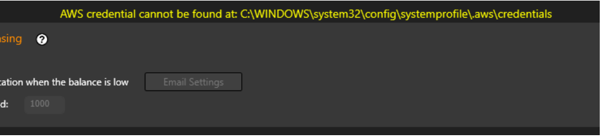
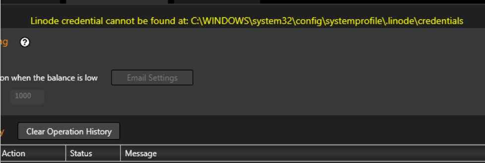

# Cambria Cluster: CloudExtend User Manual

## Introduction

Cloud computing is a popular trend and is favored in many industries, including transcoding. With continuous improvement of cloud infrastructure, support, and user experience, such as AWS and Linode, many users have started to look into cloud transcoding solutions. It has low deployment cost, no long-term commitment, is flexible, etc. However, it is often very costly in the long term for workflows that have stable and continuous transcoding. Media files also take up significant storage space and require high internet bandwidth. Also, many users have security concerns, and their media assets cannot be stored in cloud environments. Hence, many workflows still favor transcoding locally with physical hardware.

For local transcoding solutions, the setup is often fixed and not very flexible to change in capacity. When there is a surge in transcoding needs, backlogs will be created temporarily. If not, the transcoding system has to be over-built to handle the surge as well, resulting in huge initial deployment costs.

Cambria Cluster with the Cloud Extend feature is here to solve the problem smartly and efficiently. When the local transcoding system is overloaded, it will launch new pre-configured instances automatically. These instances will offload the additional transcoding jobs and shut down when the jobs are done. The integration is aimed at being as seamless as possible. With bidirectional S3 mapping, the instances will be able to access source files and write back transcoded output to local drives.


## Amazon AWS Setup

### Credential and S3/EC2 Setup

If you have not set up credentials for AWS yet, then you should see this warning. Follow the document below to learn how to set it up.



Dropbox PDF:  
https://www.dropbox.com/s/3sciafbq5s0k588/Amazon%20AWS%20Credentials%20and%20S3_EC2%20Setup%20Guide.pdf?dl=0

If the setup of the “credentials” file is proper, you will observe no warning, otherwise, a warning will be shown.

### AMI Image

An AMI Image is a saved virtual machine that CloudExtend will use to create instances; allowing Cluster to connect to the machine and run queued jobs.

An AMI Image with FTC will be needed to be created in order to use CloudExtend.

Learn how to generate an AMI image follow this guide:  
https://www.dropbox.com/s/e0nue54nn6hgqrk/Amazon%20AWS%20AMI%20Creation%20and%20Editing.pdf?dl=0

### AWS Instances Settings

Prepare following information to add AWS instances to Cluster:

- AMI ID (starts with “ami-”). Ex. ami-010cd39cf6463e144  
  If testing, you can use this Capella created AMI: ami-0d250373c58e8fadf (This is updated after every release because we delete old versions. Currently this is for FTC 5.2)
- Choose an Instance Type  
  Amazon EC2 Instance Types - Amazon Web Services  
  Use a fast instance type, recommend to start with c5.xlarge  
  ARM based CPUs is not supported
- Enter a Security Group ID (eg, “sg-0586a52429f0b355a”)  
  To Create a Security Group using AWS:

  1. Open the Amazon EC2 at https://console.aws.amazon.com/ec2/. Make sure that you are logged in to your account.
  2. In the navigation pane on the left, choose Security Groups under Network & Security.
  3. Choose Create Security Group.
  4. Enter a name for the security group (for example, my-security-group) and provide a description.
  5. Specify your Inbound rules to Type: All Traffic and CIDR blocks: 0.0.0.0/0
  6. Click Create security group
  7. Now look for the security group that you just created and enter it into the Security Group ID field.

- Subnet ID  
  This section can be blank.
- Key Pair Name  
  Allows remote access to instance  
  Use that as the Key Pair that you created when creating the AMI or make a new one

- To Create a Key Pair using AWS Console:

  1. In the navigation pane on the left, choose Key Pairs under Network & Security.
  2. Choose Create key pair.
  3. Enter a name for the key pair.
  4. Set key pair type to RSA and Private key file format to .pem.
  5. Then click Create key pair.
  6. Make sure to keep this .pem file somewhere safe.

- Instance Name  
  Eg “AWS-C5xLarge-*”, then new instances will be created and automatically named AWS-C5xLarge-0, AWS-C5xLarge-1 and so on
- Region (eg, “us-west-2”)  
  https://docs.aws.amazon.com/AWSEC2/latest/UserGuide/using-regions-availability-zones.html
  If you are using the Capella created AMI please set region to “us-west-2”
- Number of instances  
  When “Add” is clicked, instances will be automatically launched in AWS portal and added into Machines tab


## Akamai Linode Setup



If you have not set up credentials for Linode yet, then you should see this warning. Follow the document below to learn how to set it up.

Dropbox PDF:  
https://www.dropbox.com/s/gk9fr8wwkloj22i/Akamai%20Linode%20Credentials%20and%20Instance%20Setup%20Guide.pdf?dl=0

If the setup of the “credentials” file is proper, you will observe no warning, otherwise, a warning will be shown.

### Linode Image

Please contact Capella Support to receive information on how to setup a Linode Image.

You will need to follow the Linux installation guide and save the Linode instance as an image.

### Linode Instance Settings

Prepare following information to add Linode instances to Cluster:

- For Instance Type and Region you can either use command prompt to find out the information, or look at the tables provided here on the third page:  
  https://www.dropbox.com/s/gk9fr8wwkloj22i/Akamai%20Linode%20Credentials%20and%20Instance%20Setup%20Guide.pdf?dl=0
- If you are using command prompt, follow this guide on how to install linode-cli to your computer:  
  https://www.linode.com/docs/products/tools/cli/guides/install/#install-python-3-and-pip3
- Choose an Instance Type  
  To find the different types of instances in command prompt use linode-cli linode types
**- Image ID (starts with “private/”). Ex. private/14585314  
  To find your Image ID use command “linode-cli images list”  
  Or view in Linode dashboard → Images → Deploy to New Linode → the imageID will appear in the URL.  
  Example: https://cloud.linode.com/linodes/create/?type=Images&imageID=private/410965
**- Root Password
- Create a password for your instance
- Must be 7–128 characters
**- Instance Name 
- must be unique
- You cannot have two instances with the same name, or else you will receive an error  
** Region
- To find the different types of instances use command “linode-cli regions list”  
- You can also use the table provided in the Setup Guide

When “Add” is clicked, instances will be automatically launched in Linode portal and added into Linodes tab.

## Instance Controller

A sample is already provided and installed with Cluster:

```
C:\Program Files (x86)\Capella\CambriaCluster\cpx64\AwsDynInstCtrl.exe
C:\Program Files (x86)\Capella\CambriaCluster\cpx64\LinodeDynInstCtrl.exe
```

It facilitates automation of launching new instances when necessary, and stopping or terminating instances when unnecessary.

Recommended to call every 30 minutes. Too short will have lots of overhead, as instances take time to launch.

Example with AwsDynInstCtrl (Linode works the same, just replace Aws with Linode):

Usage: AwsDynInstCtrl [--create X --limit Y [--slot W]] [--stop Z] [--debug 1]

- --create X: create instance if there are more than X queued jobs
- --limit Y: limit to create Y instances only
- --slot W: Default 2, control the slots of the new instance.
- --stop Z: Set all instances to 0 slot when there are Z or less queued jobs
- --debug 1: more debugging information

Example:  
`AwsDynInstCtrl.exe --create 20 --limit 1 --stop 5`

- Create 1 instance if there are more than 20 queued jobs  
- Set all instances to 0 slot when there are 5 or less queued jobs  
- Cluster service will automatically stop/terminate those instances if configured  

# Remarks and Troubleshooting

- Instances take a while to start up. You can refer to the **Machines** tab to know the estimated ready time.  
  Cambria Cluster enforces a **minimum 10 minutes waiting time** for each newly launched instance to avoid jobs being assigned prematurely and causing errors.
- When creating an instance make sure that it shows up in the **Machine** tab.
- Make sure the instance is shown in the Machine tab.  
  It should show up as the **Instance Name** that you put in CloudExtend.
- If the machine is showing **Offline**, make sure you have waited long enough (the “!” icon will show estimated time).
- Make sure **available slot > 0**.  
  By default, new instances added have **2 default slots**.
- The machine is required to be set as **Online** in order to be assigned jobs.  
  By default, new instances added via Cluster UI are added to Cluster (so they are either *Online* or *Offline*, but not *Standby / Cold Standby*).
- Instances, if left idle or even stopped, will still incur charges.  
  → “**Terminate**” or “**Delete**” instances when not used.  
  → Set up usage warning / monitoring notification in the AWS portal.
- The temporary output folder for **S3 Mapping redirection** is  
  `C:\Users\Public\Documents\CapellaOutput` — ensure drive C has sufficient space.
- HTTP GET from Cluster machine to instances via “Machine IP” should return proper XML, e.g.:

https://34.123.186.99:8648/CambriaFC/v1/SystemInfo


- Make sure you have configured **Security Group** properly so that the instance is reachable from Cluster.  
- Make sure that the internet connection is **Private** or **Domain**, not **Public**.  
  Otherwise, during FTC/Cluster installation, you must enable firewall rules for *Public* as well.  
  You can verify this by disabling all Windows Firewall profiles (Private, Domain, Public) temporarily.

- **Source files / output files not mapped properly**, or you encounter these errors:
- *Unable to connect to endpoint*
- Ensure CloudExtend S3 Mapping is correct.

Example configuration:
F:\MiniosShare\Source → source files  
F:\MiniosShare\Output → transcoded outputs  
32.22.156.123:10852 → Cluster public IP (firewall configured properly) 
Hosting Minio web server at port 9000  
Routing external port 10852 → Cluster machine IP port 9000  


- **Slow transcoding performance**
- Ensure **Instance Type** is strong enough (sufficient CPU cores + memory).
- Lower concurrent transcoding slots.
- Have a fast internet connection to the instances.
- Make sure the **Region** is set close to you.


## Q/A

**Q: How to revoke the configured “Cloud Extend Storage”?**  
- The snapshot of them are stored in encrypted form in client’s job.  
- Remove the configuration from the Cluster. Existing credentials that are stored in the client job become invalid.  
- Hence, if you remove the configuration, and add the “same” configuration again, the old one will still be invalidated.

**Q: The “Cloud Extend Storage” does not apply settings in Credential Manager for “On Premise Path”.**  
- Limitation as of now. To workaround, log on to "Capella CpClusterServiceManager" with an administrator account that has access to the On Premise Path.


